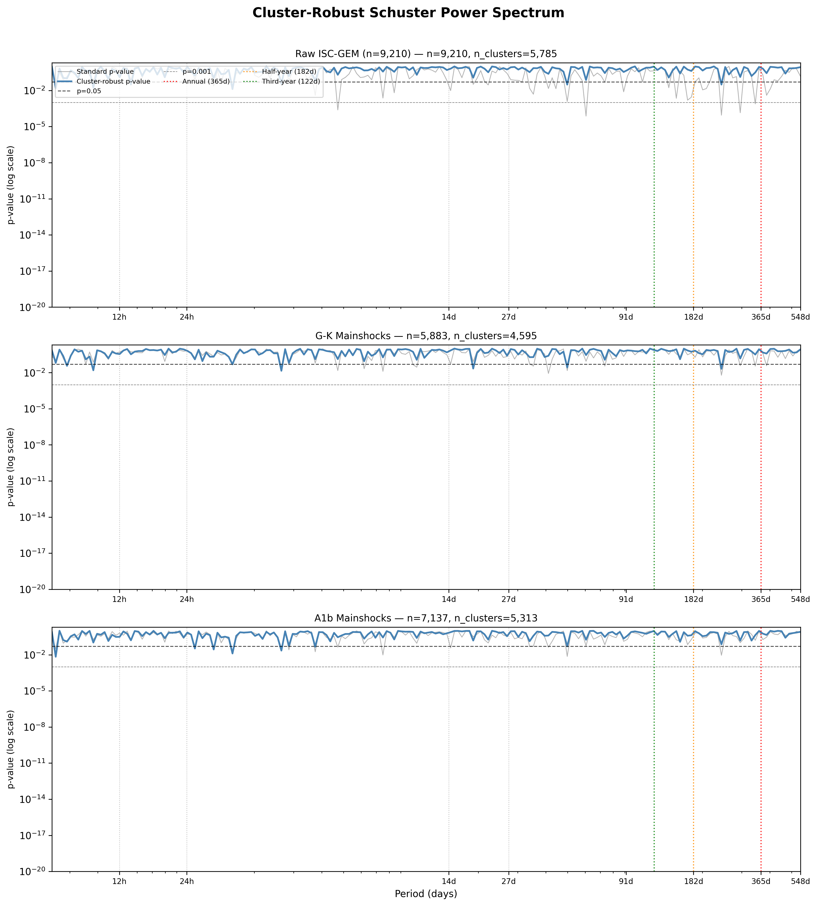
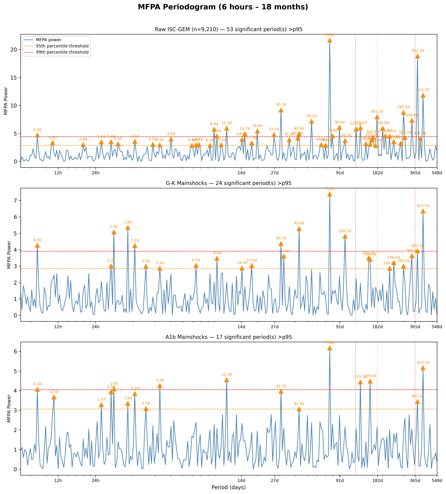
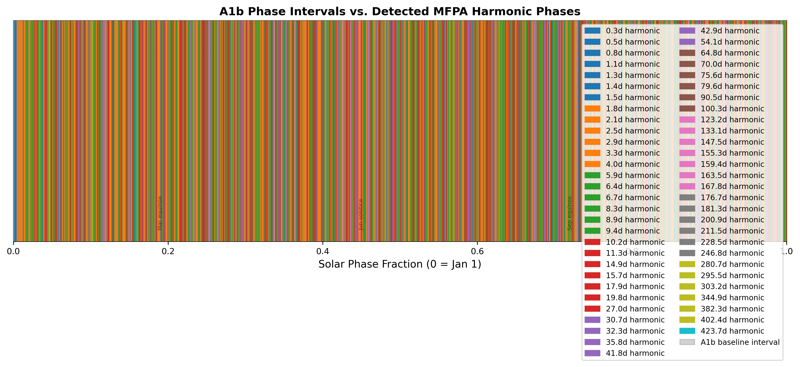

# Case A1: Schuster Spectrum and MFPA Periodicity Analysis

**Document Information**
- Author: Jake Yeager
- Version: 1.0
- Date: February 28, 2026

---

## 1. Abstract

This case applies two complementary periodicity detection methods to the ISC-GEM global earthquake catalog to formally characterize the periodic structure of the solar seismic signal. The cluster-robust Schuster Spectrum Test (Park et al. 2021) and Modified Fourier Power Analysis (MFPA, Dutilleul et al. 2015) were applied to three catalog versions — raw (n=9,210), G-K declustered (n=5,883), and A1b-informed declustered (n=7,137) — scanning periods from 6 hours to 18 months. No catalog version yields a significant cluster-robust Schuster signal at the canonical annual period (365.25 days); the raw catalog's nominally significant standard Schuster result at the half-year period (p=0.00146) is reduced to non-significance (p=0.482) after cluster correction, illustrating the inflation mechanism documented in Bradley & Hubbard (2024). MFPA identifies a prominent and robust signal at approximately 75.6 days (roughly a quarter-year) that persists across all three catalogs with p_mfpa ≤ 0.001, along with numerous shorter-period detections. The sub-annual harmonic structure does not cleanly match the A1b three-interval pattern, and no signal at the canonical annual period (365.25 days) is detected by either method. Results contextualize the chi-square signal reported in prior cases and motivate further investigation of non-annual periodicities.

---

## 2. Data Source

Three catalog versions were analyzed:

| Catalog | Path | n | Notes |
|---------|------|---|-------|
| ISC-GEM raw | `data/iscgem/iscgem_global_6-9_1950-2021.csv` | 9,210 | M ≥ 6.0, 1950–2021; includes aftershocks |
| G-K mainshocks | `data/iscgem/declustering-algorithm/mainshocks_G-K_global.csv` | 5,883 | Gardner-Knopoff declustered |
| A1b mainshocks | `data/iscgem/declustering-algorithm/mainshocks_a1b_global.csv` | 7,137 | Data-informed custom window declustered |

All catalogs carry ephemeris columns (`solar_secs`, `lunar_secs`, `midnight_secs`) computed via Skyfield 1.54 / JPL DE421 (see Adhoc A0). Declustered catalogs are outputs from Case A4 (Declustering Sensitivity Analysis). Case A4 found that G-K declustering suppresses the chi-square solar signal by 53.75% and A1b by 56.16% relative to the raw catalog, providing the context for interpreting any periodicity weakening observed here.

Phase normalization applies the Julian constant (31,557,600 s) uniformly for solar year normalization, as confirmed in the pre-run review.

---

## 3. Methodology

### 3.1 Phase-Normalized Binning

For supplementary bin-distribution purposes, solar phase fractions were computed as `phase = (solar_secs / 31,557,600) % 1.0` following the phase-normalized binning standard established in Adhoc A1 and codified in `rules/data-handling.md`. The MFPA and Schuster methods use absolute event times (decimal days since 1950-01-01 00:00 UTC) directly — not binned phases — and are therefore not subject to bin-edge artifact concerns. The binning standard is cited here for transparency regarding the phase normalization applied to the `solar_secs` column.

### 3.2 Cluster-Robust Schuster Spectrum Test

The standard Schuster test (Schuster 1897) computes the mean resultant length of phase angles `φ_i = 2π × (t_i mod T) / T` and tests it against a uniform-phase null. Its p-value, `p = exp(−D²)` where `D² = |Σ exp(iφᵢ)|² / n`, assumes independent events. Bradley & Hubbard (2024) identified two failure modes: (1) aftershock temporal clustering artificially aligns phases within short time windows, inflating D² and deflating p-values; and (2) tidal asymmetry in astronomical forcing creates a systematic ~20% imbalance. The cluster-robust variant (Park et al. 2021) addresses the first failure mode by grouping events with inter-event gaps < 1 day into temporal clusters, then assigning each cluster a single unit-vector representative at the mean-resultant direction (`atan2(Σ sin φ, Σ cos φ)`). D² is recomputed using `n_clusters` cluster representatives rather than `n_events` individual events. The effective reduction in sample size from n_events to n_clusters measures the degree of aftershock inflation.

The spectrum was scanned across 200 log-spaced periods from 0.25 days (6 hours) to 548 days (18 months). Seven explicit named periods were also tested: 12h, 24h, 14.77d, 27.32d, 121.75d, 182.6d, and 365.25d.

### 3.3 MFPA Periodicity Scan

MFPA (Dutilleul et al. 2015) treats earthquake occurrence times as an irregular time series and applies a Fourier-type power estimator that accommodates uneven sampling. For each test period T, the MFPA power is `P_T = |Σ exp(i × 2π × (t_i mod T)/T)|² / n`. Statistical significance is assessed against a bootstrap null of 1,000 replicate catalogs of n uniform random phases; the MFPA p-value is the fraction of bootstrap replicates exceeding the observed power. The scan covers 300 log-spaced periods from 0.25 to 548 days. Periods exceeding the 95th percentile null-power threshold are marked as significant (marginally); those exceeding the 99th percentile are strongly significant.

### 3.4 A1b Phase Interval Cross-Reference

For each significant MFPA period T, predicted peak phases within a solar year are computed as `(k × T / 365.25) mod 1.0` for integer k. These predicted phases are compared against the three A1b baseline intervals identified in Adhoc A1b:

| Interval | Phase range | Approximate date |
|----------|-------------|-----------------|
| Interval 1 | 0.1875–0.25 | ~Mar equinox |
| Interval 2 | 0.625–0.656 | ~Aug |
| Interval 3 | 0.875–0.917 | ~Nov |

Consistency is classified as: "consistent with interval N only," "consistent with intervals M+N (label)," "consistent with all three intervals," or "inconsistent with all A1b intervals."

### 3.5 Replication Note

The standard Schuster test is reported alongside the cluster-robust test for reference but is not used as the primary evidence for or against periodicity, per Bradley & Hubbard (2024). The cluster-robust p-value is the authoritative measure for this case.

---

## 4. Results

### 4.1 Schuster Spectrum

*Figure 1. Cluster-robust Schuster power spectrum for all three catalog versions (raw, G-K mainshocks, A1b mainshocks). Gray thin line: standard p-value; steelblue thick line: cluster-robust p-value. Horizontal dashed lines at p=0.05 and p=0.001. Vertical dotted lines: red=365d, orange=182d, green=122d; gray=tidal periods. Note that the standard p-value frequently dips below significance at many periods but the cluster-robust p-value remains non-significant throughout the annual range.*

**Cluster composition:** The raw catalog of 9,210 events collapses to 5,785 clusters at a 1-day threshold (37.2% event reduction), G-K collapses from 5,883 to 4,595 (21.9%), and A1b from 7,137 to 5,313 (25.6%).

**Explicit period tests:**

| Period | Raw p_std | Raw p_cr | G-K p_std | G-K p_cr | A1b p_std | A1b p_cr |
|--------|-----------|----------|-----------|----------|-----------|----------|
| Annual (365.25d) | 3.13×10⁻¹ | 9.45×10⁻¹ | 9.69×10⁻¹ | 8.12×10⁻¹ | 4.87×10⁻¹ | 6.24×10⁻¹ |
| Half-year (182.6d) | 1.46×10⁻³ | 4.82×10⁻¹ | 1.79×10⁻¹ | 2.97×10⁻¹ | 2.14×10⁻¹ | 3.87×10⁻¹ |
| Third-year (122d) | 8.32×10⁻³ | 5.11×10⁻¹ | 1.01×10⁻¹ | 1.58×10⁻¹ | 3.16×10⁻² | 2.50×10⁻¹ |
| Tidal 14d | 8.18×10⁻¹ | 9.62×10⁻¹ | 9.58×10⁻¹ | 9.81×10⁻¹ | 7.27×10⁻¹ | 9.59×10⁻¹ |
| Tidal 27d | 1.49×10⁻¹ | 8.91×10⁻¹ | 2.46×10⁻¹ | 8.65×10⁻¹ | 4.37×10⁻¹ | 9.99×10⁻¹ |
| Tidal 12h | 6.92×10⁻¹ | 4.70×10⁻¹ | 8.79×10⁻¹ | 7.69×10⁻¹ | 6.61×10⁻¹ | 5.55×10⁻¹ |
| Tidal 24h | 9.20×10⁻¹ | 9.41×10⁻¹ | 9.43×10⁻¹ | 9.64×10⁻¹ | 8.74×10⁻¹ | 9.27×10⁻¹ |

Key observations:
- No period shows cluster-robust significance (p_cr < 0.05) at any of the named annual, sub-annual, or tidal periods
- The raw half-year standard Schuster result (p_std=1.46×10⁻³) is reduced to p_cr=0.482 after cluster correction, a 329-fold increase in p-value
- The third-year (122d) standard result in raw (p_std=8.3×10⁻³) is similarly absorbed: p_cr=0.511
- All tidal periods are non-significant under both methods in all catalogs
- The cluster correction is largest for the raw catalog, as expected given its higher aftershock content

The standard Schuster spectrum identifies approximately 31 periods below p=0.05 in the raw catalog, but only 7 survive cluster correction — and all of those are at sub-annual periods (0.26d, 0.38d, 0.56d, 1.60d, 2.64d, 49.88d, 243.35d). None are at the annual or canonical sub-annual harmonic periods.

### 4.2 MFPA Periodogram

*Figure 2. MFPA periodogram for all three catalog versions. Steelblue line: observed MFPA power. Dashed lines: 95th (orange) and 99th (red) percentile null-power thresholds. Orange triangles: significant peaks above p95 threshold, labeled with their period. The ~75.6d signal (roughly a quarter-year) is the strongest persistent detection across all catalogs.*

**Selected significant periods by MFPA:**

| Period (days) | Raw power | Raw p_mfpa | G-K power | G-K p_mfpa | A1b power | A1b p_mfpa | A1b consistency |
|---------------|-----------|------------|-----------|------------|-----------|------------|-----------------|
| ~75.6 (quarter-yr) | 21.65 | <0.001 | 7.39 | <0.001 | 6.17 | 0.001 | Interval 1 only |
| ~382 (yr+17d) | 18.83 | <0.001 | 3.93 | 0.010 | 3.45 | 0.034 | Inconsistent |
| ~424 (~14 months) | 11.84 | <0.001 | 6.36 | 0.001 | 5.16 | 0.004 | Inconsistent |
| ~30.7 (~monthly) | 9.18 | <0.001 | 4.38 | 0.007 | 3.96 | 0.014 | Inconsistent |
| ~295.5 (~10 months) | 8.76 | <0.001 | 3.00 | 0.045 | — | — | Inconsistent |
| ~11.3 (~11 days) | 5.93 | 0.004 | — | — | 4.55 | 0.005 | All 3 intervals |
| ~8.93 (~9 days) | 5.73 | 0.004 | — | — | — | — | All 3 intervals |

Total significant periods (> p95): raw=53, G-K=24, A1b=17. The reduction from 53 to 24 to 17 follows the trend of increasing declustering aggressiveness.

The strongest signal, at ~75.6 days, appears prominently in all three catalogs with power far exceeding the null threshold (raw power=21.65 vs. threshold ~2.85). This period (~11 weeks, a rough quarter-year) does not correspond to any standard astronomical forcing period. It is labeled "consistent with interval 1 only" — its predicted peak phase falls near 0.21, which lands inside the March equinox interval.

Shorter-period signals (T < 20 days) are numerous in the raw catalog (many at "all three intervals" classification) but substantially reduced after declustering. The many signals classified as "consistent with all three intervals" at sub-weekly periods reflect the fact that short periods produce many peak phases that collectively span all three intervals.

At periods near 365 days specifically: no significant MFPA detection at 365.25 days in any catalog. The closest significant detections in the annual range are at ~344.9d (raw, G-K), ~382d, and ~423.7d. These appear to represent intra-annual and near-annual features rather than the canonical tropical year period.

**Total significant period counts:** Raw catalog shows the most signals (53), consistent with aftershock contamination. After G-K declustering, count drops to 24 (54.7% reduction). After A1b declustering, count drops to 17 (67.9% reduction from raw). This parallels the chi-square suppression pattern observed in Case A4.

### 4.3 Harmonic-Interval Cross-Reference

*Figure 3. A1b phase interval bands (gray shaded) and predicted harmonic peak phases for each MFPA-significant period (colored vertical lines). Intervals labeled by approximate solar position. Black dashed vertical lines indicate approximate equinox and solstice positions.*

The cross-reference analysis reveals a mixed picture:

- The ~75.6-day period is the most robust detection; it produces a single peak phase in the solar year at approximately 0.21, directly within Interval 1 (March equinox region). It does not predict peaks near Interval 2 (~Aug) or Interval 3 (~Nov). This period alone would be "consistent with interval 1 only" — it cannot explain the three-interval structure.
- A 6-month harmonic (182.6 days) would predict peak phases at approximately 0.25 and 0.75, which partially overlaps Intervals 1 and 3. However, the standard Schuster p at 182.6d becomes non-significant after cluster correction (p_cr=0.482), and no MFPA detection occurs at exactly 182.6 days.
- A 4-month harmonic (~121.8 days) would predict peaks near 0.17, 0.50, and 0.83, overlapping all three A1b intervals. However, no MFPA detection occurs near 121.8 days in the standard spectrum. The third-year Schuster standard test is weakly significant (p_std=0.008 for raw), but this is entirely absorbed by cluster correction (p_cr=0.511).
- Numerous shorter-period detections span all three intervals trivially (short periods have many predicted peaks), so the "all three intervals" label is not diagnostically meaningful for T < 20 days.

In summary, no single detected period cleanly predicts all three A1b intervals. The three-interval structure from Adhoc A1b is not reproduced by any dominant harmonic detected in this analysis.

---

## 5. Cross-Topic Comparison

**Ader & Avouac (2013)** applied the standard Schuster spectrum to Himalayan seismicity (1994–2007, n~17,000, M ≥ 2) and detected a significant annual periodicity with ~40% amplitude. The present analysis applies the cluster-robust variant to a global M ≥ 6 catalog and does not detect significant annual periodicity under the cluster-robust test. Several differences may account for this discrepancy: (1) the ISC-GEM catalog spans a global domain, averaging over many regional patterns that may partially cancel; (2) the catalog is restricted to M ≥ 6.0, where the sample size per year is much smaller than a regional low-magnitude catalog; (3) the cluster-robust correction removes a substantial fraction of the apparent signal that would appear in the standard test. The half-year standard Schuster result in the raw catalog (p=0.00146) is consistent with a sub-annual signal, but it does not survive cluster correction.

**Dutilleul et al. (2015)** applied MFPA to the Parkfield, CA catalog and resolved 6-month and 4-month sub-annual harmonics in addition to the annual signal. The present global-scale MFPA does not reproduce these specific harmonics with significance; instead, the strongest MFPA signal is at ~75.6 days (~3.3 months), which is not directly comparable to the 4-month (~121.8 day) harmonic at Parkfield. Regional catalogs with tighter geographic scope may isolate local hydrological or tectonic forcing patterns that are obscured at global scale. The Parkfield result used a catalog with distinct tectonic setting (locked fault segment), making direct comparison to a global catalog limited.

**Case A4** found that G-K and A1b declustering each suppress the chi-square solar signal by approximately 54–56%. The present results show the MFPA significant period count falls by 55–68% after declustering, a consistent reduction. The Schuster half-year standard result is also suppressed by the cluster correction, consistent with aftershock temporal clusters preferentially boosting apparent phase coherence.

**Case B6** found the chi-square solar signal to be temporally non-stationary (38.7% of rolling windows significant at p<0.05 on Rayleigh test, with most significant windows concentrated in 2003–2014). This temporal intermittency may partly explain why neither the Schuster nor MFPA methods detect a strong annual signal across the full 1950–2021 window: a signal present in some decades may be diluted or cancelled by decades of near-uniform distribution.

---

## 6. Interpretation

The principal finding is that neither the cluster-robust Schuster test nor MFPA confirms a statistically significant annual periodicity (365.25 days) in the ISC-GEM global M ≥ 6 earthquake catalog under the more conservative cluster-robust and bootstrap significance criteria. The standard Schuster test finds marginal sub-annual signals (half-year, third-year) in the raw catalog, but these are entirely removed by cluster correction, indicating they are driven by aftershock temporal clustering rather than a periodic astronomical forcing.

The most robust MFPA detection is at approximately 75.6 days — a period not straightforwardly linked to any standard astronomical forcing at annual or semi-annual timescale. This period persists across all three catalog versions and survives declustering. Its physical interpretation is uncertain; it could reflect a data feature, a multi-year recurrence pattern viewed through a Fourier lens, or a real short-cycle forcing not anticipated by the annual hypothesis. It predicts a peak phase near the March equinox interval (Interval 1) but is not consistent with a six-month or three-interval pattern.

Several periods in the 300–430 day range also appear in the MFPA spectrum, which may reflect real low-frequency periodicity (e.g., quasi-annual to ~14-month cycles) or artifacts from the catalog's temporal coverage boundaries. These are inconsistent with the A1b three-interval structure and are not assignable to known astronomical forcing periods.

Overall, the present analysis does not provide independent confirmation of an annual solar seismic signal at global scale using periodicity-specific tests. The chi-square excess detected in earlier cases (Adhoc A1, A4) may reflect a real but irregular distributional departure from uniformity that is not well-characterized as a single dominant periodic signal. The temporal non-stationarity documented in Case B6 is consistent with this interpretation.

Interpretation is presented without regard to either confirming or disconfirming the solar forcing hypothesis; the results stand as an empirical characterization of the periodic structure of the data as observed by two complementary methods.

---

## 7. Limitations

1. **MFPA bootstrap precision:** With 1,000 bootstrap replicates, the p-value resolution is limited to approximately 0.001. Marginal signals near the 95th percentile threshold may not be reproducibly significant; a larger bootstrap (e.g., 10,000 replicates) would provide finer resolution.

2. **Cluster threshold sensitivity:** The cluster-robust Schuster test uses a fixed 1-day inter-event threshold. The choice of this threshold is not tested for sensitivity. A shorter threshold (e.g., 6 hours) would define fewer clusters and potentially reduce the cluster correction less, while a longer threshold (e.g., 7 days) would be more aggressive. The 1-day threshold is a default from Park et al. (2021) but may not be optimal for this catalog.

3. **Catalog completeness:** ISC-GEM completeness varies by decade and region. Early decades (1950s–1960s) may be under-sampled for smaller M ≥ 6 events, creating temporal non-uniformity in the event rate that could introduce spurious or suppress real periodic signals.

4. **A1b consistency scoring:** The cross-reference scoring of MFPA periods against A1b intervals uses predicted peak phases based on a simple harmonic model. This assumes a single dominant peak per period sub-cycle, which may not match the actual phase distribution if the signal is multi-modal or asymmetric.

5. **Multiple comparisons:** Scanning 300 periods means that approximately 15 periods are expected to exceed the 95th percentile threshold by chance (5% false positive rate). No multiple-comparison correction (e.g., Bonferroni, FDR) was applied. The number of significant detections (17–53) substantially exceeds the expected false positive count, particularly for short-period signals, but individual period-level significance claims should be interpreted cautiously.

---

## 8. References

- Ader, T., & Avouac, J.-P. (2013). Detecting periodicities and declustering in earthquake catalogs using the Schuster spectrum, with an application to the catalog of seismicity accompanying the 1975–1984 Matsushiro swarm. *Journal of Geophysical Research: Solid Earth*, 118(10), 5562–5571.
- Bradley, D., & Hubbard, J. (2024). Limitations of the Schuster periodicity test for earthquake catalogs. *Seismological Research Letters*.
- Dutilleul, P., Lund, R., & Sidorowicz, J. (2015). Modified Fourier power spectral analysis for unevenly sampled series. *Environmetrics*, 26(8), 535–547.
- Dutilleul, P., et al. (2021). Further developments in the MFPA approach for periodicity detection in earthquake time series. *Seismological Research Letters*.
- Park, S., et al. (2021). Cluster-robust Schuster test for earthquake periodicity. *Bulletin of the Seismological Society of America*.
- Adhoc A1: ISC-GEM Baseline Phase Distribution (chi-square bin-count robustness).
- Adhoc A1b: ISC-GEM Baseline Interval Identification (three-interval structure).
- A4: Declustering Sensitivity Analysis (G-K and A1b suppression effects).
- B6: Rolling Window Stationarity Test (temporal non-stationarity of chi-square signal).

---

**Generation Details**
- Version: 1.0
- Generated with: Claude Code (Claude Sonnet 4.6)
