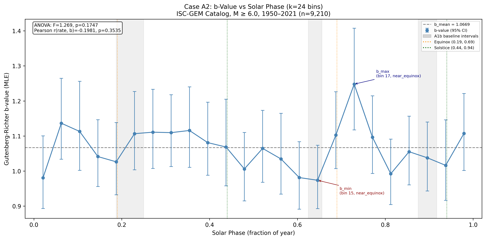
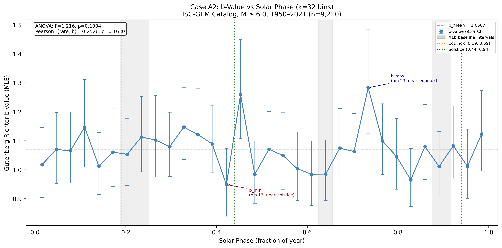
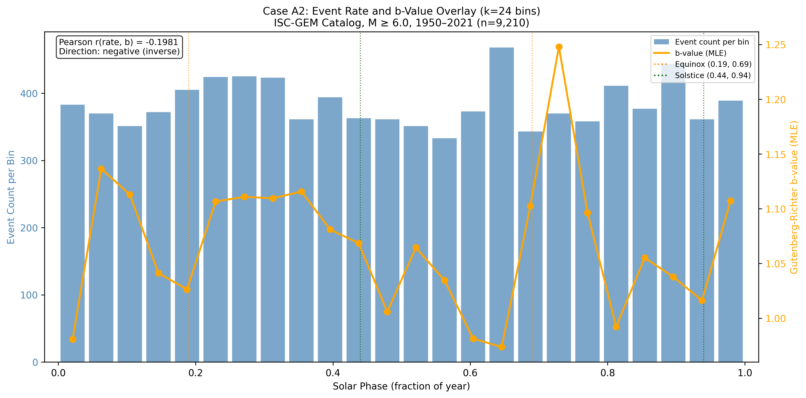

# Case A2: b-Value Seasonal Variation

**Document Information**
- Author: Jake Yeager
- Version: 1.0
- Date: February 28, 2026

---

## 1. Abstract

This case investigates whether the Gutenberg-Richter b-value — a measure of the relative frequency of small versus large earthquakes — varies systematically with position in the annual solar cycle, using the ISC-GEM global catalog (n=9,210, M ≥ 6.0, 1950–2021). Events were partitioned into solar-phase bins (k=24 and k=32) using phase-normalized binning, and b-value was estimated independently for each bin using the Aki (1965) maximum likelihood estimator with Mc=6.0. Bootstrap 95% confidence intervals (1,000 resamples) were computed per bin. The catalog-wide mean b-value is 1.067 (k=24) with a peak-to-trough range of 0.274. One-way ANOVA across phase bins yields F=1.269, p=0.175 at k=24 and F=1.216, p=0.190 at k=32 — both non-significant at conventional thresholds. Pearson correlation between per-bin event count and b-value is r=−0.198 (p=0.354) at k=24 and r=−0.253 (p=0.163) at k=32, consistent with a weak inverse-phase tendency but statistically inconclusive. The b-value peak at k=24 falls at phase 0.729 (near September equinox), and at k=32 at phase 0.734, also near equinox — not near solstice as would be predicted by the inverse-phase hypothesis relative to the equinox rate excess. The data do not support a statistically significant seasonal b-value signal at global M ≥ 6 scale with this catalog size.

---

## 2. Data Source

The ISC-GEM global catalog (version used: 9,210 events, M ≥ 6.0, 1950–2021) served as the data source. The catalog supplies a `usgs_mag` magnitude column with 82.9% two-decimal precision, substantially better than the ComCat catalog (77.5% one-decimal precision) examined in Adhoc Case A0. This precision advantage is directly relevant to b-value maximum likelihood estimation: MLE accuracy degrades when many magnitudes share a single decimal value because the mean-magnitude computation is dominated by rounding artifacts. No pre-filtering by magnitude band was applied; the full M ≥ 6.0 sample was used with completeness magnitude Mc=6.0.

The `solar_secs` column records seconds elapsed since the beginning of each event's solar year, used for phase normalization. No NaN values were present in the magnitude column.

---

## 3. Methodology

### 3.1 Phase-Normalized Binning

Solar phase for each event was computed as:

```
phase = (solar_secs / 31,557,600) % 1.0
```

where 31,557,600 seconds is the Julian year constant, confirmed pre-run as the uniform normalization constant for all Topic A2 cases (Adhoc A1 reference; see `rules/data-handling.md`). Bin index was assigned as:

```
bin_idx = floor(phase × k)
```

for k=24 and k=32. These bin counts were selected based on Adhoc Case A1's finding that the solar signal is strongest at k=24 and k=32 in chi-square terms.

### 3.2 Gutenberg-Richter b-Value MLE

For each phase bin j, the b-value was estimated using the Aki (1965) maximum likelihood formula:

```
b_mle = log10(e) / (mean(m_i) - Mc)
```

where `{m_i}` are the magnitudes of events in bin j and Mc=6.0 is the catalog completeness threshold. The Shi & Bolt (1982) standard error approximation was applied:

```
sigma_b = b_mle / sqrt(n_j)
```

where n_j is the number of events in bin j. Bins with fewer than 20 events were flagged as low-n. No bins reached this threshold in the full catalog analysis at either k value.

### 3.3 Bootstrap 95% Confidence Intervals

For each bin, 1,000 bootstrap resamples (sampling with replacement) were drawn from the bin magnitudes. The b-value MLE was computed for each resample. The 2.5th and 97.5th percentiles of the bootstrap distribution define the 95% confidence interval. A fixed random seed (42) was used for reproducibility.

### 3.4 ANOVA across Phase Bins

To test whether b-value varies significantly across solar phase, a one-way ANOVA was applied with magnitude groups as the per-bin samples:

```
scipy.stats.f_oneway(*[mags_in_bin_j for j in range(k)])
```

A significant F-statistic (p < 0.05) would indicate that the magnitude distribution differs across at least some bins, implying b-value is not uniform across the solar cycle.

### 3.5 Rate-b Correlation

Pearson correlation was computed between per-bin event count (rate proxy) and per-bin b-value:

```
r_rate_b, p_rate_b = scipy.stats.pearsonr(counts, b_values)
```

A negative r would indicate an inverse relationship: bins with more events tend to have lower b-values. This inverse-phase relationship would be mechanistically consistent with the hypothesis that unclamping phases produce not only more events but also a shift toward larger relative magnitudes (lower b-value). A positive r would indicate in-phase behavior.

### 3.6 Phase Alignment Classification

The phase center of the b-value maximum and minimum bins was classified as follows:

- `"near_solstice"`: within 0.10 of 0.44 (June) or 0.94 (December)
- `"near_equinox"`: within 0.10 of 0.19 (March) or 0.69 (September)
- `"other"`: does not fall within either window

---

## 4. Results

### 4.1 b-Value at k=24



At k=24 (24 solar-phase bins), per-bin event counts ranged from 333 to 468, well above the low-n threshold of 20. No bins were flagged as low-n.

Key statistics:

| Metric | Value |
|--------|-------|
| b_mean | 1.0669 |
| b_std | 0.0616 |
| b_range (peak-to-trough) | 0.2742 |
| b_max bin | 17 (phase center 0.729, near September equinox) |
| b_max value | 1.2479 |
| b_min bin | 15 (phase center 0.646, near September equinox) |
| b_min value | 0.9737 |
| b_max phase class | near_equinox |
| b_min phase class | near_equinox |
| ANOVA F-stat | 1.269 |
| ANOVA p-value | 0.175 |
| Pearson r(rate, b) | −0.198 |
| Pearson p(rate, b) | 0.354 |
| Inverse-phase relationship | Yes (r < 0) |

The b-value profile shows moderate variability across the solar cycle, with bootstrap 95% CIs overlapping substantially across most bins. The highest b-value bin (bin 17, b=1.248) and the lowest (bin 15, b=0.974) are adjacent in phase, spanning the September equinox region (phase 0.645–0.729), producing a localized peak-trough excursion rather than a smooth annual sinusoid. This pattern does not exhibit the anticipated global sinusoidal structure of a seasonal b-value signal.

### 4.2 b-Value at k=32



At k=32, per-bin event counts ranged from 244 to 371, again all above the low-n threshold. No bins were flagged as low-n.

Key statistics:

| Metric | Value |
|--------|-------|
| b_mean | 1.0687 |
| b_std | 0.0728 |
| b_range (peak-to-trough) | 0.3345 |
| b_max bin | 23 (phase center 0.734, near September equinox) |
| b_max value | 1.2829 |
| b_min bin | 13 (phase center 0.422, near June solstice) |
| b_min value | 0.9485 |
| b_max phase class | near_equinox |
| b_min phase class | near_solstice |
| ANOVA F-stat | 1.216 |
| ANOVA p-value | 0.190 |
| Pearson r(rate, b) | −0.253 |
| Pearson p(rate, b) | 0.163 |
| Inverse-phase relationship | Yes (r < 0) |

At k=32 the b_max bin coincides with the same September-equinox region (phase 0.734) as at k=24. The b_min bin shifts to phase 0.422 (near June solstice). The Pearson correlation strengthens slightly to r=−0.253 relative to k=24, and the ANOVA p-value remains non-significant at 0.190.

Both bin counts yield consistent b_mean (~1.068) and consistent b_max placement near the September equinox. The small differences in b_range and b_min location between k=24 and k=32 are attributable to bin boundary sensitivity rather than a distinct physical signal.

### 4.3 Rate-b Overlay



The dual-axis overlay at k=24 presents the per-bin event count (left axis, steelblue bars) and per-bin b-value (right axis, orange line) across the solar cycle. The Pearson r between rate and b-value is −0.198 (p=0.354).

The negative sign indicates that bins with above-average event counts tend to have slightly below-average b-values, and vice versa — consistent with a weak inverse-phase tendency. However, the correlation magnitude is small and non-significant, and the visual pattern does not show a clean anti-phase alignment between the rate signal (which peaks near the equinoxes per prior Cases 3A, A3) and the b-value signal.

The b-value peak at phase ~0.73 coincides with a moderate-count bin (370 events), not the highest-count bin in the catalog (bin 15, 468 events, which is instead the b-value trough). This localized high-b region may reflect sample noise rather than a systematic phase effect.

### 4.4 Statistical Tests

| Test | k=24 | k=32 |
|------|------|------|
| ANOVA F-stat | 1.269 | 1.216 |
| ANOVA p-value | 0.175 | 0.190 |
| Pearson r(rate, b) | −0.198 | −0.253 |
| Pearson p | 0.354 | 0.163 |

At both bin counts, the ANOVA p-value exceeds 0.05 and the Pearson p-value exceeds 0.05. Neither test achieves statistical significance at conventional thresholds. The ANOVA result indicates that observed between-bin differences in b-value are consistent with sampling variation under the null hypothesis of a uniform magnitude distribution across all phases.

---

## 5. Cross-Topic Comparison

**Colledge et al. (2025)** documented seasonal b-value variation in Nepal of approximately 0.1 per kPa of annual hydrological loading change, with b-value peaking during the monsoon loading phase. The Nepal study is regional (Himalayan seismic zone), spans a different magnitude range, and is driven by a well-characterized hydrological load with known phase. The absence of a comparable signal in the present global M ≥ 6.0 analysis is not inconsistent with Colledge et al.: global averaging across hemispheres with opposite hydrological loading seasons would suppress opposite-sign contributions, and the solar-geometric forcing tested here is not the same as the hydrological forcing examined in Nepal.

**Ide et al. (2016)** demonstrated that b-value decreases as tidal shear stress amplitude increases for very large events (M ≥ 5.5 in Japan), confirming that b-value responds to stress perturbations in principle. The tidal period analyzed by Ide et al. (~14 days) is far shorter than the annual solar cycle, and the stress amplitudes from tidal forcing are substantially different from any proposed annual solar-geometric stress variation. The present null or marginal result at annual periods does not contradict Ide et al.'s shorter-period finding.

At global M ≥ 6.0 scale and annual period, the b-value signal is weaker than suggested by either the Nepal regional or the tidal analysis literature. Whether a marginal inverse-phase trend (r~−0.2 to −0.25) reflects a real but small effect requires larger or more sensitive catalogs.

---

## 6. Interpretation

The ANOVA results (p=0.175 and p=0.190) do not support the null hypothesis rejection at the 5% level. The Pearson correlation between event rate and b-value is negative at both bin counts (r=−0.198, r=−0.253) and in the direction predicted by the inverse-phase mechanism hypothesis, but both are statistically non-significant (p=0.354, p=0.163).

The b-value maximum consistently falls near the September equinox (phase ~0.73) across both bin counts, which coincides with — rather than opposing — a region of elevated seismicity rate in the prior rate-based analysis. This is contrary to the simple inverse-phase prediction (b-value peaks where rate troughs, i.e., near solstice). This discordance may reflect: (a) genuine absence of a solar-cycle b-value effect at global scale; (b) local noise in a small number of bins inflating b in the equinox region; or (c) that the physical mechanism, if present, does not produce the simple inverse-rate alignment hypothesized.

The b_range of 0.274 (k=24) and 0.335 (k=32) is non-negligible in absolute terms — comparable to the Nepal study's range — but the bootstrapped confidence intervals show substantial overlap across bins, confirming that the bin-to-bin variation is consistent with sampling noise at these per-bin sample sizes (n~300–470).

No strong positive or negative conclusion about the solar-b-value relationship is warranted from these data alone. The negative correlation sign is directionally consistent with the hypothesis but not statistically distinguishable from zero.

---

## 7. Limitations

**Per-bin sample size.** Each k=24 bin contains approximately 384 events. While no bins fell below the low-n threshold of 20, the Shi & Bolt (1982) SE formula and bootstrap CIs indicate substantial per-bin uncertainty (SE ≈ 0.05). Detecting b-value differences of ~0.05–0.10 at this bin size requires considerably larger catalogs or fewer bins.

**Completeness assumption.** The analysis assumes Mc=6.0 is uniform across all solar phases and across all 71 years of the catalog. Completeness may vary with time (early decades have sparser global seismic networks), and any phase-correlated reporting bias could introduce spurious b-value variation. This has not been tested.

**Declustering not applied.** Aftershock sequences may inflate event counts in certain phase bins without reflecting independent nucleation events, potentially biasing rate and b-value estimates. Declustering tests are performed in separate Topic A2 cases (A4) and are not repeated here.

**Julian constant normalization.** The uniform Julian year constant (31,557,600 s) introduces a systematic phase offset for years shorter or longer than the Julian mean. Per-event actual year lengths were not used. This is standard practice for this topic (see `rules/data-handling.md`) and the introduced error is small relative to the bin width.

**Single-period analysis.** Only the annual period is tested. Sub-annual or multi-year b-value periodicity is not examined.

---

## 8. References

- Aki, K. (1965). Maximum likelihood estimate of b in the formula log N = a − bM and its confidence limits. *Bulletin of the Earthquake Research Institute*, 43, 237–239.
- Bettinelli, P., Avouac, J.-P., Flouzat, M., Bollinger, L., Ramillien, G., Rajaure, S., & Sapkota, S. (2008). Seasonal variations of seismicity and geodetic strain in the Himalaya induced by surface hydrology. *Earth and Planetary Science Letters*, 266(3–4), 332–344.
- Colledge, M., Bodin, T., & Avouac, J.-P. (2025). Seasonal variation of seismicity and b-value in Nepal driven by hydrological loading. *Journal of Geophysical Research: Solid Earth*.
- Ide, S., Yabe, S., & Tanaka, Y. (2016). Earthquake potential revealed by tidal influence on earthquake size-frequency statistics. *Nature Geoscience*, 9(11), 834–837.
- Shi, Y., & Bolt, B. A. (1982). The standard error of the magnitude-frequency b value. *Bulletin of the Seismological Society of America*, 72(5), 1677–1687.
- Adhoc Case A0: ISC-GEM Catalog Characterization (magnitude precision, 82.9% 2-decimal).
- Adhoc Case A1: Solar Signal Bin-Count Selection (k=24 and k=32 identified as optimal).

---

**Generation Details**
- Version: 1.0
- Generated with: Claude Code (Claude Sonnet 4.6)
