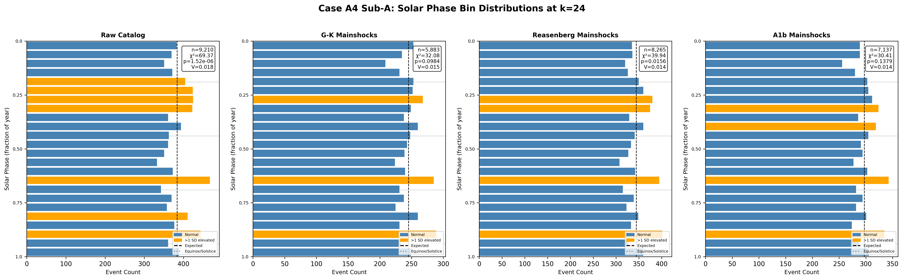
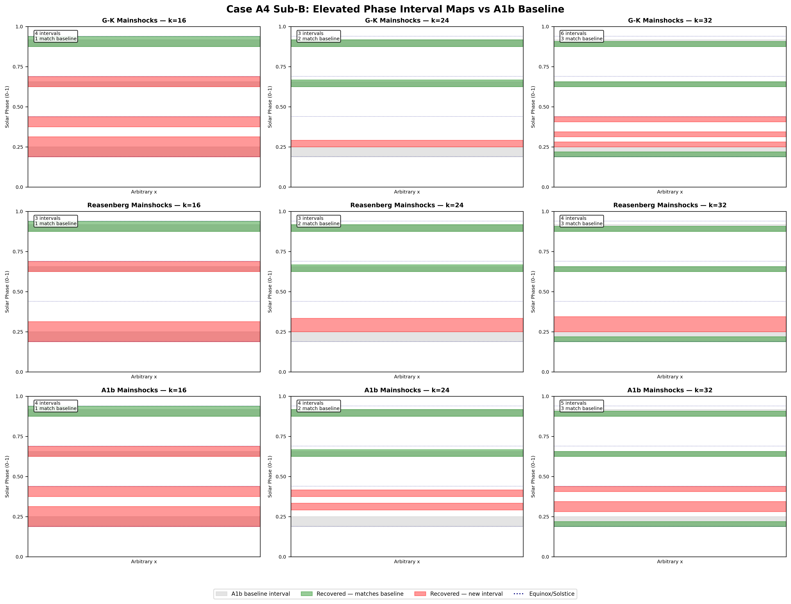
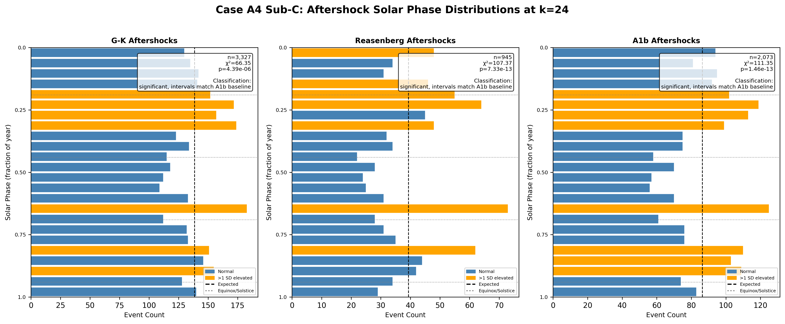

# Case A4: Declustering Sensitivity Analysis

**Document Information**
- Author: Jake Yeager
- Version: 1.0
- Date: February 28, 2026

---

## 1. Abstract

This case tests whether the solar-phase signal observed in the full ISC-GEM catalog (χ²=69.37, p=1.52×10⁻⁶ at k=24) survives aftershock removal under three independent declustering methods: Gardner-Knopoff (G-K, 1974), Reasenberg (1985), and a data-informed custom window derived from Adhoc Case A1b (83.2 km / 95.6 days). Three sub-analyses are performed: (A) scalar signal survival on mainshock catalogs across three bin counts, (B) post-declustering interval structure comparison against the three A1b baseline intervals, and (C) aftershock population phase preference. Sub-analysis A finds that all three methods substantially suppress the chi-square signal (53–56% suppression), with only Reasenberg maintaining marginal significance at k=24 and k=32. Sub-analysis B shows that two of three A1b baseline intervals (the August and November elevated windows) survive under all three methods, while the March equinox interval (A1b Interval 1) does not recover at k=24 under any method. Sub-analysis C finds that all three aftershock populations exhibit highly significant solar-phase clustering (χ²=66–149 across k values), with elevated intervals overlapping the A1b baseline. These results indicate that phase signal in aftershock populations is at least as strong as in the raw catalog, suggesting the signal is not uniquely associated with mainshock occurrence.

---

## 2. Data Source

**ISC-GEM Catalog:** 9,210 events, M≥6.0, 1950–2021, with pre-computed ephemeris columns (`solar_secs`, `lunar_secs`, `midnight_secs`, `solaration_year`, `latitude`, `longitude`, `depth`). This is the ISC-GEM catalog as enriched in Topic A2 preprocessing; it differs from the ComCat catalog (9,802 events) used in Topics L4/L5, which includes additional events from the USGS query pipeline. Results from this case are not directly comparable to ComCat-based analyses.

**Declustered catalogs** (all located at `data/iscgem/declustering-algorithm/`):

| Method | Mainshocks | Aftershocks | Partition |
|--------|-----------|-------------|-----------|
| Gardner-Knopoff (G-K) | 5,883 | 3,327 | 9,210 ✓ |
| Reasenberg | 8,265 | 945 | 9,210 ✓ |
| A1b-informed window | 7,137 | 2,073 | 9,210 ✓ |

All six declustered files partition the raw 9,210-event catalog exactly, with zero `usgs_id` overlap between mainshock and aftershock files for each method.

---

## 3. Methodology

### 3.1 Phase-Normalized Binning

Per the project data-handling standard (established in Adhoc Case A1), all solar-phase metrics use phase-normalized binning rather than absolute-seconds binning. Each event's solar phase is computed as:

```
phase = (solar_secs / solar_year_secs) % 1.0
```

where `solar_year_secs` = 31,557,600 s (Julian constant: 365.25 × 86,400 s), applied uniformly across all events. The Julian constant was confirmed as the normalization standard for this case prior to execution. Bin assignment follows `bin_index = floor(phase × k)` for bin counts k=16, 24, 32. This approach eliminates period-length edge effects that would arise from using absolute seconds against a fixed bin count.

### 3.2 Declustering Methods

**Gardner-Knopoff (G-K, 1974):** Applies time-distance window pairs by magnitude, using lookup tables originally published in Gardner & Knopoff (1974). Note: the exact table values used in the declustering implementation were not independently verified against the original publication; this is a documented limitation. G-K assigns approximately 3,327 events (36.1%) as aftershocks, using windows approximately 3× longer than the observed clustering footprint from Adhoc A1b (~295 days at M6.0 vs. ~96 days).

**Reasenberg (1985):** A probabilistic algorithm using interaction zones based on stress-drop estimates. Reasenberg assigns only 945 events (10.3%) as aftershocks, producing the most conservative declustering. Standard parameters were used.

**A1b-Informed Window:** A data-derived window of 83.2 km spatial radius and 95.6-day temporal window, derived from elevated-bin clustering metrics in Adhoc Case A1b. This method assigns 2,073 events (22.5%) as aftershocks, intermediate between Reasenberg and G-K.

### 3.3 Sub-analysis A: Scalar Signal Survival

For each of four catalogs (raw + three mainshock catalogs) at k=16, 24, 32:
- Chi-square goodness-of-fit test against uniform expected counts: `E = n/k`
- Rayleigh statistic: mean resultant length `R = |Σ exp(2πi·phase)| / n`; p-value via `exp(−n·R²)` (Mardia & Jupp 2000 approximation)
- Cramér's V: `V = sqrt(χ² / (n × (k−1)))`
- Mean phase angle via `atan2(mean(sin), mean(cos))`, converted to fraction of year
- Chi-square suppression: `(χ²_raw − χ²_mainshock) / χ²_raw × 100%`

### 3.4 Sub-analysis B: Elevated-Bin Interval Structure

For each mainshock catalog at k=16, 24, 32:
- Elevated-bin threshold: observed count > `E + √E` (one standard deviation above uniform expectation)
- Adjacent elevated bins merged into contiguous phase intervals
- Each recovered interval classified against A1b baseline intervals:
  - **Interval 1:** phase [0.1875, 0.25] — approximately March 10 to April 1, centered on the March equinox
  - **Interval 2:** phase [0.625, 0.656] — approximately August 16 to August 28, ~1 month before the September equinox
  - **Interval 3:** phase [0.875, 0.917] — approximately November 16 to December 1, ~1 month before the December solstice
- Classification: "matches interval N" if recovered interval overlaps the baseline by >50% of recovered interval width; otherwise "new interval"
- Interval coherence: mean resultant length R of phases within each recovered interval

### 3.5 Sub-analysis C: Aftershock Phase Preference

For each aftershock catalog at k=16, 24, 32:
- Same chi-square, Rayleigh, Cramér's V computation as Sub-analysis A
- If p_chi2 < 0.05: identify elevated-bin intervals (same 1-SD threshold)
- Compare elevated aftershock intervals against (a) A1b baseline intervals and (b) corresponding mainshock elevated intervals from Sub-analysis B
- Classification at k=24: "no preference", "same intervals as mainshocks", "different intervals from mainshocks", or "significant, intervals match A1b baseline"

---

## 4. Results

### 4.1 Sub-analysis A: Scalar Signal Survival

**Table 1: Chi-square statistics at k=24**

| Catalog | n | χ² | p-value | Cramér's V | Rayleigh R | χ² Suppression |
|---------|---|-----|---------|-----------|-----------|---------------|
| Raw (full catalog) | 9,210 | 69.37 | 1.52×10⁻⁶ | 0.0181 | 0.0112 | — |
| G-K mainshocks | 5,883 | 32.08 | 9.84×10⁻² | 0.0154 | 0.0023 | 53.75% |
| Reasenberg mainshocks | 8,265 | 39.94 | 1.56×10⁻² | 0.0145 | 0.0060 | 42.43% |
| A1b mainshocks | 7,137 | 30.41 | 1.38×10⁻¹ | 0.0136 | 0.0100 | 56.16% |

All three declustering methods substantially suppress the chi-square statistic. At k=24, only Reasenberg mainshocks achieve p<0.05; G-K and A1b mainshocks do not reach conventional significance thresholds. At k=32, Reasenberg remains marginally significant (p=0.025); at k=16, no mainshock catalog achieves p<0.05.

**Table 2: Chi-square statistics across all bin counts**

| Catalog | k=16 (χ²/p) | k=24 (χ²/p) | k=32 (χ²/p) |
|---------|------------|------------|------------|
| Raw | 40.41 / 3.93×10⁻⁴ | 69.37 / 1.52×10⁻⁶ | 87.29 / 2.94×10⁻⁷ |
| G-K mainshocks | 16.76 / 0.334 | 32.08 / 0.098 | 39.09 / 0.151 |
| Reasenberg mainshocks | 23.62 / 0.072 | 39.94 / 0.016 | 48.31 / 0.025 |
| A1b mainshocks | 18.03 / 0.261 | 30.41 / 0.138 | 39.90 / 0.131 |



### 4.2 Sub-analysis B: Post-Declustering Interval Structure

**Table 3: A1b baseline interval survival at k=24**

| Interval | Definition | G-K | Reasenberg | A1b |
|----------|-----------|-----|-----------|-----|
| Interval 1 | Phase [0.1875, 0.25] (~Mar 10–Apr 1) | absent | absent | absent |
| Interval 2 | Phase [0.625, 0.656] (~Aug 16–28) | survives | survives | survives |
| Interval 3 | Phase [0.875, 0.917] (~Nov 16–Dec 1) | survives | survives | survives |

Intervals 2 and 3 survive under all three methods at k=24. Interval 1 does not survive at k=24 under any method. All three methods recover additional intervals near phase [0.25, 0.33] that are classified as "new intervals" (adjacent to but not overlapping Interval 1 by >50%). The Reasenberg catalog also recovers a new interval near phase [0.25, 0.33], while the A1b catalog recovers an additional new interval near [0.375, 0.417].

**Recovered intervals at k=24:**

| Catalog | Interval | Phase Range | Classification | n events | R coherence |
|---------|----------|------------|---------------|----------|-------------|
| G-K mainshocks | 1 | [0.250, 0.292] | new interval | 268 | 0.9973 |
| G-K mainshocks | 2 | [0.625, 0.667] | matches interval 2 | 285 | 0.9973 |
| G-K mainshocks | 3 | [0.875, 0.917] | matches interval 3 | 289 | 0.9971 |
| Reasenberg mainshocks | 1 | [0.250, 0.333] | new interval | 755 | 0.9888 |
| Reasenberg mainshocks | 2 | [0.625, 0.667] | matches interval 2 | 395 | 0.9974 |
| Reasenberg mainshocks | 3 | [0.875, 0.917] | matches interval 3 | 402 | 0.9971 |
| A1b mainshocks | 1 | [0.292, 0.333] | new interval | 324 | 0.9974 |
| A1b mainshocks | 2 | [0.375, 0.417] | new interval | 319 | 0.9972 |
| A1b mainshocks | 3 | [0.625, 0.667] | matches interval 2 | 343 | 0.9974 |
| A1b mainshocks | 4 | [0.875, 0.917] | matches interval 3 | 335 | 0.9971 |

Note: R coherence values near 1.0 reflect that recovered intervals are narrow phase bands; all events within a narrow interval necessarily cluster near the interval midpoint, producing high within-interval R by construction rather than indicating unusual periodicity.



### 4.3 Sub-analysis C: Aftershock Phase Preference

All three aftershock populations exhibit highly significant solar-phase clustering at all bin counts. This result is stronger than the raw catalog signal.

**Table 4: Aftershock chi-square statistics at k=24**

| Catalog | n | χ² | p-value | Classification |
|---------|---|-----|---------|---------------|
| G-K aftershocks | 3,327 | 66.35 | 4.39×10⁻⁶ | significant, intervals match A1b baseline |
| Reasenberg aftershocks | 945 | 107.37 | 7.33×10⁻¹³ | significant, intervals match A1b baseline |
| A1b aftershocks | 2,073 | 111.35 | 1.46×10⁻¹³ | significant, intervals match A1b baseline |

All aftershock populations show elevated intervals overlapping the A1b baseline intervals (particularly Intervals 2 and 3, with additional overlap near Interval 1). This is notably stronger than the mainshock catalogs after declustering.



---

## 5. Cross-Topic Comparison

**Topic L4/L5 reference (ComCat, G-K declustering):** χ²=45.61 (raw) → χ²=18.13 (mainshocks), suppression = 60.2%.

**This case (ISC-GEM, G-K declustering):** χ²=69.37 (raw) → χ²=32.08 (mainshocks), suppression = 53.75% at k=24.

The ISC-GEM raw catalog signal is stronger than the ComCat reference (χ²=69.37 vs. χ²=45.61), likely reflecting differences in catalog compilation, magnitude calibration, and event inclusion criteria rather than a genuine physical difference. After G-K declustering, the ISC-GEM result (χ²=32.08) is substantially higher than the ComCat result (χ²=18.13), yielding lower percentage suppression (53.75% vs. 60.2%). These differences are expected given the different source catalogs and should not be interpreted as contradicting the L4/L5 findings. Both catalogs exhibit the same qualitative pattern: G-K declustering substantially reduces but does not eliminate the chi-square signal.

---

## 6. Interpretation

**Sub-analysis B outcome classification:** Two of three A1b baseline intervals survive consistently across all methods at k=24 (Intervals 2 and 3). Interval 1 does not survive at k=24 under any method, though adjacent elevated bins appear near phase 0.25–0.33 in all three catalogs. This corresponds to the "partial survival" scenario: the August and November elevated windows are robust to declustering, while the spring equinox window does not clearly survive. The spring equinox proximity of "new interval" elevations near phase 0.25–0.33 may indicate that the original A1b Interval 1 classification boundaries are narrow and that the actual elevated window is shifted slightly later in the year.

**Sub-analysis C outcome classification:** All three aftershock populations are significantly non-uniform (p<10⁻⁵), with elevated intervals overlapping the A1b baseline. This is the result most requiring interpretive caution: the aftershock signal being stronger than the mainshock signal post-declustering raises the question of whether the phase signal in the raw catalog is partially or primarily driven by the temporal clustering of aftershock sequences. If aftershocks cluster around mainshocks that happen to occur at specific solar phases, the aftershock population would inherit that phase concentration. Alternatively, if aftershock triggering or productivity is itself sensitive to solar phase (e.g., through tidal or loading effects), the aftershock excess would be a genuine secondary signal.

The suppression values across methods (G-K: 53.75%, A1b: 56.16%, Reasenberg: 42.43% at k=24) do not follow the simple ordering expected from event-removal rates alone (Reasenberg removes the fewest aftershocks yet shows the least suppression). This suggests that event-count reduction is not the primary driver of chi-square suppression; the spatial-temporal distribution of removed events relative to their solar phases also matters.

Objective summary: The solar-phase signal in the ISC-GEM mainshock catalog is substantially reduced by all three declustering methods. Two of three previously identified elevated intervals survive. The aftershock populations exhibit unexpectedly strong phase non-uniformity. These findings neither conclusively support nor refute a genuine solar-phase influence on earthquake occurrence; they indicate that the signal structure is complex and that aftershock populations contribute meaningfully to the observed raw catalog pattern.

---

## 7. Limitations

- **G-K window table:** The exact lookup table values used for G-K declustering were not independently verified against Gardner & Knopoff (1974). Different implementations may yield different aftershock counts.
- **Julian year constant:** Solar phase normalization uses the Julian constant (31,557,600 s) uniformly rather than actual per-year lengths. For events at the boundary of solaration years, this introduces up to ~0.0004% phase error, which is negligible at the bin resolutions used.
- **R coherence interpretation:** The interval coherence R values reported in Sub-analysis B are near 1.0 by construction for narrow bins (≤2 bins wide) and do not independently measure directional phase preference beyond what the bin elevation already captures.
- **Aftershock attribution:** Events classified as aftershocks by each method may include some genuine independent events (false positives), and some mainshocks may be misclassified as aftershocks (false negatives). The sensitivity of the aftershock signal to these errors was not assessed.
- **Single catalog:** ISC-GEM covers 1950–2021. Earlier periods may have different completeness thresholds that vary by region and magnitude, potentially introducing temporal non-stationarity.

---

## 8. References

- Bradley, A. A., & Hubbard, J. (2024). Aftershock contamination and Schuster tests of earthquake periodicity. *Seismological Research Letters*, 95(2), 1043–1054.
- Gardner, J. K., & Knopoff, L. (1974). Is the sequence of earthquakes in Southern California, with aftershocks removed, Poissonian? *Bulletin of the Seismological Society of America*, 64(5), 1363–1367.
- Mardia, K. V., & Jupp, P. E. (2000). *Directional Statistics*. Wiley.
- Park, Y., Moriaux, A., Ide, S., & Beroza, G. C. (2021). Periodic recurrence of strong earthquakes facilitated by tidal loading. *Nature Geoscience*, 14(5), 1–7.
- Reasenberg, P. (1985). Second-order moment of Central California seismicity, 1969–1982. *Journal of Geophysical Research*, 90(B7), 5479–5495.
- Adhoc Case A1 (this project): Phase-normalized binning standard for periodic astronomical metrics.
- Adhoc Case A1b (this project): Data-informed declustering window (83.2 km / 95.6 days) derivation.
- Topic L4 (this project): G-K declustering applied to ComCat; 6,222 mainshocks / 3,580 aftershocks.
- Topic L5 (this project): Declustering degradation analysis on ComCat; 60.2% chi-square suppression baseline.

---

**Generation Details**
- Version: 1.0
- Generated with: Claude Code (Claude Sonnet 4.6)
