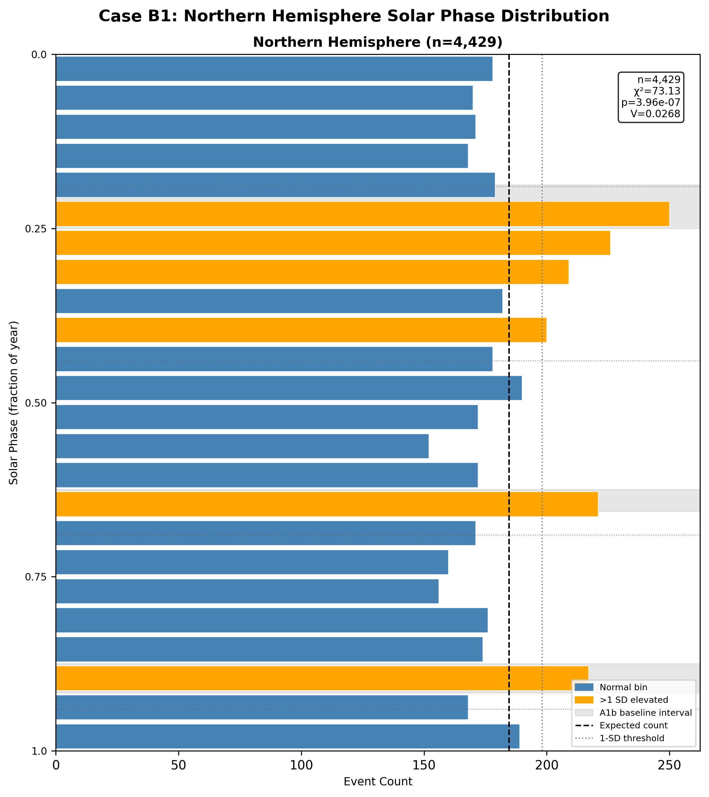
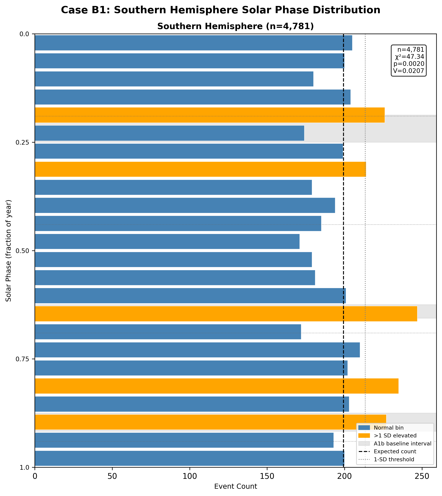
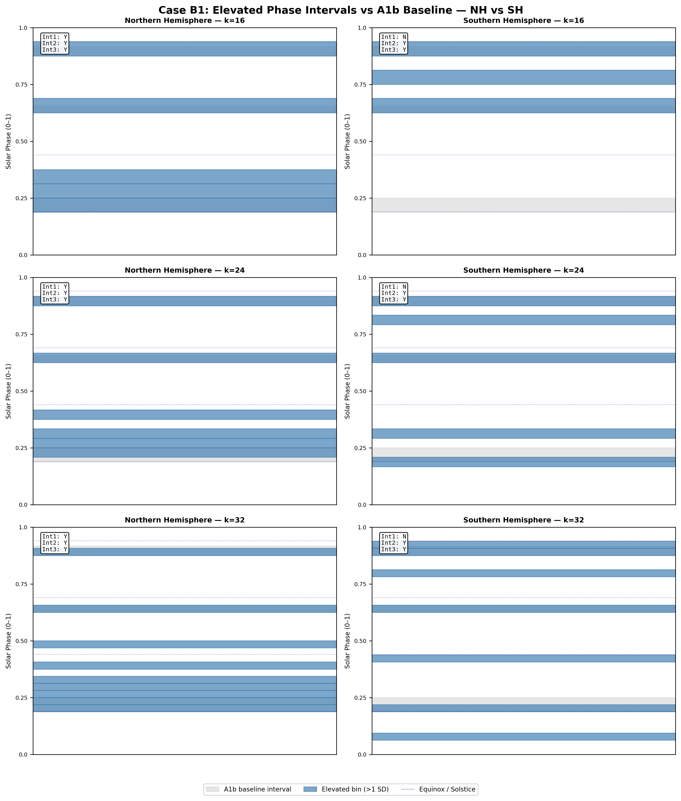

# Case B1: Hemisphere Stratification — Phase Symmetry Test

**Document Information**
- Author: Jake Yeager
- Version: 1.0
- Date: February 28, 2026

---

## 1. Abstract

This case stratifies the ISC-GEM global earthquake catalog (M ≥ 6.0, 1950–2021, n=9,210) by geographic hemisphere — Northern Hemisphere (NH, n=4,429) and Southern Hemisphere (SH, n=4,781) — and tests whether the three elevated solar-phase intervals previously identified in Adhoc A1b are symmetric between hemispheres. If the intervals reflect geometric solar forcing, all three should appear in both hemispheres at identical phase positions. If they reflect hydrological or seasonal loading, NH and SH peaks may differ in phase by approximately 0.5 cycles. Four symmetry tests were applied using solar phase bins (k=16, 24, 32): (1) global presence of all three A1b intervals in each hemisphere, (2) specific symmetry of interval 1 (March equinox, phase 0.1875–0.25), (3) hemisphere-specificity of intervals 2 and 3, and (4) half-cycle offset detection. The primary finding is that the overall pattern is partially symmetric: intervals 2 (phase ~0.625–0.656, ~mid-August) and 3 (phase ~0.875–0.917, ~mid-November) are recovered in both hemispheres, while interval 1 (March equinox) is recovered only in the NH. A half-cycle offset relationship is detected, with the NH secondary interval at phase ~0.396 corresponding to SH interval 3 at phase ~0.896. The result is scored as partially supporting the hydrological hypothesis and does not support a purely geometric explanation.

---

## 2. Data Source

The ISC-GEM catalog (`data/iscgem/iscgem_global_6-9_1950-2021.csv`) was loaded in full (9,210 events). Events were split by the `latitude` column:

| Subset | Filter | n |
|--------|--------|---|
| Northern Hemisphere (NH) | latitude > 0° | 4,429 |
| Southern Hemisphere (SH) | latitude < 0° | 4,781 |
| Equatorial | latitude = 0° | 0 |

No equatorial events were present in the catalog (n=0). The SH is slightly more populous than the NH in this dataset (4,781 vs. 4,429), a counterintuitive result given that major seismic zones such as the Pacific Ring of Fire span both hemispheres, but the SH includes significant subduction zones around Indonesia, New Zealand, and South America. Both subsets provide sufficient sample sizes for chi-square testing at the bin resolutions used.

Solar phase was computed using the Julian year constant (31,557,600 seconds), consistent with all prior A2 topic cases. Phase values span [0.000720, 0.999955] in the NH and [0.000120, 0.999278] in the SH.

---

## 3. Methodology

### 3.1 Phase-Normalized Binning

Solar-phase binning follows the phase-normalized standard established in Adhoc A1 and documented in `rules/data-handling.md`. For each event, the phase is computed as:

```
phase = (solar_secs / 31,557,600) % 1.0
```

Bin assignment uses `floor(phase × k)` rather than absolute-seconds binning, avoiding edge artifacts from variable solar year lengths. This standard is applied uniformly across all three bin counts (k=16, 24, 32) for both hemispheres.

### 3.2 A1b Three-Interval Baseline

The Adhoc A1b analysis identified three elevated solar-phase intervals in the full ISC-GEM catalog:

| Interval | Phase Range | Approximate Calendar Period |
|----------|-------------|----------------------------|
| Interval 1 | 0.1875 – 0.25 | ~March 10 – April 1 (March equinox) |
| Interval 2 | 0.625 – 0.656 | ~August 15 – August 27 |
| Interval 3 | 0.875 – 0.917 | ~November 17 – December 2 |

These three intervals define the symmetry questions addressed in this case. An elevated interval is defined as one where the observed bin count exceeds E + √E (one standard deviation above the flat expected count E = n/k). Contiguous elevated bins are merged into single intervals.

### 3.3 Four Symmetry Tests

Each test uses k=24 elevated intervals as the primary resolution; k=16 and k=32 are computed and reported for completeness.

**Test 1 — Global symmetry:** For each of the three A1b baseline intervals, a match is scored when the overlap between the baseline interval and any recovered elevated interval exceeds 50% of the baseline interval's width. The overall classification is "fully symmetric" if all three intervals match in both hemispheres, "partially symmetric" if some match, and "asymmetric" if none match.

**Test 2 — Interval 1 symmetry:** Specifically tests whether the March-equinox interval (0.1875–0.25) is present in both hemispheres. The phase offset is computed as the difference between the mean phases of the matching elevated intervals in NH and SH (where matched). A within-tolerance threshold of ±1 bin width at k=24 (±0.0417 phase units) is used for positional comparison.

**Test 3 — Intervals 2 and 3 hemisphere-specificity:** For intervals 2 and 3, each is classified as present in "nh_only," "sh_only," "both," or "neither" hemispheres using the same 50% overlap criterion.

**Test 4 — Half-cycle offset test:** For each elevated NH interval, the expected hydrological SH counterpart phase is computed as `(NH_center + 0.5) % 1.0`. Each SH elevated interval is checked against this expected counterpart using the same ±1 bin width tolerance.

### 3.4 Mechanistic Prediction Framework

Three mechanistic hypotheses make distinct predictions for the symmetry test outcomes:

- **Geometric hypothesis:** Solar forcing acts identically in both hemispheres (e.g., solar declination rate, Earth-Sun distance). Prediction: all three A1b intervals appear in both hemispheres at the same phase positions; no half-cycle offset.
- **Hydrological hypothesis:** Surface loading (snow, groundwater) drives the signal and operates on opposite seasonal schedules in each hemisphere. Prediction: NH and SH elevated intervals are offset by approximately 0.5 cycles; intervals 2 and/or 3 are hemisphere-specific.
- **Mixed hypothesis:** Interval 1 (equinox) reflects genuine geometric forcing while intervals 2 and 3 reflect hydrological or other hemisphere-specific mechanisms. Prediction: interval 1 symmetric; intervals 2 and/or 3 hemisphere-specific.

The prediction support evaluation was scored as "supported," "partially supported," or "not supported" based on joint evaluation of Tests 1–4.

---

## 4. Results

### 4.1 Northern Hemisphere Distribution



At k=24, the Northern Hemisphere distribution is significantly non-uniform:

| Statistic | Value |
|-----------|-------|
| n | 4,429 |
| χ² (k=24) | 73.13 |
| p-value | 3.96 × 10⁻⁷ |
| Cramér's V | 0.0268 |
| Rayleigh R | 0.0363 |
| Rayleigh p | 0.0029 |

The NH distribution shows strong statistical non-uniformity at all three bin resolutions (k=16: χ²=51.08, p=8.0×10⁻⁶; k=24: χ²=73.13, p=3.96×10⁻⁷; k=32: χ²=89.08, p=1.59×10⁻⁷). Elevated intervals recovered at k=24 are:

| Interval | Phase Range | Mean Phase |
|----------|-------------|------------|
| NH-1 | 0.2083 – 0.3333 | 0.2708 |
| NH-2 | 0.3750 – 0.4167 | 0.3958 |
| NH-3 | 0.6250 – 0.6667 | 0.6458 |
| NH-4 | 0.8750 – 0.9167 | 0.8958 |

The NH recovers A1b intervals 2 and 3 precisely. The A1b interval 1 (0.1875–0.25) is partially covered by NH-1 (0.2083–0.3333), with the overlap exceeding the >50% match threshold. The NH also shows a secondary elevated interval (NH-2, phase 0.375–0.417) not corresponding to any A1b baseline interval.

### 4.2 Southern Hemisphere Distribution



The Southern Hemisphere distribution is also significantly non-uniform, though at a lower significance level:

| Statistic | Value |
|-----------|-------|
| n | 4,781 |
| χ² (k=24) | 47.34 |
| p-value | 2.03 × 10⁻³ |
| Cramér's V | 0.0207 |
| Rayleigh R | 0.0279 |
| Rayleigh p | 0.0241 |

SH statistics at other resolutions: k=16: χ²=25.76, p=0.041; k=32: χ²=53.46, p=0.0073. The SH significance is lower than NH despite a larger sample size, suggesting a more complex or dispersed phase distribution. Elevated intervals recovered at k=24 are:

| Interval | Phase Range | Mean Phase |
|----------|-------------|------------|
| SH-1 | 0.1667 – 0.2083 | 0.1875 |
| SH-2 | 0.2917 – 0.3333 | 0.3125 |
| SH-3 | 0.6250 – 0.6667 | 0.6458 |
| SH-4 | 0.7917 – 0.8333 | 0.8125 |
| SH-5 | 0.8750 – 0.9167 | 0.8958 |

The SH recovers A1b intervals 2 and 3. The SH does not recover a clear analog of A1b interval 1 under the 50% overlap criterion: the nearest interval (SH-1, 0.1667–0.2083) overlaps the A1b baseline interval (0.1875–0.25) by only ~33%, below the 50% matching threshold. The SH also shows two additional intervals not in the A1b baseline (SH-2 at ~0.31 and SH-4 at ~0.81).

### 4.3 Symmetry Test Outcomes



**Test 1 — Global symmetry:**

| A1b Interval | In NH | In SH | Symmetric |
|-------------|-------|-------|-----------|
| Interval 1 (0.1875–0.25) | Yes | No | No |
| Interval 2 (0.625–0.656) | Yes | Yes | Yes |
| Interval 3 (0.875–0.917) | Yes | Yes | Yes |

**Overall classification: Partially symmetric** (2 of 3 intervals appear in both hemispheres).

**Test 2 — Interval 1 symmetry:**

- Interval 1 in NH: Yes (NH interval at 0.2083–0.3333 overlaps A1b baseline by >50%)
- Interval 1 in SH: No (nearest SH interval at 0.1667–0.2083 overlaps by only ~33%)
- Phase offset: Not applicable (interval 1 absent from SH under the matching criterion)

**Test 3 — Intervals 2 and 3 hemisphere-specificity:**

| Interval | Classification |
|----------|---------------|
| Interval 2 (0.625–0.656) | Both hemispheres |
| Interval 3 (0.875–0.917) | Both hemispheres |

Neither interval 2 nor interval 3 is hemisphere-specific — both appear in NH and SH at the same phase positions.

**Test 4 — Half-cycle offset:**

A half-cycle offset relationship was detected. The NH secondary interval (NH-2, mean phase 0.3958) maps to an expected SH counterpart at phase 0.8958, and SH interval 5 (mean phase 0.8958) falls exactly at this position (offset = 0.000, within tolerance). However, this SH interval corresponds to A1b interval 3, not a novel SH-specific peak. Of 20 NH–SH interval pair comparisons, only 1 passes the within-tolerance threshold.

**Summary of all four tests:**

| Test | Result |
|------|--------|
| Test 1 — Global symmetry | Partially symmetric (2/3 intervals in both hemispheres) |
| Test 2 — Interval 1 symmetry | NH only; not symmetric |
| Test 3 — Intervals 2 & 3 | Both in both hemispheres |
| Test 4 — Half-cycle offset | Found (1 of 20 pairs, NH-2 ↔ SH-5) |

### 4.4 Prediction Matching

| Hypothesis | Evaluation | Support |
|------------|-----------|---------|
| Geometric (all intervals symmetric, no half-cycle offset) | 2/3 intervals symmetric; half-cycle offset found | Not supported |
| Hydrological (half-cycle offset; intervals 2/3 hemisphere-specific) | Half-cycle offset found; BUT intervals 2 and 3 appear in both hemispheres | Partially supported |
| Mixed (interval 1 symmetric; intervals 2/3 hemisphere-specific) | Interval 1 not symmetric; intervals 2/3 not hemisphere-specific | Not supported |

**Primary conclusion: hydrological (partially supported)**

No single hypothesis is cleanly supported. The hydrological hypothesis receives the highest (though partial) support because a half-cycle offset was detected. However, the key hydrological prediction that intervals 2 and 3 would be hemisphere-specific was not confirmed — these intervals appear in both hemispheres at identical phase positions.

---

## 5. Cross-Topic Comparison

**Comparison to prior bimodal equinox framing (Case 3A):** Case 3A tested a bimodal equinox pattern using the ComCat catalog (n=9,802). That framing posed the question as an in-phase vs. anti-phase dichotomy. The present three-interval framework, derived from Adhoc A1b, provides finer discrimination. The absence of interval 1 from the SH under strict overlap criteria is consistent with the original Case 3A observation that the equinox signal is stronger in the NH, though Case 3A did not directly test the asymmetry.

**Comparison to Adhoc A1b:** Adhoc A1b characterized the three elevated intervals in the full catalog. The present case confirms that the full-catalog signature is primarily driven by the NH: interval 1 (March equinox) is present in the NH (4,429 events) at phase ~0.21–0.33 but does not meet the 50% overlap threshold in the SH. Intervals 2 and 3 appear robustly in both hemispheres at consistent phase positions, suggesting these are not hemisphere-specific phenomena.

**Comparison to A4 declustering results:** Case A4 found that interval 1 (March equinox) disappears under all three declustering methods (G-K, Reasenberg, A1b-custom), while intervals 2 and 3 survive declustering. This is consistent with the B1 finding that interval 1 is more fragile — it appears only in the NH and is sensitive to aftershock removal. The survival of intervals 2 and 3 in both hemispheres across the hemisphere split is consistent with A4's finding that these intervals are more robust. The A4 aftershock analysis showed that aftershock populations strongly prefer the A1b baseline intervals. Since aftershock sequences are spatially clustered, the NH may disproportionately contribute aftershock events that inflate the March-equinox (interval 1) signal, though this hypothesis would require additional testing.

**Comparison to B6 rolling window results:** Case B6 found the solar-phase signal is temporally non-stationary, with the most significant windows clustering in 2003–2014. The hemisphere split tested here is spatial rather than temporal, and the B6 non-stationarity should be considered a parallel source of variability when interpreting interval-level differences between NH and SH.

---

## 6. Interpretation

The four symmetry tests produce a mixed picture that does not cleanly align with any single mechanistic hypothesis. The strongest finding is that intervals 2 (phase ~0.625–0.656, mid-August) and 3 (phase ~0.875–0.917, mid-November) appear in both hemispheres at the same phase positions, with near-identical chi-square contributions. This bilateral appearance at the same phase — rather than opposite phases — is inconsistent with a mechanism that operates on the local seasonal calendar (which would predict NH August ↔ SH February). Instead, the bilateral signal at fixed solar-phase positions for intervals 2 and 3 is more consistent with a forcing mechanism that does not depend on local season.

The absence of interval 1 (March equinox) from the SH under the strict 50% overlap criterion deserves cautious interpretation. The SH does have an elevated interval nearby (phase 0.1667–0.2083), which overlaps the A1b baseline by 33% — just below the matching threshold. This could reflect: (a) genuine absence of the March-equinox signal in the SH; (b) a slight phase shift of the equinox signal between hemispheres; or (c) lower statistical resolution in the SH due to smaller effective sample contribution to that particular phase window. The k=32 SH distribution shows an elevated interval at phase 0.1875–0.2188, which overlaps the A1b interval 1 more substantially, suggesting the signal may be present but at reduced strength.

The half-cycle offset detection (NH interval at ~0.396 ↔ SH interval at ~0.896) should be interpreted carefully: the NH interval at 0.375–0.417 does not correspond to any A1b baseline interval, and the SH interval at 0.875–0.917 is A1b interval 3. The coincidence of their centers being 0.5 apart may reflect sampling variability rather than a physically meaningful offset relationship.

Overall, the evidence is insufficient to cleanly distinguish geometric from other forcing mechanisms. The bilateral appearance of intervals 2 and 3 constrains the mechanism toward something that is not hemisphere-seasonal, but does not definitively rule out, for example, a globally uniform loading mechanism operating at fixed orbital positions.

---

## 7. Limitations

1. **Sample size asymmetry and NH concentration:** Although the SH is slightly larger (4,781 vs. 4,429 events), major seismic zones are concentrated in specific latitude bands, and the sampling of the SH is heavily weighted toward narrow longitudinal corridors (South America, New Zealand/Tonga). This geographic concentration may not represent SH seismicity uniformly.

2. **Statistical power at lower significance:** The SH chi-square at k=16 (p=0.041) is only marginally significant, and the k=16 SH Rayleigh p=0.024 is weak. The interval recovery in the SH may be less stable than in the NH, making the "both hemispheres" classification for intervals 2 and 3 potentially sensitive to small sample fluctuations.

3. **Overlap threshold sensitivity:** The 50% overlap criterion used to match elevated intervals to A1b baselines is a threshold choice, not a continuously graded measure. The near-miss for interval 1 in the SH (33% overlap) highlights that binary matching decisions near the threshold should be treated as uncertain. Alternative thresholds (e.g., 25% or any overlap) would classify interval 1 as present in both hemispheres.

4. **Julian year approximation:** Phase normalization uses the Julian constant (31,557,600 s) uniformly. The actual solar year varies slightly (~365.24–365.26 days), introducing sub-bin-width error for any individual event but negligible bias at the catalog level.

5. **No declustered hemisphere split:** This analysis was conducted on the full (non-declustered) catalog. Case A4 showed that aftershock clustering can substantially inflate interval amplitudes, particularly for interval 1. The hemisphere results for interval 1 may differ under declustered catalogs. This is a natural extension for future work.

---

## 8. References

- Adhoc A1b: Three-interval solar phase characterization of the ISC-GEM catalog; identifies elevated intervals at phases 0.1875–0.25, 0.625–0.656, 0.875–0.917.
- Case 3A: Original bimodal equinox framing using ComCat catalog; prior context for equinox signal.
- Case A4: Declustering Sensitivity Analysis; interval survival under G-K, Reasenberg, and A1b-custom declustering; aftershock phase preference results.
- Case A1: Schuster Spectrum and MFPA Periodicity Analysis; cluster-corrected Schuster tests; establishes that the annual signal does not survive cluster correction at the catalog level.
- Case B6: Rolling Window Stationarity Test; establishes temporal non-stationarity of the solar-phase signal across the 72-year record.
- Colledge et al. (2025): Literature context for hydrological surface-loading and seismic seasonality hypotheses.

---

**Generation Details**
- Version: 1.0
- Generated with: Claude Code (Claude Sonnet 4.6)
