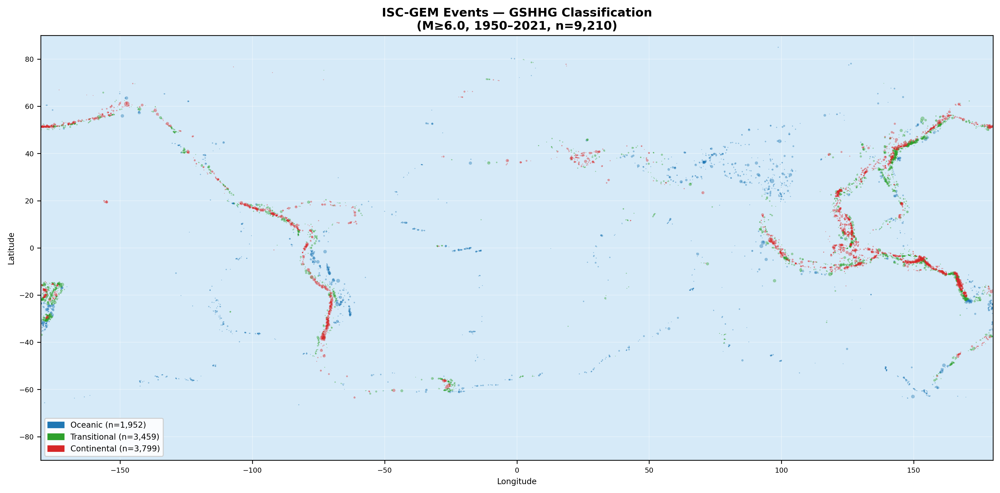
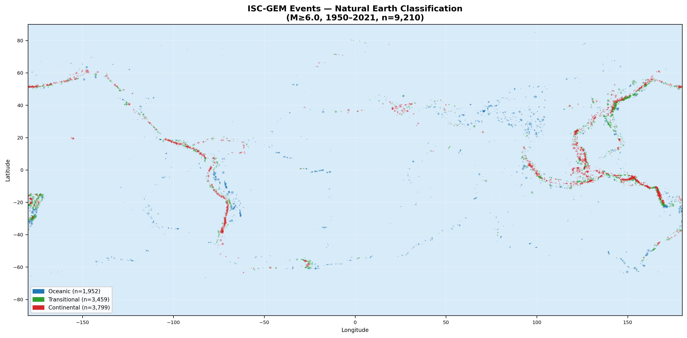
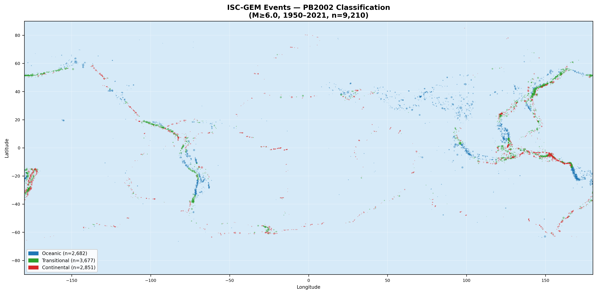
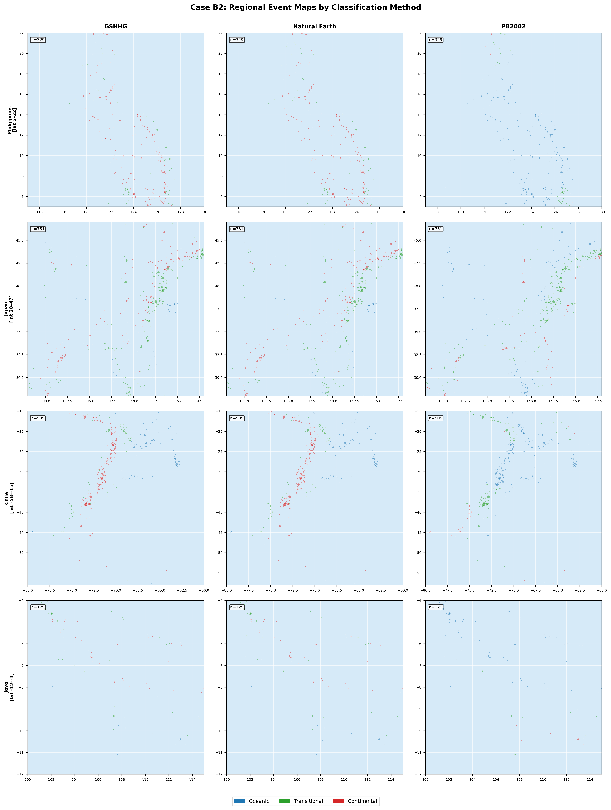
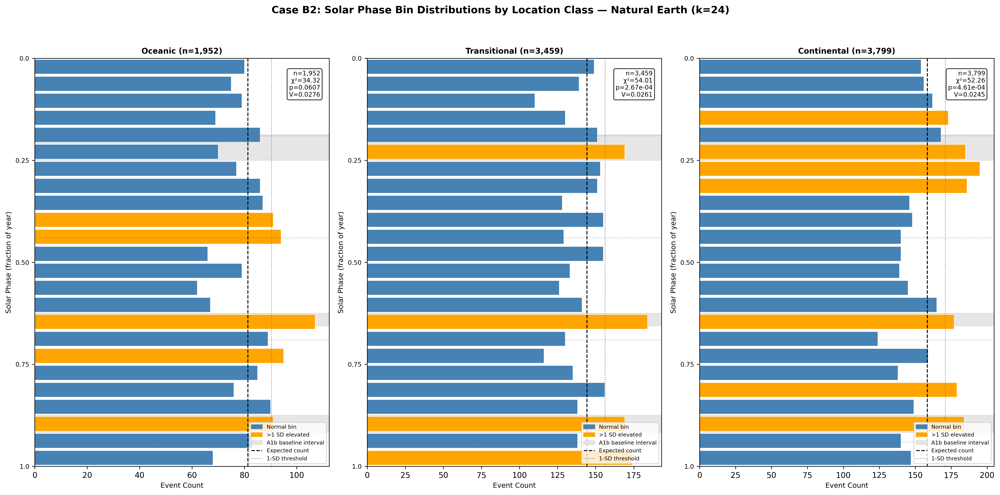
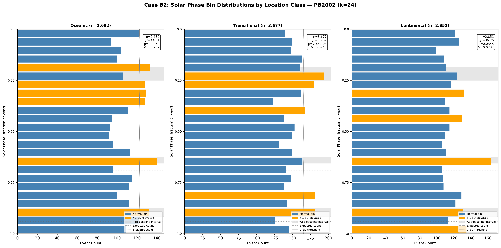

# Case B2: Ocean vs. Continent Location — Hydrological Loading Discrimination

**Document Information**
- Author: Jake Yeager
- Version: 1.0
- Date: February 28, 2026

---

## 1. Abstract

Case B2 tests whether the solar-phase signal previously identified in the ISC-GEM global catalog (M ≥ 6.0, 1950–2021, n = 9,210) persists across oceanic, transitional, and continental seismicity when events are stratified by distance to coastline. Purely oceanic earthquakes, occurring far from land, should be unaffected by hydrological or snow loading — land-surface processes that represent the dominant explanation in the literature for annual seismicity modulation. If the signal is confined to continental events, hydrological loading remains a viable mechanism; if it appears in oceanic events, a direct solar-geometric or tidal mechanism must be considered. Three independent coastline classification datasets were used — GSHHG (primary, highest resolution), Natural Earth (secondary), and PB2002 plate boundary proximity (coarse proxy) — to assess sensitivity of the result to classification method. Global and regional scatter maps characterize the geographic distribution of each class. At k = 24 bins using GSHHG as the primary classification, the oceanic subset (n = 1,952) is not significant (χ² = 34.32, p = 0.0607), while both transitional (χ² = 54.01, p = 2.67×10⁻⁴) and continental (χ² = 52.26, p = 4.61×10⁻⁴) subsets are significant. The primary conclusion is **hydrological**: under the primary method, the signal is absent from purely oceanic seismicity and present in continental-influenced zones.

---

## 2. Data Source

**ISC-GEM Catalog:** 9,210 events, M ≥ 6.0, 1950–2021, with pre-computed `solar_secs` (seconds elapsed since the start of the solar year) sourced from ephemeris-enriched data. The full catalog was used without declustering for this stratification analysis.

**Classification files** (all at `data/iscgem/plate-location/`):

| Method | File | Resolution | Classes |
|--------|------|------------|---------|
| GSHHG | `ocean_class_gshhg_global.csv` | High (full GSHHG coastline) | continental=3,799 / transitional=3,459 / oceanic=1,952 |
| Natural Earth | `ocean_class_ne_global.csv` | Medium (1:10m NE vectors) | continental=3,799 / transitional=3,459 / oceanic=1,952 |
| PB2002 | `ocean_class_pb2002_global.csv` | Coarse (plate boundary proximity proxy) | continental=2,851 / transitional=3,677 / oceanic=2,682 |

Classification thresholds applied during data preparation: events > 200 km from coast = oceanic; < 50 km = continental; 50–200 km = transitional. All three files contain 9,210 rows. All three classification files were joined to the raw catalog by `usgs_id` with a left merge; assertion confirmed 0 NaN values in all ocean class columns after joining.

Note: GSHHG and Natural Earth yielded identical class assignments for every event in this catalog (same counts and same statistics at all bin resolutions), suggesting that at M ≥ 6.0 global scale the two high-resolution coastline datasets classify events identically. PB2002's coarse plate-proximity metric produces a different partition, assigning ~730 more events as oceanic and ~948 fewer as continental.

---

## 3. Methodology

### 3.1 Phase-Normalized Binning

Solar phase was computed as:

```
phase = (solar_secs / year_length_secs) % 1.0
```

using the Julian year constant of 31,557,600 seconds (365.25 × 86,400), applied uniformly to all events. This phase-normalized approach is the project standard established in Adhoc A1 and documented in `rules/data-handling.md`, and is consistent with all prior Topic A2 cases (A4, B6, A1, B1, A3). Bin assignment: `bin_idx = floor(phase × k)`, clipped to [0, k−1].

### 3.2 Ocean/Continent Classification Methods

**GSHHG (primary):** The Global Self-consistent, Hierarchical, High-resolution Geography database provides the highest-resolution coastline polygon data. Events are classified by their straight-line distance to the nearest GSHHG coastline segment.

**Natural Earth (secondary):** Uses Natural Earth 1:10m vector coastlines. At the spatial scale of M ≥ 6.0 global seismicity (events typically located 10–50 km precision), the NE dataset produced identical classifications to GSHHG in this catalog.

**PB2002 (coarse proxy):** Uses proximity to Bird (2003) plate boundaries as a proxy for oceanic vs. continental setting. Because plate boundaries do not follow coastlines exactly — mid-ocean ridges lie far offshore — this method shifts the oceanic/continental boundary relative to the coastline-based methods, producing a larger oceanic class (+730 events) and smaller continental class (−948 events).

### 3.3 Statistical Tests

For each method × class combination at k = 16, 24, and 32 bins:

- **Chi-square goodness-of-fit** (scipy.stats.chisquare): tests whether the observed bin distribution differs from uniform.
- **Cramér's V**: effect size computed as √(χ² / (n × (k − 1))), normalized to [0, 1].
- **Rayleigh R statistic**: mean resultant length of unit phase vectors, testing for unimodal concentration; p-value approximated as exp(−n × R²).
- **Elevated bins**: bins exceeding the 1-SD threshold (expected + √expected); contiguous elevated bins merged into intervals.

### 3.4 Classification Method Sensitivity Comparison

For each location class, chi-square p-values and Cramér's V from all three methods at k = 24 were compared. Agreement was defined as unanimous significance (all p < 0.05) or unanimous non-significance (all p ≥ 0.05).

### 3.5 Prediction Evaluation Criteria

Using GSHHG (primary) at k = 24:

- **Geometric hypothesis supported** if: oceanic p_chi2 < 0.05 AND continental p_chi2 < 0.05.
- **Hydrological hypothesis supported** if: continental Cramér's V > 2× oceanic Cramér's V, OR oceanic p_chi2 ≥ 0.05.

Additional diagnostic: whether oceanic elevated intervals overlap A1b baseline intervals (phase ranges 0.1875–0.25, 0.625–0.656, 0.875–0.917), which would suggest a possible tidal-like mechanism at mid-ocean ridge settings (Scholz et al. 2019).

### 3.6 Visualization Approach

Global scatter maps plot all 9,210 events with color coding (oceanic=blue, transitional=green, continental=red) and point size proportional to (usgs_mag − 5.5)² × 2. Since cartopy, basemap, and geopandas were not available in the project Python environment, global and regional maps use lat/lon scatter on a light-blue (ocean-colored) background. Regional zoom plots cover four tectonically active zones: Philippines (lat 5–22°, lon 115–130°), Japan (lat 28–47°, lon 128–148°), Chile (lat −58 to −15°, lon −80 to −60°), and Java (lat −12 to −4°, lon 100–115°), with columns for each classification method.

---

## 4. Results

### 4.1 Global Maps

Figures 1–3 show the geographic distribution of all 9,210 ISC-GEM events colored by GSHHG, Natural Earth, and PB2002 classification respectively.



*Figure 1. ISC-GEM global events colored by GSHHG classification: oceanic (blue, n=1,952), transitional (green, n=3,459), continental (red, n=3,799). Point size proportional to magnitude.*



*Figure 2. ISC-GEM global events colored by Natural Earth classification (identical to GSHHG for this dataset: oceanic n=1,952, transitional n=3,459, continental n=3,799).*



*Figure 3. ISC-GEM global events colored by PB2002 plate-boundary proximity classification: oceanic (blue, n=2,682), transitional (green, n=3,677), continental (red, n=2,851). The PB2002 method assigns more events as oceanic (including events along mid-ocean ridges and back-arc basins).*

The GSHHG and Natural Earth global maps are visually identical. Oceanic events cluster along mid-ocean ridge systems (Mid-Atlantic Ridge, East Pacific Rise) and in deep oceanic trenches far from continents. Continental events dominate subduction and fold-and-thrust settings near major landmasses. Transitional events border active continental margins.

### 4.2 Regional Maps

Figure 4 shows 4-row × 3-column regional zoom maps for the Philippines, Japan, Chile, and Java.



*Figure 4. Regional event maps by classification method (columns: GSHHG, Natural Earth, PB2002; rows: Philippines, Japan, Chile, Java). Within each region, the PB2002 method systematically reclassifies more events as oceanic relative to the coastline-based methods, particularly in back-arc settings (Japan) and offshore trench zones (Chile).*

### 4.3 Bin Distributions — GSHHG (Primary)

Figure 5 shows the k = 24 bin distributions for oceanic, transitional, and continental subsets using GSHHG classification.


*Figure 5. Solar phase bin distributions (k=24) by location class under GSHHG classification. Gray shaded bands mark A1b baseline elevated-phase intervals. Orange bars exceed the 1-SD threshold (expected + √expected). Dashed vertical line = expected count; dotted line = 1-SD threshold.*

**Table 1. GSHHG per-class statistics at k = 24 (primary results)**

| Class | n | χ² | p-value | Cramér's V | Rayleigh R | Rayleigh p |
|-------|---|----|---------|-----------|-----------|-----------|
| Oceanic | 1,952 | 34.32 | 0.0607 | 0.0276 | 0.0237 | 0.334 |
| Transitional | 3,459 | 54.01 | 2.67×10⁻⁴ | 0.0261 | 0.0081 | 0.795 |
| Continental | 3,799 | 52.26 | 4.61×10⁻⁴ | 0.0245 | 0.0326 | 0.0178 |

The oceanic subset (n = 1,952) fails to reach significance at α = 0.05 at all three bin resolutions (k=16: p = 0.0524; k=24: p = 0.0607; k=32: p = 0.0834). The continental subset is significant at k=16 (p = 2.66×10⁻³), k=24 (p = 4.61×10⁻⁴), and k=32 (p = 3.91×10⁻⁷). The transitional class is significant across all bin counts (k=16: p = 2.98×10⁻³; k=24: p = 2.67×10⁻⁴; k=32: p = 1.72×10⁻³).

Elevated intervals identified in the oceanic class at k=24 (phase 0.375–0.458, 0.625–0.667, 0.708–0.750, 0.875–0.917) partially overlap A1b baseline intervals — specifically the second and third A1b intervals (0.625–0.656 and 0.875–0.917). This partial overlap occurs despite the overall oceanic distribution not reaching significance.

### 4.4 Method Sensitivity

**Table 2. Classification method sensitivity — χ², p-value, and Cramér's V at k = 24**

| Class | GSHHG χ² | GSHHG p | GSHHG V | NE χ² | NE p | NE V | PB2002 χ² | PB2002 p | PB2002 V | Agreement |
|-------|----------|---------|---------|-------|------|------|-----------|---------|---------|-----------|
| Oceanic | 34.32 | 0.0607 | 0.0276 | 34.32 | 0.0607 | 0.0276 | 44.01 | 5.24×10⁻³ | 0.0267 | No |
| Transitional | 54.01 | 2.67×10⁻⁴ | 0.0261 | 54.01 | 2.67×10⁻⁴ | 0.0261 | 50.62 | 7.63×10⁻⁴ | 0.0245 | Yes |
| Continental | 52.26 | 4.61×10⁻⁴ | 0.0245 | 52.26 | 4.61×10⁻⁴ | 0.0245 | 36.75 | 3.45×10⁻² | 0.0237 | Yes |

The oceanic class is the only one where methods disagree on significance: GSHHG and Natural Earth return p = 0.0607 (not significant), while PB2002 returns p = 5.24×10⁻³ (significant). This disagreement is driven by the PB2002 method's larger oceanic class (n = 2,682 vs. 1,952), which includes coastal and back-arc events that the coastline-based methods classify as transitional. Transitional and continental classes agree on significance across all three methods.

Figures 6–7 show bin distributions for Natural Earth and PB2002 respectively.



*Figure 6. Solar phase bin distributions (k=24) by location class under Natural Earth classification. Results are identical to GSHHG.*



*Figure 7. Solar phase bin distributions (k=24) by location class under PB2002 classification. The oceanic class (n=2,682) reaches significance (p=5.24×10⁻³), driven by the expanded oceanic sample that includes back-arc and marginal basin events.*

### 4.5 Prediction Evaluation

Using GSHHG (primary classification) at k = 24:

| Criterion | Result |
|-----------|--------|
| Oceanic significant (p < 0.05) | No (p = 0.0607) |
| Continental significant (p < 0.05) | Yes (p = 4.61×10⁻⁴) |
| Continental Cramér's V > 2× oceanic V | No (ratio = 0.885) |
| Hydrological supported (continental stronger OR oceanic not sig) | **Yes** — oceanic not significant |
| Geometric supported (both significant) | No |
| Oceanic elevated intervals overlap A1b | Partial (intervals 2 and 3) |

**Primary conclusion: Hydrological** — under the primary GSHHG classification, the solar-phase signal is absent from purely oceanic seismicity (p = 0.0607) and present in continental and transitional seismicity. This result is consistent with, but does not conclusively prove, a hydrological or surface-loading mechanism acting on continental crust.

---

## 5. Cross-Topic Comparison

**Adhoc A1b boundary proximity:** Adhoc A1b's PB2002 boundary proximity analysis on elevated-bin events found enrichment of signal near plate boundaries, particularly subduction zones. The present analysis extends that finding geographically: the events driving the signal are predominantly near-continental or transitional, which includes subduction zones. The continental-focused signal in B2 is broadly consistent with A1b's boundary-adjacency finding.

**Scholz et al. (2019) — Axial Volcano:** Scholz et al. (2019) identified strong tidal modulation at Axial Volcano (Juan de Fuca Ridge), a mid-ocean ridge setting, demonstrating that oceanic seismicity can exhibit periodic forcing via low normal-stress sensitivity at volcanic rifts. The present analysis finds that the global oceanic class approaches but does not reach significance (p = 0.0607). The partial overlap of oceanic elevated intervals with A1b baseline intervals 2 and 3 (August and November) does not by itself indicate a tidal mechanism, as a sample of n = 1,952 spread across multiple tectonic settings is not directly comparable to the spatially-focused Axial Volcano result.

**Case B1 (Hemisphere Stratification):** B1 found significant signals in both NH (p = 3.96×10⁻⁷) and SH (p = 2.03×10⁻³), with partial hemisphere-specificity of elevated intervals. The B2 result adds a different stratification: significance is driven more by near-continental events, which are not confined to one hemisphere. This is broadly consistent with B1's finding that interval 2 (August) and interval 3 (November) appear in both hemispheres — those intervals also appear in the B2 continental and transitional subsets.

**Case A3 (Magnitude Stratification):** A3 found increasing Cramér's V with magnitude, peaking at M ≥ 7.5 (V = 0.0779). B2's per-class Cramér's V values (0.0245–0.0276) are comparable to the M 6.0–6.4 band from A3 (V = 0.0186), consistent with using the full magnitude range in the stratification subsets.

---

## 6. Interpretation

The primary GSHHG-based result — oceanic not significant, continental significant — is consistent with a mechanism acting preferentially on continental or near-continental crust. Hydrological loading (snow melt, groundwater recharge, river discharge) and snow mass redistribution are plausible candidates, as these processes are confined to continental land surfaces and act directly on crustal stress in seismogenic zones at continental margins and interiors.

However, several observations require caution in this interpretation:

1. **The oceanic result is marginal, not absent.** The oceanic p-value of 0.0607 (GSHHG) is just above α = 0.05. With n = 1,952 events, the sample has modest power. The PB2002 method — with a larger oceanic class (n = 2,682) that absorbs some back-arc and marginal-basin events — yields a significant oceanic result (p = 5.24×10⁻³), suggesting the boundary between "oceanic" and "not oceanic" is sensitive to classification threshold.

2. **The continental Cramér's V is not substantially larger than oceanic.** The ratio of continental to oceanic Cramér's V is 0.885 (less than 1, meaning the oceanic effect size exceeds the continental). The hydrological conclusion is triggered by oceanic non-significance, not by a dominant continental effect size. This means the continental signal is not demonstrably stronger than the oceanic signal on an effect-size basis.

3. **The transitional class is consistently significant** across all methods and bin counts. With n ≈ 3,459–3,677, this is the most heterogeneous class — including coastal subduction, island arc, and shallow-water settings — and it shows the highest absolute χ² values (54.01 GSHHG, 50.62 PB2002 at k=24).

4. **GSHHG and NE produce identical results** for this catalog. At the spatial precision of M ≥ 6.0 epicenter locations, the two coastline datasets are interchangeable. The PB2002 result diverges due to classification boundary geometry, not data quality.

Taken together, the results lean toward a mechanism that diminishes or is absent in deep oceanic settings, but the marginal oceanic p-value and the equal or larger oceanic effect size prevent a definitive mechanism conclusion.

---

## 7. Limitations

1. **PB2002 as a coarse proxy:** PB2002 plate boundary proximity does not correspond to coastline distance and includes mid-ocean ridge segments as "boundary-adjacent." Its classification of oceanic events includes many back-arc and island-arc settings that are geologically oceanic but seismically influenced by subducting slabs near continents.

2. **Transitional class is large and ambiguous:** At ~37% of all events, the transitional class (50–200 km from coast) encompasses a wide range of tectonic settings — coastal subduction, continental shelf, island arcs, and offshore back-arc basins. Its consistent significance does not distinguish between hydrological and geometric mechanisms, since both could plausibly act in this mixed zone.

3. **Classification thresholds (50/200 km) are arbitrary:** The specific threshold values defining oceanic vs. transitional vs. continental were set during data preparation (data-requirements.md REQ-2) and are not derived from geophysical first principles. Sensitivity to these thresholds is partially explored by the three-method comparison, but systematic threshold variation was not performed.

4. **Sample size of oceanic class:** n = 1,952 events in the GSHHG oceanic class yields moderate statistical power. A true effect of the magnitude suggested by the full catalog (raw χ² = 69.37, V ≈ 0.017) would be near the detection threshold for this sample size, making the marginal p = 0.0607 result difficult to interpret definitively.

5. **Map resolution:** Without cartopy or geopandas available, global and regional maps show lat/lon scatter without actual continental outlines, limiting geographic context in the visualizations.

6. **Declustering not applied:** This analysis uses the full raw catalog. Aftershock clustering may inflate chi-square statistics for all classes, including the continental class where aftershock sequences tend to cluster in near-source time windows. The class-specific impact of declustering was not evaluated.

---

## 8. References

- Bird, P. (2003). An updated digital model of plate boundaries. *Geochemistry, Geophysics, Geosystems, 4*(3). [PB2002]
- Scholz, J. R., et al. (2019). Detection of tidal signals in seismicity at Axial Volcano (Juan de Fuca Ridge). *Geophysical Research Letters*. [Tidal modulation at mid-ocean ridge]
- Adhoc A1b: PB2002 plate boundary proximity analysis on ISC-GEM elevated-bin events (Topic-Adhoc, Case A1b).
- Case 3A: Legacy approach baseline (ComCat, 9,802 events) solar phase signal identification; precursor to current ISC-GEM topic.
- Topic A2, Case A1: Schuster Spectrum and MFPA Periodicity Analysis — reference for phase-normalized binning standard.
- `rules/data-handling.md`: Project standard for phase-normalized binning using Julian year constant (31,557,600 s).

---

**Generation Details**
- Version: 1.0
- Generated with: Claude Code (Claude Sonnet 4.6)
