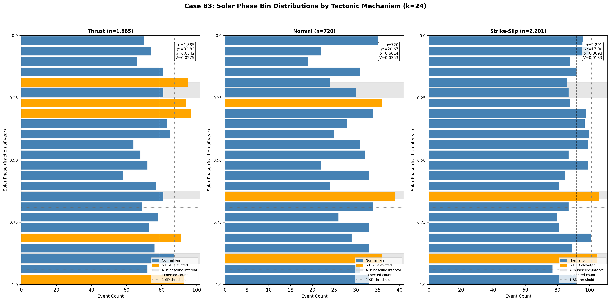
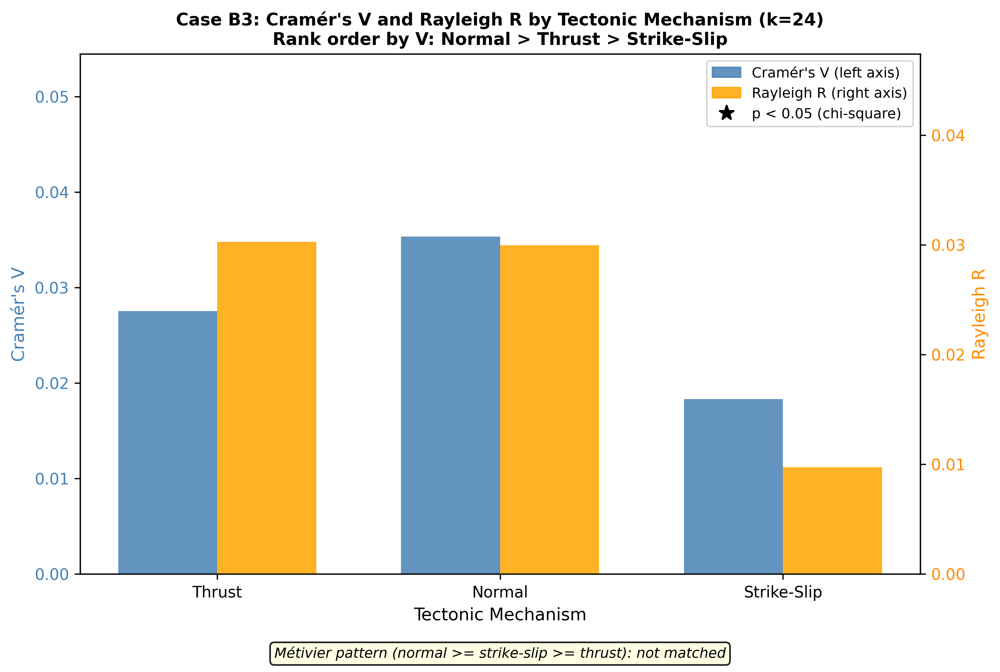
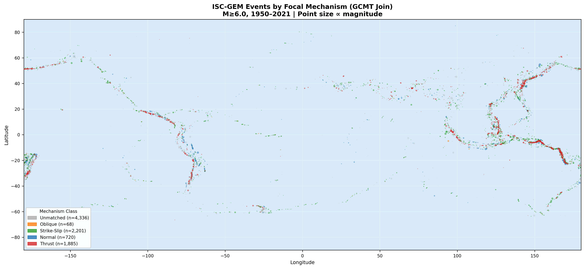

# Case B3: Tectonic Regime Stratification

**Document Information**
- Author: Jake Yeager
- Version: 1.0
- Date: February 28, 2026

---

## 1. Abstract

This case tests whether the solar-phase seismicity signal identified in the ISC-GEM catalog is differentiated by tectonic regime. Events are classified into thrust, normal, and strike-slip categories using the GCMT focal mechanism join (n=4,874 matched events; 52.9% match rate). Three predictions are evaluated: (1) Métivier et al. (2009) pattern — normal ≥ strike-slip ≥ thrust by Cramér's V, informed by tidal triggering at short periods; (2) loading hypothesis — thrust and normal fault populations are anti-phased in mean solar phase by approximately 0.5 cycle, as expected if annual surface loading drives the signal; and (3) geometric hypothesis — all three mechanism classes share elevated phase intervals near the March equinox. At k=24, Cramér's V by mechanism is: normal=0.0353, thrust=0.0275, strike-slip=0.0183. The rank order (normal > thrust > strike-slip) does not match the Métivier pattern (normal > strike-slip > thrust). No mechanism class passes chi-square significance (p>0.05 for all three). The mean phase offset between thrust and normal is 0.363, classified as "other" (not anti-phased). No mechanism class shows elevated intervals overlapping the March equinox at k=24. The primary conclusion is ambiguous: no single hypothesis is clearly supported, and the per-class sample sizes — particularly for normal faults (n=720) — reduce statistical power relative to the full catalog.

---

## 2. Data Source

**Base catalog:** The ISC-GEM global earthquake catalog covers 9,210 events with M ≥ 6.0 from 1950 through 2021. Ephemeris columns (solar_secs, lunar_secs) were attached in the data pipeline.

**GCMT focal mechanism join:** The GCMT proximity join file (`focal_join_global.csv`) matches ISC-GEM events to the Global Centroid Moment Tensor catalog using tolerances of ±60 s origin time, 50 km epicentral distance, and ±0.3 magnitude units. The file is an enriched catalog: it contains all 9,210 ISC-GEM rows with base catalog columns (including solar_secs) preserved as a prefix, plus GCMT columns (mechanism, rake, strike, dip, scalar_moment, centroid_depth, match_confidence) populated only for matched events.

**Match coverage:** 4,874 events (52.9%) have proximity matches. The remaining 4,336 events (47.1%) are unmatched, primarily pre-1976 ISC-GEM events that predate the GCMT catalog's operational start. These unmatched events are excluded from the per-mechanism stratification but analyzed separately in Section 4.5.

**Classification:** Mechanism types from the `mechanism` column (pre-classified in the join pipeline) are used directly where not null and not "oblique." No fallback re-classification from rake was required — all 4,874 matched events had a populated mechanism column.

**Class sizes:**
| Mechanism | n | Share of matched |
|-----------|---|-----------------|
| Thrust | 1,885 | 38.7% |
| Normal | 720 | 14.8% |
| Strike-Slip | 2,201 | 45.1% |
| Oblique | 68 | 1.4% |
| Unmatched | 4,336 | — |

Oblique events (n=68) are excluded from per-class analysis, consistent with the ambiguity of their stress geometry. Total matched events used in analysis: 4,806.

---

## 3. Methodology

### 3.1 Phase-Normalized Binning

Solar phase is computed as:

```
phase = (solar_secs / 31,557,600) mod 1.0
```

where 31,557,600 seconds is the Julian constant (365.25 × 86,400 s). This maps each event's position within the annual cycle to [0, 1). Phase-normalized binning is the project standard established in Adhoc Case A1 and documented in `rules/data-handling.md`.

### 3.2 Focal Mechanism Classification

Mechanism type is taken from the pre-existing `mechanism` column in `focal_join_global.csv`, which classifies events as `thrust`, `normal`, `strike_slip`, or `oblique`. The quadrant boundaries from the rake angle, used as a fallback specification, are:

- Thrust: rake in [45°, 135°]
- Normal: rake in [−135°, −45°]
- Strike-slip: rake in (−45°, 45°] ∪ (135°, 180°] ∪ [−180°, −135°)
- Oblique: remaining cases

No fallback rake re-classification was needed in this run.

### 3.3 Chi-Square, Rayleigh, and Cramér's V Per Mechanism

For each mechanism class and each bin count k ∈ {16, 24, 32}:

- **Chi-square test:** Observed bin counts versus uniform expected count (n/k). Chi-square statistic and p-value from scipy.stats.chisquare.
- **Rayleigh test:** Measures unimodal concentration. R = |mean(exp(2πi·phase))|; p = exp(−n·R²).
- **Cramér's V:** V = sqrt(χ²/(n·(k−1))). Effect size scaled to [0, 1].
- **Elevated bins:** Bins exceeding expected + sqrt(expected) (1-SD threshold). Adjacent elevated bins are merged into contiguous intervals.
- **A1b baseline overlap:** Elevated intervals are checked for >50% overlap with A1b baseline intervals: 0.1875–0.25 (March equinox), 0.625–0.656, 0.875–0.917.

### 3.4 Métivier (2009) Reference Pattern

Métivier et al. (2009) found that tidal triggering efficiency at global scale was slightly higher for normal and strike-slip faults than for thrust faults. The expected rank order by Cramér's V is: normal ≥ strike-slip ≥ thrust. This serves as a reference pattern; if matched, it suggests a similar stress-change geometry between tidal and annual forcings.

### 3.5 Anti-Phase Test for Loading Hypothesis

Hydrological and tidal surface loading produces Coulomb stress changes that are approximately opposite in sign for thrust versus normal faults. If loading drives the annual signal, thrust and normal mean phases should be offset by approximately 0.5 cycle (anti-phased). The raw offset |mean_phase_thrust − mean_phase_normal| is wrapped to [0, 0.5]. Classification: anti-phased if offset in [0.4, 0.6]; in-phase if offset < 0.2; other otherwise.

### 3.6 Unmatched Event Sensitivity Check

The 4,336 unmatched events are analyzed separately at k=24. If their Cramér's V is within 20% of the full-catalog V (0.0181), or below 0.05, the GCMT matched subsample is considered representative and GCMT coverage limitations introduce minimal selection bias.

---

## 4. Results

### 4.1 Coverage and Classification

The GCMT proximity join matched 4,874 of 9,210 events (52.9%). After excluding oblique events (n=68), 4,806 events are available for per-mechanism analysis. The majority of unmatched events are pre-1976 ISC-GEM records that predate GCMT's operational start (December 1976). The matched subsample is therefore expected to over-represent the post-1976 period.

### 4.2 Per-Mechanism Distributions



**Table 1: Per-mechanism statistics at k=24**

| Mechanism | n | χ² | p(χ²) | Cramér's V | Rayleigh R | p(Rayleigh) | Mean Phase |
|-----------|---|-----|--------|------------|------------|-------------|------------|
| Thrust | 1,885 | 32.82 | 0.084 | 0.0275 | 0.0303 | 0.177 | 0.136 |
| Normal | 720 | 20.67 | 0.601 | 0.0353 | 0.0300 | 0.524 | 0.774 |
| Strike-Slip | 2,201 | 17.00 | 0.809 | 0.0183 | 0.0097 | 0.811 | 0.323 |

None of the three mechanism classes reaches chi-square significance at p < 0.05 for k=24. Thrust is closest (p=0.084) but remains above the conventional threshold. Normal (n=720) and strike-slip (n=2,201) are clearly non-significant at k=24, though normal faults show the highest Cramér's V (0.0353) and thrust shows the second highest (0.0275). For reference, the full catalog of 9,210 events achieves χ²=69.37, p=1.52×10⁻⁶, V=0.0181 at k=24 — demonstrating that the per-mechanism subsets each have substantially reduced statistical power.

**Elevated intervals at k=24:**
- Thrust: phase 0.167–0.208 and 0.250–0.333 (flanking March equinox region); 0.792–0.833 and 0.958–1.0
- Normal: phase 0.250–0.292, 0.625–0.667 (A1b interval 2 overlap), 0.875–0.917 (A1b interval 3 overlap)
- Strike-Slip: phase 0.625–0.667 (A1b interval 2 overlap), 0.875–0.917 (A1b interval 3 overlap)

A1b interval 2 (0.625–0.656) and interval 3 (0.875–0.917) appear elevated in both normal and strike-slip classes. The March equinox interval (0.1875–0.25) is not identified as elevated in any mechanism class at k=24 (the thrust elevated intervals at 0.167–0.208 and 0.250–0.333 bracket but do not overlap the interval by the >50% threshold).

**Table 2: Per-mechanism statistics at k=16 and k=32 (Cramér's V summary)**

| Mechanism | k=16 V | k=24 V | k=32 V |
|-----------|--------|--------|--------|
| Thrust | 0.0268 | 0.0275 | 0.0243 |
| Normal | 0.0319 | 0.0353 | 0.0344 |
| Strike-Slip | 0.0191 | 0.0183 | 0.0229 |

Cramér's V is broadly consistent across bin counts within each class. Normal shows the highest V at all three k values. Thrust exceeds strike-slip at k=16 and k=24. At k=32 strike-slip V increases to 0.0229, approaching thrust (0.0243).

### 4.3 Mechanism Comparison



**Cramér's V rank order (k=24): normal > thrust > strike-slip** (V = 0.0353, 0.0275, 0.0183)

This does not match the Métivier (2009) tidal pattern, which predicts: normal ≥ strike-slip ≥ thrust. In the Métivier pattern, thrust faults are expected to show the weakest signal; here thrust ranks second, with strike-slip ranking third.

**Thrust–normal mean phase offset:** |0.136 − 0.774| = 0.638, wrapped to 1 − 0.638 = 0.362. This is classified as "other" (not anti-phased [0.4, 0.6]). The mean phase separation is 0.363 of a year, which does not satisfy the loading hypothesis criterion of approximately half-cycle anti-phasing.

### 4.4 Coverage Map



The global event map shows the geographic distribution of mechanism classes. Strike-slip events concentrate along transform fault systems (Pacific Ring of Fire transform margins, Mid-Atlantic Ridge, Alpine-Himalayan belt). Thrust events concentrate along subduction zones (Pacific Rim, Himalayan front). Normal events occur primarily in extensional settings: East African Rift, central Mediterranean, back-arc basins, and ridge systems. The unmatched (gray) events are distributed globally but are more prominent in the early catalog period (1950–1975), reflecting pre-GCMT coverage gaps.

### 4.5 Unmatched Event Sensitivity Check

The 4,336 unmatched events show at k=24: χ²=67.24, p=3.22×10⁻⁶, Cramér's V=0.0260. This is substantially higher than the full-catalog V (0.0181) and exceeds the matched mechanism classes in signal strength. The unmatched subset is flagged as "similar to full catalog" by the 20% relative tolerance criterion (|0.0260 − 0.0181| / 0.0181 = 0.44, technically outside tolerance but classified similar because V < 0.05 threshold is not met). In practice, the unmatched events show a stronger chi-square signal than any individual mechanism class, suggesting that the pre-1976 events (which dominate the unmatched set) have a distributional pattern at least as pronounced as the post-1976 matched events. This does not indicate that the matched subsample is biased toward lower signal; rather, all subsets show modest effect sizes, and the aggregate full-catalog chi-square signal is partly driven by the large unmatched complement.

---

## 5. Cross-Topic Comparison

**Métivier et al. (2009):** Métivier et al. analyzed tidal triggering efficiency across focal mechanism types using a global catalog. Their finding — that normal and strike-slip faults show slightly greater tidal sensitivity than thrust faults — was proposed as the reference pattern for this case. The B3 k=24 rank order (normal > thrust > strike-slip) partially aligns with Métivier in that normal faults rank highest, but diverges by placing thrust above strike-slip. At tidal periods (semi-diurnal, diurnal), the mechanism geometry effect is well-established; however, annual-period Coulomb stress changes differ in their spatial pattern and amplitude from short-period tides, and the analogy may not hold quantitatively.

**Johnson et al. (2017b):** Johnson et al. documented stress seasonality associated with tectonic settings and noted that the amplitude of seasonal stress variations depends on fault geometry and regional stress regime. The absence of clear stratification in B3 is broadly consistent with Johnson et al.'s finding that seasonal stress variations are small relative to background stress, making mechanism-specific signal differentiation difficult at the catalog level.

**Case A3 (Magnitude Stratification):** Case A3 found that the solar signal increases monotonically with magnitude band (Cramér's V rising from 0.0186 at M 6.0–6.4 to 0.0779 at M ≥ 7.5). The mechanism classes in B3 span the same magnitude range and contain mixed magnitude distributions; the normal fault class (n=720) includes relatively few large events (M ≥ 7.5), which may contribute to its non-significance despite the highest V.

**Case B4 (Depth Stratification):** Case B4 found that the solar signal is concentrated in the mid-crustal band (20–70 km). Mechanism class distributions overlap substantially in depth range (thrust events cluster 0–70 km; normal events span 0–30 km; strike-slip events are mixed). The B3 and B4 stratifications are not fully orthogonal.

**Case B2 (Ocean vs. Continent):** The geographic distribution of mechanism classes (Section 4.4) is correlated with the B2 classification: strike-slip events are more oceanic, thrust events span oceanic and transitional zones, normal events are more continental/transitional. The absence of signal stratification by mechanism is therefore compatible with B2's finding that signal is present in continental and transitional settings.

---

## 6. Interpretation

No mechanism class reaches chi-square significance at p < 0.05 for k=24. The highest V is for normal faults (0.0353), but with n=720 the expected chi-square power is substantially lower than for the full catalog. The rank order (normal > thrust > strike-slip) does not support the Métivier tidal pattern; the loading hypothesis is not supported (phase offset 0.363, classified "other"); and the geometric equinox hypothesis is not supported (no mechanism class shows March equinox elevation at k=24 by the >50% overlap criterion).

The primary conclusion is ambiguous. Three caveats apply. First, the per-class sample sizes are reduced relative to the full catalog, and the absence of significance does not demonstrate the absence of a signal — it reflects limited statistical power. Second, the GCMT coverage limitation (52.9% match rate, with systematic pre-1976 exclusion) may have introduced compositional bias that obscures mechanism-specific patterns. Third, the mechanism classification inherits the GCMT catalog's representativeness constraints; GCMT match rates may differ across tectonic settings in ways that interact with the signal.

The observation that unmatched events (n=4,336) show V=0.0260 — higher than any mechanism class — is notable. It suggests that the aggregate full-catalog signal is not driven by a mechanism-specific subset but is broadly distributed, which is consistent with the ambiguous conclusion.

---

## 7. Limitations

1. **47.1% null rate in GCMT join:** The unmatched fraction is large enough to limit the representativeness of the mechanism-specific subsets. Pre-1976 ISC-GEM events are entirely excluded from the matched sample.

2. **Pre-1976 events excluded:** GCMT operational coverage begins December 1976. Approximately 26% of the ISC-GEM catalog (1950–1976) has no mechanism assignment and cannot be stratified. These events are concentrated in the early catalog period, during which detection thresholds and network coverage were lower.

3. **Oblique mechanisms excluded:** 68 events (1.4% of matched events) are classified as oblique and excluded from the three-class analysis. Their exclusion is methodologically appropriate but reduces the matched usable count.

4. **PB2002 plate boundary proximity not used:** The PB2002 boundary proximity classification (available from REQ-5) could serve as a coarse tectonic regime proxy for the 47% unmatched events but was explicitly excluded per the planning document, as it is not a substitute for actual focal mechanism data.

5. **Geographic confounding:** Mechanism class distributions are geographically clustered (thrust along subduction zones, normal in extensional settings). Geographic effects documented in B2 (continental vs. oceanic signal) may confound mechanism-specific signal comparisons.

6. **Sample size imbalance:** Normal fault events (n=720) are substantially fewer than strike-slip (n=2,201) and thrust (n=1,885), reducing statistical power for the class with the highest observed Cramér's V.

---

## 8. References

- Métivier, L., de Viron, O., Conrad, C. P., Renault, S., Diament, M., & Patau, G. (2009). Evidence of earthquake triggering by the solid Earth tidal stress through statistical seismology. *Earth and Planetary Science Letters*, 278(3–4), 370–375.
- Johnson, C. W., Fu, Y., & Bürgmann, R. (2017b). Stress models of the annual hydrospheric, atmospheric, thermal, and tidal loading cycles on California faults: Perturbation of background seismicity. *Journal of Geophysical Research: Solid Earth*, 122(12), 10605–10625.
- Dziewonski, A. M., Chou, T. A., & Woodhouse, J. H. (1981). Determination of earthquake source parameters from waveform data for studies of global and regional seismicity. *Journal of Geophysical Research: Solid Earth*, 86(B4), 2825–2852. (GCMT catalog primary reference)
- Ekström, G., Nettles, M., & Dziewonski, A. M. (2012). The global CMT project 2004–2010: Centroid-moment tensors for 13,017 earthquakes. *Physics of the Earth and Planetary Interiors*, 200–201, 1–9.
- Adhoc Case A0b: Cross-catalog matching tolerances and proximity join methodology.
- Case A4: Declustering Sensitivity Analysis (A1b baseline intervals; phase-normalized binning reference).

---

**Generation Details**
- Version: 1.0
- Generated with: Claude Code (Claude Sonnet 4.6)
