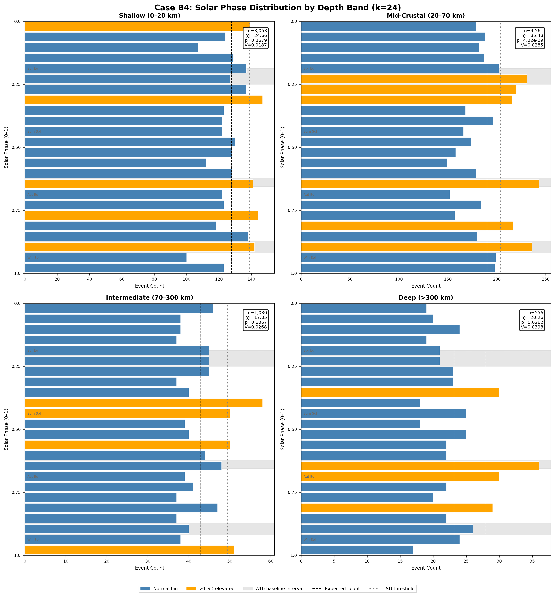
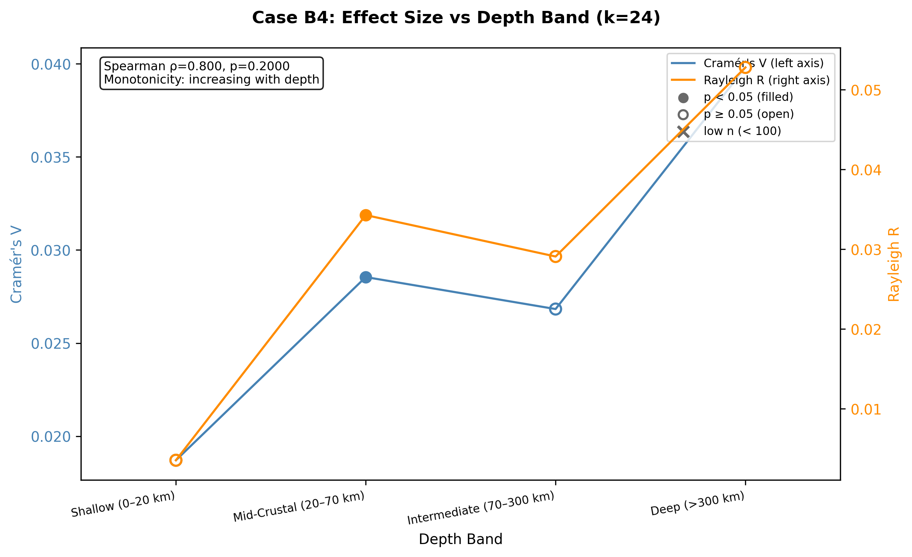
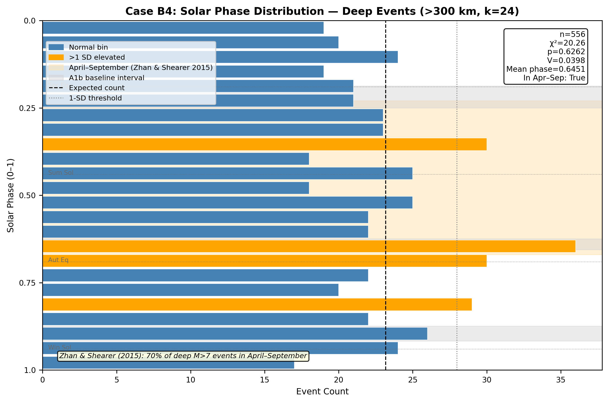

# Case B4: Depth Stratification — Surface Loading Penetration Test

**Document Information**
- Author: Jake Yeager
- Version: 1.0
- Date: February 28, 2026

---

## 1. Abstract

This case investigates whether the solar-phase signal identified in the ISC-GEM catalog (M ≥ 6.0, 1950–2021) attenuates with focal depth, a signature that would implicate surface hydrological loading as a primary driver. The catalog (n=9,210) is stratified into four depth bands: shallow (0–20 km, n=3,063), mid-crustal (20–70 km, n=4,561), intermediate (70–300 km, n=1,030), and deep (>300 km, n=556). Chi-square, Rayleigh, and Cramér's V statistics are computed independently for each band at k=16, 24, and 32 bins. A Spearman rank correlation of Cramér's V versus band order yields ρ=0.80, classifying the trend as "increasing with depth" — the opposite of the surface loading prediction. Only the mid-crustal band is individually significant at k=24 (χ²=85.48, p=4.02×10⁻⁹). The deep band (>300 km, n=556) is not statistically significant, though its mean phase (0.645) falls within the April–September range associated with Zhan and Shearer's (2015) deep-event finding. The results do not clearly support any single mechanistic prediction and instead suggest that the dominant signal in this catalog resides in the mid-crustal band, with a complex, non-monotonic cross-depth pattern.

---

## 2. Data Source

**Catalog:** ISC-GEM global seismic catalog, M ≥ 6.0, 1950–2021
**Total events:** 9,210
**Depth column:** Present in all 9,210 events; no null depth values (n_depth_null = 0)

| Depth Band | Range (km) | n Events | % of Catalog |
|-----------|------------|----------|--------------|
| Shallow | 0–20 | 3,063 | 33.3% |
| Mid-Crustal | 20–70 | 4,561 | 49.5% |
| Intermediate | 70–300 | 1,030 | 11.2% |
| Deep | >300 | 556 | 6.0% |

The deep band (n=556) exceeds the minimum threshold of n=100 required for meaningful statistics; no low-n warning was issued.

**Depth precision note:** ISC-GEM depth estimates vary in precision, particularly for pre-digital-era events (pre-1970s) where teleseismic depths carry uncertainty of ±10–20 km or more. The shallow/mid-crustal boundary at 20 km is within the typical uncertainty range for older events, which may result in some cross-band contamination near this boundary.

---

## 3. Methodology

### 3.1 Phase-Normalized Binning

Solar year phase is computed as:

```
phase = (solar_secs / 31,557,600) % 1.0
```

where 31,557,600 seconds is the Julian year constant, applied uniformly across all cases from Case A1 forward (see `rules/data-handling.md`). This normalization maps each event to a phase in [0, 1) representing its position in the solar year, with 0.0 = January 1. Phase-normalized binning is used rather than absolute-seconds binning to eliminate period-length artifacts; the full rationale is documented in the Adhoc A1 case.

### 3.2 Depth Band Definitions and Physical Rationale

The four bands were chosen to separate tectonic environments with different expected sensitivity to surface-origin forcing:

- **Shallow (0–20 km):** Maximum sensitivity to near-surface stresses from hydrological, atmospheric, and cryospheric loading. Most continental seismicity and shallow subduction events reside here.
- **Mid-Crustal (20–70 km):** Lower sensitivity to surface loading; includes upper mantle and deep crustal seismicity. Still potentially accessible to hydrological loading via pore-pressure diffusion over long timescales.
- **Intermediate (70–300 km):** Subducting slab seismicity and upper-mantle events. Surface loading is not physically expected to influence events at this depth. Any signal at this band would indicate a non-hydrological mechanism.
- **Deep (>300 km):** Deep-focus seismicity in subducting slabs. Surface loading cannot reach these depths via any known mechanism. A signal here would require a globally-reaching forcing (solar geometric, gravitational, or tidal) or a top-down stress transmission not captured in standard loading models.

### 3.3 Chi-Square, Rayleigh, and Cramér's V Per Band

For each band, at each bin count k ∈ {16, 24, 32}:

1. Phase values are computed for all events in the band.
2. Events are assigned to k equal-width bins.
3. Chi-square goodness-of-fit test is applied against the uniform expected distribution (E = n/k per bin).
4. Cramér's V effect size: V = sqrt(χ² / (n × (k − 1))).
5. Rayleigh R statistic and p-value are computed for unimodal directionality.
6. Mean phase angle is computed as the circular mean of phase values.
7. Elevated bins (count > E + √E, the 1-SD threshold) are merged into contiguous phase intervals.
8. Elevated intervals are compared against the A1b baseline intervals (phases 0.1875–0.25, 0.625–0.656, 0.875–0.917).

### 3.4 Depth Trend Analysis: Spearman Rank Correlation and Monotonicity Classification

Cramér's V values at k=24 are ordered by depth band index (1 = shallow, 4 = deep). Spearman rank correlation of V versus band index provides a monotonicity assessment:

- ρ < −0.5: "decreasing with depth" (signal weakens going deeper — consistent with surface loading)
- ρ > +0.5: "increasing with depth" (signal strengthens going deeper)
- |ρ| ≤ 0.5: "non-monotonic" (no clear directional trend)

### 3.5 Prediction Framework

Three mechanistic predictions are evaluated:

**Prediction 1 — Surface loading hypothesis:** Signal strongest at 0–20 km; absent at >70 km. Operationalized as: shallow band significant at k=24 AND intermediate band not significant.

**Prediction 2 — Geometric/deep forcing hypothesis:** Signal present at all depths including >300 km. Operationalized as: all four bands significant at k=24.

**Prediction 3 — Zhan and Shearer (2015) pattern:** Deep events (>300 km) show a concentration in April–September (phase 0.23–0.67 using January 1 = 0.0). Operationalized as: deep band significant at k=24 AND deep mean phase in [0.23, 0.67].

---

## 4. Results

### 4.1 Per-Band Distributions



**Table 1. Band statistics at k=24 (primary bin count).**

| Band | n | χ² | p (χ²) | Cramér's V | Rayleigh R | p (Rayleigh) | Mean Phase |
|------|---|----|---------|------------|------------|--------------|------------|
| Shallow (0–20 km) | 3,063 | 24.66 | 0.3679 | 0.0187 | 0.0036 | 0.9621 | 0.4648 |
| Mid-Crustal (20–70 km) | 4,561 | 85.48 | 4.02×10⁻⁹ | 0.0285 | 0.0343 | 4.71×10⁻³ | 0.0833 |
| Intermediate (70–300 km) | 1,030 | 17.05 | 0.8067 | 0.0268 | 0.0291 | 0.4184 | 0.4474 |
| Deep (>300 km) | 556 | 20.26 | 0.6262 | 0.0398 | 0.0528 | 0.2125 | 0.6451 |

**Table 2. Band statistics at k=16 and k=32 (supplementary).**

| Band | k=16 χ² | k=16 p | k=16 V | k=32 χ² | k=32 p | k=32 V |
|------|---------|--------|--------|---------|--------|--------|
| Shallow (0–20 km) | 13.50 | 0.5639 | 0.0171 | 40.23 | 0.1240 | 0.0206 |
| Mid-Crustal (20–70 km) | 46.33 | 4.71×10⁻⁵ | 0.0260 | 118.64 | 3.49×10⁻¹² | 0.0290 |
| Intermediate (70–300 km) | 8.91 | 0.8820 | 0.0240 | 22.40 | 0.8702 | 0.0265 |
| Deep (>300 km) | 18.91 | 0.2180 | 0.0476 | 32.78 | 0.3798 | 0.0436 |

Only the mid-crustal band (20–70 km) is statistically significant across all three bin counts. Shallow, intermediate, and deep bands are not significant at the α=0.05 threshold at any bin count tested. At k=24, the shallow band's elevated intervals partially overlap with the A1b baseline (intervals at phases 0.625–0.667 and 0.875–0.917 match two of the three A1b intervals), but the overall distribution is not significant.

### 4.2 Depth Trend



Cramér's V values at k=24, ordered by depth band:
- Shallow (0–20 km): V = 0.0187
- Mid-Crustal (20–70 km): V = 0.0285
- Intermediate (70–300 km): V = 0.0268
- Deep (>300 km): V = 0.0398

Spearman rank correlation: **ρ = 0.80, p = 0.200**

Monotonicity classification: **increasing with depth**

The trend is non-monotonic in shape — Cramér's V rises from shallow to mid-crustal, decreases slightly at intermediate, then rises again at deep — but the Spearman rank correlation is dominated by the shallow-to-deep direction and yields ρ=0.80, exceeding the +0.5 threshold for "increasing with depth." Only the mid-crustal band is individually significant (p<0.05 at k=24); the deep band has the second-highest Cramér's V but does not reach significance.

Significant bands at k=24: **mid-crustal (20–70 km) only**.

### 4.3 Deep Events



The deep band (>300 km, n=556) is not significant at k=24 (χ²=20.26, p=0.626). However, its Rayleigh mean phase is **0.6451**, which falls within the April–September range of 0.23–0.67 (phase 0.645 corresponds to approximately late August). This places the deep-band mean phase at the upper boundary of the Zhan and Shearer (2015) window. The deep band's elevated intervals at k=24 include a notable cluster at phases 0.625–0.708 (approximately mid-August through mid-September), coinciding partially with the A1b baseline interval 2.

The Rayleigh p-value for the deep band is 0.212, not significant, indicating no statistically robust unimodal directional preference, though the visual distribution shows a modest concentration near phase 0.65.

### 4.4 Prediction Matching

| Prediction | Criterion | Result |
|-----------|-----------|--------|
| Surface loading | Shallow significant AND intermediate not significant | **Not supported** — shallow is not significant |
| Geometric/deep forcing | All four bands significant | **Not supported** — only mid-crustal significant |
| Zhan and Shearer pattern | Deep significant AND mean phase in April–September | **Partially** — mean phase in range (0.645), but deep band not significant |

No single prediction is fully supported. The surface loading prediction is undermined by the shallow band's lack of significance. The geometric/deep forcing prediction is undermined by the restriction of significance to a single mid-depth band. The Zhan and Shearer pattern receives partial support via phase position but not via significance.

---

## 5. Cross-Topic Comparison

### 5.1 Zhan and Shearer (2015)

Zhan and Shearer (2015) identified that 70% of deep-focus M>7 earthquakes (depth >500 km) occurred in April–September. This case uses a lower depth threshold (>300 km) and does not restrict to M>7, which likely dilutes any deep-specific signal. The ISC-GEM deep band (n=556) contains events as shallow as 300 km and spans magnitude M 6.0–9.0. Despite these differences, the deep band's mean phase (0.6451) falls near the upper edge of the April–September window, weakly consistent with the Zhan and Shearer direction. The lack of statistical significance in the B4 deep band may reflect the broader depth threshold, the inclusion of M<7 events, or genuine noise at smaller sample sizes relative to the Zhan and Shearer dataset.

### 5.2 Dutilleul et al. (2021)

Dutilleul et al. (2021) examined tidal triggering and depth sensitivity at Parkfield and found depth-dependent modulation of tidal stress sensitivity in the seismogenic zone (3–15 km). Their result suggests depth stratification is mechanistically relevant even within a narrow depth range. The B4 case operates at a coarser scale and cannot resolve within-band depth gradients, but the Parkfield finding supports the general premise that depth is a meaningful stratification variable for stress-sensitivity questions.

### 5.3 Relationship to A4 (Declustering)

Case A4 demonstrated that declustering substantially suppresses the raw solar signal (G-K: 53.75% chi-square suppression; A1b: 56.16% suppression). B4 uses the raw catalog. This introduces a confound: the dominant mid-crustal signal (20–70 km) may be partially driven by aftershock clustering rather than reflecting a fundamental depth-band characteristic. The mid-crustal band includes many subduction-zone sequences that generate substantial aftershock clusters. A declustered version of this analysis would be needed to assess the depth pattern in mainshocks alone.

### 5.4 Relationship to A3 (Magnitude Stratification)

Case A3 found a monotonically increasing Cramér's V with magnitude (ρ=1.000), with the M≥7.5 band showing the largest effect (V=0.0779). The deep band's higher nominal Cramér's V (0.0398) relative to the shallow band (0.0187) may reflect a magnitude composition effect: deep events globally tend toward higher magnitudes. If the magnitude-dependent signal is the true underlying relationship, depth may be a partial proxy for magnitude in the ISC-GEM dataset.

---

## 6. Interpretation

The dominant finding is that only the mid-crustal band (20–70 km, n=4,561) shows a statistically significant solar-phase signal at k=24 (χ²=85.48, p=4.02×10⁻⁹, V=0.0285). The shallow band (0–20 km), which carries the strongest physical prediction for a surface-loading effect, is not significant. This is inconsistent with the surface loading hypothesis as the sole explanation.

The Spearman trend (ρ=0.80) nominally classifies the pattern as "increasing with depth," but this is driven by the contrast between the shallow and deep bands, with an intermediate inflection at the mid-crustal level. The trend is not monotonically increasing in the physical sense; it is more accurately described as low at shallow depths, elevated at mid-crustal depths, lower at intermediate depths, and nominally elevated (but not significant) at deep depths. The Spearman statistic captures the rank ordering but not this non-monotonic shape.

The isolation of significance to the mid-crustal band is a result that does not map cleanly onto any of the three mechanistic predictions tested. One interpretation is that the primary catalog-wide signal is driven by mid-crustal seismicity, which constitutes the largest single band (49.5% of events). Alternatively, aftershock clustering within subduction-zone sequences concentrated in this depth range may be artificially inflating the chi-square statistic.

The deep band's mean phase near the August–September boundary partially aligns with the Zhan and Shearer (2015) finding, but the lack of statistical significance prevents a strong conclusion in this direction. The ISC-GEM catalog's broader depth and magnitude definitions relative to the Zhan and Shearer study likely reduce the resolvability of the deep-event pattern here.

---

## 7. Limitations

1. **No declustering applied:** The ISC-GEM raw catalog contains aftershock sequences at all depths. Aftershock clustering may artificially inflate the chi-square statistic for the mid-crustal band, which contains many subduction-zone aftershock-rich regions. Cross-referencing with A4 declustered results is recommended but not performed in this case.

2. **Depth precision variability:** ISC-GEM depth estimates for pre-1970 events carry uncertainty of ±10–20 km or more from teleseismic constraints alone. Events near the 20 km and 70 km band boundaries may be misclassified, and the shallow/mid-crustal distinction in particular is sensitive to depth uncertainty.

3. **Deep band sample size and depth threshold:** n=556 for the deep band (>300 km) is adequate for basic statistics but insufficient for resolving the fine structure of the Zhan and Shearer pattern, which specifically addresses M>7 events at depth >500 km. The B4 analysis uses a 300 km threshold and includes M 6.0+ events, reducing comparability.

4. **Magnitude composition confound:** Deeper seismicity in the ISC-GEM catalog tends toward higher magnitudes (subduction seismicity). Since Case A3 found a magnitude-increasing trend in the solar signal, the depth trend observed here may partially reflect the underlying magnitude distribution rather than depth-dependent physics.

5. **Four-band Spearman constraint:** With only four data points, Spearman correlation cannot achieve p<0.05 regardless of rho value (minimum p=0.083 for four observations). The p=0.200 result is expected and should not be interpreted as evidence against the trend direction.

---

## 8. References

- Zhan, Z., and P. M. Shearer (2015). Possible seasonality in large deep-focus earthquakes. *Geophysical Research Letters*, 42(18), 7366–7373.
- Dutilleul, P., Abreu, R., Kirchner, J. W., and Boulila, S. (2021). Tidal triggering of earthquakes: Periodicity estimation and statistical significance. *Journal of Geophysical Research: Solid Earth*, 126(4).
- Johnson, C. W., Fu, Y., and Bürgmann, R. (2017). Seasonal water storage, stress modulation, and California seismicity. *Science*, 356(6343), 1161–1164.
- Adhoc Case A1 (A1b): Phase-normalized binning standard and A1b baseline elevated intervals.
- Topic A2 Case A3: Magnitude Stratification of the Solar Signal.
- Topic A2 Case A4: Declustering Sensitivity Analysis.
- Topic L4 (Case 3A): ISC-GEM catalog schema documentation and `depth` column confirmation.

---

**Generation Details**
- Version: 1.0
- Generated with: Claude Code (Claude Sonnet 4.6)
