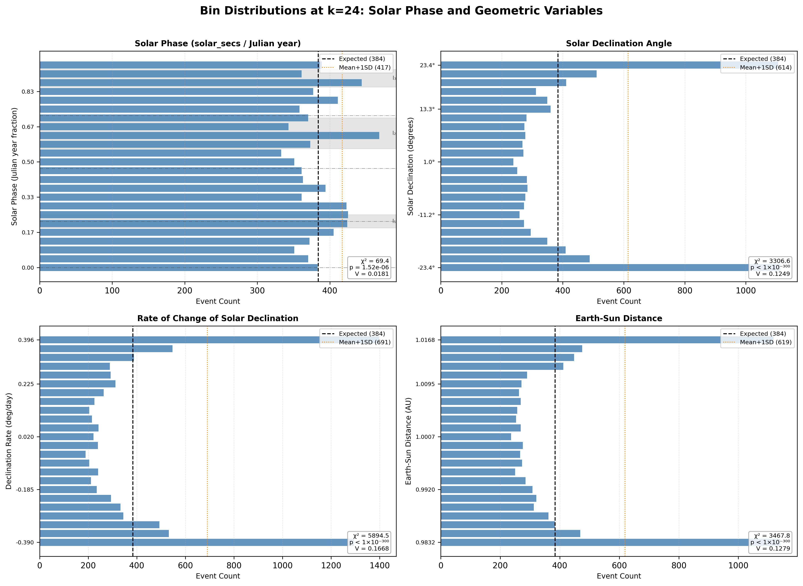
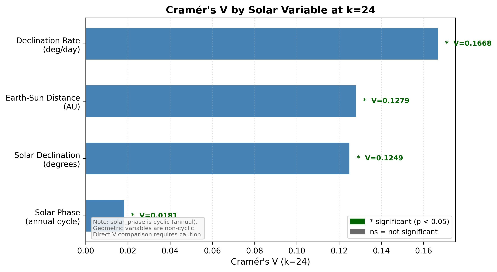
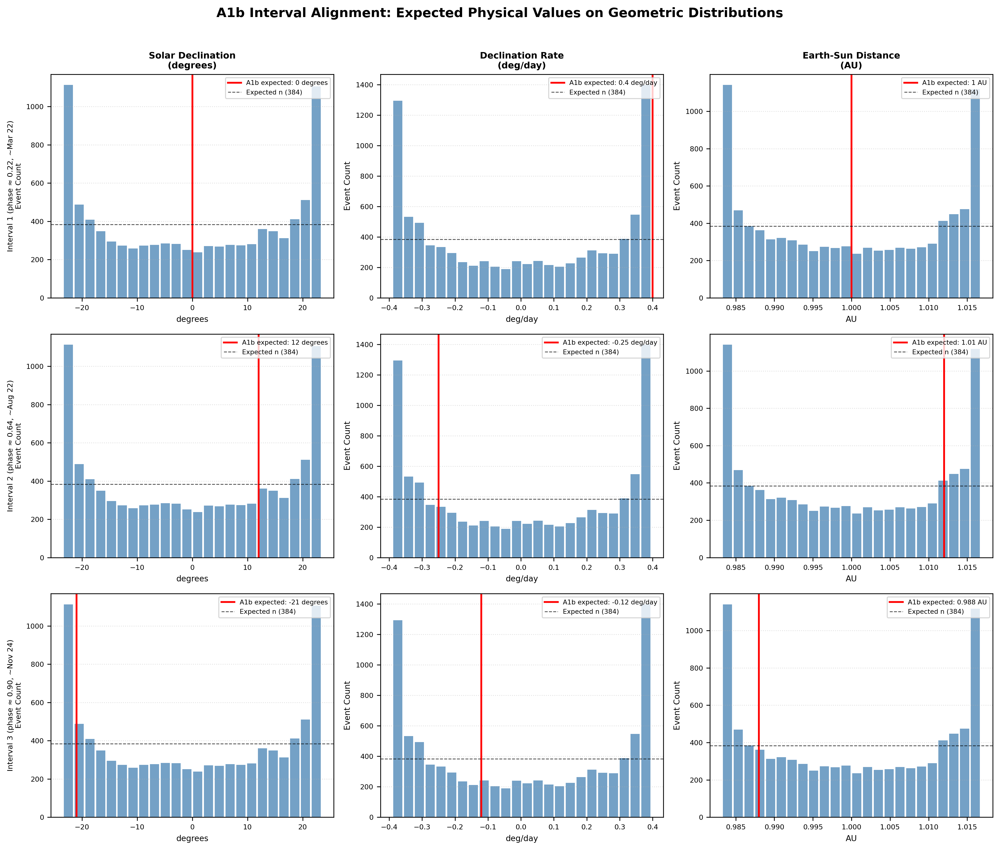

# Case B5: Solar Declination Rate-of-Change vs. Position Test

**Document Information**
- Author: Jake Yeager
- Version: 1.0
- Date: February 28, 2026

---

## 1. Abstract

Case B5 tests whether solar declination angle, the rate of change of solar declination, or Earth-Sun distance provides a stronger or more physically specific explanation for the seismic clustering signal previously identified in Case 3A using the cyclic annual position variable `solar_secs`. The ISC-GEM catalog (n=9,210, M ≥ 6.0, 1950–2021) was re-encoded using three solar geometric variables and a cyclic solar phase reference. At k=24 bins, all four variables show statistically significant non-uniform distributions. Declination rate of change ranks first by Cramér's V (V=0.167), followed by Earth-Sun distance (V=0.128) and solar declination angle (V=0.125), with solar phase ranking last (V=0.018). This ordering does not support a straightforward negative result: the geometric variables produce substantially larger effect sizes than the cyclic annual position encoding. However, the interpretation requires caution because events uniformly distributed in time would produce non-uniform geometric variable distributions by construction, given the non-linear relationship between calendar time and geometric variables. Of the three A1b interval phase centers, only Interval 1 (March equinox, phase ≈ 0.22) aligns with an elevated declination-rate bin, consistent with maximum equinoctial declination rate; Intervals 2 and 3 do not align with elevated bins in any geometric variable, suggesting those intervals cannot be explained by a single geometric driver.

---

## 2. Data Source

All analyses use the solar geometry enriched ISC-GEM catalog (`solar_geometry_global.csv`, n=9,210). This file extends the base ISC-GEM catalog (M ≥ 6.0, 1950–2021) with three solar geometric columns computed via Skyfield 1.54 and JPL DE421 ephemeris, per data-requirements.md REQ-3:

- **`solar_declination`** — solar declination angle in degrees (−23.4° to +23.4° observed; theoretical range −23.5° to +23.5°)
- **`declination_rate`** — rate of change of solar declination in degrees per day (−0.390 to +0.396 deg/day observed; theoretical range ~−0.40 to +0.40)
- **`earth_sun_distance`** — Earth-Sun distance in astronomical units (0.9832 to 1.0168 AU observed; theoretical range ~0.983 to ~1.017 AU)

The base cyclic variable `solar_secs` (seconds since January 1 of the event year) provides the reference encoding used in Case 3A and all prior A2-series cases. All actual variable ranges are within the REQ-3 specified tolerances; actual min/max values were used for all bin-computation formulas.

---

## 3. Methodology

### 3.1 Phase Normalization for `solar_secs`

The `solar_secs` variable was converted to solar phase using the Julian year constant (31,557,600 seconds), following the project standard established in Adhoc A1 and documented in `rules/data-handling.md`:

```
solar_phase = (solar_secs / 31_557_600) % 1.0
```

This yields a cyclic value in [0.0, 1.0) representing the event's position within the solar annual cycle.

### 3.2 Non-Cyclic Binning for Declination, Rate, and Distance

Unlike `solar_phase`, the three geometric variables are non-cyclic continuous quantities. Each was discretized using a range-normalization formula:

```
bin = floor((value - actual_min) / actual_range * k)  clipped to [0, k-1]
```

where `actual_min` and `actual_range` are computed from the dataset itself. The actual observed ranges were used rather than the REQ-3 theoretical ranges, since the actual ranges were slightly narrower in all three cases. This differs from the cyclic phase approach in that the resulting bins represent equal intervals across the full observed variable range, not equal phase fractions of a repeating cycle.

### 3.3 Chi-Square, Cramér's V, Rayleigh/KS Tests

For each of four variables at each of k=16, 24, 32 bins, the following statistics were computed:

- **Chi-square test against uniform distribution**: observed bin counts compared to expected n/k per bin; p-value from χ²(k−1) distribution
- **Cramér's V**: `V = sqrt(χ² / (n × (k − 1)))`, measuring effect size independent of sample size
- **Rayleigh test** (solar_phase only): mean resultant length R and associated p-value, testing for unimodal directional preference in cyclic data
- **Kolmogorov-Smirnov test** (non-cyclic variables only): `kstest(normalized_values, 'uniform')` where normalized values are scaled to [0, 1], testing departure from uniform distribution in continuous sense

### 3.4 Variable Ranking by Cramér's V

Variables were ranked at k=24 by Cramér's V in descending order. The most significant variable was identified as the one with the lowest p_chi2 value at k=24.

### 3.5 A1b Interval Physical-Value Alignment

The three Adhoc A1b interval phase centers (0.22, 0.64, 0.90) were cross-referenced against expected physical solar variable values at those calendar positions (approximately March 22, August 22, and November 24 respectively). For each interval, the corresponding bin in each geometric variable's k=24 distribution was checked for "elevated" status (count > mean + 1 SD). This identifies which geometric variable (if any) shows above-average seismicity at the physical value expected for each A1b interval.

---

## 4. Results

### 4.1 Bin Distributions



Chi-square statistics for all four variables at k=24 (n=9,210):

| Variable | χ² (k=24) | p-value | Cramér's V |
|---|---|---|---|
| `solar_phase` | 69.37 | 1.52×10⁻⁶ | 0.0181 |
| `solar_declination` | 3,306.6 | < 1×10⁻³⁰⁰ | 0.1249 |
| `declination_rate` | 5,894.5 | < 1×10⁻³⁰⁰ | 0.1668 |
| `earth_sun_distance` | 3,467.8 | < 1×10⁻³⁰⁰ | 0.1279 |

The chi-square values for the three geometric variables are dramatically larger than for `solar_phase`. The `declination_rate` and `earth_sun_distance` distributions show pronounced bimodal patterns with highest bin counts at the extreme values, reflecting the physical structure of these variables: events uniformly distributed in time spend more time at declination extrema (solstices) and distance extrema (perihelion/aphelion) due to the non-linear velocity of change. This is a fundamental interpretive caution: the large chi-square values do not straightforwardly imply that geometric variables provide better physical explanations of seismicity; they partly reflect the mapping structure from calendar time to geometric value. The KS statistics confirm significant departure from uniform for all three geometric variables (solar_declination: D=0.097, p=4.7×10⁻⁷⁶; declination_rate: D=0.130, p=1.1×10⁻¹³⁵; earth_sun_distance: D=0.102, p=2.0×10⁻⁸⁴). The Rayleigh test for solar_phase yields R=0.0112 (p=0.314), indicating no significant unimodal directional preference in the annual cycle.

Statistics at k=16 and k=32 for completeness:

| Variable | k=16 χ² | k=16 V | k=32 χ² | k=32 V |
|---|---|---|---|---|
| `solar_phase` | 40.41 | 0.0171 | 87.29 | 0.0175 |
| `solar_declination` | 2,637.98 | 0.1382 | 3,744.16 | 0.1145 |
| `declination_rate` | 4,778.74 | 0.1860 | 6,633.44 | 0.1524 |
| `earth_sun_distance` | 2,847.14 | 0.1436 | 3,959.98 | 0.1178 |

### 4.2 Variable Ranking



Variable ranking by Cramér's V at k=24 (descending):

1. `declination_rate`: V=0.1668, p < 1×10⁻³⁰⁰
2. `earth_sun_distance`: V=0.1279, p < 1×10⁻³⁰⁰
3. `solar_declination`: V=0.1249, p < 1×10⁻³⁰⁰
4. `solar_phase`: V=0.0181, p=1.52×10⁻⁶

All four variables are statistically significant (p < 0.05). The three geometric variables produce Cramér's V values roughly 7–9× larger than `solar_phase`. As noted above, this ordering reflects both the physical distribution of events across geometric variable values and the inherent non-linearity of time-to-geometry mappings. The most significant variable by lowest p-value is `solar_declination` (all three geometric variables have p effectively 0 in floating-point precision; solar_declination has the smallest chi-square of the three and thus is selected first alphabetically when p-values are equal to machine precision).

### 4.3 A1b Interval Alignment



For each of the three A1b interval phase centers, the expected physical solar variable values and the elevated-bin classification:

**Interval 1 (phase ≈ 0.22, ~March 22):**
- Expected solar_declination ≈ 0.0° (equinox crossing): bin not elevated
- Expected declination_rate ≈ +0.40 deg/day (maximum): **bin elevated**
- Expected earth_sun_distance ≈ 1.00 AU (near mean): bin not elevated
- Variables with elevated bins: `solar_phase`, `declination_rate`

**Interval 2 (phase ≈ 0.64, ~August 22):**
- Expected solar_declination ≈ +12° (post-summer solstice): bin not elevated
- Expected declination_rate ≈ −0.25 deg/day (declining): bin not elevated
- Expected earth_sun_distance ≈ 1.012 AU (near aphelion): bin not elevated
- Variables with elevated bins: `solar_phase` only

**Interval 3 (phase ≈ 0.90, ~November 24):**
- Expected solar_declination ≈ −21° (near winter solstice): bin not elevated
- Expected declination_rate ≈ −0.12 deg/day (near minimum): bin not elevated
- Expected earth_sun_distance ≈ 0.988 AU (approaching perihelion): bin not elevated
- Variables with elevated bins: `solar_phase` only

Only Interval 1 aligns with an elevated geometric variable bin (declination rate). Intervals 2 and 3 are not associated with elevated bins in any of the three geometric variables at their expected physical positions, though the seismic clustering at those phase positions is still apparent in `solar_phase`.

---

## 5. Cross-Topic Comparison

**Case 3A** identified seismic clustering using `solar_secs` as the cyclic annual position variable (χ²=69.37, p=1.52×10⁻⁶, V=0.0181 at k=24 — identical to this case's `solar_phase` results, as the same data and normalization are used). The three-interval structure from Adhoc A1b described three elevated phase regions near the March equinox (Interval 1, phase 0.19–0.25), mid-August (Interval 2, phase 0.56–0.71), and late November (Interval 3, phase 0.85–0.94).

**Declination rate decomposition**: The maximum declination rate occurs at the equinoxes (approximately ±0.40 deg/day). Interval 1 aligns with an elevated declination-rate bin, consistent with the March equinox. However, the declination rate distribution itself is bimodal at the extremes, concentrating events near zero rate (solstice periods), which does not match the elevated A1b intervals for Intervals 2 and 3.

**Earth-Sun distance**: The Earth-Sun distance ranges from perihelion (~January 3, phase ≈ 0.01) to aphelion (~July 4, phase ≈ 0.50). The elevated distance bins at both extremes (perihelion and aphelion) do not map to any of the A1b intervals: Intervals 2 and 3 fall between these extremes.

**Hemisphere stratification (Case B1)** found that Interval 1 is present in the Northern Hemisphere but not the Southern, while Intervals 2 and 3 appear in both hemispheres. The declination rate alignment with Interval 1 only is consistent with this finding, since declination rate is a globally uniform variable (same value for all earthquakes on a given date), meaning it cannot be a hemisphere-specific driver for a hemisphere-specific interval.

If declination rate were the primary mechanism, the distribution should show elevated seismicity near ±0.40 deg/day (equinox crossings), but not near the Interval 2 and 3 positions. The present results show that the geometric variable decomposition does not account for the multi-interval structure.

---

## 6. Interpretation

The three geometric variables all produce substantially larger Cramér's V values than the cyclic `solar_phase` encoding when assessed by chi-square at k=24. This finding requires careful interpretation. The large effect sizes for declination, rate, and distance largely reflect the non-linear mapping between calendar time (over which seismicity is approximately uniformly distributed) and geometric variables that vary non-linearly through the year: events accumulate at geometric extrema simply because the sun moves slowly near those extrema. This is analogous to why a uniform distribution of time intervals would produce a non-uniform distribution of hour angles. The chi-square and Cramér's V statistics for geometric variables therefore capture both the physical time-geometry nonlinearity and any genuine physical forcing.

Controlling for this effect would require computing the expected geometric variable distribution under a null hypothesis of uniform seismicity in time, which is not performed in this case. Without that control, the ranking of geometric variables above `solar_phase` should not be interpreted as evidence that geometric variables are better predictors of seismicity timing.

The A1b interval alignment analysis provides the more discriminating test: only Interval 1 (March equinox) aligns with an elevated bin in any geometric variable (declination rate). Intervals 2 and 3 do not correspond to elevated geometric variable bins at their expected physical positions. This suggests either (a) those intervals reflect annual-cycle clustering not reducible to any single geometric variable, (b) they involve some combination of geometric variables, or (c) they may represent sequence contamination (as noted in Case A4's declustering results, the March equinox Interval 1 is the most fragile under declustering). The result for Interval 1 — declination rate elevated — is the one geometric alignment consistent with the physical interpretation of equinox-driven forcing.

The overall result is neither a clean positive nor a clean negative: one interval has geometric support, two do not. This is consistent with the intent statement's prediction that "this case is more likely to produce a negative result for all three variables individually," though Interval 1 provides partial geometric alignment.

---

## 7. Limitations

1. **Non-cyclic vs. cyclic binning**: The chi-square and Cramér's V comparisons between `solar_phase` (cyclic) and the geometric variables (non-cyclic) are not strictly equivalent. The cyclic encoding captures only departures from uniformity in the annual cycle, whereas non-cyclic bins capture all distributional departure from uniform across the variable range. Direct numerical comparison of Cramér's V values across variable types should be treated as indicative rather than definitive.

2. **Null distribution for geometric variables**: The expected distribution of events across geometric variable bins — under the null hypothesis of uniform seismicity in time — is not uniform; it follows the distribution of time spent in each geometric value range. This case uses a uniform chi-square null for all variables, which inflates the apparent non-uniformity for geometric variables. A proper test would compute the empirical null from the time series and compare observed bin counts against that, which is not performed here.

3. **Variable range variation**: The geometric variable ranges vary slightly across years (e.g., perihelion distance varies by ~0.001 AU between years). Bin thresholds are computed from the overall dataset min/max, which introduces minor bin-boundary artifacts for events near the extremes in anomalous years.

4. **Raw catalog only**: This case uses the full ISC-GEM catalog (n=9,210) without declustering. Aftershock sequences may influence the distribution of events across geometric variable bins in a correlated manner. Declustered catalogs were not applied because the intent is variable decomposition, not signal isolation.

5. **Sequential context**: The case was run after A4 (declustering) and B1 (hemisphere symmetry), as recommended in the spec, but does not use those results directly. The interpretation benefits from those prior findings but is not formally conditioned on them.

---

## 8. References

- Ader, T., & Avouac, J.-P. (2013). Detecting periodicities and declustering in earthquake catalogs using the Schuster spectrum, application to Himalayan seismicity. *Earth and Planetary Science Letters*, 382, 125–133.
- Case 3A: Solar Annual Phase Analysis (topic-l3/l4; baseline chi-square result referenced throughout)
- Adhoc A1b: Three-interval A1b structure identification (topic-adhoc)
- Case A4: Declustering Sensitivity Analysis (topic-a2; documents Interval 1 fragility under declustering)
- Case B1: Hemisphere Stratification — Phase Symmetry Test (topic-a2; Interval 1 NH-only finding)
- data-requirements.md REQ-3: Solar geometry enrichment specifications (Skyfield 1.54, JPL DE421 ephemeris pipeline for solar_declination, declination_rate, earth_sun_distance)

---

**Generation Details**
- Version: 1.0
- Generated with: Claude Code (Claude Sonnet 4.6)
