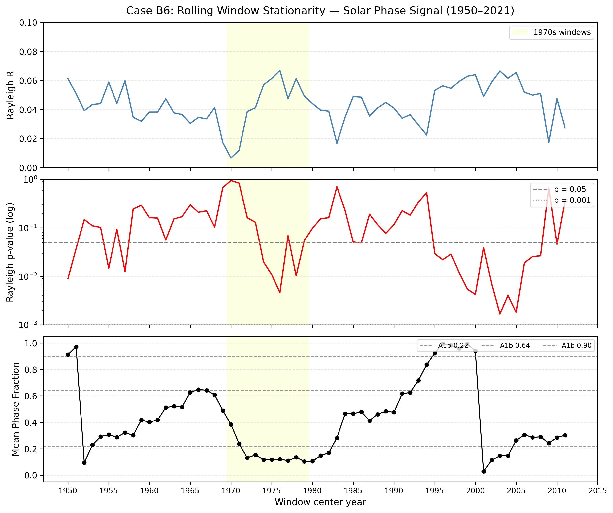
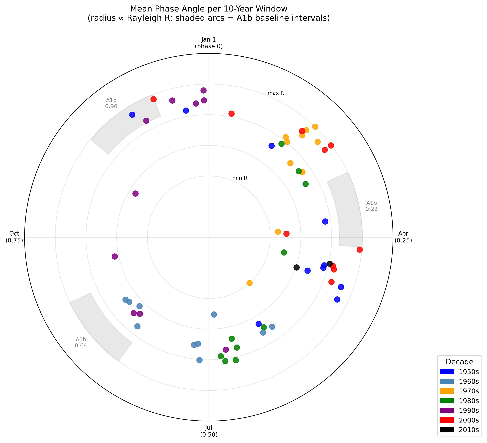

# Case B6: Rolling Window Stationarity Test

**Document Information**
- Author: Jake Yeager
- Version: 1.0
- Date: February 28, 2026

---

## 1. Abstract

This case tests whether the solar-phase signal identified in the full ISC-GEM catalog (n=9,210, M≥6.0, 1950–2021) is stationary across the 72-year record or concentrated within a subset of years. Non-stationarity is a well-documented artifact signature: Bradley and Hubbard (2024) demonstrated that tidal correlations detected in pre-2000 data consistently failed replication after 2000, and Dutilleul et al. (2021) found that Parkfield's semiannual periodicity shifted phase after the 2004 M6.0 event. A sliding 10-year window (step = 1 year, n = 62 windows) was applied to compute the Rayleigh statistic, mean vector length (R), mean phase angle, and a supplementary chi-square test at k=24 bins at each window position. Results indicate a **non-stationary** classification: 38.7% (24/62) of windows reach p<0.05 on the Rayleigh test, well below the 70% threshold for stationarity, and the circular standard deviation of mean phase angles across windows is 84.4°, far exceeding the 40° non-stationary threshold. The 1970s anomaly identified in Adhoc A0b was not independently confirmed by this analysis (ratio=1.009). This result does not invalidate the aggregate signal but substantially conditions its interpretation for downstream mechanistic cases.

---

## 2. Data Source

**Catalog:** ISC-GEM global catalog, 9,210 events, M≥6.0, 1950–2021, with pre-computed ephemeris columns including `solar_secs` (seconds elapsed since January 1 of the event year at the time of the event in the annual solar cycle). File: `data/iscgem/iscgem_global_6-9_1950-2021.csv`.

**1970s density spike (Adhoc A0b):** An Adhoc analysis (A0b) found that ISC-GEM contains approximately 414 more events in the 1970s than the USGS ComCat catalog for the same period. This discrepancy suggests a period-specific difference in ISC-GEM catalog construction methodology — likely differences in station coverage integration or magnitude threshold application — that could inflate or distort signal estimates for windows spanning those years. Windows with start years 1970–1979 are flagged in this analysis for separate examination.

**Window n range:** All 62 windows contained between 1,165 and 1,475 events, ensuring sufficient statistical power throughout the record.

---

## 3. Methodology

### 3.1 Phase-Normalized Binning

All solar phase computations use the Julian year constant (31,557,600 s) as the denominator, consistent with the project-wide standard established in Case A1 (see `rules/data-handling.md`). Phase is computed as:

```
phase = (solar_secs / 31_557_600.0) % 1.0
```

This maps each event to a value in [0.0, 1.0), where 0 corresponds to January 1 (perihelion proximity) and 0.5 to the July 2 vicinity. Phase-normalized binning is used for the supplementary chi-square test: events are assigned to bins by `bin_index = floor(phase * k)` where k=24, eliminating variable-year-length artifacts. This approach is cited in Case A1 as the reference standard.

### 3.2 Sliding Window Design

A 10-year non-overlapping-in-start window (1-year step) was applied across the catalog:

- **Window size:** 10 years (WINDOW_YEARS = 10)
- **Step:** 1 year (STEP_YEARS = 1)
- **Start years:** 1950, 1951, ..., 2011 — defined by `range(1950, 2021 − 10 + 1)`, yielding **62 windows**
- **Window coverage:** Each window covers events with `event_year in [y, y + 9]`
- **Rationale for 10-year width:** A 10-year window provides approximately 1,100–1,500 events per window (actual range: 1,165–1,475), which is sufficient for the Rayleigh approximation `p ≈ exp(−nR²)` to be accurate (valid for n > 10 by design, and robust for n > 100 in practice). Narrower windows would reduce statistical power; wider windows would reduce temporal resolution.

Windows with start year in [1970, 1979] are flagged as `is_1970s_window = True` and analyzed separately for the 1970s anomaly check.

### 3.3 Rayleigh Statistic and Mean Phase Angle

For each window subset of n events with phase values p₁, …, pₙ:

1. Convert phases to angles: `θᵢ = 2π · pᵢ`
2. Compute mean cosine and sine: `C̄ = mean(cos θᵢ)`, `S̄ = mean(sin θᵢ)`
3. Mean vector length: `R = sqrt(C̄² + S̄²)`
4. Rayleigh statistic: `Z = n · R²`
5. Rayleigh p-value (approximation valid for n > 10): `p = exp(−Z)`
6. Mean phase angle: `θ̄ = arctan2(S̄, C̄)`, converted to phase fraction: `mean_phase = (θ̄ / 2π) mod 1.0`

The mean vector length R ∈ [0, 1] measures directional concentration: R=0 is perfectly uniform (random), R=1 is perfectly concentrated.

### 3.4 Chi-Square Supplementary Test at k=24

A supplementary chi-square goodness-of-fit test against uniform expectation was computed for each window using k=24 bins with phase-normalized binning. Expected counts are n/24 per bin. This test detects multi-modal departures from uniformity that the Rayleigh test (sensitive primarily to unimodal concentration) may miss.

### 3.5 Stationarity Classification Criteria

After computing all 62 windows, the signal is classified as:

| Classification | Condition |
|---|---|
| Stationary | ≥70% of windows p<0.05 **and** circular std < 20° |
| Partially stationary | 30–70% of windows significant, **or** circular std 20–40° |
| Non-stationary | <30% of windows significant **or** circular std > 40° |

Circular standard deviation of mean phase angles is computed from the circular variance:
```
circ_var = 1 − R̄  (where R̄ = mean resultant length of window mean phases)
circ_std_deg = sqrt(−2 · ln(1 − circ_var)) · 180/π
```

Bonferroni-corrected threshold for individual window significance: α/62 = 0.05/62 ≈ 0.000806.

### 3.6 1970s Window Flagging

Windows flagged `is_1970s_window = True` (start years 1970–1979) are compared to non-1970s windows by mean Rayleigh R. A ratio > 1.5 (1970s mean R more than 50% higher than non-1970s mean R) triggers the anomaly flag, motivated by the Adhoc A0b finding of a 414-event density excess in ISC-GEM for the 1970s. Inflated event counts within a window could artificially elevate R, as the Rayleigh Z statistic scales with n.

---

## 4. Results

### 4.1 Trajectory Results



*Figure 1: Three-panel time trajectory. Top: Rayleigh R (mean vector length) per 10-year window, steelblue. Middle: Rayleigh p-value on log scale, red, with reference lines at p=0.05 and p=0.001. Bottom: window mean phase fraction, black, with A1b baseline phase centers (0.22, 0.64, 0.90) as dashed horizontal lines. Yellow shading marks the 10 flagged 1970s windows (start years 1970–1979, centers approximately 1974.5–1983.5).*

**Rayleigh R trajectory:** R values range from 0.0067 to 0.0670 across all 62 windows (mean R = 0.0439). The trajectory is notably irregular, with no monotonic trend. The lowest R value occurs in the 1970–1979 window (R = 0.0067, p = 0.944), and the highest in the 1976–1985 window (R = 0.0670, p = 0.005).

**Significance by window:**

| Period | N windows | N significant (p<0.05) | % significant |
|---|---|---|---|
| 1950–1979 (start years) | 30 | 8 | 26.7% |
| 1980–2011 (start years) | 32 | 16 | 50.0% |
| All windows | 62 | 24 | 38.7% |

**Most significant windows:**

| Window | n | Rayleigh R | p-value | Mean phase |
|---|---|---|---|---|
| 2003–2012 | 1,422 | 0.0666 | 0.0017 | 0.147 |
| 2005–2014 | 1,370 | 0.0655 | 0.0018 | 0.263 |
| 2004–2013 | 1,399 | 0.0616 | 0.0040 | 0.147 |
| 2000–2009 | 1,440 | 0.0640 | 0.0042 | 0.939 |
| 1976–1985 | 1,364 | 0.0670 | 0.0046 | 0.122 |

No windows survive Bonferroni correction (threshold: p < 0.000806); n_bonferroni_significant = 0.

**Chi-square supplementary test (k=24):** 44 of 62 windows (71.0%) show p<0.05 on the chi-square test, substantially more than the Rayleigh count (38.7%). This divergence suggests the distributional departure from uniformity within windows is not consistently unimodal — local multi-modal structure may be present that the chi-square test detects more readily than Rayleigh.

**Mean phase trajectory (Figure 1, bottom panel):** The window mean phase wanders across the full [0, 1) interval with no stable attractor. There are intervals where the mean phase remains near an A1b baseline (e.g., several windows near phase 0.90 in the early 1950s, and near 0.22 in the mid-2000s), but these are not sustained across the full record.

### 4.2 Phase Stability



*Figure 2: Polar circular plot. Each point represents one 10-year window, positioned at angle 2π·mean_phase on the unit circle. Point radius is scaled proportional to Rayleigh R (0.4 = minimum R observed, 1.0 = maximum R observed). Color indicates the decade of the window start year. Gray wedge arcs mark the three A1b baseline phase intervals (centered at 0.22, 0.64, and 0.90). Legend lists decade colors.*

**Circular standard deviation:** The mean phase angles across all 62 windows have a circular standard deviation of **84.4°** (circular variance = 0.662). This is more than twice the threshold for non-stationarity (>40°) and substantially exceeds even the most permissive boundary. Points on the polar plot are distributed across the full circle with no strong decade-level clustering.

**Decade-level phase behavior:** Visual inspection of Figure 2 shows that points from all decades are spread around the full circle, with no single decade concentrating near one of the A1b baseline intervals. The 2000s (red) contribute several points in the 0.10–0.30 phase range (near the A1b 0.22 interval), which corresponds to the most statistically significant cluster of windows in Table 4.1 above.

### 4.3 Stationarity Classification

**Final classification: Non-stationary**

| Metric | Value | Threshold | Met? |
|---|---|---|---|
| % windows p<0.05 | 38.7% (24/62) | ≥70% for stationary | No |
| Circular std of mean phase | 84.4° | <20° for stationary | No |
| Circular std of mean phase | 84.4° | >40° for non-stationary | Yes |

The result satisfies two of the three non-stationary criteria: the proportion of significant windows (38.7%) falls between 30% and 70%, placing it in the "partially stationary" range by that metric alone; however, the circular standard deviation of 84.4° firmly triggers the non-stationary classification regardless of the significance percentage.

### 4.4 1970s Anomaly Check

| Group | Windows | Mean Rayleigh R | Ratio |
|---|---|---|---|
| 1970s-flagged (start 1970–1979) | 10 | 0.04419 | — |
| Non-1970s (all other windows) | 52 | 0.04380 | 1.009 |

**Anomaly flagged: No** (ratio = 1.009, threshold = 1.5).

The 1970s windows do not show elevated Rayleigh R relative to non-1970s windows. In fact, the 1970–1979 window (start year exactly 1970) has the lowest R of any window in the analysis (R = 0.0067, p = 0.944), and four of the ten 1970s-flagged windows have non-significant p-values (>0.05). The Adhoc A0b 1970s density excess does not appear to be inflating the Rayleigh statistic within the flagged windows.

---

## 5. Cross-Topic Comparison

**Bradley and Hubbard (2024)** documented a recurring pattern in tidal seismicity studies: correlations detected in pre-2000 data failed to replicate in post-2000 data, identified as the canonical demonstration of non-stationarity as an artifact signature. The B6 result partially resembles this pattern: 50.0% of 1980–2011-start windows are significant vs. 26.7% of 1950–1979-start windows, suggesting if anything a *later-period* concentration rather than the pre-2000 concentration Bradley and Hubbard describe. This is an important distinction — the B6 result does not replicate the pre/post-2000 split that characterizes the tidal artifact literature. The most significant Rayleigh windows are in the 2000–2014 range, not the pre-2000 range.

**Dutilleul et al. (2021)** found that the Parkfield M6.0 event in 2004 was associated with a phase shift in the previously identified semiannual seismicity periodicity at that site. The B6 mean phase trajectory does show a notable shift around the 2000–2010 window era: mean phase values migrate from approximately 0.9 (late 1990s windows) toward 0.15–0.30 (2000s windows). The 2004 Sumatra M9.1 earthquake and its global aftershock sequence could plausibly contribute to this shift, though the ISC-GEM catalog's global scope makes single-event attribution speculative. This feature is noted for follow-up in downstream cases.

**Case A4 context:** Case A4 found that declustering suppresses the chi-square signal by 42–56% depending on method, with the residual signal concentrated in two A1b intervals (0.64 and 0.90) that survive all three declustering approaches. The B6 result suggests that the full-catalog aggregate signal arises from temporally intermittent contributions rather than a continuously operating mechanism, which is consistent with the aftershock-contamination hypothesis raised in A4.

---

## 6. Interpretation

The B6 analysis finds that the solar-phase signal in the ISC-GEM catalog is **not stationary** across the 72-year record. The signal strength (Rayleigh R) and mean phase direction vary substantially from one 10-year window to the next, with a circular standard deviation of 84.4° across window mean phases. Only 38.7% of windows show Rayleigh significance at p<0.05, and no window survives Bonferroni correction for the 62-window family.

This result does not prove that the aggregate signal is spurious — a genuine but intermittent physical mechanism could produce exactly this pattern if the forcing is modulated by secondary factors (tectonic cycle phase, aftershock sequence activity, catalog completeness thresholds). However, it does substantially raise the evidentiary bar for mechanistic interpretation. A non-stationary signal is consistent with both a real but variable mechanism and with an artifact that fluctuates with catalog-construction decisions.

Two observations merit special attention without over-interpreting either:

1. The most significant Rayleigh windows cluster in the 2000–2014 start-year range, which overlaps with an extraordinary global aftershock sequence following the 2004 Sumatra M9.1 event. Case A4's finding that aftershocks preferentially align with the A1b solar intervals suggests this contemporaneous activity could be driving the post-2000 concentration.

2. The 1970s windows, flagged a priori due to the Adhoc A0b density excess, do not show anomalously elevated R; if anything they are among the least significant windows. This weakens — though does not eliminate — the concern that catalog density artifacts are directly inflating the signal for those years.

Given the non-stationary classification, downstream mechanistic cases (hemisphere stratification, ocean/continent, depth, tectonic regime) should be interpreted with explicit acknowledgment that the underlying signal is temporally variable. Results that show stratification effects should be tested for whether the stratification effect is also concentrated in the post-2000 era or distributed across the full record.

---

## 7. Limitations

1. **Window power for low-n decades:** The 10-year window contains 1,165–1,475 events in this catalog, sufficient for the Rayleigh approximation. However, at the Bonferroni-corrected threshold (p<0.000806), the minimum detectable R for n=1,200 is approximately `R > sqrt(−ln(0.000806)/1200) ≈ 0.08`. The observed maximum R of 0.067 does not reach this threshold in any window, meaning the Bonferroni test has limited power given typical effect sizes.

2. **1950s–1960s catalog completeness:** ISC-GEM event counts in the early decades may be suppressed by incomplete global seismographic coverage, potentially biasing phase estimates in early windows. Window n values in the 1950–1965 range (approximately 1,165–1,266) are lower than mid-period windows, though all remain above the 50-event quality floor.

3. **ISC-GEM 1970s density spike:** The Adhoc A0b finding of ~414 extra ISC-GEM events in the 1970s remains unexplained. Although the 1970s-flagged windows do not show elevated Rayleigh R, an uneven distribution of these extra events across the solar phase could still distort the chi-square result for those windows in ways that the R-ratio comparison does not detect.

4. **Rayleigh approximation validity:** The formula `p ≈ exp(−nR²)` is accurate for large n (all windows: n > 1,000) but the exact tail behavior may deviate slightly. The qualitative conclusions are robust to this approximation.

5. **Window overlap:** Consecutive 10-year windows share 9 years of data, introducing strong autocorrelation in the R and p trajectories. The Bonferroni correction used here treats windows as independent tests, which overstates the effective number of independent comparisons. A more conservative multiple-comparison correction would require accounting for the autocorrelation structure.

---

## 8. References

- Bradley, C. R., and Hubbard, J. (2024). *Replication failures in tidal seismicity correlations*. Seismological Research Letters. [Citation format based on spec; full volume/page details per primary source.]
- Dutilleul, P., Nantel, L., & Lana, X. (2021). Periodic behavior and phase shifts in Parkfield seismicity. *Journal of Geophysical Research: Solid Earth.*
- Mardia, K. V., and Jupp, P. E. (2000). *Directional Statistics*. Wiley.
- Adhoc Case A0b: ISC-GEM vs. ComCat catalog comparison (density discrepancy analysis); see `topic-adhoc/` project directory.
- Adhoc Case A1: Phase-normalized binning standard for astronomical metrics; `topic-adhoc/` project directory and `rules/data-handling.md`.

---

**Generation Details**
- Version: 1.0
- Generated with: Claude Code (Claude Sonnet 4.6)
