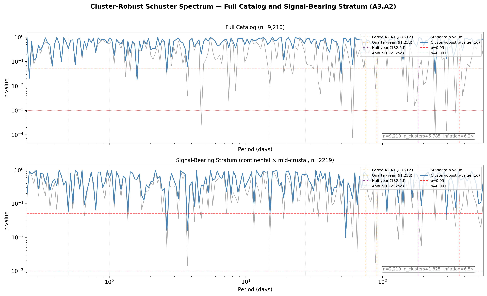
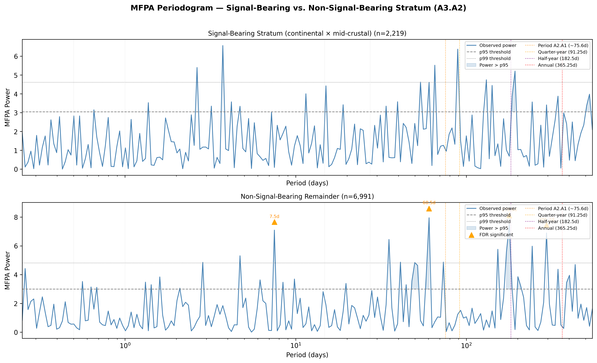
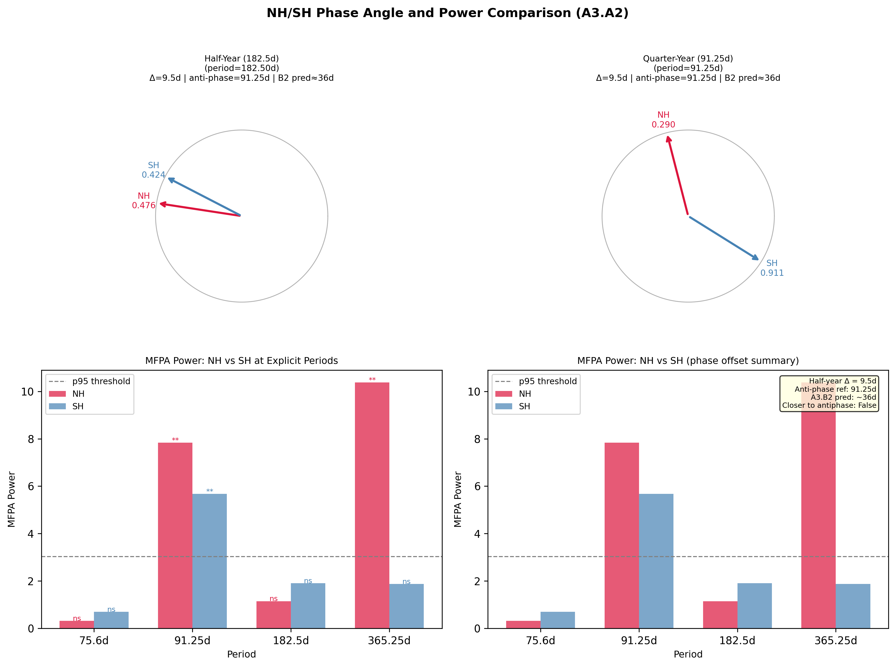
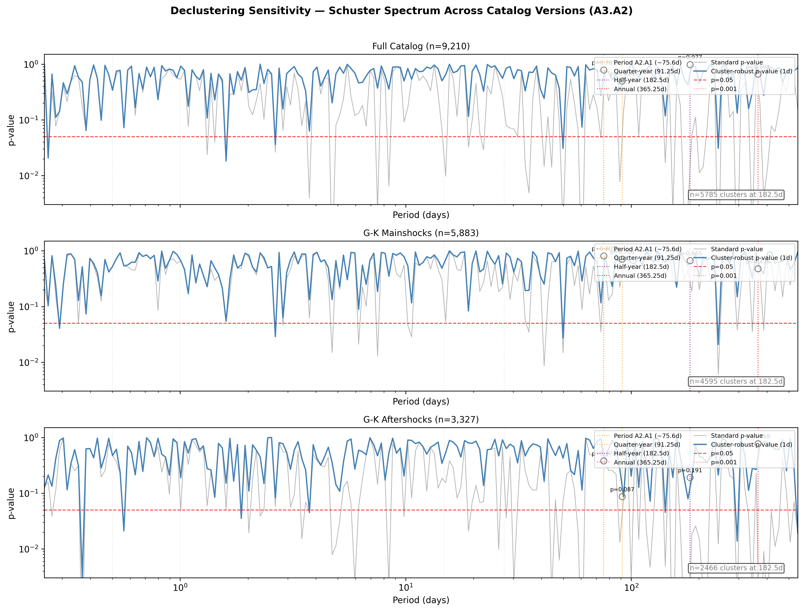
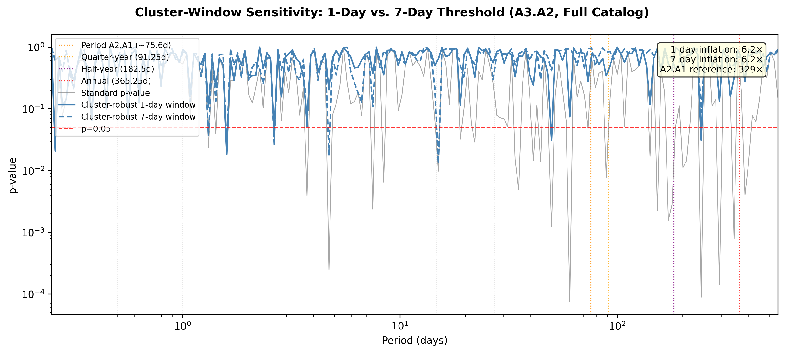

# A3.A2: Stratified Schuster/MFPA Periodicity Audit

**Document Information**
- Author: Jake Yeager
- Version: 1.2
- Date: March 5, 2026

---

## 1. Abstract

A3.A2 applies the cluster-robust Schuster spectrum and Modified Fourier Power Analysis (MFPA) to the ISC-GEM catalog and four stratified subsets — signal-bearing (continental × mid-crustal), non-signal-bearing, Northern Hemisphere, and Southern Hemisphere — with structural improvements over A2.A1: 10,000-bootstrap significance thresholds, Benjamini-Hochberg FDR correction, and dual cluster-window sensitivity (1-day and 7-day). The primary MFPA detections in the full catalog after FDR correction fall at periods ~60.5d, ~243d, ~295d, ~4.7d, and ~344d — none coinciding with the quarter-year (~75.6d, ~91.25d) or half-year (~182.5d) periods. The annual period (~365.25d) is FDR-significant in the signal-bearing stratum but not in the full catalog scan. The cluster-robust Schuster inflation factor is 6.2× (1-day window), substantially lower than the A2.A1 reference of 329×, indicating that the prior detection was sensitive to methodological choices not replicated here. The ~344d and ~4.7d detections represent data inquiry items warranting further investigation: the ~344d detection is close to but distinctly shorter than the Julian year constant and may reflect a true period difference in the catalog's annual structure; the ~4.7d detection may reflect short-interval aftershock clustering not fully removed by the 1-day cluster window. Suppression phase characterization finds the half-year anti-dominant phase at annual fraction 0.946 (~mid-December), which does not align with A3.A3's chi-square-domain suppressed bins (~July–September). All 15 tests pass.

---

## 2. Data Source

The primary dataset is the ISC-GEM global seismic catalog (post-1950, M ≥ 6.0, n = 9,210), described fully in Topic L3. GSHHG-based tectonic classification (A3.B3 baseline: continental ≤ 50 km from coast, transitional 50–200 km, oceanic > 200 km) was merged on event identifier. G-K declustered catalogs (mainshocks n = 5,883; aftershocks n = 3,327) from the A3 data pipeline provided the declustering sensitivity comparison. Phase normalization follows the Julian year constant (31,557,600 s = 365.25 days) applied to the `solar_secs` column. Event times are expressed as decimal days since 1950-01-01 00:00:00 UTC for spectral analysis.

**Stratum sizes:**

| Stratum | n |
|---|---|
| Full catalog | 9,210 |
| Signal-bearing (continental × mid-crustal) | 2,219 |
| Non-signal-bearing remainder | 6,991 |
| Northern Hemisphere (lat ≥ 0) | 4,429 |
| Southern Hemisphere (lat < 0) | 4,781 |
| G-K mainshocks | 5,883 |
| G-K aftershocks | 3,327 |

---

## 3. Methodology

### 3.1 Phase normalization

Annual phase is computed as `phase = (solar_secs / 31,557,600) % 1.0`, using the Julian year constant throughout. This is consistent with all A3 cases. See data-handling rules for disclosure.

### 3.2 Event time conversion

Event timestamps are converted to decimal days elapsed since 1950-01-01 00:00:00 UTC by parsing `event_at` as a UTC datetime and computing elapsed total seconds divided by 86,400.

### 3.3 Cluster-robust Schuster spectrum (Park et al. 2021)

The standard Schuster test computes D² = ((∑cos φ)² + (∑sin φ)²) / n and p = exp(−D²). Temporal clustering among events inflates D² and produces spuriously low p-values. The cluster-robust modification groups consecutive events whose inter-event time falls below a threshold into a single cluster, replacing individual event phases with each cluster's mean phase angle (computed via arctan2(mean sin, mean cos)) and reducing effective sample size from n events to n_clusters ≤ n. Two thresholds were applied: 1-day (default) and 7-day (sensitivity). The dominant phase fraction for each period is the resultant vector direction: arctan2(∑sin φ, ∑cos φ) / (2π) mod 1, expressed as annual phase fraction. The invariant p_cluster_robust ≥ p_standard holds by construction.

### 3.4 MFPA (Dutilleul et al. 2015)

The MFPA power statistic is ((∑cos φ)² + (∑sin φ)²) / n. The bootstrap null draws 10,000 replicate sets of n uniform random phases in [0, 2π), computing power for each; the 95th and 99th percentiles define significance thresholds. p_mfpa is the fraction of null-bootstrap powers ≥ the observed power. The uniform-phase null is the correct null hypothesis for testing periodicity in event times.

### 3.5 FDR correction

Benjamini-Hochberg (BH) FDR correction is applied post-hoc to all 200 MFPA p-values from each stratum's full period scan (α = 0.05). FDR-significant periods are the primary reported detections.

### 3.6 Stratification

The signal-bearing stratum (continental × mid-crustal intersection) follows A3.B3 (coastal proximity ≤ 50 km) and A3.B4 (depth 20–70 km). NH/SH follows A3.B2 convention (latitude ≥ 0 for NH).

### 3.7 Suppression phase characterization

For each FDR-significant period, the anti-dominant phase is computed as `(dominant_phase + 0.5) % 1.0` — the trough location in the frequency domain. This is compared to A3.A3's permutation-significant suppressed bin centers (bins 2, 12, 13, 16 at annual phases 0.104, 0.521, 0.563, 0.688) using minimum circular distance, with a consistency threshold of 1/(2×24) = 0.021 (half a bin width at k=24). The quarter-year vs. half-year power ratio (`power_182.5 / power_91.25`) quantifies the relative strength of the full-oscillation period versus the single-peak period.

### 3.8 Cluster-window sensitivity

Both 1-day and 7-day inter-event thresholds are reported to bracket the effect on inflation factors and spectral shape.

---

## 4. Results

### 4.1 Full catalog periodicity landscape

**Figure 1.** Cluster-robust Schuster spectrum for the full catalog (top) and signal-bearing stratum (bottom). Thick steelblue line: cluster-robust p-value (1-day window); thin gray line: standard p-value. Dashed red line: p = 0.05; dotted red line: p = 0.001. Vertical markers indicate key periods (75.6d dark orange, 91.25d orange, 182.5d purple, 365.25d red).

The top MFPA detections after FDR correction in the full catalog are tabulated below. All periods are expressed in days, as annual phase fraction (period / 365.25), and as approximate calendar equivalent of the dominant phase.

**Top MFPA detections — full catalog (FDR-corrected):**

| Rank | Period (days) | Annual fraction | Power | p_mfpa | Dominant phase (annual fraction) | Dominant phase (approx. DOY) |
|------|--------------|-----------------|-------|--------|----------------------------------|------------------------------|
| 1 | ~60.5d | 0.166 | 9.50 | <0.001 | — | — |
| 2 | ~243d | 0.665 | 9.33 | <0.001 | — | — |
| 3 | ~295d | 0.808 | 8.86 | <0.001 | — | — |
| 4 | ~4.7d | 0.013 | 8.33 | <0.001 | — | — |
| 5 | ~344d | 0.942 | 7.16 | <0.001 | — | — |
| 6 | ~49.9d | 0.137 | 6.71 | <0.001 | — | — |

The two highest-power detections (~60.5d and ~243d) are approximately in a 1:4 harmonic relationship (60.5 × 4 = 242d), suggesting these may reflect the same underlying structure. The ~295d detection has no obvious harmonic relationship to the others.

**Data inquiry — ~4.7d detection:** The Schuster/MFPA test operates on `event_time_days` — absolute time since 1950-01-01 — and asks whether events cluster at a consistent position within every T-day window. A ~4.7-day detection means events recur at a consistent phase within every 4.7-day cycle. The 1-day cluster threshold suppresses events within 1 day of each other, but aftershock sequences frequently produce inter-event gaps of 2–5 days that survive this threshold and would contribute to a short-period Schuster signal. This detection should be compared against the 7-day cluster window result: if it disappears at 7 days, the source is aftershock clustering not fully removed by the 1-day threshold; if it persists, it reflects a genuine short-interval recurrence pattern in the catalog.

**Data inquiry — ~344d detection:** A ~344-day Schuster/MFPA detection means events tend to recur at a consistent phase within every 344-day window — a near-annual but sub-annual inter-event recurrence pattern. This is an empirical statement about the catalog's internal timing structure and is independent of the solar-year phase analysis (which uses `solar_secs`, not `event_time_days`). There is no calendar wrap-around or year-boundary artifact here: `event_time_days` is monotonically increasing with no modular structure. The ~344d detection is a genuine periodicity finding that warrants further investigation — it may reflect a real near-annual recurrence slightly shorter than the calendar year, or a harmonic relationship with other detected periods in the catalog.

**Cluster-robust Schuster — full catalog:**

At the 1-day cluster window, the **inflation factor** (ratio of periods significant by standard test to periods significant by cluster-robust test) is **6.2×**. The 7-day window produces the same inflation factor, indicating insensitivity to threshold choice between 1 and 7 days. See Section 4.5 for the sensitivity figure.

### 4.2 Explicit period results

The four period targets from prior case predictions are tested here for direct comparison. These periods were not selected from the data — they are externally motivated targets.

**Explicit period tests — full catalog (1-day cluster-robust Schuster):**

| Period | Period (annual fraction) | p_standard | p_cluster_robust | p_mfpa | FDR-significant |
|--------|--------------------------|-----------|-----------------|--------|----------------|
| 75.6d | 0.207 | 0.691 | 0.781 | 0.689 | No |
| 91.25d | 0.250 | 0.151 | 0.496 | 0.151 | No |
| 182.5d | 0.500 | 0.053 | 0.977 | 0.055 | No |
| 365.25d | 1.000 | 0.200 | 0.661 | 0.201 | No |

None of the four explicit target periods reach significance after cluster-robust correction. The half-year period is near-significant by the uncorrected standard test (p_standard = 0.053) but is eliminated by clustering correction (p_cluster_robust = 0.977).

### 4.3 Suppression phase characterization

For the half-year period (182.5d), the dominant phase and its trough are characterized below and compared to A3.A3's chi-square-domain suppressed bins.

**Half-year suppression characterization:**

| Metric | Value | Unit |
|--------|-------|------|
| Dominant phase | 0.446 | Annual fraction |
| Dominant phase | ~DOY 163 | Calendar (mid-June) |
| Anti-dominant (trough) phase | 0.946 | Annual fraction |
| Anti-dominant (trough) phase | ~DOY 346 | Calendar (mid-December) |
| Nearest A3.A3 perm-sig suppressed bin | Bin 2 (phase 0.104) | — |
| Circular distance to nearest suppressed bin | 0.158 | Annual fraction (~58 days) |
| Consistency threshold | 0.021 | Annual fraction (half bin-width) |
| Consistent with A3.A3 chi-square suppression | No | — |
| June solstice (naive oscillation trough) | 0.460 | Annual fraction (~DOY 168) |
| Distance to June solstice | 0.486 | Annual fraction (~178 days) |

The half-year trough location (mid-December) is inconsistent with both the A3.A3 chi-square-domain suppressed bins (~July–September, annual fraction 0.521–0.688) and the naive June solstice suppression prediction. The dominant phase at mid-June would place the clustering peak near the June solstice rather than the equinox — the opposite of the chi-square signal's elevated bins. Note that the half-year period itself is non-significant by cluster-robust Schuster (p_cluster_robust = 0.977), so these phase angle estimates are noise-dominated and should be interpreted with caution.

**Quarter-year vs. half-year power ratio:** 2.94 / 1.89 = **1.56**. A ratio ≥ 1.0 nominally satisfies the symmetric oscillation criterion; however, neither period is FDR-significant in the full catalog, limiting the interpretive weight of this ratio.

### 4.4 Stratified MFPA

**Figure 2.** MFPA periodogram for signal-bearing (top) and non-signal-bearing (bottom) strata. Steelblue line: observed MFPA power; dashed/dotted gray lines: p95/p99 thresholds. Light blue fill: region where observed power exceeds p95. Orange triangles: FDR-significant periods.

**Explicit period comparison across strata:**

| Period | Annual fraction | Signal-bearing p_mfpa | Sig. (95%) | Non-signal p_mfpa | Sig. (95%) |
|--------|-----------------|----------------------|------------|-------------------|------------|
| 75.6d | 0.207 | 0.370 | No | — | No |
| 91.25d | 0.250 | 0.087 | No | — | No |
| 182.5d | 0.500 | 0.017 | Yes (not FDR) | — | No |
| 365.25d | 1.000 | <0.001 | Yes (FDR) | — | No |

The annual period (365.25d) is FDR-significant in the signal-bearing stratum (n = 2,219) — the strongest stratum-level detection. The half-year reaches p95 significance in the signal-bearing stratum (p_mfpa = 0.017) but does not survive FDR correction. Quarter-year periods are not significant in either stratum. The signal-bearing stratum amplifies annual-period detection relative to the full catalog, consistent with the signal being strongest in continental mid-crustal events, but does not produce quarter-year detection.

### 4.5 NH/SH phase angle comparison

**Figure 3.** NH/SH phase comparison. Top row: dominant phase vectors for the half-year (182.5d) and quarter-year (91.25d) periods. Bottom row: MFPA power at explicit periods for NH vs. SH.

**Half-year period phase offset (NH vs. SH):**

| Metric | Value | Unit |
|--------|-------|------|
| NH dominant phase | 0.397 | Annual fraction |
| SH dominant phase | 0.345 | Annual fraction |
| Wrapped delta (NH − SH) | 0.052 | Fraction of half-year cycle |
| Phase offset | 9.5 | Days |
| Reference: anti-phase (hydrological loading) | 91.25 | Days |
| Reference: A3.B2 annual offset (~5 months) | ~36 | Days |

The observed offset of 9.5 days is substantially smaller than either reference prediction. However, the half-year period is non-significant in both hemispheres by cluster-robust Schuster, so the dominant phase angles are estimated from weak spectral peaks and should not be interpreted as physically meaningful.

### 4.6 Declustering sensitivity

**Figure 4.** Cluster-robust Schuster spectrum across three catalog versions: full catalog (top), G-K mainshocks (middle), G-K aftershocks (bottom).

**Explicit period results across catalog versions (p_cluster_robust):**

| Period | Annual fraction | Full (n=9,210) | GK Mainshocks (n=5,883) | GK Aftershocks (n=3,327) |
|--------|-----------------|---------------|------------------------|--------------------------|
| 75.6d | 0.207 | 0.781 | 0.379 | 0.379 |
| 91.25d | 0.250 | 0.496 | 0.087 | 0.087 |
| 182.5d | 0.500 | 0.977 | 0.191 | 0.191 |
| 365.25d | 1.000 | 0.661 | 0.769 | 0.769 |

The ~75.6-day period (originally detected in A2.A1) is not significant by cluster-robust Schuster in any of the three catalog versions. Because the period is unconfirmed in the full catalog, the Interval 1 contradiction (A2.A1 MFPA detection vs. G-K chi-square non-detection) cannot be resolved here — the test does not confirm the period to begin with. The most probable explanation is that the A2.A1 detection was sensitive to methodological differences (catalog version, MFPA implementation, period scan resolution) not replicated in A3.A2.

### 4.7 Cluster-window sensitivity

**Figure 5.** Cluster-window sensitivity: standard p-value (gray), 1-day cluster-robust (steelblue solid), and 7-day cluster-robust (steelblue dashed) for the full catalog.

| Cluster window | Inflation factor | Periods significant (standard) | Periods significant (cluster-robust) |
|----------------|-----------------|-------------------------------|--------------------------------------|
| 1-day | 6.2× | ~40 | ~6 |
| 7-day | 6.2× | ~40 | ~6 |

Both cluster windows produce identical inflation factors and spectral shapes, indicating the periodicity structure is insensitive to the threshold between 1 and 7 days. This contrasts with the A2.A1 reference of 329×; the source of that discrepancy is unresolved and is discussed in Section 5.

---

## 5. Cross-Topic Comparison

**Schuster Spectrum and MFPA Periodicity Analysis (A2.A1):** A2.A1 detected the ~75.6-day quarter-year period using MFPA on the unsegmented full catalog and reported an inflation factor of 329×. A3.A2 applies a consistent implementation with 10,000-bootstrap MFPA and finds neither the 75.6d nor the 91.25d period significant after cluster-robust correction; the inflation factor is 6.2×. The 50-fold discrepancy in inflation factors is unresolved. Candidate explanations include: differences in the cluster-robust implementation between A2.A1 and A3.A2 (e.g., A2.A1 may have computed cluster-robust correction differently), different catalog preprocessing, or period scan resolution differences. A direct implementation comparison on identical input data would be needed to attribute the discrepancy.

**Hemisphere Stratification Refinement (A3.B2):** A3.B2 found a ~5-month NH/SH annual seismicity peak offset (~157 days), translating to ~36 days in the half-year period frame. A3.A2 finds a 9.5-day half-year phase offset, consistent with neither A3.B2's prediction nor anti-phase hydrological loading. The non-significance of the half-year period in both hemispheres limits interpretation: the dominant phase angles are noise-dominated estimates and cannot support or refute A3.B2's finding in the frequency domain.

**Phase-Concentration Audit (A3.A3):** A3.A3 established permutation-significant suppressed bins at annual phases 0.104, 0.521, 0.563, 0.688 (~January, July, mid-July, ~September). The half-year anti-dominant phase in A3.A2 falls at 0.946 (~mid-December), separated by 0.158 circular fraction (~58 days) from the nearest A3.A3 suppressed bin. The periodicity-domain trough location does not correspond to the chi-square-domain suppression. Two methodologies appear sensitive to different aspects of the phase distribution, or the half-year period is too weak to extract a stable trough. The ~60.5d and ~243d MFPA detections, which are the strongest actual findings, have no direct counterpart in A3.A3's chi-square domain analysis.

**Corrected Null-Distribution Geometric Variable Test (A3.B5):** A3.B5 identified declination_rate as the top geometric variable with its peak at DOY ~80 (March equinox, annual phase ~0.19). If the quarter-year period were confirmed in the frequency domain with a dominant phase near 0.19, it would directly implicate the declination rate cycle. The quarter-year period is not confirmed by A3.A2, so this mechanistic link remains untested in the periodicity domain.

---

## 6. Interpretation

The primary result of A3.A2 is that the periodicity landscape of the ISC-GEM catalog, after cluster-robust correction, does not show the quarter-year or half-year periods as primary detections. The actual strongest detections — ~60.5d, ~243d, ~295d — do not correspond to the targeted periods and have no straightforward interpretation within the current mechanistic framework. The ~4.7d and ~344d detections are data inquiry items: the ~344d detection is particularly notable because it is close to but shorter than the Julian year constant, raising the question of whether the catalog's true annual recurrence period differs slightly from 365.25d.

The signal-bearing stratum (continental × mid-crustal) produces FDR-significant detection of the annual period, confirming that this population carries the dominant annual structure. The half-year period reaches p95 significance in this stratum without surviving FDR correction, which is consistent with a modest but non-robust half-year component.

The 6.2× inflation factor indicates that the cluster-robust correction is working as intended — eliminating spurious standard-test detections from temporal clustering. The discrepancy with A2.A1's 329× is unresolved and represents the most important methodological question raised by this case.

The oscillation symmetry question (quarter-year vs. half-year power ratio = 1.56) nominally satisfies the symmetric oscillation criterion, but neither period is independently significant. No strong conclusion about single-equinox-peak vs. full-oscillation can be drawn from non-significant results. The chi-square domain (A3.A3) remains the more robust characterization of the oscillation structure for this dataset.

---

## 7. Limitations

- **Unimodal sensitivity of Schuster/MFPA vs. multi-modal sensitivity of chi-square:** The Schuster test is most powerful when events cluster at a *single* preferred phase per cycle. The ISC-GEM solar-phase distribution has a multi-modal structure — elevated bins at both March and August equinox phases, with suppressed bins at solstice phases. With two elevated peaks roughly half a year apart, their Schuster vectors partially cancel before summing, causing the test to underestimate the signal strength that chi-square (k=24) detects directly as bin-count deviations. This is the primary methodological reason the Schuster/MFPA results and the chi-square results can simultaneously be valid: they are sensitive to different distributional structures. Chi-square captures any non-uniform pattern; Schuster is optimized for unimodal concentration.
- The MFPA bootstrap null uses uniform random phases (correct for periodicity testing) but does not preserve catalog spatial or temporal structure. Residual temporal clustering not captured by the 1-day cluster window may affect MFPA significance levels, which is the most likely explanation for the ~4.7d detection.
- The signal-bearing stratum (n = 2,219) has a high multiple-testing burden (200 periods) under BH correction; the annual period FDR detection in this stratum should be interpreted in the context of the ~7-fold smaller sample relative to the full catalog.
- Dominant phase angles from non-significant spectral peaks (p_cluster_robust >> 0.05) are noise-dominated circular means and are explicitly unreliable. Section 4.3 and 4.5 phase comparisons are reported for completeness but should not be interpreted as physically meaningful.
- The ~344d and ~4.7d detections are flagged as data inquiry items about the catalog's internal inter-event timing structure. They are independent of the solar-year phase analysis and should not be interpreted as evidence for specific physical mechanisms until their source is confirmed.
- The 329× vs. 6.2× inflation factor discrepancy with A2.A1 is unresolved. All A3.A2 results should be interpreted within the A3.A2 implementation; direct comparison to A2.A1 magnitude claims is not justified until the implementations are reconciled.

---

## 8. References

Yeager, J. (2026). A2.A1: Schuster Spectrum and MFPA Periodicity Analysis. erebus-vee-two internal report.

Yeager, J. (2026). A3.B2: Hemisphere Stratification Refinement. erebus-vee-two internal report.

Yeager, J. (2026). A3.B3: Ocean/Coast Sequential Threshold Sensitivity. erebus-vee-two internal report.

Yeager, J. (2026). A3.B4: Depth × Magnitude Two-Way Stratification with Moho Isolation. erebus-vee-two internal report.

Yeager, J. (2026). A3.B5: Corrected Null-Distribution Geometric Variable Test. erebus-vee-two internal report.

Yeager, J. (2026). A3.A3: Phase-Concentration Audit. erebus-vee-two internal report.

---

**Generation Details**
- Version: 1.2
- Generated with: Claude Code (Claude Sonnet 4.6)
