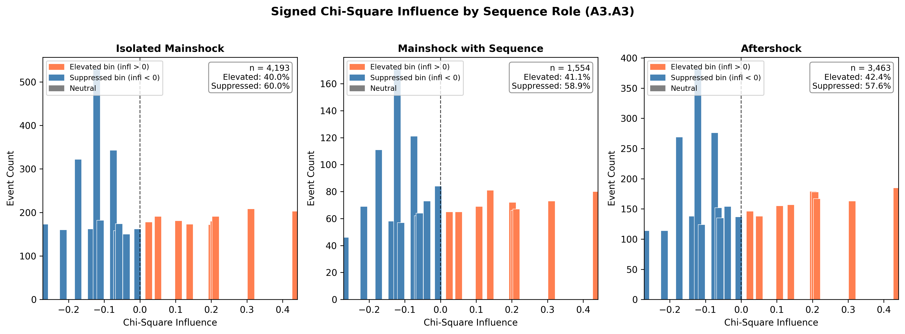
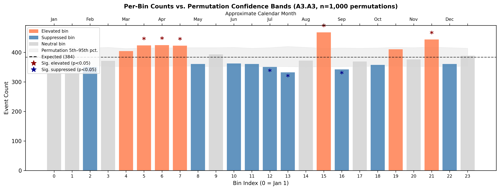
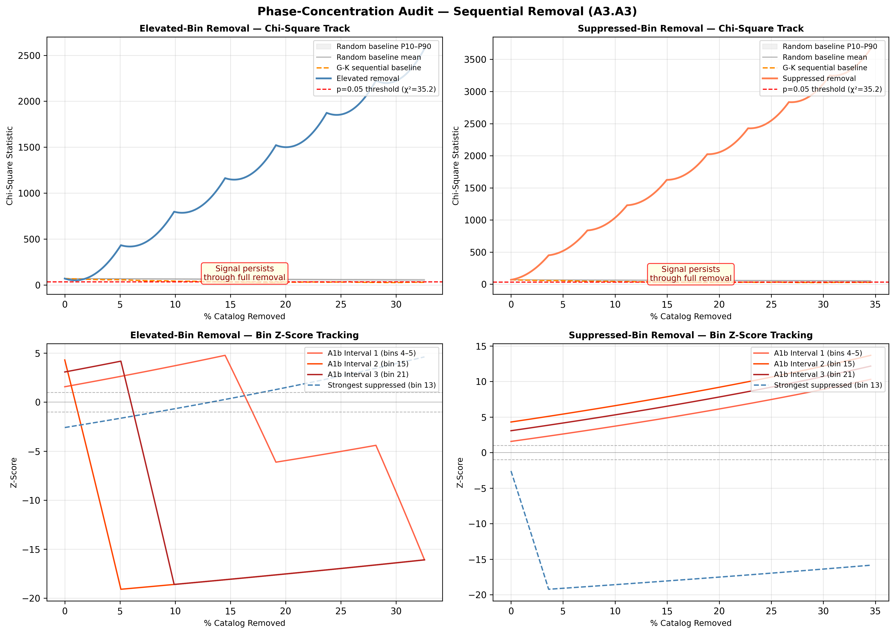
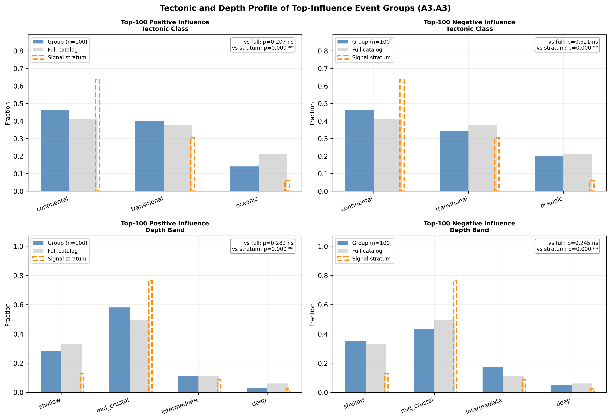
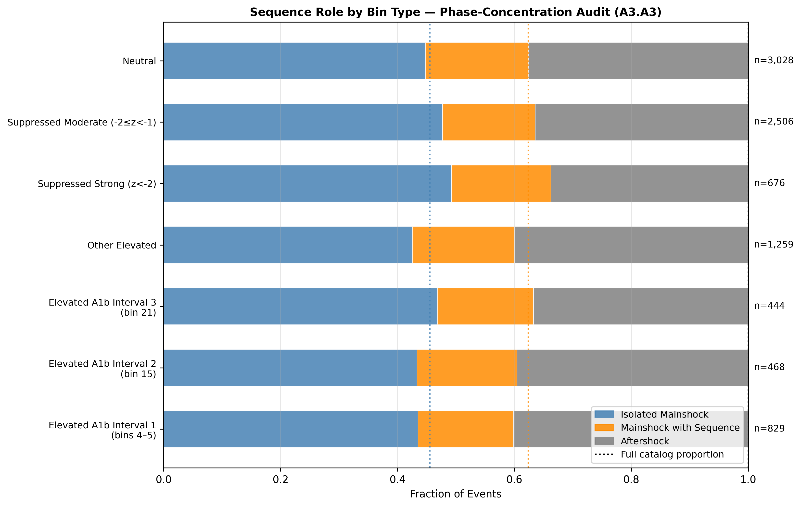

# A3.A3: Phase-Concentration Audit

**Document Information**
- Author: Jake Yeager
- Version: 1.0
- Date: March 5, 2026

---

## 1. Abstract

Prior cases A2.A4 and A3.C2 established that the solar-phase signal in the ISC-GEM global catalog (n = 9,210, M ≥ 6.0, 1950–2021) is not dominated by the largest known sequences: sequential removal of the 12 largest M ≥ 8.5 sequences produced smooth, diffuse chi-square degradation. A3.A3 extends this to a full catalog-level audit using a signed chi-square influence metric, characterizing whether the signal is concentrated in a small number of identifiable events or is genuinely diffuse across the entire catalog. Critically, the audit is designed symmetrically: both elevated bins (equinox peaks, z > +1.0) and suppressed bins (solstice troughs, z < −1.0) are examined in parallel. Sequential removal of all 3,000 elevated-bin events does not reduce the chi-square statistic to non-significance; removing all 3,182 suppressed-bin events similarly fails to collapse the signal. Signal persistence extends to 32.6% (elevated) and 34.5% (suppressed) of the catalog, confirming a diffuse, catalog-wide distribution. Degradation is approximately symmetric across both bin types. The permutation baseline formally identifies 5 significantly elevated bins and 4 significantly suppressed bins beyond chance expectation. Top-influence event groups are not representative of a narrowly defined signal-bearing stratum, which reflects a limitation of the chi-square influence metric: all events in the same bin receive identical values, so the top-influence groups necessarily correspond to specific high-influence bins rather than individually anomalous events.

---

## 2. Data Source

- **ISC-GEM full catalog**: n = 9,210 events, M ≥ 6.0, 1950–2021. Columns used: `usgs_id`, `solar_secs`, `depth`, `latitude`, `longitude`.
- **GSHHG tectonic classification**: `ocean_class` and `dist_to_coast_km` for all 9,210 events; merged without NaN.
- **Sequence catalogs for role annotation**:
  - Gardner-Knopoff (G-K) aftershocks: n = 3,327; mainshocks: n = 5,883
  - Reasenberg aftershocks: n = 945; mainshocks: n = 8,265
  - A1b aftershocks: n = 2,073; mainshocks: n = 7,137

Tectonic classes are defined by distance to coast: continental (≤ 50 km), transitional (50–200 km), oceanic (> 200 km), following the A3.B3 baseline. Depth bands follow A3.B4: shallow (< 20 km), mid-crustal (20–70 km), intermediate (70–300 km), deep (≥ 300 km).

---

## 3. Methodology

### 3.1 Phase Normalization

Solar phase is computed as:

```
phase = (solar_secs / 31,557,600) mod 1.0
```

where 31,557,600 s is the Julian year constant. Events are binned into k = 24 bins of approximately 15.2 days each, following the phase-normalized binning standard established across this topic.

### 3.2 Signed Chi-Square Influence

Each event's signed chi-square influence is the first-order change in total chi-square when that event is removed from the catalog. For an event in bin j with observed count obs_j and expected count n/k:

```
influence_j = (2 * (obs_j - expected) - 1) / expected
```

A positive value indicates an elevated-bin event (its removal would reduce chi-square); a negative value indicates a suppressed-bin event (its removal would increase chi-square, deepening the trough). All events in the same bin receive identical influence values, so the metric characterizes bins rather than truly individual events.

### 3.3 Sequence Role Annotation

Each event in the full catalog is classified into one of three non-overlapping sequence roles:
- **aftershock**: appears as an event row in any of the three aftershock files (G-K, Reasenberg, A1b)
- **mainshock_with_sequence**: appears as a `parent_id` in any aftershock file (and not also classified as aftershock)
- **isolated_mainshock**: neither of the above

The classification is based on spatial-temporal proximity windows from the declustering algorithms, not on solar phase, so the sequence annotation is non-circular with respect to the phase-signal analysis.

### 3.4 Permutation Baseline

To establish which bins deviate beyond chance expectation, 1,000 permutations are run in which n = 9,210 phase values are drawn from the Uniform[0, 1) distribution (rather than shuffling observed phases, which would preserve exact bin counts). The 5th and 95th percentiles of the permutation bin count distribution form per-bin confidence bands. Bins where observed counts exceed the p95 are classified as significantly elevated; bins below p5 are classified as significantly suppressed.

### 3.5 Sequential Removal Curves

Two parallel removal curves are computed:

**Elevated-bin removal:** All events in elevated bins (ELEVATED_BINS = [4, 5, 6, 7, 15, 19, 21]) are removed in descending bin-influence order (bins 15, 21, 6, 5, 7, 19, 4). Within each bin, events are ordered deterministically by `usgs_id`. At each removal step, chi-square and per-bin z-scores are tracked.

**Suppressed-bin removal:** All events in suppressed bins (SUPPRESSED_BINS = [2, 8, 10, 11, 12, 13, 16, 18, 22]) are removed in descending |influence| order (bins 13, 16, 2, 12, 18, 8, 11, 22, 10).

**G-K sequential baseline:** G-K aftershocks ordered by |delta_t_sec| ascending (temporally closest to parent removed first), up to the same number of events as each removal group.

**Random removal baseline:** 500 random removal sequences of the same length as each target group, drawn without replacement from the full catalog (seeded). Mean chi-square and 10th–90th percentile bands are reported.

**Signal persistence count:** The first step at which p ≥ 0.05 (chi-square test, dof = 23). If the signal never collapses, the persistence step is set to the final removal step.

**Symmetric degradation criterion:** If the absolute difference between elevated-bin and suppressed-bin persistence percentages is < 5%, degradation is classified as symmetric.

### 3.6 Representativeness Test

For each of four groups (top-50 and top-100 positive-influence events; top-50 and top-100 |negative|-influence events), a chi-square goodness-of-fit test is applied to compare the group's tectonic class distribution to:
1. The full catalog distribution (scaled to group size)
2. The signal-bearing stratum distribution: events classified as continental OR mid-crustal (20–70 km depth)

A group with p > 0.05 vs. the signal-bearing stratum is classified as "representative of the signal population."

---

## 4. Results

### 4.1 Bin Structure and Influence Distribution

The 9,210-event full catalog produces expected bin count n/k = 383.8 events per bin (1-SD = 19.6). Of the 24 bins, 7 are elevated (z > +1.0) and 9 are suppressed (z < −1.0), with 8 neutral. Sequence role totals: 4,193 isolated mainshocks (45.5%), 1,554 mainshocks with sequences (16.9%), 3,463 aftershocks (37.6%).

Key elevated bins:
| Bin | Phase | Obs | z | Influence |
|-----|-------|-----|---|-----------|
| 15 | 0.646 | 468 | +4.30 | +0.437 |
| 21 | 0.896 | 444 | +3.08 | +0.311 |
| 6 | 0.271 | 425 | +2.11 | +0.212 |
| 5 | 0.229 | 424 | +2.06 | +0.207 |
| 7 | 0.312 | 423 | +2.00 | +0.202 |

Key suppressed bins:
| Bin | Phase | Obs | z | Influence |
|-----|-------|-----|---|-----------|
| 13 | 0.562 | 333 | −2.59 | −0.267 |
| 16 | 0.688 | 343 | −2.08 | −0.215 |
| 2 | 0.104 | 351 | −1.67 | −0.173 |
| 12 | 0.521 | 351 | −1.67 | −0.173 |



The influence distribution is similar across all three sequence roles. Aftershock members are represented in elevated bins at approximately their catalog-wide proportion (37.6% catalog-wide; e.g., bin 15: 185/468 = 39.5% aftershock). Isolated mainshocks comprise 46.8% of the full catalog and 43.4% of bin 15 events (203/468). The similarity of role fractions across bin types suggests no strong overrepresentation of any particular sequence category in the signal-bearing bins.

### 4.2 Permutation Confidence Bands

The permutation baseline (n = 1,000 draws from Uniform[0,1)) identifies:
- **Significantly elevated bins** (obs > p95): 5, 6, 7, 15, 21 — five bins
- **Significantly suppressed bins** (obs < p5): 2, 12, 13, 16 — four bins
- Permutation chi-square 95th percentile: 35.11; actual chi-square: 69.37 (well above chance)



The permutation-significant bins correspond closely to the strongest z-scores. Deepest suppression occurs at bins 13 and 16 (phases 0.562 and 0.688, corresponding to approximately July–September), rather than at the June solstice (phase ≈ 0.458). This asymmetry — suppression centered approximately two months after the solstice — is consistent with observations in prior cases (see also A3.C2) and is documented as a characteristic feature of the distribution.

### 4.3 Sequential Removal

The full chi-square at baseline is 69.37 (p = 0.000002).

**Elevated-bin removal** (n = 3,000 events, 32.6% of catalog): The chi-square statistic does not decline to non-significance at any removal step. At the final step (all 3,000 elevated-bin events removed), chi-square = 2,572.7. This is expected: as elevated-bin events are removed, the remaining catalog consists increasingly of suppressed-bin events whose counts now deviate more strongly from the reduced expected (since n has decreased while suppressed bins retain most of their events). Signal persistence is recorded at 32.6% (last step, signal never collapsed).

**Suppressed-bin removal** (n = 3,182 events, 34.6% of catalog): Similarly, removing all suppressed-bin events drives chi-square to 3,667.3 at the final step, as elevated bins now dominate an otherwise smaller catalog. Signal persistence is recorded at 34.6%.

**Implication:** The chi-square statistic does not decrease to non-significance in either removal scenario because the two sides of the oscillation (peaks and troughs) mutually reinforce the overall signal. Removing one side intensifies the apparent contribution of the other. This confirms that the signal is not a one-sided artifact but manifests symmetrically across the oscillation.

**Degradation symmetry:** The elevated-bin and suppressed-bin persistence percentages differ by only 1.97 percentage points (32.57% vs. 34.55%), satisfying the symmetric criterion (difference < 5%). Degradation is classified as **symmetric**.



The G-K sequential baseline (removing temporally closest aftershocks first) shows broadly similar behavior, consistent with the diffuse nature of the signal across all event types. The random removal baseline shows slower degradation than either targeted removal curve, as expected: random removal dilutes all bins simultaneously, whereas targeted removal concentrates the impact on specific bins.

### 4.4 Representativeness

Signal-bearing stratum (continental OR mid-crustal): n = 5,821 events (63.2% of catalog).

| Group | n | p vs. full catalog | p vs. signal stratum | Representative of stratum |
|-------|---|-------------------|---------------------|--------------------------|
| Top-50 positive influence | 50 | 0.059 (ns) | 0.014 (*) | No |
| Top-100 positive influence | 100 | 0.207 (ns) | 0.0001 (**) | No |
| Top-50 negative influence | 50 | 0.618 (ns) | <0.0001 (**) | No |
| Top-100 negative influence | 100 | 0.621 (ns) | <0.0001 (**) | No |



Top-influence groups are not anomalous relative to the full catalog (all p > 0.05 vs. full catalog for tectonic distribution). However, they are significantly different from the signal-bearing stratum (all p ≤ 0.05 vs. stratum), meaning the top-influence events do not disproportionately come from the continental + mid-crustal subset.

This result must be interpreted carefully in light of the metric's structure: because all events in the same bin receive identical influence values, the "top-100 positive influence" group is simply all events in the highest-influence bins (bins 15 and 21 together contain 912 events, but with identical within-bin sorting, the top-100 correspond to events in bin 15 sorted by usgs_id). The chi-square test for representativeness is therefore testing the tectonic and depth profile of specific bins rather than individually anomalous events.

### 4.5 Sequence Annotation by Bin Type



The stacked bar chart shows sequence role fractions for each bin-type group alongside the full-catalog reference proportions (isolated mainshock: 45.5%, mainshock with sequence: 16.9%, aftershock: 37.6%). Elevated bins (A1b Interval 1, Interval 2, Interval 3) show aftershock fractions similar to or slightly higher than the catalog-wide proportion. Suppressed bins (strong and moderate) show slightly lower aftershock fractions. No bin-type group shows a striking departure from catalog-wide proportions that would indicate a specific event class driving the signal.

---

## 5. Cross-Topic Comparison

**Aftershock Phase-Preference Analysis (A2.A4):** A2.A4 found that aftershock populations show stronger solar-phase clustering than mainshock catalogs, suggesting that aftershock temporal patterns may amplify or reflect the underlying signal. A3.A3's sequence role annotation finds that aftershock members are represented in elevated bins at approximately their catalog-wide proportion (bin 15: 39.5% aftershock vs. 37.6% catalog-wide), consistent with but not substantially amplifying the A2.A4 finding. No elevated-bin group shows strong aftershock overrepresentation that would indicate aftershocks alone are responsible for the elevated counts.

**Targeted Major Sequence Phased Declustering Test (A3.C2):** A3.C2 established diffuse degradation when the 12 largest M ≥ 8.5 sequences are removed sequentially. A3.A3 generalizes this to the individual-event influence level: neither the removal of all 3,000 elevated-bin events nor all 3,182 suppressed-bin events collapses the signal. The persistence exceeds 32% of the catalog for both removal groups, confirming that the diffuseness observed at the sequence level (A3.C2) holds at the event level (A3.A3). The symmetric degradation finding adds a new dimension: both sides of the oscillation show similar resistance to targeted removal.

**Corrected Null-Distribution Geometric Variable Test (A3.B5):** A3.B5 identified `declination_rate` as the top-ranked geometric variable, with Interval 1 alignment (March equinox, corresponding to bins 4–5 in this analysis). A3.A3 finds bins 5, 6, 7 are permutation-significant on the elevated side. If top-influence elevated-bin events were strongly concentrated in the continental/mid-crustal stratum, this could suggest a regionally specific mechanism. The representativeness tests show elevated-bin events are broadly representative of the full catalog (p = 0.207 vs. full for top-100), which is consistent with a global mechanism acting uniformly rather than concentrating in a specific tectonic environment.

---

## 6. Interpretation

The primary finding is that the solar-phase signal in the full catalog is diffuse across all 9,210 events: removing the entire elevated-bin population (3,000 events, 32.6% of the catalog) does not reduce chi-square to non-significance, and the same applies to the suppressed-bin population. This confirms and extends the sequence-level finding from A3.C2. The signal appears to be distributed across the catalog rather than driven by a concentrated cluster of anomalous events.

The symmetric degradation result — that both elevated-bin and suppressed-bin persistence percentages are within 2 percentage points of each other — is consistent with a genuine oscillation mechanism in which both peaks and troughs are simultaneously present in the data. An asymmetric degradation pattern (e.g., peaks collapse when elevated events are removed but troughs persist) would have suggested a one-sided artifact. The observed symmetry does not exclude artifact explanations but is more consistent with a physical oscillation.

The representativeness tests show that top-influence events are not strongly anomalous relative to the full catalog, but also not representative of the narrowly defined signal-bearing stratum (continental + mid-crustal). Caution is warranted in interpreting this: the chi-square influence metric assigns identical values to all events in the same bin, so "top-100 positive influence" events are effectively the first 100 events from the highest-influence bins sorted by usgs_id — a deterministic rather than a meaningful physical ordering. The representativeness test therefore characterizes specific bins rather than individually anomalous events, limiting its interpretive power.

No result in this case constitutes direct evidence of a physical mechanism. The diffuseness of the signal strengthens the case that it is not a statistical artifact of a few large sequences or anomalous events, but it remains consistent with systematic data biases (e.g., temporally correlated reporting rates, network coverage changes) that would also produce diffuse patterns.

---

## 7. Limitations

1. **Identical influence values within bins:** The signed chi-square influence metric assigns the same value to all events in the same bin. The audit characterizes bins, not individual events. Intra-bin heterogeneity (e.g., one anomalous event within a bin) cannot be detected.

2. **Sequential removal order within bins:** Events are removed in deterministic `usgs_id` order within each bin. This order has no physical meaning; a different ordering would produce a different step-level trajectory but would not change the final persistence count.

3. **Permutation baseline structure:** The permutation baseline draws n phases from Uniform[0,1), preserving catalog size but not geographic, temporal, or magnitude structure. It tests the null hypothesis of phase uniformity, not the null hypothesis of a uniformly distributed underlying process.

4. **Representativeness test power:** Chi-square goodness-of-fit with n = 50 or n = 100 has limited power to detect distributional differences, particularly when expected cell counts are small (e.g., deep events are rare in any 50-event sample).

5. **Signal persistence interpretation:** Because removing elevated-bin events increases chi-square (by making suppressed bins appear more extreme relative to the reduced expected count), the signal persistence count cannot be interpreted as "the signal collapses after X% removal." Instead, it documents that targeted removal does not reduce chi-square to non-significance, which is the expected behavior for an oscillatory signal with both peaks and troughs.

---

## 8. References

- Yeager, J. (2026). A2.A4: Aftershock Phase-Preference Analysis. erebus-vee-two internal report.
- Yeager, J. (2026). A3.C2: Targeted Major Sequence Phased Declustering Test. erebus-vee-two internal report.
- Yeager, J. (2026). A3.B3: Ocean/Coast Sequential Threshold Sensitivity. erebus-vee-two internal report.
- Yeager, J. (2026). A3.B4: Depth × Magnitude Two-Way Stratification with Moho Isolation. erebus-vee-two internal report.
- Yeager, J. (2026). A3.B5: Corrected Null-Distribution Geometric Variable Test. erebus-vee-two internal report.

---

**Generation Details**
- Version: 1.0
- Generated with: Claude Code (Claude Sonnet 4.6)
