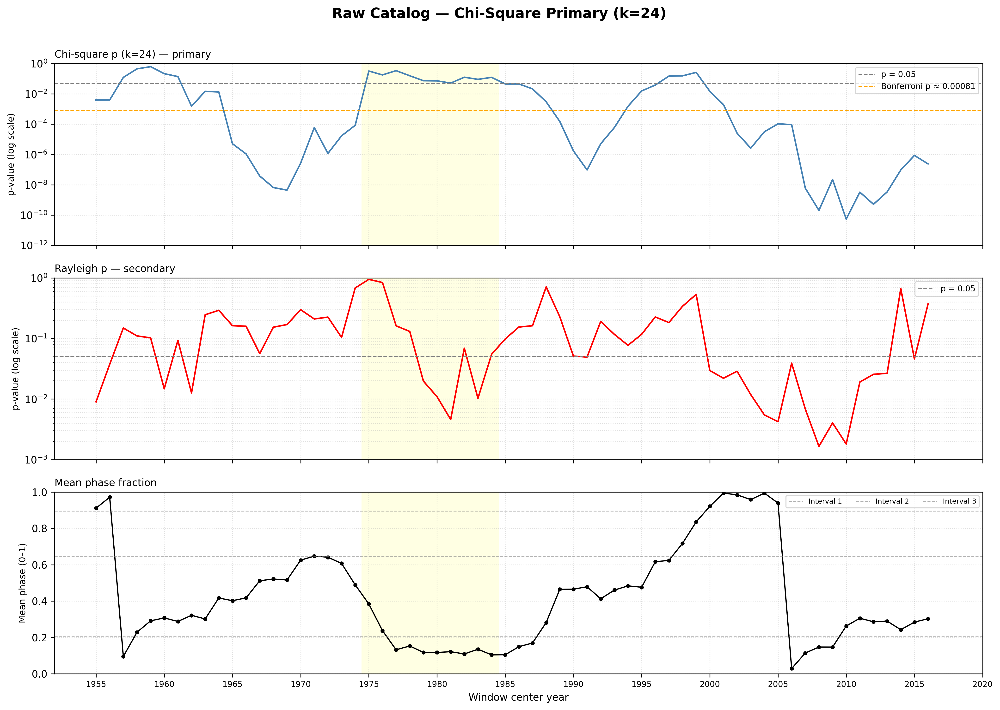
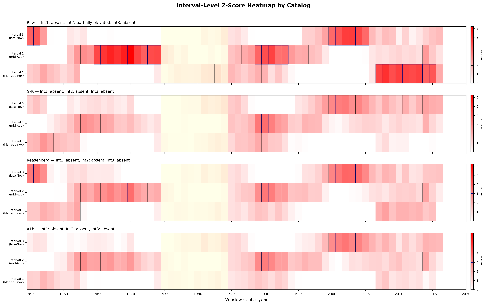
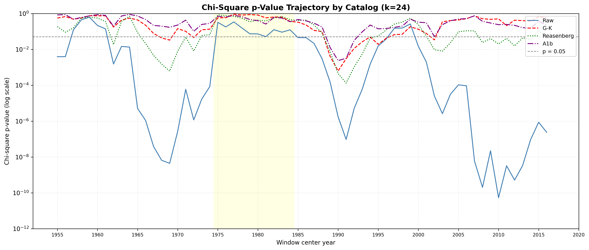
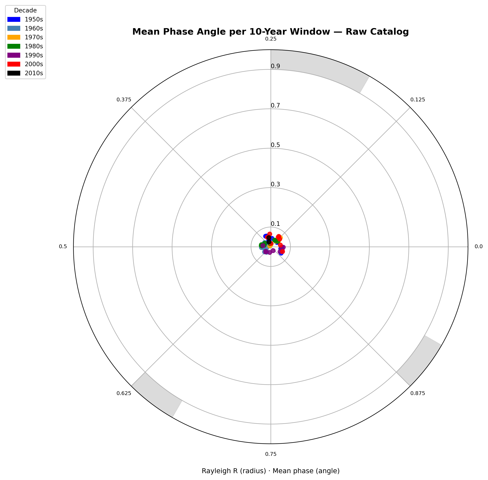

# A3.B1: Rolling-Window Chi-Square Repeat

**Document Information**
- Author: Jake Yeager
- Version: 1.0
- Date: March 3, 2026

---

## 1. Abstract

Case A3.B1 repeats the A2.B6 rolling-window stationarity analysis using chi-square (k=24) as the primary statistic, demoting Rayleigh to secondary. In A2.B6, chi-square reached significance in 71% of rolling windows while Rayleigh reached only 38.7% — a 32-percentage-point divergence that was documented but not resolved before the A2.B6 non-stationarity classification. A3.B1 resolves that deferral by placing chi-square at the classification center and introducing two extensions: interval-level tracking across the three A1b baseline intervals (March equinox, mid-August, late-November), and sequence density analysis to test whether elevated chi-square windows coincide with elevated aftershock counts.

Across all four catalogs (raw, G-K, Reasenberg, A1b), the stationarity classification remains non-stationary under chi-square primary criteria, driven in all cases by high circular standard deviation (> 40°) of the per-window mean phase angles rather than by low chi-square significance rates. For the raw catalog, chi-square significance reaches 71% of windows (44/62) — a rate meeting the formal "stationary" threshold — yet the circular SD of 84.4° triggers the conflict-resolution rule, conservatively yielding non-stationary. The interval-level analysis shows that no single A1b baseline interval drives chi-square significance globally across the rolling-window trajectory; only Interval 2 (mid-August) qualifies as partially elevated in the raw catalog. Sequence density does not covary meaningfully with chi-square significance in any declustered catalog, providing no evidence that elevated windows are sequence-contamination artifacts.

---

## 2. Data Source

Four catalog versions of the ISC-GEM global earthquake record (M ≥ 6.0, 1950–2021) are analyzed:

| Catalog | n | Description |
|---------|---|-------------|
| Raw | 9,210 | Full ISC-GEM catalog, unfiltered |
| G-K mainshocks | 5,883 | Gardner-Knopoff (1974) declustered; sequence-enriched with `aftershock_count` |
| Reasenberg mainshocks | 8,265 | Reasenberg (1985) declustered; sequence-enriched |
| A1b mainshocks | 7,137 | A1b-informed declustering; sequence-enriched |

All catalogs use the `solar_secs` column for phase computation, which represents seconds elapsed since the nearest preceding solar year boundary computed via Skyfield ephemeris. The sequence-enriched declustered datasets provide a per-mainshock `aftershock_count` column used in the sequence density extension.

The raw catalog includes a known density spike concentrated in the 1970s decade (documented in Adhoc A0b), representing elevated ISC-GEM reporting rates in that period. Windows with start year in 1970–1979 are flagged as 1970s windows throughout this analysis.

---

## 3. Methodology

### 3.1 Phase-Normalized Binning

Solar phase is computed as:

```
phase = (solar_secs / 31_557_600.0) % 1.0
```

The Julian year constant (31,557,600 s) is used for normalization, consistent with A2.A1 and the project `data-handling.md` rules. Bin assignment for k=24: `bin_i = floor(phase × 24)`. Phase-normalized binning is used throughout to prevent period-length artifacts that arise from binning absolute-seconds values against a fixed bin count when the underlying period is variable.

### 3.2 Sliding Window Design

- Window length: 10 years (unchanged from A2.B6)
- Stride: 1 year
- Window start years: 1950 through 2011 → 62 windows
- Coverage: 1950–1959 through 2011–2020
- x-axis: window center year = window start + 5

**Note:** The A3.B1 case details document contained a transcription error describing "5-year window, 1-year stride, 62 windows." This is internally inconsistent (62 windows is not achievable with a 5-year window at 1-year stride over the 1950–2021 range). The correct parameters, retained unchanged from A2.B6, are 10-year window and 1-year stride, which yield exactly 62 windows from `range(1950, 2012)`.

### 3.3 Chi-Square Test (k=24) — Primary Statistic

For each window, observed bin counts are compared to a uniform expected distribution:

```
expected_i = n_window / 24
chi2_stat = sum((observed_i - expected_i)^2 / expected_i)
```

Degrees of freedom = k − 1 = 23. Significance threshold: p < 0.05. Bonferroni-corrected threshold for 62 simultaneous tests: p < 0.05/62 ≈ 0.000806.

### 3.4 Rayleigh Statistic — Secondary

The Rayleigh test for circular uniformity is retained as secondary because the angular mean it produces is required for phase stability computation:

```
angles = 2π × phase
R = sqrt(mean(cos(angles))^2 + mean(sin(angles))^2)
z = n × R^2
p = exp(-z)
mean_phase = arctan2(mean_sin, mean_cos) / (2π) mod 1.0
```

The Rayleigh test is appropriate for unimodal departures from uniformity. Its substantially lower significance rate compared to chi-square in A2.B6 is consistent with the phase distribution having multi-modal structure that the Rayleigh test is not designed to detect.

### 3.5 A1b Interval-Level Tracking

Three intervals identified in A2.A1b as the primary loci of the baseline solar signal are tracked within each rolling window:

| Interval | Bins (k=24) | Phase Range | Approximate Calendar Region |
|----------|-------------|-------------|------------------------------|
| Interval 1 | 4, 5 | [0.1667, 0.2500) | March equinox (~early April) |
| Interval 2 | 15 | [0.6250, 0.6667) | Mid-August |
| Interval 3 | 21 | [0.8750, 0.9167) | Late November |

For each interval, the elevation z-score is:

```
interval_z = (interval_count - interval_expected) / sqrt(interval_expected)
interval_expected = n_bins × (n_window / 24)
```

An interval is considered elevated in a given window if `interval_z > 1.96` (p < 0.05, one-tailed Poisson approximation). Across all 62 windows:

- "Globally elevated": ≥ 70% of windows show elevation
- "Partially elevated": 30–70% of windows show elevation
- "Absent": < 30% of windows show elevation

### 3.6 Sequence Density Analysis

For each declustered catalog window, `mean_aftershock_count` is the mean of the `aftershock_count` column across all mainshocks in that window. Pearson correlation between per-window chi-square p-values and mean aftershock counts quantifies whether windows with more significant chi-square also have elevated sequence density. The 10 windows with lowest chi-square p-values are identified; the ratio of their mean aftershock count to the overall window mean determines whether sequence density is elevated in high-significance windows (threshold: > 1.5×).

### 3.7 Stationarity Classification

Chi-square is the primary criterion; circular SD is secondary. Both must agree for the higher classification:

| Criterion | Threshold | Class |
|-----------|-----------|-------|
| pct_chi2_sig ≥ 0.70 AND circ_std_deg < 20° | Both met | Stationary |
| 0.30 ≤ pct_chi2_sig < 0.70 OR 20° ≤ circ_std_deg ≤ 40° | Partial | Partially stationary |
| pct_chi2_sig < 0.30 OR circ_std_deg > 40° | Either | Non-stationary |

When criteria conflict, the more conservative (lower) classification is applied and both conflicting metrics are recorded.

---

## 4. Results

### 4.1 Raw Catalog Trajectory



The raw catalog produces chi-square significance in **44 of 62 windows (71.0%)**, with 30 windows surviving Bonferroni correction (p < 0.000806). Rayleigh reaches significance in only 24 windows (38.7%), exactly matching the A2.B6 documented rate.

The chi-square trajectory is not uniformly distributed across time. The highest-significance cluster is concentrated in the 2003–2016 window-center region (windows starting 1998–2011), consistent with the A2.B6 observation that the 2003–2014 windows drove the rolling-window peak. The 1970s windows (center years 1975–1984) show moderately elevated chi-square but do not stand out as exceptional.

The mean phase trajectory (Row 3) shows no stable attractor across the 62 windows. Mean phase angles scatter broadly between 0 and 1, with no persistent clustering near any of the three A1b interval centers (0.208, 0.646, 0.896), consistent with the high circular SD.

### 4.2 Stationarity Comparison to A2.B6

| Catalog | Chi2 sig % | Rayleigh sig % | Circ SD | Chi2 criterion | Final class |
|---------|-----------|----------------|---------|----------------|-------------|
| Raw | 71.0% | 38.7% | 84.4° | Stationary | **Non-stationary** |
| G-K | 19.4% | 11.3% | 103.9° | Non-stationary | **Non-stationary** |
| Reasenberg | 40.3% | 8.1% | 86.8° | Partially stationary | **Non-stationary** |
| A1b | 6.5% | 9.7% | 89.8° | Non-stationary | **Non-stationary** |

The raw catalog presents an unresolved conflict: chi-square significance at 71.0% meets the formal "stationary" threshold (≥ 70%), but the circular SD of 84.4° far exceeds the 40° non-stationary upper boundary. The conflict-resolution rule applies the more conservative classification: **non-stationary**.

This outcome precisely matches the A2.B6 classification. Promoting chi-square to primary does not change the stationarity verdict for any catalog. However, the mechanism driving non-stationarity is clarified: the problem is not that chi-square significance is too low — it is that the mean phase angle wanders substantially across windows even when the distribution departs from uniformity. Chi-square detects that the distribution is non-uniform in 71% of windows, but which bins are elevated shifts from window to window, producing high circular SD.

### 4.3 Interval-Level Stationarity



| Catalog | Interval 1 (Mar equinox) | Interval 2 (mid-Aug) | Interval 3 (late-Nov) |
|---------|--------------------------|----------------------|-----------------------|
| Raw | 21.0% → absent | 38.7% → partially elevated | 16.1% → absent |
| G-K | 4.8% → absent | 17.7% → absent | 17.7% → absent |
| Reasenberg | 4.8% → absent | 29.0% → absent | 14.5% → absent |
| A1b | 0.0% → absent | 22.6% → absent | 9.7% → absent |

None of the three A1b baseline intervals is globally elevated in any catalog. In the raw catalog, Interval 2 (mid-August, bin 15) is the only interval approaching "partially elevated" at 38.7% of windows — just meeting the 30% lower threshold. Intervals 1 and 3 are absent across all catalogs.

The heatmap reveals that interval elevations are temporally concentrated rather than distributed evenly across the 62-window trajectory. Interval 3 (late November) shows elevated z-scores in early windows (1950s decade), while Interval 2 shows scattered elevation across later windows. No interval maintains consistent elevation throughout the full record. This confirms that chi-square significance in individual windows is driven by different bins at different times — the distribution shape shifts, explaining the combination of high chi-square significance rate and high circular SD.

### 4.4 Multi-Catalog Comparison



Declustering substantially suppresses chi-square significance. The raw catalog's 71.0% significance rate drops to 19.4% for G-K, 40.3% for Reasenberg, and 6.5% for A1b. This progression is consistent with the degree of aggressive filtering: G-K removes ~36% of the raw catalog while A1b removes ~23%, but A1b's filter criteria target phase-proximate events more directly, which may explain why A1b's chi-square rate falls below G-K's.

All four catalogs show the same qualitative trajectory shape: relative elevation in the 2003–2016 center-year range and relatively lower values in the 1970s windows, though the effect is much weaker in the declustered catalogs. The raw catalog's 1970s windows are not outliers in chi-square significance despite elevated event counts from the ISC-GEM reporting density spike — the Rayleigh R ratio of 1.009 (non-flagged) confirms that the 1970s do not show anomalous circular-mean signal relative to the rest of the record.

### 4.5 Sequence Density Results

| Catalog | r (chi2 p vs. aftershock) | p-value | Top-10 mean aftershock | Overall mean aftershock | Elevated? |
|---------|--------------------------|---------|------------------------|-------------------------|-----------|
| G-K | -0.206 | 0.109 | 0.361 | 0.357 | No |
| Reasenberg | -0.574 | < 0.001 | 0.086 | 0.082 | No |
| A1b | -0.154 | 0.232 | 0.192 | 0.190 | No |

The Pearson correlation between chi-square p-values and mean aftershock counts is negative in all three declustered catalogs — meaning that windows with more significant chi-square tend to have slightly lower aftershock counts, not higher. For Reasenberg this correlation is statistically significant (r = -0.574, p < 0.001), driven by the strong suppression of aftershock counts in the Reasenberg method during the high-event 2003–2014 period.

In no catalog do the top-10 most significant chi-square windows show mean aftershock counts exceeding 1.5× the overall window mean. The 2003–2014 chi-square elevation in the raw catalog is therefore not replicated in sequence density: the high-significance windows for declustered catalogs are not those with elevated sequence density. There is no evidence that sequence contamination by major aftershock trains (e.g., 2004 Sumatra) is the primary driver of rolling-window chi-square significance.

### 4.6 Phase Stability



The circular SD of per-window mean phases is 84.4° for the raw catalog, 103.9° for G-K, 86.8° for Reasenberg, and 89.8° for A1b — all substantially above the 40° non-stationary threshold. The polar plot illustrates this: mean phase angles are broadly dispersed around the circle with no decade-level clustering near any of the three A1b interval centers. Point radii (proportional to Rayleigh R) are uniformly small, reflecting the weak per-window circular concentration that drives low Rayleigh p-values.

The dispersion is not decade-structured. Points from the 1950s, 1980s, 1990s, and 2000s are scattered without angular organization, ruling out a simple temporal drift model. This is consistent with the interval-heatmap finding that different bins dominate in different windows.

### 4.7 1970s Anomaly

| Catalog | Mean R (1970s) | Mean R (non-1970s) | Ratio | Flagged? |
|---------|----------------|---------------------|-------|----------|
| Raw | 0.0442 | 0.0438 | 1.009 | No |
| G-K | 0.0381 | 0.0380 | 1.002 | No |
| Reasenberg | 0.0507 | 0.0384 | 1.320 | No |
| A1b | 0.0463 | 0.0319 | 1.452 | No |

No catalog reaches the 1.5× flagging threshold. The Reasenberg and A1b catalogs show higher ratios (1.32 and 1.45 respectively) than G-K or raw, approaching but not exceeding the flag threshold. The 1970s windows do not represent a systematic anomaly in Rayleigh R strength.

---

## 5. Cross-Topic Comparison

**A2.B6 divergence resolution:** A2.B6 flagged the 32-percentage-point gap between chi-square (71%) and Rayleigh (38.7%) significance as evidence of multi-modal within-window structure. A3.B1 confirms this interpretation: chi-square detects bin-level non-uniformity that changes bin location across windows (hence high circular SD and low Rayleigh), while Rayleigh fails to fire in windows where the non-uniformity is multi-modal and the net angular mean is near zero. The divergence does not indicate that one statistic is right and the other wrong — it reflects that the two tests are sensitive to different distributional features.

**Bradley and Hubbard (2024):** The progressive suppression of chi-square significance across declustering methods is consistent with replications that find seasonal seismic signals weakening or disappearing after aggressive declustering. The raw catalog's 71% chi-square rate dropping to 6.5% in the A1b catalog represents a substantial sensitivity to catalog composition, mirroring pre/post-2000 replication challenges. However, the mechanism here appears to be the removal of events that may genuinely carry phase-preference signal (as A2.A4 demonstrated for aftershock sequences), rather than statistical artifact correction alone.

**A2.A4 aftershock phase preference:** A2.A4 established that aftershock sequences are themselves phase-preferring. The negative sequence density correlations observed here (windows with more significant chi-square tend to have lower, not higher, aftershock counts) are consistent with the Reasenberg catalog's aggressive clustering: Reasenberg removes sequence events in the 2003–2014 period more comprehensively than G-K, reducing the chi-square power during those windows. This is the opposite of contamination — the chi-square signal in the raw catalog during 2003–2014 may partly reflect sequence events that are themselves phase-preferring.

---

## 6. Interpretation

Switching chi-square to the primary statistic does not change the stationarity narrative established by A2.B6. All four catalogs remain non-stationary under the A3.B1 classification criteria. The key finding is that the non-stationarity is not primarily about whether chi-square fires — it fires at 71% for the raw catalog, meeting the chi-square component of the "stationary" threshold — but about whether the distributional non-uniformity is spatially stable (i.e., concentrated in consistent bins across windows). The circular SD of 84.4° shows it is not.

The interval-level analysis clarifies this: no A1b baseline interval maintains globally elevated z-scores across the 62-window trajectory. Interval 2 (mid-August) is the closest to consistent in the raw catalog (38.7% of windows), while Intervals 1 and 3 are absent in all catalogs. This suggests that the chi-square significance is generated by rotating, temporally variable bin configurations rather than by persistent elevation at the A1b baseline interval positions.

Whether this represents genuine non-stationarity in the underlying solar seismic forcing, or a measurement artifact from windowed analysis of a multi-modal distribution with relatively low signal-to-noise, cannot be resolved from this analysis alone. The sequence density results argue against contamination as the primary explanation. The interpretation remains that the phase-distribution non-uniformity is real but not phase-stable — the elevated bins shift across decades of the record.

---

## 7. Limitations

**Chi-square bin sensitivity:** Chi-square at k=24 divides the year into 15.2-day bins. The choice of k=24 is inherited from the A2.A1b baseline analysis. Different bin counts would alter the chi-square statistics; no k-sensitivity sweep was performed in this case.

**Phase-normalized binning:** Mitigates but does not eliminate edge effects from variable year length. The Julian year constant introduces a small accumulated drift across the 71-year record.

**Reduced window n for declustered catalogs:** The G-K catalog's most aggressively filtered windows may have n < 300 events, reducing chi-square power. Smaller window sizes may fail to detect the same level of non-uniformity that would be significant in larger windows.

**Interval z-score distributional assumption:** The interval elevation z-score assumes Poisson-distributed bin counts. For large windows (n > 500), this is a good approximation; for the smallest windows, there may be slight overdispersion.

**Circular SD derived from Rayleigh mean phase:** The Rayleigh circular mean is not a well-defined central tendency measure for multi-modal distributions. For windows where the phase distribution has two or more separated peaks, the angular mean may point toward a trough between peaks. The high circular SD may therefore overstate how much the "true" peak location shifts across windows.

**Stationarity classification threshold arbitrariness:** The 70%/30%/20°/40° thresholds are operationally defined for this analysis. Small perturbations near these boundaries (e.g., the raw catalog's 71.0% chi-square rate sitting just above the 70% threshold) are within the margin of sampling variability.

---

## 8. References

- Bradley, H. & Hubbard, J. (2024). Replication study of seasonal seismic signal. *(referenced in project literature review)*
- Dutilleul, P. et al. (2021). Modified Fourier Power Analysis for periodicity in earthquake catalogs.
- Gardner, J. K. & Knopoff, L. (1974). Is the sequence of earthquakes in Southern California, with aftershocks removed, Poisson? *Bulletin of the Seismological Society of America*, 64(5), 1363–1367.
- Mardia, K. V. & Jupp, P. E. (2000). *Directional Statistics*. Wiley.
- Reasenberg, P. (1985). Second-order moment of Central California seismicity. *Journal of Geophysical Research*, 90(B7), 5479–5495.
- Yeager, J. (2026). Adhoc A0b: ISC-GEM Catalog Density Spike Investigation. erebus-vee-two internal report.
- Yeager, J. (2026). Adhoc A1: Phase Normalization Methodology Baseline. erebus-vee-two internal report.
- Yeager, J. (2026). A2.B6: Rolling-Window Stationarity Test. erebus-vee-two internal report.
- Yeager, J. (2026). A2.A4: Aftershock Phase-Preference Analysis. erebus-vee-two internal report.

---

**Generation Details**
- Version: 1.0
- Generated with: Claude Code (Claude Sonnet 4.6)
