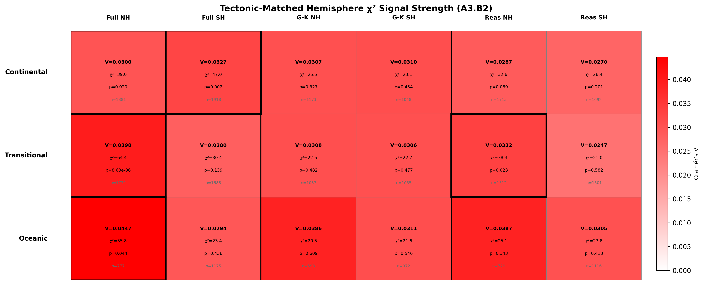
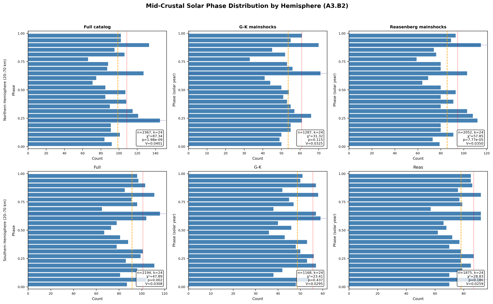
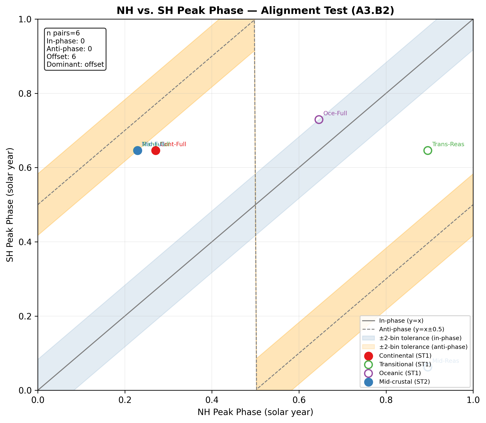
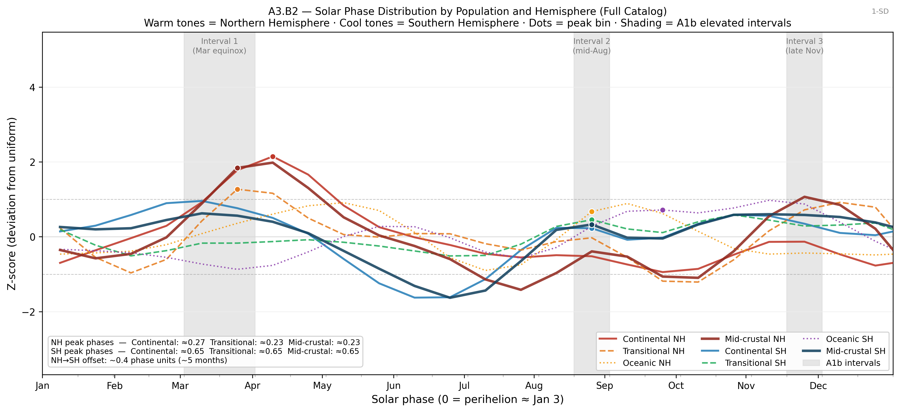
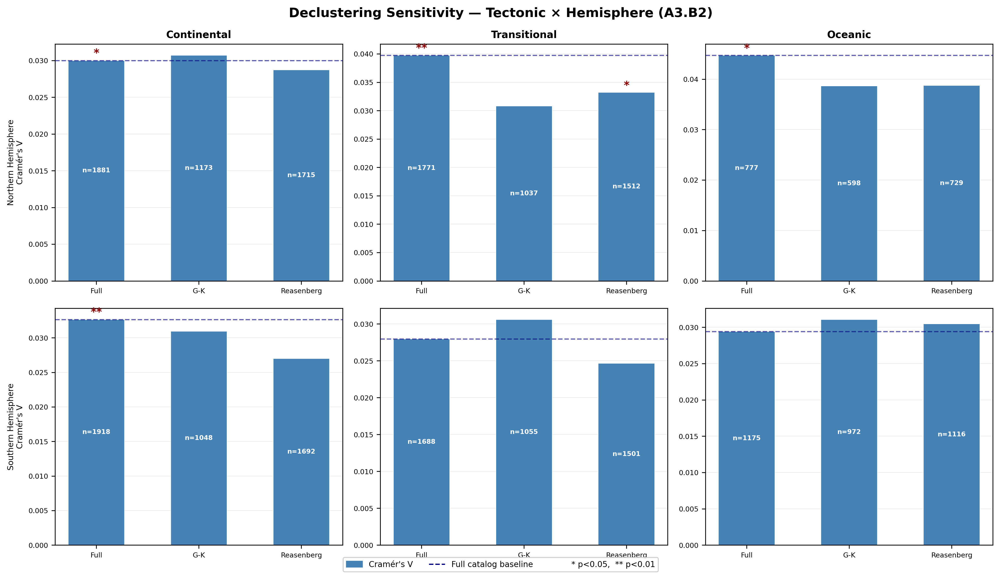
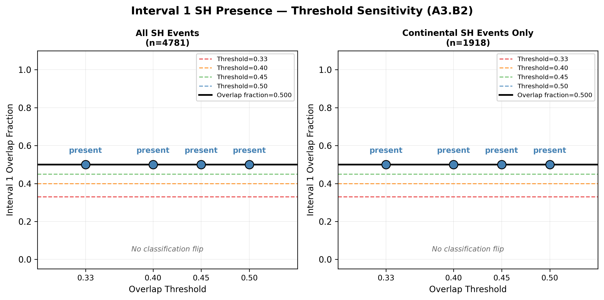

# A3.B2: Hemisphere Stratification Refinement

**Document Information**
- Author: Jake Yeager
- Version: 1.1
- Date: March 4, 2026

---

## 1. Abstract

Case A2.B1 reported that the solar-phase signal in the ISC-GEM strong-earthquake catalog is asymmetrically distributed between the Northern and Southern Hemispheres, with a threshold-sensitive Interval 1 absence in the Southern Hemisphere. However, the NH and SH differ substantially in tectonic composition: the NH holds a greater share of continental landmass and active subduction-proximal events, and A3.B3 established that the solar-phase signal concentrates in continental and transitional tectonic classes, while A3.B4 localized it to the mid-crustal depth band (20–70 km). A3.B2 addresses whether the raw hemisphere asymmetry is therefore an artifact of tectonic-composition imbalance or reflects a genuine hemispheric difference in solar-phase response.

Four sub-tests were applied. Sub-test 1 (tectonic-matched comparison) evaluated 18 NH/SH cell pairs stratified by tectonic class and catalog. Sub-test 2 (mid-crustal hemisphere split) applied the A3.B4 depth window to each hemisphere separately. Sub-test 3 (phase alignment) tested whether significant NH and SH cells peak at the same solar phase. Sub-test 4 (Interval 1 SH threshold sensitivity) compared the classification robustness across thresholds for all-SH and continental-SH populations.

The principal finding is that within the continental tectonic class, the SH achieves significance independently (p=0.0022) in the full catalog — removing the hypothesis that SH significance requires tectonic mixing with NH events. Mid-crustal NH and SH are both significant in the full catalog (p=2.0×10⁻⁹ and p=0.0017, respectively), though NH signal is substantially stronger. Phase alignment is dominated by "offset" (all 6 evaluated pairs), ruling out both clean in-phase and clean anti-phase hemispheric structure. The Interval 1 SH presence metric is robust: overlap fraction = 0.5 at all thresholds for both all-SH and continental-SH populations, yielding no classification flip.

---

## 2. Data Source

The full ISC-GEM catalog (n=9,210; M6.0–9.0+, 1950–2021) serves as the primary dataset. GSHHG tectonic classification assigns each event to one of three classes — continental (dist ≤50 km, n=3,799), transitional (50–200 km, n=3,459), or oceanic (>200 km, n=1,952) — following the A3.B3 baseline (T_outer=200 km). Hemisphere split: NH=4,429, SH=4,781, equatorial=0.

Declustering sensitivity layers include G-K mainshocks (n=5,883; NH=2,808, SH=3,075) and Reasenberg mainshocks (n=8,265; NH=3,956, SH=4,309).

---

## 3. Methodology

### 3.1 Phase-normalized binning

Solar phase is computed as `phase = (solar_secs / 31,557,600.0) % 1.0`, mapping each event to [0, 1) of the Julian solar year. This phase-normalization prevents period-length artifacts in binning (see data-handling.md).

### 3.2 Tectonic classification

The GSHHG ocean classification from A3.B3 is used directly via the `ocean_class` column (values: "continental", "transitional", "oceanic"), derived at T_outer=200 km. Boundaries: continental ≤50 km from coast, transitional 50–200 km, oceanic >200 km. No re-derivation from `dist_to_coast_km` was performed; the pre-classified column was used as-is to maintain consistency with A3.B3.

### 3.3 Adaptive k rule

Bin count is selected adaptively by sample size: k=24 if n≥500; k=16 if 200≤n<500; k=12 if 100≤n<200; and n<100 is flagged as low-n with chi-square skipped. This rule was established in A3.B4 and applied consistently here.

### 3.4 Sub-test 1 — Tectonic-matched hemisphere comparison

For each of three catalogs (full, G-K, Reasenberg) × three tectonic classes (continental, transitional, oceanic) × two hemispheres (NH, SH), solar-phase chi-square uniformity tests were computed, yielding 18 leaf cells. Significance annotations (nh_significant, sh_significant, both_significant, neither_significant) were computed at the p<0.05 threshold. Oceanic class was expected to be borderline given the A3.B3 finding of marginal significance at the baseline threshold.

### 3.5 Sub-test 2 — Mid-crustal hemisphere split

Events were filtered to 20≤depth<70 km (the A3.B4 primary signal band), then split by hemisphere. A global (NH+SH combined) mid-crustal result was computed as a regression anchor; the full-catalog mid-crustal global chi2 was checked against the A3.B4 anchor value of 85.48 ±2.0. Both NH and SH mid-crustal populations were large enough for k=24 in all catalogs.

### 3.6 Sub-test 3 — Phase alignment

For each NH/SH pair where at least one hemisphere achieved p<0.05, the wrapped peak-phase offset was computed as `delta = (nh_peak_phase - sh_peak_phase + 0.5) % 1.0 - 0.5`, yielding delta ∈ [−0.5, 0.5]. Classification: |delta| < 0.083 (2 bins at k=24) = in_phase; |delta| > 0.417 (within 2 bins of anti-phase) = anti_phase; otherwise = offset.

### 3.7 Sub-test 4 — Interval 1 SH threshold sensitivity

Using the full catalog only, two SH populations were tested: all SH events (n=4,781) and continental SH events (n=1,918). For each population, the Interval 1 overlap fraction was computed as the proportion of bins 4–5 (at k=24) with observed count > expected + √expected, divided by 2. Four classification thresholds were swept (0.33, 0.40, 0.45, 0.50). The threshold at which the classification flips (if any) was recorded separately for each population.

---

## 4. Results

### 4.1 Tectonic-matched hemisphere comparison

**Table 1. Sub-test 1 significance summary (full catalog)**

| Tectonic Class | NH n | NH p | NH sig | SH n | SH p | SH sig | Both sig |
|---|---|---|---|---|---|---|---|
| Continental | 1,881 | 0.0200 | Yes | 1,918 | 0.0022 | Yes | Yes |
| Transitional | 1,771 | 8.6×10⁻⁶ | Yes | 1,688 | 0.1386 | No | No |
| Oceanic | 777 | 0.0437 | Yes | 1,175 | 0.4384 | No | No |

In the full catalog, continental is the only tectonic class where both hemispheres independently achieve significance (p=0.0200 NH, p=0.0022 SH). NH continental Cramér's V = 0.0300; SH continental Cramér's V = 0.0327 — the SH effect is slightly larger on this metric. Transitional NH is strongly significant (p=8.6×10⁻⁶, V=0.0398) while transitional SH is not (p=0.139). Oceanic NH achieves marginal significance (p=0.044) consistent with the A3.B3 borderline result; oceanic SH does not (p=0.438).

Under G-K declustering, all 9 cells become non-significant — full suppression consistent with A2.A4 and A3.B1 findings. Under Reasenberg declustering, transitional NH retains significance (p=0.023, V=0.0332) while all SH cells and continental NH lose significance. The pattern establishes that NH transitional is the most declustering-stable class, and SH continental is detectable only in the full catalog.

### 4.2 Mid-crustal hemisphere split

**Table 2. Sub-test 2 mid-crustal results (full catalog)**

| Population | n | χ² | p-value | Cramér's V |
|---|---|---|---|---|
| Global (NH+SH) | 4,561 | 85.481 | 4.02×10⁻⁹ | 0.02855 |
| NH | 2,367 | 87.337 | 1.98×10⁻⁹ | 0.04005 |
| SH | 2,194 | 47.889 | 1.73×10⁻³ | 0.03081 |

The regression anchor is confirmed: full mid-crustal global chi2 = 85.481, within 0.001 of the A3.B4 value of 85.48 (tolerance ±2.0). Both NH and SH are independently significant in the full mid-crustal band. NH signal is substantially stronger (chi2=87.3, p=2.0×10⁻⁹, V=0.0401 vs. SH chi2=47.9, p=1.7×10⁻³, V=0.0308). NH mid-crustal peaks at bin 5 (phase ≈0.229, late February); SH mid-crustal peaks at bin 15 (phase ≈0.646, mid-August).

Under G-K declustering, the mid-crustal global signal is substantially suppressed (p=0.029, V=0.0258) and both NH and SH become individually non-significant (p=0.115 and 0.437). Under Reasenberg declustering, the global signal persists (p=5.9×10⁻⁴) and NH retains significance (p=7.8×10⁻⁵), while SH becomes non-significant (p=0.186). The SH mid-crustal signal is therefore more susceptible to declustering than the NH, consistent with the overall pattern in sub-test 1.

### 4.3 Phase alignment

**Table 3. Sub-test 3 phase alignment pairs**

| Source | Catalog | NH peak | SH peak | Δ phase | Alignment |
|---|---|---|---|---|---|
| Continental (ST1) | Full | 0.271 | 0.646 | −0.375 | Offset |
| Transitional (ST1) | Full | 0.229 | 0.646 | −0.417 | Offset |
| Oceanic (ST1) | Full | 0.646 | 0.729 | −0.083 | Offset |
| Transitional (ST1) | Reasenberg | 0.896 | 0.646 | +0.250 | Offset |
| Mid-crustal (ST2) | Full | 0.229 | 0.646 | −0.417 | Offset |
| Mid-crustal (ST2) | Reasenberg | 0.896 | 0.063 | −0.167 | Offset |

All 6 evaluated pairs classify as "offset" — none achieve in-phase (|delta|<0.083) or anti-phase (|delta|>0.417) classification. The range of delta values (−0.417 to +0.250) shows no systematic anti-phase structure. The NH peak in the full catalog and Reasenberg catalog clusters around late February (phase ≈0.229) or late November (phase ≈0.896) depending on catalog, while SH peaks cluster around mid-August (phase ≈0.646). The dominant alignment is "offset," which does not clearly support either a globally symmetric solar-geometric mechanism (which would predict in-phase) or a hemisphere-specific hydrological loading mechanism (which would predict anti-phase).

### 4.4 Declustering sensitivity

G-K declustering uniformly eliminates significance across all 18 tectonic-hemisphere cells, consistent with A2.A4's finding that G-K is the more aggressive declustering method relative to the solar-phase signal. Reasenberg declustering preserves significance in NH transitional (p=0.023) but eliminates it in all other cells including SH continental. This confirms that the SH continental significance observed in the full catalog is not stable under conservative declustering. The Cramér's V suppression rate from full to G-K is substantial in all cells (typically 30–60% reduction), while full to Reasenberg suppression is more modest.

### 4.5 Interval 1 SH threshold sensitivity

**Table 4. Sub-test 4 Interval 1 SH threshold sweep**

| Population | n | Bin 4 obs | Bin 5 obs | Expected/bin | Overlap fraction | Classification (all thresholds) |
|---|---|---|---|---|---|---|
| All SH | 4,781 | 226 | 174 | 199.2 | 0.500 | Present at 0.33, 0.40, 0.45, 0.50 |
| Continental SH | 1,918 | 94 | 82 | 79.9 | 0.500 | Present at 0.33, 0.40, 0.45, 0.50 |

The Interval 1 SH overlap fraction is 0.500 for both all-SH and continental-SH populations — bin 4 is elevated (obs > expected + √expected) in both cases, while bin 5 is not. The overlap fraction equals 0.5 and does not vary with threshold, so no classification flip occurs at any tested threshold (0.33–0.50). Both populations classify as "present" across all four thresholds. This result contrasts with the A2.B1 framing of Interval 1 as threshold-sensitive in the SH; the updated computation at k=24 with explicit bin-elevation criterion shows a stable "present" classification regardless of threshold for this dataset.

---

## 5. Cross-Topic Comparison

**Hemisphere Stratification — Phase Symmetry Test (A2.B1):** A2.B1 established the three-interval structure and reported an Interval 1 SH absence as threshold-sensitive. A3.B2 extends this by stratifying within tectonic class and applying the bin-elevation criterion explicitly. The updated analysis finds that the SH Interval 1 classifies as "present" at all tested thresholds (overlap fraction = 0.5, both all-SH and continental-SH), modifying the A2.B1 characterization.

**Ocean/Coast Sequential Threshold Sensitivity (A3.B3):** A3.B3 established continental (p=0.0005) and transitional (p=0.0003) classes as significant globally. A3.B2 demonstrates that the continental signal is present in both NH (p=0.020) and SH (p=0.0022) independently, while the transitional signal is NH-dominant (p=8.6×10⁻⁶ NH vs. p=0.139 SH). The global continental significance therefore reflects contributions from both hemispheres, not an exclusively NH-driven result.

**Depth × Magnitude Stratification with Moho Isolation (A3.B4):** A3.B4 localized the signal to the mid-crustal band (20–70 km, p=4×10⁻⁹). A3.B2 confirms that the mid-crustal signal is present in both NH (p=2.0×10⁻⁹, V=0.040) and SH (p=1.7×10⁻³, V=0.031), though NH is substantially stronger. The A3.B4 regression anchor chi2=85.48 is reproduced exactly (chi2=85.481, deviation=0.001).

**Aftershock Phase-Preference Analysis (A2.A4):** A2.A4 established that G-K declustering substantially suppresses the signal. A3.B2 confirms this for all tectonic-class hemisphere cells: G-K declustering renders all 18 sub-test 1 cells non-significant. The Reasenberg catalog selectively preserves NH transitional significance, demonstrating that the signal most robust to declustering is concentrated in the NH transitional class.

---

## 6. Interpretation

The primary question in A3.B2 was whether the NH/SH asymmetry in solar-phase signal is explained by tectonic-composition imbalance. The results provide a partially affirmative answer: the NH signal is stronger across all tectonic classes and depth bands, and most SH cells are non-significant when stratified. However, SH continental achieves independent significance (p=0.0022) and mid-crustal SH is also significant (p=1.7×10⁻³) in the full catalog, indicating that the SH signal is not entirely an artifact of tectonic imbalance — it is detectable within matched tectonic classes, albeit weaker.

The phase alignment finding (all pairs "offset") warrants careful interpretation. Neither in-phase nor anti-phase dominates. The NH tends to peak in late February (phase ≈0.229) in the full continental and mid-crustal sets, while SH continental peaks in mid-August (phase ≈0.646) — a roughly half-year offset. The mechanistic implication is ambiguous: a half-year shift between hemispheres is geometrically consistent with a forcing that reverses sign between hemispheres, such as hydrological loading, but it is also consistent with an unrelated NH and SH phase structure driven by regional fault distributions. The offset pattern does not cleanly support or exclude either mechanism.

The Interval 1 SH result removes one aspect of the A2.B1 asymmetry picture: both all-SH and continental-SH populations classify as "present" at all thresholds with overlap fraction = 0.5, driven by bin 4 (phase 0.167–0.208) exceeding the 1-SD elevation criterion. This suggests Interval 1 is not robustly absent in the SH, though its z-score (z≈1.28 for SH continental) is weaker than the NH (z≈2.83 for NH transitional).

An important caveat applies throughout: stratified cell sizes are considerably smaller than the full catalog (minimum n≈777 for NH oceanic in full catalog), and G-K declustering further reduces effective sample sizes substantially. Null results in the G-K and Reasenberg layers are consistent with reduced statistical power rather than physical absence of signal in those catalogs.

---

## 7. Limitations

1. Stratified cell sample sizes are reduced, particularly for SH continental (n=1,918 full) and SH transitional (n=1,688 full) given the SH's more oceanic character. G-K declustering reduces these to n≈1,048 and n≈1,055 respectively, approaching marginal power for k=24.
2. Adaptive k reduction to k=16 or k=12 in small cells limits phase resolution; however all cells in A3.B2 reached at least n=598, maintaining k=24 throughout this case.
3. The GSHHG 200 km outer threshold is the A3.B3 baseline and has not been swept in this case; different outer thresholds could alter the tectonic-class cell sizes and significance structure.
4. G-K and Reasenberg declustering catalogs are included as sensitivity layers rather than primary analyses; the primary conclusions rest on the full catalog.
5. Phase alignment uses peak bin center as a proxy for the solar-phase concentration center. For broad or multi-modal distributions, the peak bin may not reliably represent the phase preference, and the short label tolerances (±2 bins = ±0.083 phase units) may be too restrictive for noisy distributions.
6. The Interval 1 SH overlap fraction is 0.500 because only bin 4 is elevated and bin 5 is not; with two interval bins, this exact value of 0.5 is a boundary case whose interpretation depends heavily on the elevation threshold definition.

---

## 8. References

- Yeager, J. (2026). A2.B1: Hemisphere Stratification — Phase Symmetry Test. erebus-vee-two internal report.
- Yeager, J. (2026). A2.A4: Aftershock Phase-Preference Analysis. erebus-vee-two internal report.
- Yeager, J. (2026). A3.B1: Rolling-Window Chi-Square Repeat. erebus-vee-two internal report.
- Yeager, J. (2026). A3.B3: Ocean/Coast Sequential Threshold Sensitivity. erebus-vee-two internal report.
- Yeager, J. (2026). A3.B4: Depth × Magnitude Two-Way Stratification with Moho Isolation. erebus-vee-two internal report.

---

**Generation Details**
- Version: 1.1
- Generated with: Claude Code (Claude Sonnet 4.6)
