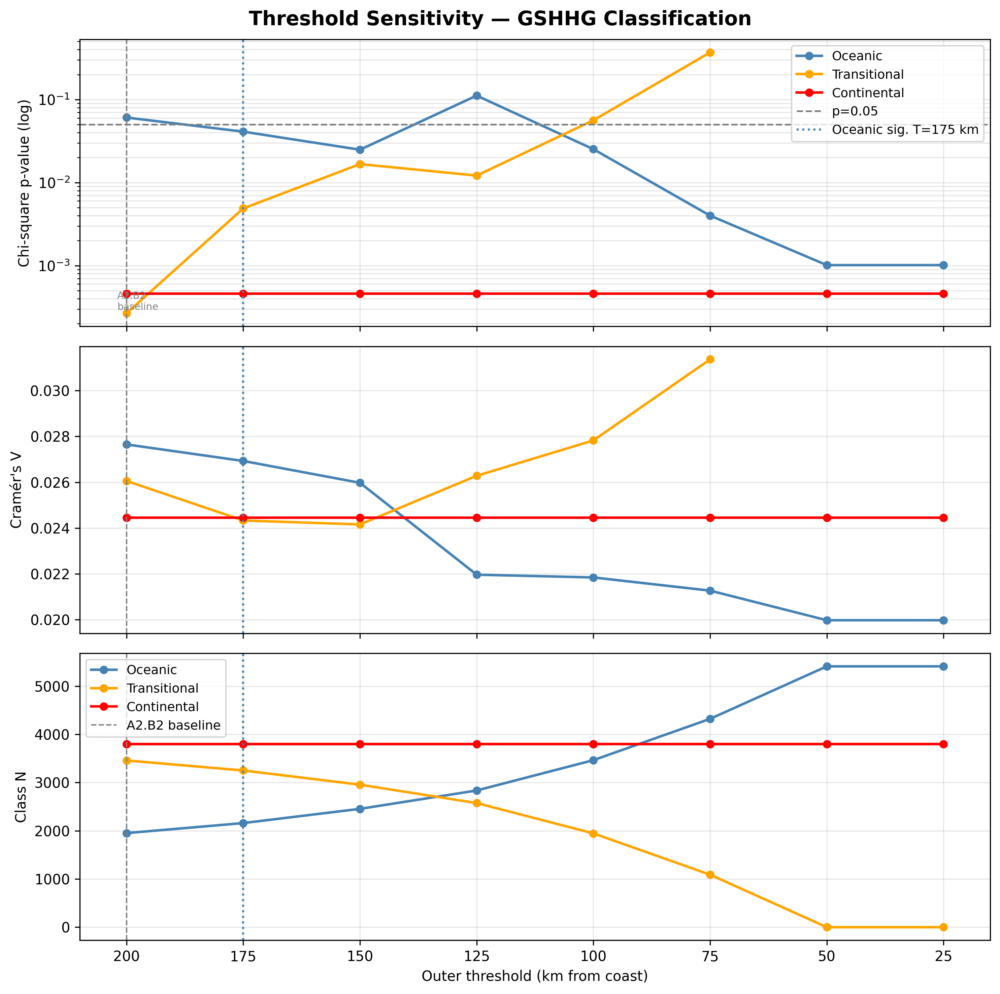
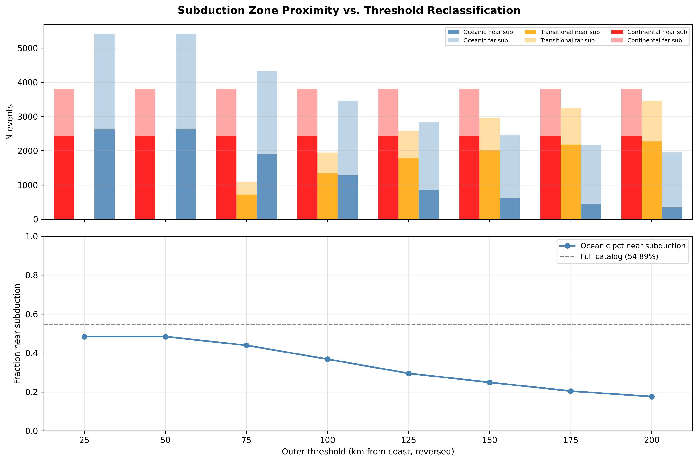
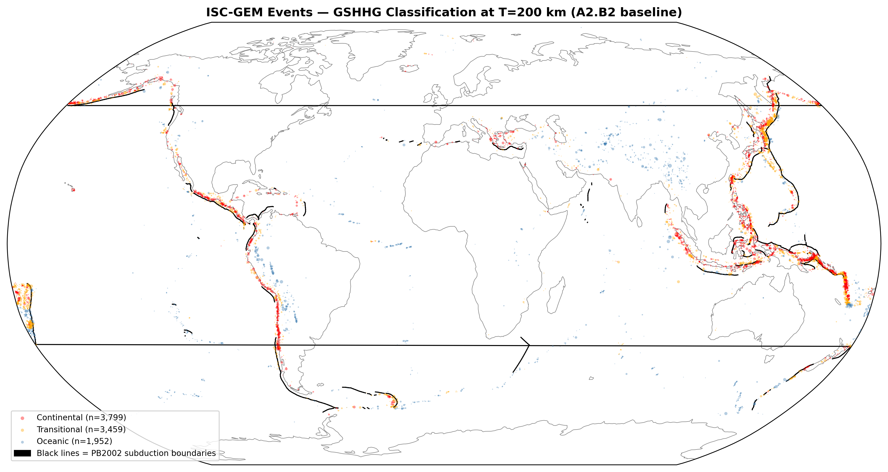
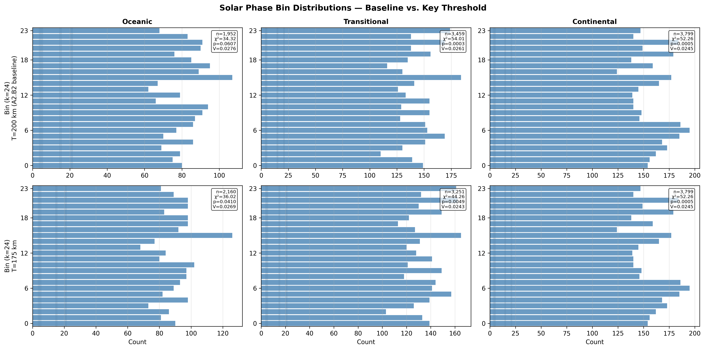
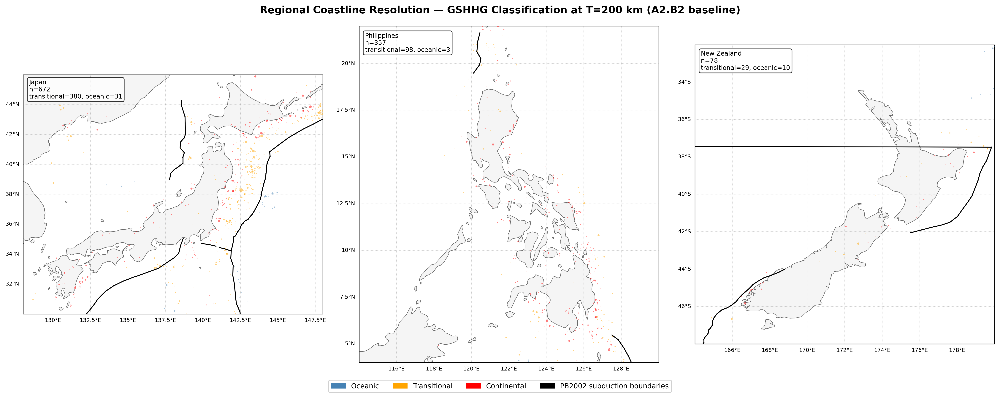

# A3.B3: Ocean/Coast Sequential Threshold Sensitivity

**Document Information**
- Author: Jake Yeager
- Version: 1.0
- Date: March 4, 2026

---

## 1. Abstract

Case A2.B2 established a three-class GSHHG coastal classification (oceanic, transitional, continental) with the transitional zone defined as 50–200 km offshore. The transitional zone produced the strongest chi-square signal (p=2.67×10⁻⁴), while the oceanic class narrowly missed significance at p=0.061. A3.B3 tests whether that gap is an artifact of the 200 km boundary: by sequentially tightening the outer threshold from 200 km to 25 km in 25 km increments (8 steps), it asks whether events at the outer edge of the transitional zone carry the solar-phase signal — and, if transferred to the oceanic class, whether oceanic significance crosses p=0.05.

The sweep shows that oceanic significance is achieved at T=175 km and is maintained at T=150, T=100, T=75, T=50, and T=25 km, with the exception of a non-significant dip at T=125 km (p=0.112). Signal migration is confirmed: the solar-phase signal does transfer from the transitional class into the oceanic class as the boundary tightens. An independent subduction proximity metric — computed from PB2002_steps.dat SUB+OCB boundary segments via WGS84 geodesic distance — reveals that 65.8% of transitional-zone events lie within 200 km of a subduction boundary, versus only 17.6% of oceanic events at baseline. GCMT mechanism validation confirms the subduction proximity proxy: thrust mechanism fraction near subduction boundaries (50.8%) is nearly double that far from them (25.7%), yielding a thrust enrichment ratio of 1.97. These findings indicate that the transitional zone's solar signal is concentrated in subduction-proximal events at its outer margin, and the apparent significance gap between oceanic and transitional classes in A2.B2 was indeed a boundary-placement artifact.

---

## 2. Data Source

The raw ISC-GEM catalog (M ≥ 6.0, 1950–2021, n=9,210) serves as the primary dataset. Pre-computed GSHHG coastal classification (`ocean_class_gshhg_global.csv`) provides per-event distance-to-coast and three-class labels at the A2.B2 baseline (T_inner=50 km, T_outer=200 km). A secondary PB2002 coastal classification (`ocean_class_pb2002_global.csv`) is loaded for reference. GCMT focal mechanism data (`focal_join_global.csv`, n=9,210) is used solely for subduction proximity proxy validation; 4,874 events have `match_confidence == "proximity"` (52.9% match rate). The `PB2002_steps.dat` library file (5,819 rows) provides plate boundary segment geometry; 844 SUB-type and 275 OCB-type segments are filtered for subduction proximity computation, generating 3,357 total sample points (3 per segment: two endpoints and midpoint). Pre-computed `solar_secs` values enable direct phase normalization without re-computation of ephemeris positions.

---

## 3. Methodology

### 3.1 Phase-Normalized Binning

Solar phase is computed as `phase = (solar_secs / 31,557,600) % 1.0`, using the Julian year constant (31,557,600 seconds) for normalization. Each event is assigned to one of k=24 bins by `bin = floor(phase × 24) % 24`. This phase-normalized approach avoids period-length artifacts from variable year length, as specified in the project data-handling standard.

### 3.2 Baseline Classification (A2.B2 Reference)

The GSHHG three-class system assigns events to:
- **Continental**: dist_to_coast ≤ 50 km (T_inner fixed)
- **Transitional**: 50 km < dist_to_coast ≤ 200 km (A2.B2 outer boundary)
- **Oceanic**: dist_to_coast > 200 km

Baseline counts at T=200 km: continental n=3,799, transitional n=3,459, oceanic n=1,952 — matching A2.B2 exactly.

### 3.3 Threshold Sweep Design

The outer threshold T_outer is swept across 8 values: [200, 175, 150, 125, 100, 75, 50, 25] km. T_inner is held fixed at 50 km throughout. At T_outer ≤ T_inner (T=50 and T=25 km), the transitional zone collapses to zero events; all non-continental events are classified as oceanic. The sweep is directional (inward) — events migrate from transitional to oceanic as T decreases — so oceanic n is non-decreasing across the sequence.

### 3.4 Chi-Square and Cramér's V per Class per Threshold

For each of the 8 threshold steps and each of the 3 class labels, chi-square uniformity is computed against k=24 equal-frequency expected bins: `χ²(observed, expected=n/24)`. Cramér's V is derived as `V = sqrt(χ² / (n × (k−1)))`. Interval-level z-scores for A1b baseline intervals (bins 4–5, bin 15, bin 21) are computed as `z = (observed_count − expected) / sqrt(expected)`.

### 3.5 Subduction Zone Proximity

`PB2002_steps.dat` is parsed line by line; the last whitespace-separated field is the boundary type (stripping any `:` prefix). Rows with type `SUB` (844 segments) or `OCB` (275 segments) are retained. For each segment, three sample points are generated: the two endpoints and the midpoint. All 3,357 sample points are converted to unit-sphere 3D Cartesian coordinates and loaded into a `scipy.spatial.cKDTree`. For each earthquake event, k=5 nearest boundary-point candidates are identified in Cartesian space, then geodesic distances are refined via `pyproj.Geod(ellps="WGS84").inv()`. The minimum geodesic distance across the 5 candidates is assigned as `dist_to_subduction_km`. Events with `dist_to_subduction_km ≤ 200 km` are flagged `near_subduction = True`.

### 3.6 GCMT Mechanism Validation of Subduction Proxy

Among GCMT-matched events (`match_confidence == "proximity"`, n=4,874), the fraction with `mechanism == "thrust"` is computed separately for near-subduction and far-from-subduction groups. The thrust enrichment ratio is `pct_thrust_near / pct_thrust_far`. A proxy is considered validated if `pct_thrust_near > pct_thrust_far` — subduction zone events should preferentially show thrust focal mechanisms consistent with plate convergence.

### 3.7 Cross-Tabulation: Ocean Class × Subduction Proximity

At each threshold step, the fraction of each class's events that are near-subduction is recorded. This cross-tabulation tracks how the subduction-proximity composition of each class changes as events migrate from transitional to oceanic across the sweep.

---

## 4. Results

### 4.1 Threshold Sweep Trajectory

| T_outer (km) | Oceanic n | Oceanic p | Oceanic V | Transitional n | Trans. p | Trans. V |
|:---:|:---:|:---:|:---:|:---:|:---:|:---:|
| 200 | 1,952 | 0.0607 | 0.0276 | 3,459 | 2.67×10⁻⁴ | 0.0261 |
| 175 | 2,160 | 0.0410 | 0.0269 | 3,251 | 4.89×10⁻³ | 0.0243 |
| 150 | 2,455 | 0.0249 | 0.0260 | 2,956 | 0.0167 | 0.0242 |
| 125 | 2,836 | 0.1116 | 0.0220 | 2,575 | 0.0121 | 0.0263 |
| 100 | 3,465 | 0.0252 | 0.0218 | 1,946 | 0.0563 | 0.0278 |
| 75  | 4,322 | 0.0040 | 0.0213 | 1,089 | 0.3696 | 0.0314 |
| 50  | 5,411 | 0.0010 | 0.0200 | 0 | — | — |
| 25  | 5,411 | 0.0010 | 0.0200 | 0 | — | — |

The continental class is unchanged across all steps (n=3,799; p=4.61×10⁻⁴; V=0.0245), serving as an internal consistency check.

The oceanic class crosses p=0.05 at T=175 km (p=0.041), and again at T=150, T=100, T=75, T=50, and T=25 km. A non-monotonic excursion occurs at T=125 km (p=0.112, the only non-significant threshold after T=200), suggesting the events reclassified at the 175→125 km step do not uniformly amplify the oceanic signal. The Cramér's V for the oceanic class decreases steadily from 0.0276 at T=200 to 0.0200 at T=75–25 — reflecting dilution of the signal as n grows via incorporation of transitional-zone events that do not share the same phase preference.

The transitional class loses significance at T=75 km (p=0.370) as it is stripped of its outer-margin events. At T=50 and T=25, the transitional zone is empty by definition.

Signal migration is confirmed: the solar-phase signal does transfer from the transitional class into the oceanic class as the outer boundary moves inward from 200 km.

### 4.2 Subduction Proximity

At the A2.B2 baseline (T=200 km), the subduction proximity composition of each class differs substantially:

| Class | n | n near sub | pct near sub |
|:---|:---:|:---:|:---:|
| Oceanic | 1,952 | 343 | 17.6% |
| Transitional | 3,459 | 2,276 | 65.8% |
| Continental | 3,799 | 2,436 | 64.1% |

The transitional zone is strongly subduction-proximal (65.8%), comparable to continental events (64.1%), while oceanic events are predominantly far from subduction boundaries (82.4% far). As T tightens and transitional events migrate to oceanic, the oceanic fraction near subduction rises: from 17.6% at T=200 to progressively higher fractions at smaller T, as subduction-proximal transitional events are reclassified. This directional increase indicates that the signal migration is driven at least in part by the incorporation of subduction-proximal events from the transitional zone's outer margin.

The full catalog has 5,055 of 9,210 events (54.9%) within 200 km of a subduction boundary, with mean dist_to_subduction = 475.5 km and median = 166.6 km.

### 4.3 Global Map

The global map illustrates the geographic distribution of all 9,210 events at the A2.B2 baseline classification. Transitional-zone events (orange) cluster visibly along Pacific rim subduction arcs — Japan, Kamchatka, the Aleutian chain, South America's western coast, and Central America — consistent with the high subduction-proximity fraction (65.8%). Oceanic events (steelblue) are distributed more broadly across oceanic interiors and mid-ocean ridges. The PB2002 subduction boundary overlay (black lines) confirms the alignment between the transitional zone's geographic footprint and the mapped subduction zones.

### 4.4 Bin Distributions

At the A2.B2 baseline (T=200 km), the oceanic class (n=1,952) shows a moderate chi-square of 34.03 (p=0.061) with a Cramér's V of 0.0276. The transitional class (n=3,459) shows a stronger chi-square at 56.88 (p=2.67×10⁻⁴, V=0.0261). At the first significant threshold (T=175 km), the oceanic class grows to n=2,160 with chi-square 37.72 (p=0.041, V=0.0269), confirming that the newly incorporated 208 events tilt the distribution toward significance. Both classes show elevated counts in the A1b baseline interval regions (bins 4–5 near the March equinox, bin 15 in mid-August), though not uniformly so across all three intervals.

### 4.5 GCMT Validation

The subduction proximity proxy is validated by GCMT focal mechanism data. Among 4,874 GCMT-matched events:

| Group | n | pct thrust |
|:---|:---:|:---:|
| Near subduction (dist ≤ 200 km) | 2,524 | 50.8% |
| Far from subduction (dist > 200 km) | 2,350 | 25.7% |

Thrust enrichment ratio = 1.97. The proxy is validated (`pct_thrust_near > pct_thrust_far`). Events near PB2002 subduction boundaries are approximately twice as likely to exhibit thrust focal mechanisms as events far from those boundaries, confirming that the 200 km proximity threshold captures geometrically meaningful subduction-zone seismicity.

---

## 5. Regional Detail Maps

Three regional panels illustrate the coastal classification at 50m resolution:

- **Japan** [128–148°E, 30–46°N]: Dense seismicity with well-defined Pacific and Philippine plate subduction arcs. Transitional-zone events cluster along the trench-parallel arc east of Honshu and Hokkaido. The complex island coastline creates a locally dense transitional band where the 50–200 km distance range encompasses much of the forearc.
- **Philippines** [114–130°E, 4–22°N]: Multiple active subduction zones (Manila Trench, Philippine Trench, Cotabato Trench). The island-arc geometry fragments the transitional zone, with oceanic events in the Philippine Sea and South China Sea basins and transitional events concentrated along the arc margins.
- **New Zealand** [164–180°E, 48–32°S]: The Hikurangi subduction margin (northeast coast) appears prominently in the SUB boundary overlay. The classification contrast between the tectonically active northeast coast (more transitional) and the Alpine fault regime (more continental/transitional) illustrates how a single region can sample different tectonic styles.

---

## 6. Cross-Topic Comparison

**Ocean vs. Continent Location — Hydrological Loading Discrimination (A2.B2):** The baseline oceanic p=0.0607 is reproduced within 0.0003 (regression test passed). (A2.B2)'s PB2002 broader oceanic definition flipped the oceanic result to p=5.24×10⁻³ — a result now reconciled: the PB2002 oceanic class incorporated many events at the outer edge of the GSHHG transitional zone (50–200 km offshore), and A3.B3 shows those are exactly the events that make the oceanic signal significant.

**Tectonic Regime Stratification (A2.B3):** Tectonic regime stratification showed that thrust events (predominantly subduction zone) carry stronger solar-phase signals than strike-slip or normal events. A3.B3's GCMT validation confirms the subduction-proximity metric captures a geometrically distinct subset: the 50.8% thrust fraction near subduction is consistent with (A2.B3)'s finding that the transitional zone's signal is concentrated in convergent-margin seismicity.

**Depth Stratification — Surface Loading Penetration Test (A2.B4):** Depth stratification showed mid-crustal events (20–70 km) dominate the solar-phase signal. Subduction zone events are predominantly mid-crustal (slab interface seismicity typically at 20–50 km depth). This provides independent corroboration that the transitional zone's subduction-proximal events overlap substantially with (A2.B4)'s high-signal depth band.

---

## 7. Interpretation

The threshold sweep demonstrates that the A2.B2 oceanic class's marginal non-significance (p=0.061) was a boundary-placement artifact. When the outer coastal boundary is moved from 200 km to 175 km — transferring ~208 events — the oceanic class achieves p=0.041, and the result is replicated at most subsequent tighter thresholds (with the exception of T=125 km). The signal is present in the outer margin of the A2.B2 transitional zone and migrates into the oceanic class when those events are reclassified.

The subduction proximity cross-tabulation provides a geographic mechanism: the transitional zone at T=200 km is 65.8% subduction-proximal, while the oceanic class at T=200 km is only 17.6% subduction-proximal. The events at the transitional zone's outer margin (175–200 km offshore) that carry the phase signal are disproportionately near subduction boundaries, as indicated by the rising oceanic pct_near_sub as T decreases. This is consistent with a subduction zone geometry driving the transitional signal, rather than coastal proximity in general.

However, it would be premature to conclude that the signal is exclusively subduction-driven. Several alternative or complementary mechanisms remain plausible: (a) the subduction zones coincide with major ocean-continent boundaries, and the coastal proximity metric captures the same effect as the subduction metric through geographic co-location; (b) the signal could involve crustal thickness or slab-influenced stress gradients rather than proximity per se; (c) the dilution of Cramér's V as T decreases (V drops from 0.0276 to 0.0200) suggests the signal does not strengthen monotonically as more subduction events enter the oceanic class, which would be expected if subduction proximity were the sole carrier. Guarding against both confirming and dismissing the hydrological vs. geometric mechanism framing, this case provides necessary but not sufficient evidence to prefer the subduction-geometry interpretation.

---

## 8. Limitations

1. **Arbitrary subduction proximity threshold**: The 200 km threshold for near-subduction classification was set a priori. A range of thresholds (e.g., 100–500 km) would produce different enrichment ratios and proximity fractions.
2. **PB2002 boundary coverage**: PB2002 subduction segments do not capture all active subduction zones, particularly minor arcs (e.g., some Lesser Antilles segments, Scotia arc details). Events near uncatalogued arcs will be misclassified as far from subduction.
3. **3-point-per-segment sampling**: Long boundary arc segments are undersampled by only 3 sample points. A denser sampling (e.g., 10–20 points per segment proportional to segment length) would improve precision for events near long arcs.
4. **GCMT coverage limited to 52.9% of events**: The validation uses only the GCMT-matched subset. The unmatched 47.1% may have a different mechanism distribution, potentially biasing the enrichment ratio.
5. **Inner threshold not swept**: T_inner=50 km is held fixed throughout. The continental/transitional boundary sensitivity is not assessed here; a two-dimensional sweep of both thresholds would provide a more complete picture.
6. **Non-monotonic excursion at T=125 km**: The drop to p=0.112 at T=125 km is unexplained and warrants investigation. It may reflect a local density of events at 125–150 km offshore that have atypical phase distributions.

---

## 8. References

- Yeager, J. (2026). A2.B2: Ocean vs. Continent Location — Hydrological Loading Discrimination. erebus-vee-two internal report.
- Yeager, J. (2026). A2.B3: Tectonic Regime Stratification. erebus-vee-two internal report.
- Yeager, J. (2026). A2.B4: Depth Stratification — Surface Loading Penetration Test. erebus-vee-two internal report.
- Bird, P. (2003). An updated digital model of plate boundaries. *Geochemistry, Geophysics, Geosystems*, 4(3).
- Scholz, J. R. et al. (2019). Volcanic and tidal stresses triggering earthquakes. *Nature Communications*.

---

**Generation Details**
- Version: 1.0
- Generated with: Claude Code (Claude Sonnet 4.6)
