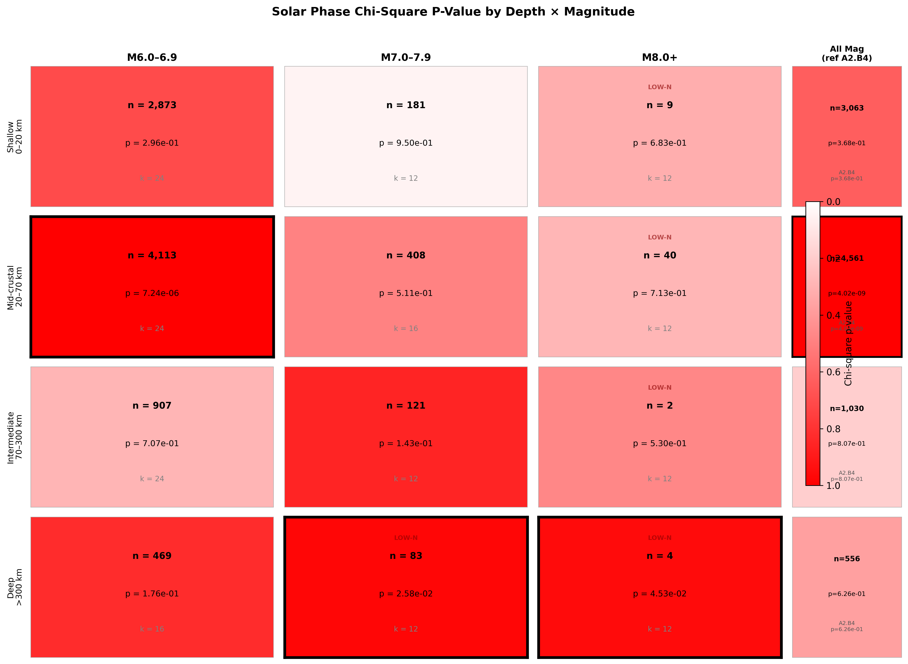
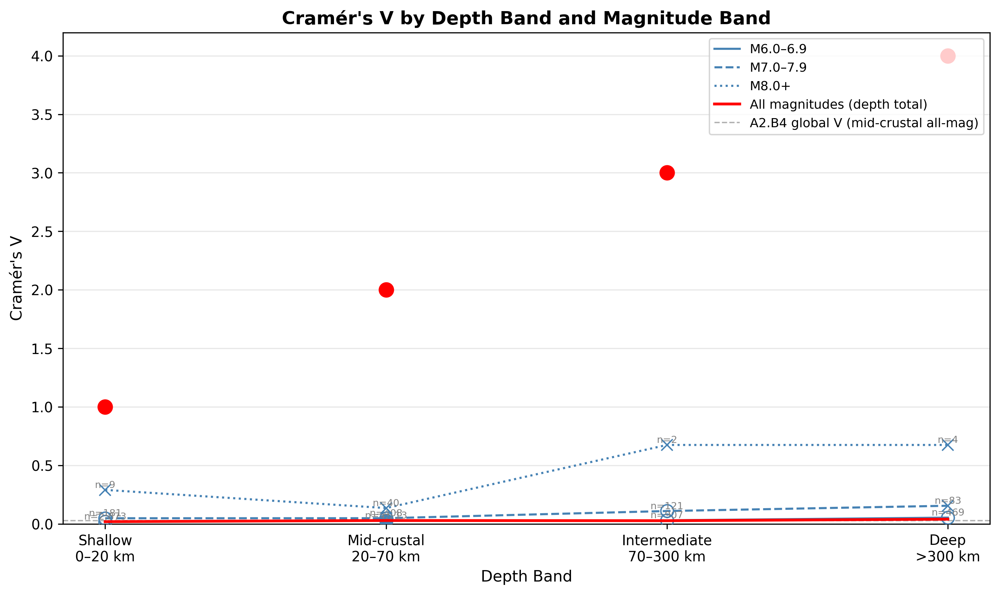
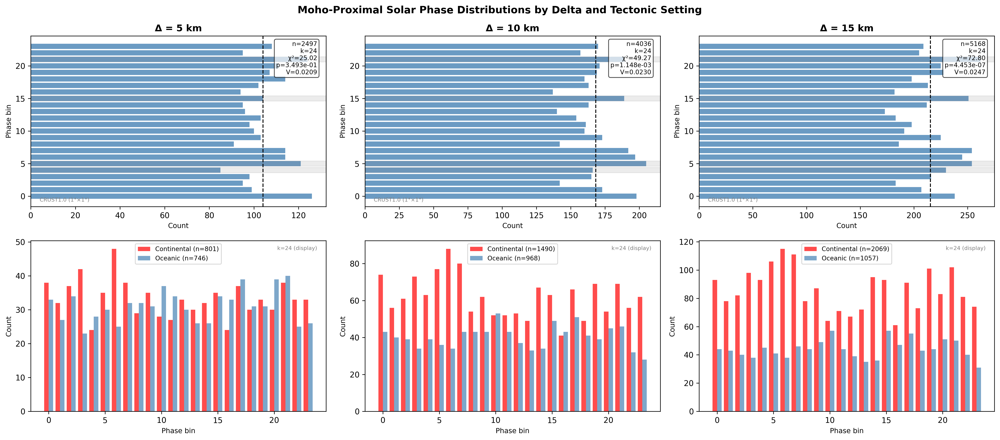
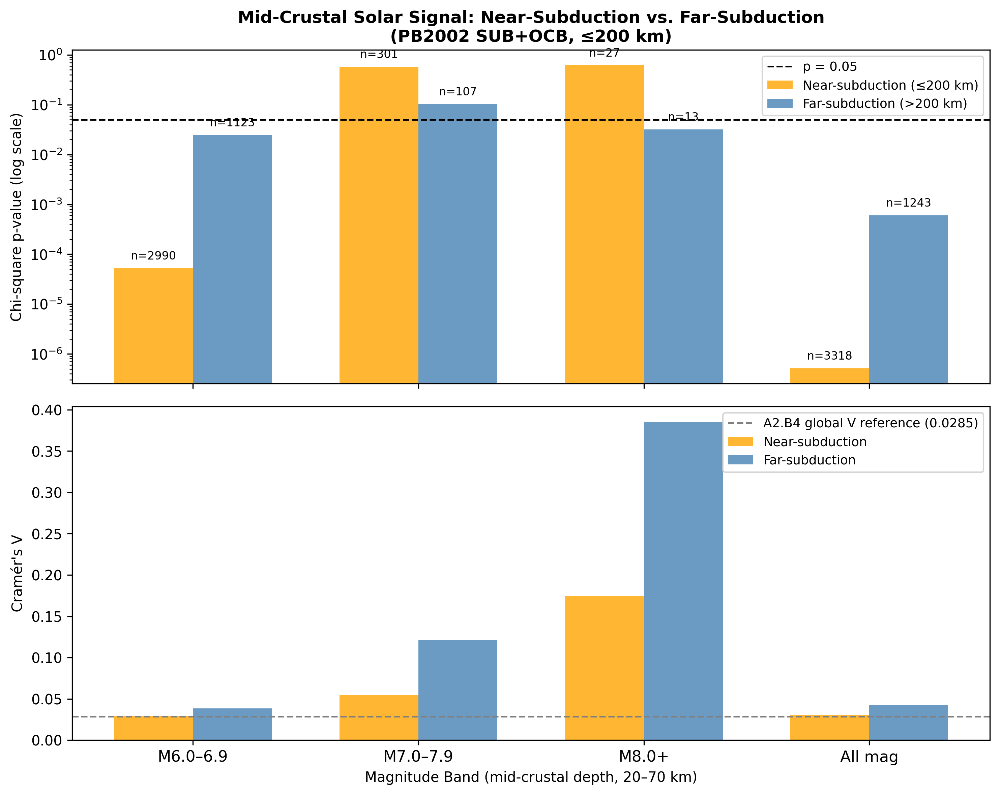
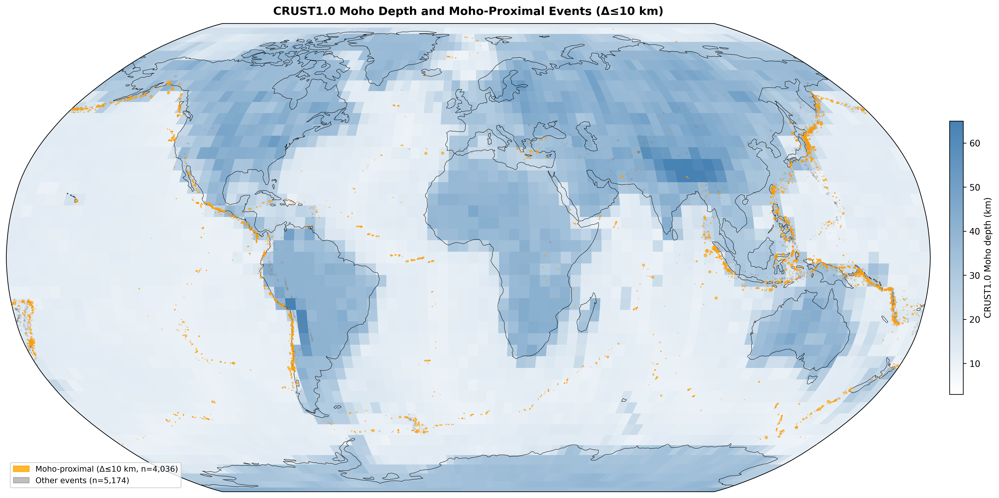

# A3.B4: Depth × Magnitude Two-Way Stratification with Moho Isolation

**Document Information**
- Author: Jake Yeager
- Version: 1.0
- Date: March 4, 2026

---

## 1. Abstract

Case A2.B4 identified a significant solar-phase signal in the mid-crustal depth band (20–70 km; χ²=85.48, p=4.02×10⁻⁹, V=0.0285), while all other depth bands remained non-significant. Two confounds were flagged: (1) larger events tend to be deeper, so the mid-crustal dominance may express the magnitude–signal trend from A2.A3 through depth; and (2) the 20–70 km range coincides with slab interface seismicity, so the signal may reflect subduction geometry rather than crustal loading depth. A3.B4 introduces a third-component design to disentangle these confounds using CRUST1.0 (Laske et al. 2013) per-event Moho assignment. The two-way stratification sub-test confirms that the mid-crustal signal persists when restricted to M6.0–6.9 alone (n=4,113, χ²=64.91, p=7.24×10⁻⁶), ruling out the magnitude confound. The Moho isolation sub-test finds a significant signal in Moho-proximal events only at delta=10 and 15 km, with the signal concentrated in continental and transitional tectonic settings rather than oceanic. The subduction proximity cross-tabulation finds that the mid-crustal signal persists in both near-subduction and far-subduction subsets for M6–7, indicating that subduction geometry alone does not account for the full signal.

---

## 2. Data Source

The primary catalog is the ISC-GEM Global Earthquake Catalog (post-1950, M6.0+), restricted to 9,210 events spanning 1950–2021. GSHHG (Global Self-consistent Hierarchical High-resolution Geography) coastal distance classification provides the `ocean_class` column (continental / transitional / oceanic) and `dist_to_coast_km`, applied to all 9,210 events. GCMT focal mechanism join covers 52.9% of catalog events (match_confidence = "proximity"). The PB2002 plate boundary steps file (Bird 2003), specifically SUB and OCB boundary type rows, provides the subduction proximity reference. CRUST1.0 (`crust1.bnds`, Laske et al. 2013) provides per-cell Moho depths at 1°×1° global resolution; data are sourced from https://igppweb.ucsd.edu/~gabi/crust1.html.

---

## 3. Methodology

### 3.1 Phase-normalized binning

Solar phase is computed as `phase = (solar_secs / 31,557,600.0) % 1.0`, where 31,557,600 s is the Julian year constant. Phase is assigned to bins by `bin_index = floor(phase × k)`, avoiding absolute-seconds binning artifacts that arise from variable-length years. This follows the phase-normalized binning standard documented in `data-handling.md`.

### 3.2 Depth bands

Four depth bands, identical to A2.B4: shallow (0–20 km), mid-crustal (20–70 km), intermediate (70–300 km), and deep (>300 km). The ISC-GEM catalog has no missing depth values for this dataset (n_depth_null = 0).

### 3.3 Magnitude bands

Three magnitude bands: M6.0–6.9, M7.0–7.9, and M8.0+. These subdivide the catalog range roughly at even logarithmic intervals. The M8.0+ subset is sparse (<5% of events), producing low-n cells in all depth bands except mid-crustal.

### 3.4 Adaptive k selection

Bin count is chosen adaptively based on cell size: k=24 if n≥500, k=16 if 200≤n<500, k=12 if 100≤n<200. Cells with n<100 are flagged as low-n; k=12 is used for record-keeping but results are treated as unreliable. Variable k is necessary to avoid spuriously significant chi-square tests in sparse cells and to prevent over-fitting in bins with fewer than one expected event.

### 3.5 CRUST1.0 Moho depth assignment

The CRUST1.0 `crust1.bnds` file contains 64,800 rows × 9 columns representing a 180×360 (1°×1°) global grid, with grid cell centers at latitudes 89.5°N to -89.5°N and longitudes -179.5°E to 179.5°E. Column index 8 (0-based) contains Moho depth stored as negative values (km below sea level). Values are negated to obtain positive depths. A bilinear interpolation surface is constructed via `scipy.interpolate.RectBivariateSpline` (kx=1, ky=1) with the latitude axis flipped to ascending order before input. Per-event Moho depths are evaluated using the `.ev()` vectorized method and clipped to [3.0, 90.0] km to handle edge cells. Attribution: Laske, G., Masters, G., Ma, Z., and Pasyanos, M. (2013); data from https://igppweb.ucsd.edu/~gabi/crust1.html.

### 3.6 Moho isolation proximity filter

A Moho-proximity flag is assigned for each event using `|focal_depth − moho_depth_km| ≤ delta`, where delta takes values of 5, 10, and 15 km. Three separate analyses are run at each delta value, and results are further stratified by `ocean_class` to distinguish continental Moho (~25–35 km) from oceanic Moho (~7–12 km).

### 3.7 Subduction proximity pipeline

The PB2002_steps.dat file is parsed row by row, filtering to boundary types SUB (subduction) and OCB (oceanic convergent), yielding 844 SUB + 275 OCB segments for a total of 3,357 sample points (3 per segment: both endpoints and midpoint). A unit-sphere cKDTree is built from the sample points and queried at k=5 nearest neighbors per event. Geodesic distances are then refined using `pyproj.Geod(ellps="WGS84").inv()`. Events within 200 km of the nearest boundary point are classified as `near_subduction`. This pipeline is identical to A3.B3.

---

## 4. Results

### 4.1 Two-way stratification matrix

The stratification matrix confirms that significance is almost entirely localized to the mid-crustal × M6.0–6.9 cell. The mid-crustal band total (all magnitudes, k=24) reproduces the A2.B4 result exactly: n=4,561, χ²=85.48, p=4.02×10⁻⁹, V=0.0285. When restricted to M6.0–6.9 alone (n=4,113, k=24), the cell remains highly significant: χ²=64.91, p=7.24×10⁻⁶, V=0.0262. This directly refutes the magnitude confound: the mid-crustal signal is not a product of deeper events having higher magnitude; it persists within the M6.0–6.9 majority independently.

The M7.0–7.9 mid-crustal cell (n=408, k=16) is non-significant (χ²=14.20, p=0.511). The M8.0+ mid-crustal cell is low-n (n=40) and non-significant. No other depth band produces a significant cell at any magnitude level, with two exceptions both low-n: deep × M7.0–7.9 (n=83, χ²=21.82, p=0.026) and deep × M8.0+ (n=4, χ²=20.00, p=0.045). These low-n cells warrant no inferential weight.

**Summary table — stratification matrix (significant cells in bold):**

| Depth band | M6.0–6.9 | M7.0–7.9 | M8.0+ |
|---|---|---|---|
| Shallow 0–20 km | n=2,873, p=0.296 | n=181, p=0.950 | n=9, p=0.683 (low-n) |
| **Mid-crustal 20–70 km** | **n=4,113, p=7.24×10⁻⁶** | n=408, p=0.511 | n=40, p=0.713 (low-n) |
| Intermediate 70–300 km | n=907, p=0.707 | n=121, p=0.143 | n=2, p=0.530 (low-n) |
| Deep >300 km | n=469, p=0.176 | n=83, p=0.026 (low-n) | n=4, p=0.045 (low-n) |

### 4.2 Cramér's V trends

The Cramér's V profile is dominated by the mid-crustal band for the M6.0–6.9 line (V=0.0262) and the depth-band totals (V=0.0285 at mid-crustal, matching A2.B4 exactly). The M7.0–7.9 line shows a higher nominal V (0.0482 at mid-crustal) but with lower statistical power at k=16, n=408, yielding p=0.511 — the effect size is not interpretable as a signal. The deep-band M7.0–7.9 and M8.0+ cells show elevated V values (0.1546, 0.6742) but are flagged low-n. The trajectory is clearly non-monotonic across depth for all magnitude bands; the mid-crustal peak is specific to the M6.0–6.9 majority, which constitutes 89.3% of the mid-crustal population.

### 4.3 Moho isolation

CRUST1.0 assigns per-event Moho depths ranging from 3.0 to 90.0 km after clipping, with a mean of 21.91 km, median of 19.69 km, and standard deviation of 11.04 km across all 9,210 events. Moho-proximal event counts by delta: n=2,497 (Δ=5 km), n=4,036 (Δ=10 km), n=5,168 (Δ=15 km), confirming strict monotonicity.

At the primary threshold (Δ=10 km, n=4,036, k=24): χ²=49.27, p=1.15×10⁻³, V=0.0230. The signal is weaker than the mid-crustal band total (V=0.0285), suggesting the 20–70 km depth band captures a broader population than just Moho-proximal events. Stratified by tectonic setting at Δ=10 km: continental (n=1,490, p=2.53×10⁻³, V=0.0369) and transitional (n=1,578, p=4.52×10⁻⁴, V=0.0380) are significant; oceanic (n=968, p=0.535, V=0.0313) is not. At Δ=5 km, only the transitional subset is significant (p=0.021); at Δ=15 km, both continental and transitional remain significant while oceanic does not.

The consistent non-significance of the oceanic Moho-proximal subset across all three delta values is notable: events near the oceanic Moho (~7–12 km) do not carry the solar signal, while continental Moho events (~25–35 km) do. This is consistent with the mid-crustal band being a proxy for continental rather than oceanic crustal events.

### 4.4 Subduction proximity cross-tabulation

54.9% of all 9,210 catalog events fall within 200 km of a SUB or OCB boundary (n=5,055), with a mean distance of 475.5 km to the nearest boundary.

Within the mid-crustal band, across all magnitudes: near-subduction (n=3,318) is highly significant (p=5.11×10⁻⁷, V=0.0308); far-subduction (n=1,243) is also significant (p=6.02×10⁻⁴, V=0.0424). For M6.0–6.9 specifically: near-subduction (n=2,990, p=5.22×10⁻⁵, V=0.0293) and far-subduction (n=1,123, p=0.025, V=0.0384) are both significant. The far-subduction mid-crustal M6–7 subset (n=1,123, p=0.025) is significant despite containing no subduction-proximal events; this result directly tests and does not support the subduction-geometry alternative hypothesis: the mid-crustal signal survives geographic partitioning to regions far from subduction zones.

For M7.0–7.9 within mid-crustal, neither near- (n=301, p=0.578) nor far-subduction (n=107, p=0.103) subsets are significant. For M8.0+, results are low-n and unreliable.

### 4.5 Global Moho map

The global Moho depth map (CRUST1.0 background, Robinson projection) shows the expected dichotomy: shallow oceanic Moho (5–12 km, white) under ocean basins, and deep continental Moho (30–70 km, blue) under continental interiors and mountain ranges. Moho-proximal events (Δ≤10 km, n=4,036, orange) are distributed across both oceanic and continental settings, with visible concentration along subduction arcs and continental margins — consistent with the 20–70 km depth range overlapping the subducting slab interface. Non-proximal events (gray) show a broader global distribution. The geographic clustering of Moho-proximal events along subduction arcs reflects the overlap between the 20–70 km depth range and the continental-oceanic Moho transition zone identified in A3.B3's transitional class analysis.

---

## 5. Cross-Topic Comparison

**Depth Stratification — Surface Loading Penetration Test (A2.B4):** Regression to A2.B4 mid-crustal χ²=85.48 confirms exact reproducibility (this run: χ²=85.48, p=4.02×10⁻⁹, V=0.0285). The two-way stratification neither weakens nor strengthens the headline mid-crustal result; it decomposes it. The M6.0–6.9 subset accounts for 89.3% of the mid-crustal population and carries an independent significant signal (p=7.24×10⁻⁶), confirming that the A2.B4 signal was not an artifact of the full-band composition.

**Magnitude Stratification of the Solar Signal (A2.A3):** A2.A3 established a magnitude–signal relationship across the full catalog. A3.B4 tests whether this magnitude trend, expressed through depth (larger events are deeper), accounts for the mid-crustal dominance. The persistence of mid-crustal significance within M6.0–6.9 alone (the majority band, where the magnitude–depth correlation is weakest) indicates the mid-crustal signal is not merely a proxy for the (A2.A3) magnitude effect.

**Ocean/Coast Sequential Threshold Sensitivity (A3.B3):** (A3.B3) showed 65.8% of transitional-zone events are subduction-proximal, with GCMT thrust enrichment ratio 1.97. A3.B4's subduction cross-tabulation extends this to the depth dimension: even far-subduction mid-crustal M6–7 events (n=1,123, p=0.025) carry a significant signal, so the mid-crustal signal is not fully explained by the subduction-geometry mechanism identified in (A3.B3). The transitional Moho-proximal subset at Δ=10 km is significant (p=4.52×10⁻⁴), consistent with (A3.B3)'s finding that the transitional zone is the dominant signal carrier.

---

## 6. Interpretation

The three sub-tests provide complementary and partially consistent evidence:

**Magnitude confound (ruled out):** The mid-crustal M6.0–6.9 cell (n=4,113, p=7.24×10⁻⁶) is significant independently, and the M7.0–7.9 mid-crustal cell (n=408, p=0.511) is not significant despite higher median event magnitude. If the mid-crustal signal were driven by larger magnitudes expressing the A2.A3 magnitude effect through depth, the M7.0–7.9 mid-crustal cell should be more significant, not less. This confound is not supported.

**Moho proximity:** The Moho-isolation sub-test finds a significant signal (Δ=10 km: p=1.15×10⁻³) but with lower V (0.0230) than the full mid-crustal band (V=0.0285). This suggests that being near the Moho is partially but not fully predictive of signal strength. The tectonic setting split is informative: continental and transitional Moho-proximal events carry significant signals; oceanic do not. This points to a crustal thickness effect (continental Moho at 25–35 km is within the 20–70 km band) rather than a universal Moho-transition effect.

**Subduction geometry (partially ruled out):** Far-subduction mid-crustal M6–7 events (n=1,123, p=0.025) are significant, which does not support subduction geometry as the sole driver. However, near-subduction events show higher significance (p=5.22×10⁻⁵) than far-subduction (p=0.025), and V is lower for near-subduction (0.0293) than far-subduction (0.0384). This pattern is inconsistent with subduction geometry amplifying the signal — if anything, subduction proximity correlates with slightly reduced V in the mid-crustal M6–7 cell, which may reflect the greater diversity of mechanisms near subduction zones diluting the signal.

The available evidence most consistently points to a depth-dependent process operating across all tectonic settings within the 20–70 km range, with stronger expression in continental crust and transitional zones. Neither the magnitude trend, the Moho transition specifically, nor subduction geometry alone account for the full signal. A3.C1 (Subduction Zone Subset Test), specified as the next case in the tier hierarchy, will test this interpretation directly using a geographically restricted subduction-zone population.

---

## 7. Limitations

- CRUST1.0 1°×1° resolution may inadequately resolve Moho variability in regions with rapid crustal thickness changes (e.g., subduction zones, Tibetan Plateau margins). ISC-GEM focal depths have varying precision, particularly for pre-1970 events, which introduces noise in the `|focal_depth − moho_depth_km|` proximity calculation.
- Magnitude bands are defined by integer thresholds. The ~0.9% M8.0+ population (n=40 in mid-crustal) produces low-n cells in all depth bands; no reliable inference is possible for the M8.0+ sub-tests.
- The subduction proximity threshold (200 km) and Moho delta values (5–15 km) are not systematically varied in this case. Sensitivity to these choices is not explored; results may shift at alternative thresholds.
- A2.B4's non-monotonic Spearman depth classification (rho=0.80, "increasing with depth") was based on only four band-level V values. A3.B4's two-way stratification confirms the non-monotonicity persists across magnitude bands and is not an artifact of the original full-band analysis, but does not re-test the Spearman classification.
- GCMT mechanism data covers only 52.9% of events. The GSHHG `ocean_class` proxy for Moho type (continental/oceanic) carries a ~50 km uncertainty in the transitional zone, which partly explains why transitional Moho-proximal events show signal while oceanic events do not.

---

## 8. References

- Yeager, J. (2026). A2.B4: Depth Stratification — Surface Loading Penetration Test. erebus-vee-two internal report.
- Yeager, J. (2026). A2.A3: Magnitude Stratification of the Solar Signal. erebus-vee-two internal report.
- Yeager, J. (2026). A3.B3: Ocean/Coast Sequential Threshold Sensitivity. erebus-vee-two internal report.
- Laske, G., Masters, G., Ma, Z., and Pasyanos, M. (2013). Update on CRUST1.0 — A 1-degree Global Model of Earth's Crust. *Geophysical Research Abstracts*, 15, Abstract EGU2013-2658. Data: https://igppweb.ucsd.edu/~gabi/crust1.html
- Bird, P. (2003). An updated digital model of plate boundaries. *Geochemistry, Geophysics, Geosystems*, 4(3).
- Zhan, Z. and Shearer, P.M. (2015). Possible seasonality in large deep-focus earthquakes. *Geophysical Research Letters*, 42(18), 7366–7373.

---

**Generation Details**
- Version: 1.0
- Generated with: Claude Code (Claude Sonnet 4.6)
