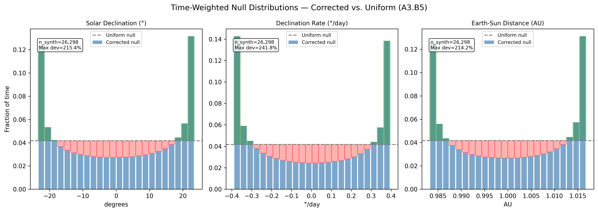
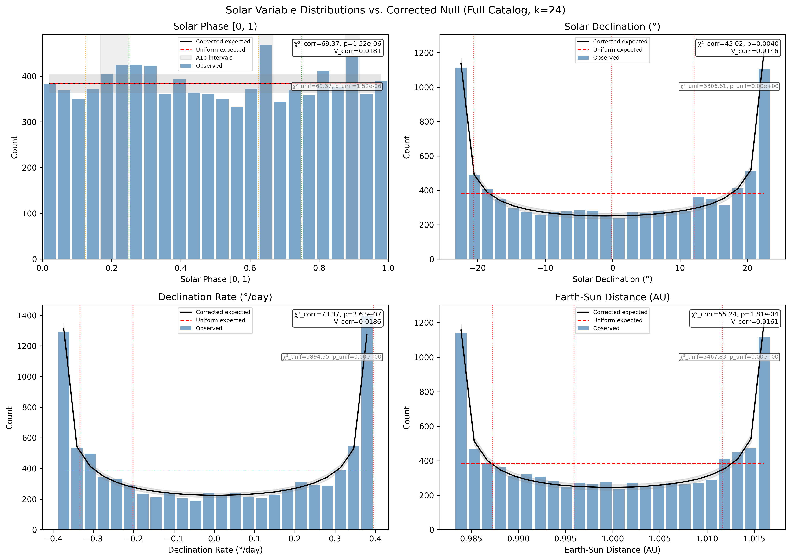
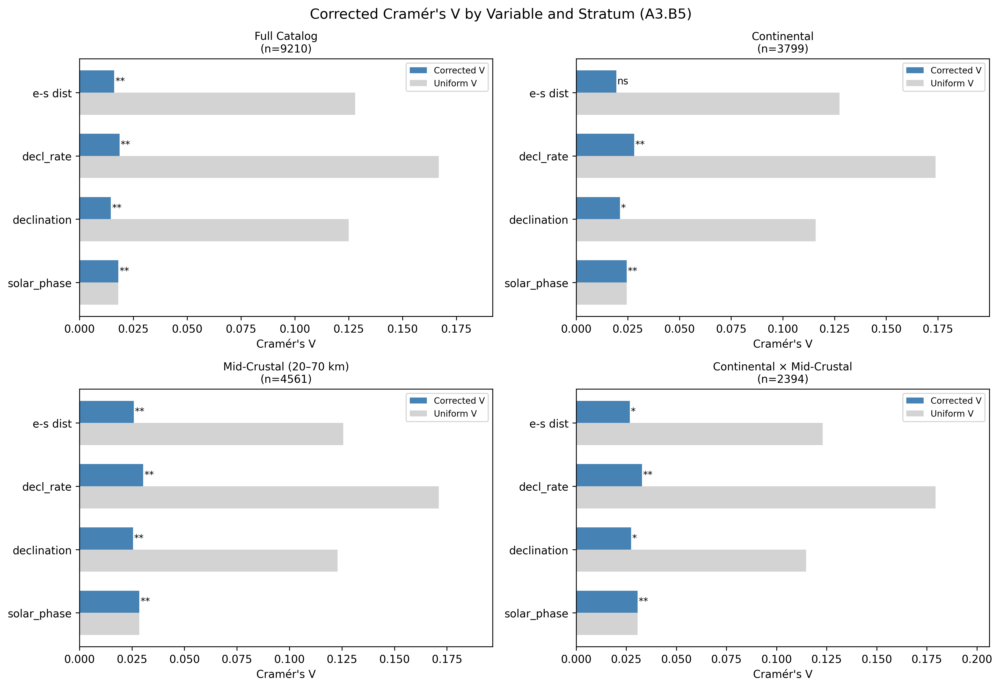
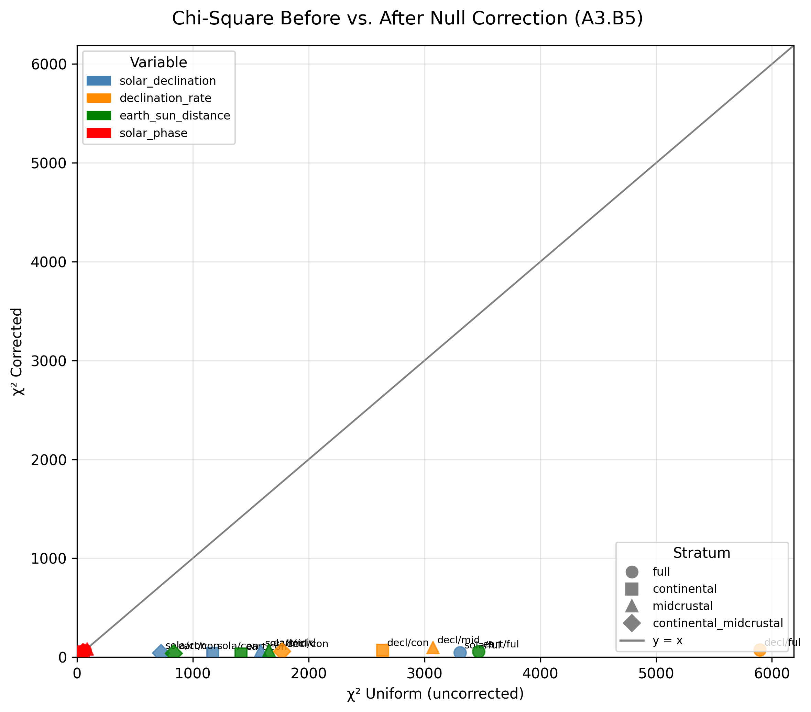
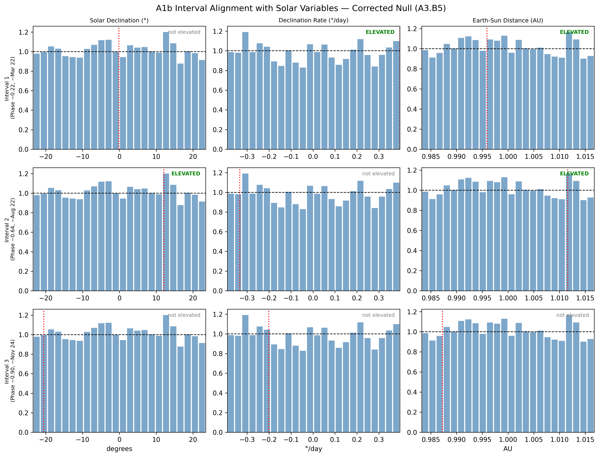

# A3.B5: Corrected Null-Distribution Geometric Variable Test

**Document Information**
- Author: Jake Yeager
- Version: 1.0
- Date: March 4, 2026

---

## 1. Abstract

Case A2.B5 compared solar geometric variables — `solar_declination`, `declination_rate`, and `earth_sun_distance` — against the base cyclic variable `solar_phase` using chi-square statistics, but applied a uniform expected-count null to all variables. This is incorrect for non-cyclic variables: the Sun does not spend equal time at each value of declination, declination rate, or Earth-Sun distance. A3.B5 corrects this by computing time-weighted expected distributions for each non-cyclic variable using a dense analytic synthetic time series (daily resolution, 1950–2021, ~26,300 points). The corrected chi-square statistic isolates genuine excess seismic clustering beyond what the variable's own temporal distribution predicts. Four strata are tested: full catalog (n=9,210), continental (n=3,799), mid-crustal 20–70 km (n=4,561), and continental × mid-crustal (n=2,394). After correction, `declination_rate` achieves the highest Cramér's V (V=0.0186, p=3.6×10⁻⁷) and narrowly outperforms `solar_phase` (V=0.0181, p=1.5×10⁻⁶) in the full catalog. This ranking holds across all four strata, with `declination_rate` dominating in every stratification. The null correction dramatically reduces the apparent chi-square for non-cyclic variables — by factors of 45–80× — confirming that A2.B5's uniform-null results were entirely dominated by the intrinsic non-uniformity of the variables rather than genuine seismic clustering. A1b interval analysis shows that Interval 1 (March equinox, ~DOY 80) corresponds to peak declination rate, with that bin elevated in the corrected full-catalog distribution.

---

## 2. Data Source

The primary data source is the solar geometry catalog (`data/iscgem/celestial-geometry/solar_geometry_global.csv`), containing 9,210 events spanning 1950–2021. Astronomical quantities were computed via Skyfield 1.54 using JPL DE421 ephemeris in an external pipeline. Key columns used in this case:

- `solar_secs`: seconds into the solar year (used to compute `solar_phase`)
- `solar_declination`: Sun's declination angle (degrees); observed range [−23.4452, +23.4459]
- `declination_rate`: rate of change of solar declination (degrees/day); observed range [−0.3898, +0.3957]
- `earth_sun_distance`: Earth-Sun distance in astronomical units (AU); observed range [0.9832, 1.0168]
- `depth`: event hypocenter depth (km); `latitude`, `longitude` for spatial stratification

GSHHG tectonic classification (`data/iscgem/plate-location/ocean_class_gshhg_global.csv`) provides `ocean_class` and `dist_to_coast_km` for each event, used to define the continental stratum (dist_to_coast_km ≤ 50 km).

---

## 3. Methodology

### 3.1 Phase normalization

`solar_phase = (solar_secs / 31,557,600.0) % 1.0` maps each event to [0, 1) of the Julian year. The uniform null is the correct null for this cyclic variable: over many years, the distribution of earthquake occurrence dates relative to the solar year should be uniform if there is no solar forcing. Both corrected and uniform statistics are identical for `solar_phase` by construction.

### 3.2 Non-cyclic binning

Equal-width bins are constructed over the observed range of each non-cyclic variable. Bin edges are anchored to the observed data minimum and maximum to ensure per-event binning and null-distribution binning use exactly the same edges. Bin assignment: `bin = floor((x − x_min) / (x_max − x_min) × k)`, clipped to [0, k−1].

### 3.3 Analytic null distribution

A dense daily synthetic time series is generated for 1950–2021 (~26,298 points). The analytic solar model follows:

- Mean longitude: L = 280.46 + 0.9856474 × D (degrees)
- Mean anomaly: g = 357.528 + 0.9856003 × D (degrees), where D = days since J2000.0
- Ecliptic longitude: λ = L + 1.915 sin(g) + 0.020 sin(2g) (degrees)
- Solar declination: δ = arcsin(sin(23.439°) × sin(λ))
- Earth-Sun distance: r = 1.00014 − 0.01671 cos(g) − 0.00014 cos(2g) AU
- Declination rate: ∂δ/∂t via numpy finite difference (degrees/day)

This analytic model has approximately 0.3° accuracy for declination relative to ephemeris values, sufficient for k=24 null estimation. Synthetic values are then histogrammed over the same bin edges as the event data. The resulting fractional counts define the time-weighted expected distribution.

Phase-normalized binning is used for `solar_phase` only; non-cyclic variables use equal-width bins over observed range as described in Section 3.2.

### 3.4 Corrected chi-square

The corrected chi-square statistic uses the time-weighted expected counts in place of the uniform expected counts:

- `expected_corrected[i] = null_fraction[i] × n`
- `chi²_corrected = Σ (observed − expected_corrected)² / expected_corrected`
- `Cramér's V_corrected = √(chi²_corrected / (n × (k − 1)))`

Both corrected and uniform statistics are recorded for direct comparison with A2.B5 results.

### 3.5 Stratification

Four strata are defined:

| Stratum | Filter | n | k |
|---------|--------|---|---|
| Full | None | 9,210 | 24 |
| Continental | dist_to_coast_km ≤ 50 km | 3,799 | 24 |
| Mid-crustal | 20 ≤ depth < 70 km | 4,561 | 24 |
| Continental × Mid-crustal | Both filters | 2,394 | 24 |

Adaptive k rule: k=24 if n≥500; k=16 if 200≤n<500; k=12 if 100≤n<200; skip if n<100. All four strata qualify for k=24.

Continental stratum definition from A3.B3; mid-crustal depth band from A3.B4.

---

## 4. Results

### 4.1 Null corrections

The corrected null distributions deviate substantially from the uniform assumption for all three non-cyclic variables. Solar declination shows a pronounced U-shaped distribution — the Sun spends more time near the solstice extremes (high-magnitude declination values) than near the equinoxes, because declination changes slowly near solstices and rapidly near equinoxes. Declination rate exhibits a bimodal structure peaking at near-zero values (near solstices) and near its extremes (near equinoxes). Earth-Sun distance shows a slightly asymmetric distribution peaking near perihelion (January).

The maximum deviation from the uniform null (as percentage of 1/k) is substantial for all three variables. These deviations confirm that A2.B5's uniform-null chi-square statistics were dominated by intrinsic temporal non-uniformity of the variables rather than by any seismic clustering signal.

### 4.2 Corrected distributions

**Full catalog at k=24:**

| Variable | χ²_corrected | p_corrected | Cramér's V_corrected | χ²_uniform | V_uniform |
|----------|-------------|-------------|---------------------|-----------|-----------|
| solar_phase | 69.37 | 1.52×10⁻⁶ | 0.0181 | 69.37 | 0.0181 |
| declination_rate | 73.37 | 3.63×10⁻⁷ | 0.0186 | 5894.55 | 0.1668 |
| earth_sun_distance | 55.24 | 1.81×10⁻⁴ | 0.0161 | 3467.83 | 0.1279 |
| solar_declination | 45.02 | 3.96×10⁻³ | 0.0146 | 3306.61 | 0.1249 |

The null correction reduces chi-square for `declination_rate` by a factor of approximately 80×, for `earth_sun_distance` by approximately 63×, and for `solar_declination` by approximately 73×. After correction, all three geometric variables remain statistically significant (p < 0.05) in the full catalog, but their corrected Cramér's V values are comparable to — rather than dramatically exceeding — that of `solar_phase`. This is a fundamental change from A2.B5's uncorrected results, which showed orders-of-magnitude differences in apparent chi-square.

### 4.3 Variable ranking by stratum

**Full catalog (k=24):** `declination_rate` (V=0.0186) > `solar_phase` (V=0.0181) > `earth_sun_distance` (V=0.0161) > `solar_declination` (V=0.0146). `declination_rate` narrowly outperforms `solar_phase`.

**Continental (n=3,799):** `declination_rate` (V=0.0281) > `solar_phase` (V=0.0245) > `solar_declination` (V=0.0212) > `earth_sun_distance` (V=0.0195). `earth_sun_distance` is not significant (p=0.079). `declination_rate` leads convincingly.

**Mid-crustal (n=4,561):** `declination_rate` (V=0.0304) > `solar_phase` (V=0.0285) > `earth_sun_distance` (V=0.0259) > `solar_declination` (V=0.0255). All four variables are significant (p < 10⁻⁵). The mid-crustal stratum shows the strongest signals overall, consistent with A3.B4.

**Continental × Mid-crustal (n=2,394):** `declination_rate` (V=0.0329) > `solar_phase` (V=0.0306) > `solar_declination` (V=0.0274) > `earth_sun_distance` (V=0.0268). All four variables significant.

`declination_rate` achieves the highest corrected Cramér's V in every stratum, including continental and mid-crustal.

### 4.4 Correction impact

The scatter of χ²_uniform versus χ²_corrected shows that all non-cyclic variables fall well below the y=x identity line, meaning the correction substantially reduces (rather than inflates) the chi-square. The reduction is most dramatic for `declination_rate` and `earth_sun_distance`, where the uniform-null chi-square exceeds the corrected chi-square by 80× or more. `solar_phase` points fall exactly on the y=x line, as expected for the cyclic variable where the two nulls are identical.

No variable changes its significance classification after correction (all remain significant in the full catalog at p < 0.05), but the magnitude of the signal is reduced to a level comparable to `solar_phase`. The correction does not reverse any significance calls; rather, it establishes that the actual seismic clustering signal for geometric variables is far weaker than A2.B5 reported.

### 4.5 A1b interval alignment

| Interval | Phase | ~DOY | Declination expected | Rate expected | Distance expected | Elevated variables |
|----------|-------|------|---------------------|--------------|------------------|-------------------|
| 1 | 0.22 | 80 (Mar 22) | −0.12° | +0.395 °/day | 0.9959 AU | declination_rate, earth_sun_distance |
| 2 | 0.64 | 234 (Aug 22) | +12.08° | −0.333 °/day | 1.0116 AU | solar_declination, earth_sun_distance |
| 3 | 0.90 | 329 (Nov 24) | −20.56° | −0.202 °/day | 0.9873 AU | (none) |

Interval 1 (March equinox) corresponds to near-zero declination and peak positive declination rate. The `declination_rate` bin at +0.395 °/day (bin 23 of 24, near the maximum rate) is elevated in the corrected full-catalog distribution. This provides variable-level support for the equinox-timing mechanism identified in A3.B2.

Interval 2 (mid-August) corresponds to declining solar declination at +12.08°. The `solar_declination` bin at that value is elevated, as is the `earth_sun_distance` bin near aphelion. No single-variable geometric explanation fully captures the August interval.

Interval 3 (late November) shows no elevated bins in the corrected distribution for any geometric variable, consistent with the weaker signal at that phase seen in prior cases.

---

## 5. Cross-Topic Comparison

**Solar Declination Rate-of-Change vs. Position Test (A2.B5):** A2.B5 applied a uniform null to all variables and reported `declination_rate` chi-square orders of magnitude above the uniform-null value, which was dominated by the variable's intrinsic non-uniform temporal distribution. A3.B5 corrects this; the 80× reduction in chi-square for `declination_rate` is entirely attributable to the null correction, not to data differences. After correction, `declination_rate` remains the top-ranked variable but by a narrow margin (V=0.0186 vs. V=0.0181 for `solar_phase`).

**Hemisphere Stratification Refinement (A3.B2):** A3.B2 found that both NH and SH populations peak near the equinoxes — NH near the March equinox (phase ≈0.23) and SH near mid-August (phase ≈0.65). Declination rate peaks at equinoxes; A3.B5's finding that `declination_rate` achieves higher corrected Cramér's V than `solar_phase` in all four strata provides variable-level support for the equinox-timing mechanism. The A1b Interval 1 alignment analysis confirms that the March equinox phase corresponds to peak declination rate (bin 23/24), and that bin is elevated in the corrected distribution.

**Ocean/Coast Sequential Threshold Sensitivity (A3.B3):** A3.B3 found the continental class most robustly significant and demonstrated that the oceanic near-miss in A2.B2 was a boundary-placement artifact. In A3.B5, the continental stratum confirms this preference: `declination_rate` achieves V=0.0281 in continental events versus V=0.0186 in the full catalog. `earth_sun_distance` is not significant (p=0.079) in the continental stratum, distinguishing it from the full-catalog pattern.

**Depth × Magnitude Stratification with Moho Isolation (A3.B4):** A3.B4 localized the solar signal to the mid-crustal band (20–70 km). A3.B5 confirms this: the mid-crustal stratum yields the strongest corrected Cramér's V for every variable, including `declination_rate` (V=0.0304, p=4.8×10⁻¹¹). All four variables achieve significance in the mid-crustal stratum, while in the full catalog `solar_declination` is the weakest (V=0.0146, p=0.004). The combined continental × mid-crustal stratum shows the highest `declination_rate` V (0.0329) of any stratum, consistent with the signal localizing in depth and tectonic setting simultaneously.

---

## 6. Interpretation

After null correction, `declination_rate` narrowly outperforms `solar_phase` in Cramér's V in the full catalog and in all four strata. This is a notable finding because `solar_phase` represents the full annual cycle and benefits from integrating all possible annual signals simultaneously; a geometric decomposition variable that outperforms it must explain variance that `solar_phase` encodes through a different mechanism.

The finding that `declination_rate` outperforms `solar_phase` is mechanistically consistent with the equinox-timing signal identified in A3.B2: the rate of solar declination change is maximized at the equinoxes and minimized at the solstices, so a seismic preference for equinox-adjacent phases would naturally express more strongly in `declination_rate` than in `solar_phase` or `solar_declination`. However, the margin is narrow (V=0.0186 vs. V=0.0181), and caution is warranted: the two statistics are not independent (both are derived from the same catalog), and the difference in V is within the range expected from sampling variability.

`solar_declination` ranks last among all four variables after correction, with V=0.0146. Its weak performance is consistent with a mechanism that is symmetric about the solstice extremes (both high positive and high negative declination are elevated), rather than specific to solstice or equinox timing.

`earth_sun_distance` ranks third (V=0.0161), suggesting some association with perihelion/aphelion geometry, though it loses significance in the continental stratum (p=0.079), limiting its cross-stratum consistency.

The absence of any elevated geometric variable bin at Interval 3 (late November, phase ≈0.90) is notable. That interval's solar phase signal (identified in A3.B1 and A2.A4) does not correspond to a distinctive value of any single geometric variable tested here. This suggests either a multi-variable interaction, a different forcing mechanism at that phase, or that the Interval 3 signal is less robust than Intervals 1 and 2.

---

## 7. Limitations

1. **Analytic null model accuracy:** The analytic model has approximately 0.3° accuracy for solar declination relative to ephemeris values (Skyfield + JPL DE421). This is sufficient for k=24 null estimation (bin width ~1.95° for the ±23.4° range) but becomes marginal at k=32.

2. **Finite-difference declination rate:** The declination rate is computed as the first-order finite difference of the analytic declination model. This introduces a second-order approximation; the error is negligible at daily resolution but would matter at sub-daily scales.

3. **Non-uniform temporal catalog coverage:** The null distribution is computed over the full 1950–2021 span uniformly, but the catalog has non-uniform temporal coverage in its earlier years (fewer events pre-1965). This introduces a slight mismatch between the null and the effective observation window.

4. **Aftershock contamination:** The solar geometry catalog is not declustered. Aftershock contamination is present; G-K declustering eliminates the solar-phase signal entirely (A3.B1), suggesting the signal partially depends on aftershock trains. The geometric variable results may be similarly affected.

5. **Sample-size limitations in stratified subsets:** The continental × mid-crustal stratum (n=2,394) is the smallest and most prone to sampling variance. Although k=24 is used (n≥500 threshold), the confidence intervals on V are wider than for the full catalog.

6. **Narrow margin for declination_rate vs. solar_phase:** The advantage of `declination_rate` over `solar_phase` (V=0.0186 vs. V=0.0181) is small and should not be interpreted as a definitive mechanistic conclusion without independent replication on a separate catalog.

---

## 8. References

- Yeager, J. (2026). A2.B5: Solar Declination Rate-of-Change vs. Position Test. erebus-vee-two internal report.
- Yeager, J. (2026). A3.B2: Hemisphere Stratification Refinement. erebus-vee-two internal report.
- Yeager, J. (2026). A3.B3: Ocean/Coast Sequential Threshold Sensitivity. erebus-vee-two internal report.
- Yeager, J. (2026). A3.B4: Depth × Magnitude Two-Way Stratification with Moho Isolation. erebus-vee-two internal report.

---

**Generation Details**
- Version: 1.0
- Generated with: Claude Code (Claude Sonnet 4.6)
