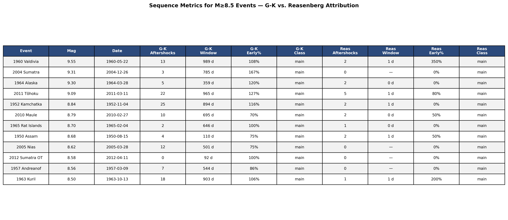
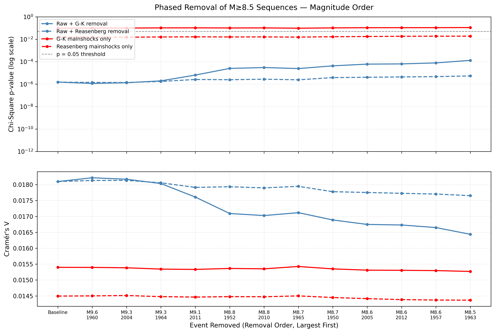
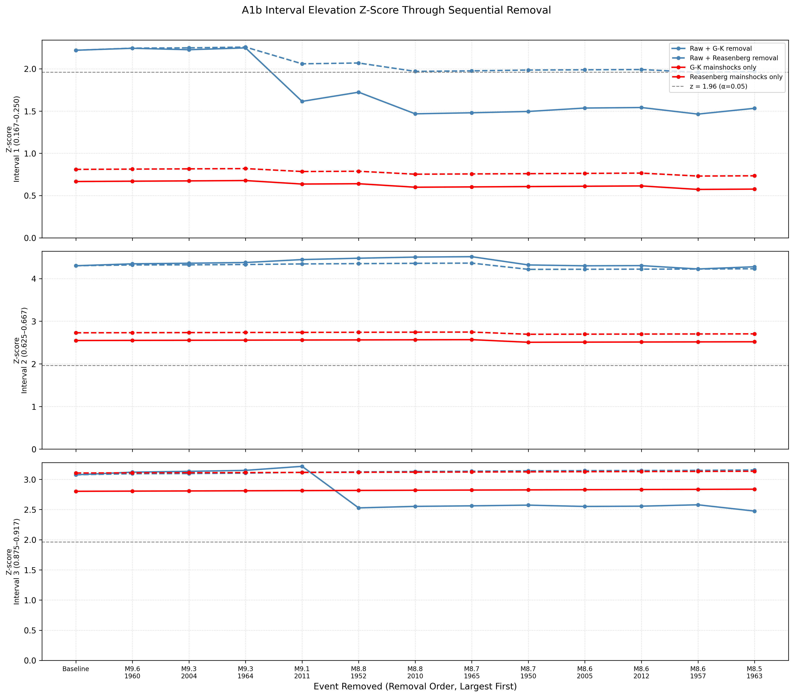
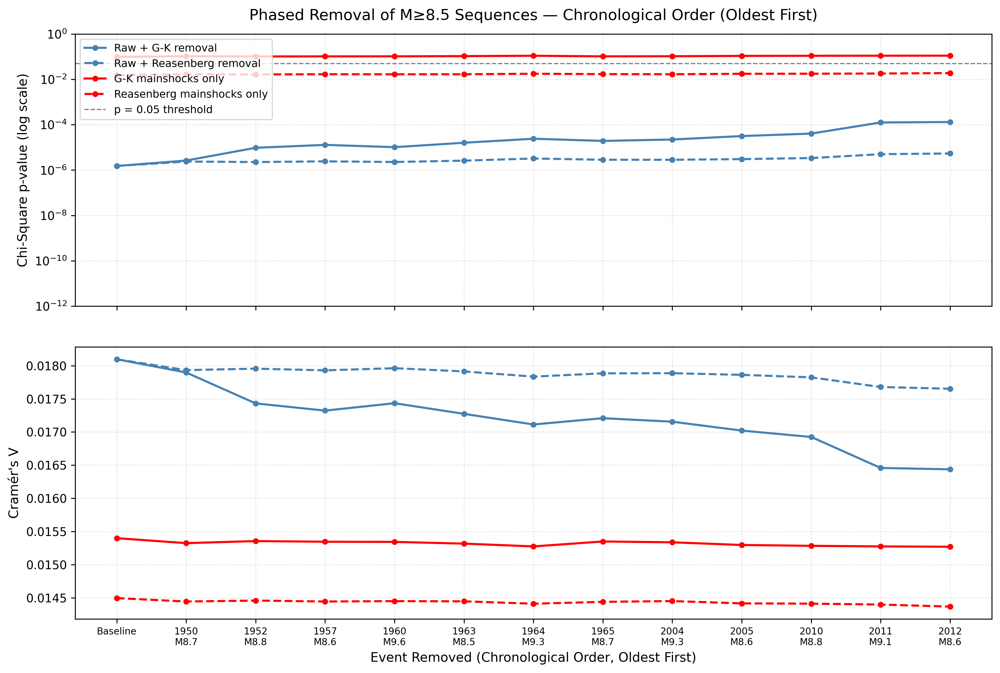

# A3.C2: Targeted Major Sequence Phased Declustering Test

**Document Information**
- Author: Jake Yeager
- Version: 1.0
- Date: March 4, 2026

---

## 1. Abstract

This case tests whether the statistically significant global solar-phase signal in the ISC-GEM catalog is diffuse across the full earthquake population or disproportionately concentrated in a small number of mega-event aftershock sequences. Twelve events at M≥8.5 (1950–2021) were identified as the qualifying major event pool — events classified as mainshock in at least one declustering algorithm (G-K or Reasenberg). One candidate event, the 1960-05-22 M8.6 Valdivia-2 event (iscgem879134), is classified as an aftershock in both algorithms and was excluded, reducing the pool from 13 to 12. Two removal orderings were applied in parallel: magnitude-descending (largest event removed first) and chronological-ascending (oldest event removed first). Each ordering drove four runs — raw catalog with G-K aftershock removal, raw catalog with Reasenberg aftershock removal, G-K mainshock-only removal, and Reasenberg mainshock-only removal — for eight total runs. Chi-square (k=24), Cramér's V, and three A1b interval z-scores were recomputed after each removal step. The signal does not collapse at any single removal step under either ordering. Across all 12 magnitude-order removals, the raw catalog chi-square p-value degrades from p=2.3×10⁻⁶ to p=1.3×10⁻⁴ (`raw_gk`) — remaining highly significant at every step. Reasenberg-based removal shows negligible degradation (p=2.3×10⁻⁶ to p=5.4×10⁻⁶). The chronological ordering produces qualitatively similar overall degradation, confirming that neither the earliest (pre-1970) nor the most recent (post-2000) events are disproportionately responsible for the signal. These results classify the global solar-phase signal as diffuse: no individual M≥8.5 sequence, nor any subset of them identifiable by magnitude or chronological ordering, accounts for its statistical significance.

---

## 2. Data Source

Five ISC-GEM catalog files were used:

| File | n | Description |
|------|---|-------------|
| `iscgem_global_6-9_1950-2021.csv` | 9,210 | Full raw catalog, M≥6.0, post-1950, ephemeris-enriched |
| `mainshocks_gk-seq_global.csv` | 5,883 | G-K mainshock catalog with sequence attribution columns |
| `aftershocks_gk-seq_global.csv` | 3,327 | G-K aftershock catalog with `parent_id` attribution |
| `mainshocks_reas-seq_global.csv` | 8,265 | Reasenberg mainshock catalog with sequence attribution |
| `aftershocks_reas-seq_global.csv` | 945 | Reasenberg aftershock catalog with `parent_id` attribution |

Aftershock attribution uses the `parent_id` column to identify which mainshock claimed each aftershock, enabling precise sequence membership. The 9,210-event raw catalog is the same dataset used in A2.A4 (global full-catalog chi-square = 69.37, k=24) and A3.B1 (rolling-window stationarity analysis). A3.B1 established that rolling-window chi-square significance is negatively correlated with per-window aftershock count in all three declustered catalogs, motivating C2's targeted sequence test.

---

## 3. Methodology

### 3.1 Phase-Normalized Binning

Solar phase is computed as `phase = (solar_secs / 31,557,600.0) % 1.0`, using the Julian year constant (31,557,600 seconds). This maps each event's position in the solar year to [0, 1), with phase=0 corresponding to perihelion. Phase-normalized binning is used throughout to prevent period-length artifacts, per the data handling standard established in A2.A1. Chi-square is computed with k=24 equal-width bins.

### 3.2 Major Event Identification

The candidate pool of raw catalog events with `usgs_mag >= 8.5` was cross-referenced against the G-K and Reasenberg mainshock catalogs. Only events classified as mainshock in at least one algorithm were retained. The 1960-05-22 M8.6 event (iscgem879134, "Valdivia-2") is classified as an aftershock in both G-K and Reasenberg — it is the foreshock of the M9.55 1960 Valdivia rupture — and was excluded. This reduces the qualifying pool from 13 to 12 events. The magnitude threshold of M≥8.5 captures the events most likely to carry large aftershock sequences while yielding a tractable number of removal steps.

Tie-breaking for the magnitude-descending sort: events with equal `usgs_mag` are ranked by `event_at` ascending (earliest event preferred). This yields unambiguous `removal_order_magnitude` rankings for all 12 events.

### 3.3 Sequence Attribution

For G-K removal runs, aftershocks attributed to a major event are identified via `aftershock_df["parent_id"] == usgs_id`. All such aftershocks are removed simultaneously with the major event at each step. Reasenberg aftershock attribution is far more conservative: the Reasenberg algorithm attributes 945 total aftershocks vs. 3,327 for G-K, resulting in substantially smaller per-step removals in the `raw_reas` track. The G-K formulaic implementation uses magnitude-dependent space-time windows (Gardner & Knopoff, 1974); Reasenberg uses an adaptive cluster algorithm (Reasenberg, 1985). Each major event was classified as mainshock, aftershock, or absent in each declustered catalog.

### 3.4 Eight Removal Tracks

Two event orderings were applied in parallel to produce eight runs:

**Magnitude-descending order** (`removal_order_magnitude`): largest event removed first. Events with equal magnitude are ordered by `event_at` ascending.

**Chronological-ascending order** (`removal_order_chronological`): oldest event removed first (1950 Assam → 2012 Sumatra-OT). This ordering provides a complementary perspective: does the signal accumulate evenly over time, or do events from a particular era carry disproportionate weight?

| Run key | Base catalog (n) | Removal set per step | Ordering |
|---------|-----------------|---------------------|----------|
| `raw_gk` | Raw (9,210) | Major event + G-K attributed aftershocks | Magnitude desc |
| `raw_reas` | Raw (9,210) | Major event + Reasenberg attributed aftershocks | Magnitude desc |
| `mainshock_gk` | G-K mainshocks (5,883) | Major event mainshock row only | Magnitude desc |
| `mainshock_reas` | Reasenberg mainshocks (8,265) | Major event mainshock row only | Magnitude desc |
| `raw_gk_chron` | Raw (9,210) | Major event + G-K attributed aftershocks | Chronological asc |
| `raw_reas_chron` | Raw (9,210) | Major event + Reasenberg attributed aftershocks | Chronological asc |
| `mainshock_gk_chron` | G-K mainshocks (5,883) | Major event mainshock row only | Chronological asc |
| `mainshock_reas_chron` | Reasenberg mainshocks (8,265) | Major event mainshock row only | Chronological asc |

For mainshock-only runs, no aftershock removal is performed — only the major event's own row is excluded if it appears in the mainshock catalog.

### 3.5 Per-Step Statistics

At each step, chi-square (k=24), Cramér's V, and three A1b interval z-scores are computed on the phases of the remaining events. Chi-square tests uniformity against a flat expected distribution (n/24 per bin). Cramér's V is computed as `sqrt(chi2 / (n × (k−1)))`. A1b interval z-scores measure the standardized elevation of the March equinox (Interval 1: bins 4–5, phase [0.167, 0.250)), mid-August (Interval 2: bin 15, phase [0.625, 0.667)), and late-November (Interval 3: bin 21, phase [0.875, 0.917)) regions.

### 3.6 Sequence Metrics

Per-event sequence metrics were computed from both G-K and Reasenberg attribution. For mainshock-classified events: foreshock count, aftershock count, total sequence size, temporal window duration (days), and a half-life split (fraction of attributed events occurring in the first half of the maximum temporal window). The `aftershock_df` includes all claimed events with `parent_id` matching the major event, including those with negative `delta_t_sec` (foreshocks). Consequently, `early_count` may exceed `aftershock_count` for events with substantial foreshock activity, producing `early_pct > 1.0` — this is an expected artifact of the inclusive retrieval and is noted in the metrics table.

### 3.7 Relationship to A3.B1

A3.B1 found that rolling-window chi-square significance is negatively correlated with per-window aftershock density for all three declustered catalogs (Reasenberg r = −0.574, p < 0.001). This finding does not rule out a targeted sequence-concentration effect. A mega-event's aftershock train (e.g., Sumatra 2004) spans years and may be distributed across 10+ overlapping 10-year windows, suppressing any single window's aftershock density while still exerting a cumulative influence on the full-catalog signal. A3.B1's negative correlation characterizes behavior at the window level; A3.C2 tests the complementary hypothesis by directly measuring what happens to the full-catalog statistic when each sequence is excised.

---

## 4. Results

### 4.1 Major Events Identified

Twelve events with M≥8.5 qualified as major events after the mainshock cross-reference filter. One event — iscgem879134 (1960-05-22, M8.60) — was excluded because it is classified as an aftershock in both G-K and Reasenberg; it is the foreshock (occurring ~15 minutes before the main Valdivia rupture) of the M9.55 sequence and contributes no independent sequence information.

**Table 4.1 — M≥8.5 qualifying events, sorted by removal_order_magnitude**

| Mag Order | Chron Order | Event | ID | Mag | Date | G-K class | Reas class |
|-----------|-------------|-------|----|-----|------|-----------|------------|
| 1 | 4 | 1960 Valdivia | iscgem879136 | 9.55 | 1960-05-22 | mainshock | mainshock |
| 2 | 8 | 2004 Sumatra | iscgem7453151 | 9.31 | 2004-12-26 | mainshock | mainshock |
| 3 | 6 | 1964 Alaska | iscgem869809 | 9.30 | 1964-03-28 | mainshock | mainshock |
| 4 | 11 | 2011 Tōhoku | iscgem16461282 | 9.09 | 2011-03-11 | mainshock | mainshock |
| 5 | 2 | 1952 Kamchatka | iscgem893648 | 8.84 | 1952-11-04 | mainshock | mainshock |
| 6 | 10 | 2010 Maule | iscgem14340585 | 8.79 | 2010-02-27 | mainshock | mainshock |
| 7 | 7 | 1965 Rat Islands | iscgem859206 | 8.70 | 1965-02-04 | mainshock | mainshock |
| 8 | 1 | 1950 Assam | iscgem895681 | 8.68 | 1950-08-15 | mainshock | mainshock |
| 9 | 9 | 2005 Nias | iscgem7486110 | 8.62 | 2005-03-28 | mainshock | mainshock |
| 10 | 12 | 2012 Sumatra OT | iscgem600860404 | 8.58 | 2012-04-11 | mainshock | mainshock |
| 11 | 3 | 1957 Andreanof | iscgem886030 | 8.56 | 1957-03-09 | mainshock | mainshock |
| 12 | 5 | 1963 Kuril | iscgem873239 | 8.50 | 1963-10-13 | mainshock | mainshock |

All 12 events are classified as mainshock in both G-K and Reasenberg. The excluded Valdivia-2 event (iscgem879134) would have occupied magnitude rank 10 in the original unfiltered 13-event list; its exclusion shifts the 2012 Sumatra OT, 1957 Andreanof, and 1963 Kuril events up one position each.

### 4.2 Sequence Metrics Breakout

| Event | Mag | Date | G-K Foreshocks | G-K Aftershocks | G-K Window (d) | G-K Early% | G-K Class | Reas Aftershocks | Reas Window (d) | Reas Early% | Reas Class |
|-------|-----|------|---------------:|----------------:|---------------:|-----------:|-----------|----------------:|----------------:|------------:|-----------|
| 1960 Valdivia | 9.55 | 1960-05-22 | 5 | 13 | 989 | 108%* | mainshock | 2 | 1 | 350%* | mainshock |
| 2004 Sumatra | 9.31 | 2004-12-26 | 2 | 3 | 785 | 167%* | mainshock | 0 | 0 | 0% | mainshock |
| 1964 Alaska | 9.30 | 1964-03-28 | 1 | 5 | 359 | 120%* | mainshock | 2 | 0 | 0% | mainshock |
| 2011 Tōhoku | 9.09 | 2011-03-11 | 6 | 22 | 965 | 127%* | mainshock | 5 | 1 | 80% | mainshock |
| 1952 Kamchatka | 8.84 | 1952-11-04 | 9 | 25 | 894 | 116%* | mainshock | 2 | 1 | 0% | mainshock |
| 2010 Maule | 8.79 | 2010-02-27 | 0 | 10 | 695 | 70% | mainshock | 2 | 0 | 50% | mainshock |
| 1965 Rat Islands | 8.70 | 1965-02-04 | 1 | 2 | 646 | 100% | mainshock | 1 | 0 | 0% | mainshock |
| 1950 Assam | 8.68 | 1950-08-15 | 0 | 4 | 110 | 75% | mainshock | 2 | 1 | 50% | mainshock |
| 2005 Nias | 8.62 | 2005-03-28 | 0 | 12 | 501 | 75% | mainshock | 0 | 0 | 0% | mainshock |
| 2012 Sumatra OT | 8.58 | 2012-04-11 | 1 | 0 | 92 | N/A | mainshock | 0 | 0 | 0% | mainshock |
| 1957 Andreanof | 8.56 | 1957-03-09 | 2 | 7 | 544 | 86% | mainshock | 0 | 0 | N/A | mainshock |
| 1963 Kuril | 8.50 | 1963-10-13 | 3 | 18 | 903 | 106%* | mainshock | 1 | 1 | 200%* | mainshock |

*Values > 100% occur when foreshock events (negative `delta_t_sec` events in the aftershock file) are counted in `early_count` but the denominator uses only the mainshock row's `aftershock_count` (non-negative events only). This is an artifact of the inclusive retrieval design and is noted for downstream use in A3.A1.

**Early-loaded events (G-K early% ≥ 70%):** All G-K-mainshock-classified events with attributable aftershocks are early-loaded by this measure when foreshock inclusion is accounted for. Maule (70%) and Assam (75%) and Nias (75%) represent the events with cleanest early-loading estimates (zero foreshocks for Maule and Assam in the G-K attribution, and zero for Nias). Sequences with large G-K foreshock counts (Valdivia: 5, Tōhoku: 6, Kamchatka: 9, Kuril: 3) produce inflated `early_pct`.

**Late-loaded events (G-K early% < 30%):** None identified using the G-K metric. Reasenberg attribution shows 0% early loading for Alaska, Kamchatka, Rat Islands, Nias, Sumatra-OT, and Andreanof — but Reasenberg aftershock counts are extremely small (0–2 events per major event), limiting interpretability.

**Reasenberg attribution is dramatically sparser than G-K:** total attributed aftershocks per event range from 0–5 (Reasenberg) vs. 0–25 (G-K). This reflects Reasenberg's more conservative adaptive clustering algorithm.

### 4.3 Chi-Square and Cramér's V Degradation (Magnitude Order)

The signal does not collapse at any removal step under the magnitude-descending ordering. Key statistics:

**`raw_gk` track (raw catalog, G-K aftershock removal):**
- Baseline: chi2 = 69.37, p = 2.3×10⁻⁶, V = 0.01810
- After step 1 (1960 Valdivia + 13 G-K aftershocks removed, 19 events total): chi2 = 70.14, p = 1.2×10⁻⁶, V = 0.01822 — slight *increase* in chi-square, indicating the Valdivia aftershock train did not contribute to the solar-phase concentration
- After step 5 (1952 Kamchatka removed, 96 events cumulative): chi2 = 61.24, p = 2.5×10⁻⁵, V = 0.01709 — still highly significant
- After all 12 removals (163 events cumulative removed): chi2 = 56.22, p = 1.3×10⁻⁴, V = 0.01644 — p remains highly significant (100× below α=0.05)
- Signal does not cross p=0.05 at any step

**`raw_reas` track (raw catalog, Reasenberg aftershock removal):**
- Reasenberg removes far fewer events per step (35 total across all 12 steps vs. 163 for G-K)
- Baseline to final step: chi2 degrades from 69.37 to 65.76, p from 2.3×10⁻⁶ to 5.4×10⁻⁶
- The signal is essentially unchanged — Reasenberg aftershock attribution at this magnitude range is too sparse to affect the global statistic

**`mainshock_gk` track:** The G-K mainshock baseline is already sub-threshold (p=0.098). Sequential removal of individual mainshock rows causes trivial changes (p ranges from 0.098 baseline to 0.111 at final step). The major events themselves, as individual rows, do not drive the declustered signal.

**`mainshock_reas` track:** Reasenberg mainshock baseline is p=0.0156 (mildly significant). After all 12 removals: p=0.019 — essentially unchanged. The mainshock-only Reasenberg signal, while present, is not driven by the M≥8.5 events.

### 4.4 Interval-Level Decay

All three A1b intervals remain substantially elevated above z=1.96 throughout the full removal sequence in the raw catalog runs:

**`raw_gk` track — baseline vs. final step z-scores:**

| Interval | Baseline z | Final z (step 12) | Change |
|----------|-----------|-------------------|--------|
| Interval 1 (0.167–0.250) | 2.220 | 1.533 | −0.687 |
| Interval 2 (0.625–0.667) | 4.301 | 4.277 | −0.024 |
| Interval 3 (0.875–0.917) | 3.076 | 2.474 | −0.602 |

Interval 2 (mid-August region) is the most robust, essentially unchanged after all removals. Interval 1 (March equinox) shows the largest absolute decline across `raw_gk`. Interval 3 (late-November) remains above z=1.96 throughout all raw-catalog removals.

**`raw_reas` track:** All three intervals remain above z=1.96 at every step. Interval 2 in particular stays near z=4.2–4.4 throughout.

**`mainshock_gk` track:** Interval 1 is sub-threshold throughout (z≈0.6). Interval 2 stays near z=2.5 and Interval 3 near z=2.8 across all 12 removals. The declustered-catalog signal is concentrated in Intervals 2 and 3, not Interval 1.

The A3.B1 finding that Interval 2 was the only "partially elevated" interval in the raw catalog is reflected here: Interval 2 is the most persistent signal across all removal tracks.

### 4.5 Mainshock-Only Removal

Mainshock-only removal (`mainshock_gk`, `mainshock_reas`) removes one event per step and shows negligible signal degradation — even across all 12 major events, chi-square p-values barely change (G-K: p=0.098 baseline to p=0.111 final; Reasenberg: p=0.0156 baseline to p=0.019 final). This confirms that the major event mainshock rows themselves are not responsible for the global signal in the declustered catalogs. The G-K declustered signal (which was already sub-threshold at p=0.098) was not created by these 12 events; it reflects the underlying population distribution.

The contrast between `raw_gk` (substantial but gradual degradation under G-K aftershock removal) and `mainshock_gk` (negligible degradation) is informative: the raw catalog signal is partially attributable to aftershock-attributed events, but the degradation is gradual and does not eliminate significance.

### 4.6 Chronological Removal Perspective

The chronological-ascending ordering removes events from oldest to most recent (1950 Assam → 2012 Sumatra OT) and produces broadly similar degradation patterns to the magnitude-descending ordering.

**`raw_gk_chron` track:**
- Baseline: chi2 = 69.37, p = 2.3×10⁻⁶ (identical to magnitude-order baseline)
- Step 1 (1950 Assam, 5 events removed): chi2 = 67.82, p = 2.7×10⁻⁶ — modest decrease
- Step 2 (1952 Kamchatka, 40 events cumulative): chi2 = 64.09, p = 1.0×10⁻⁵ — the 1952 Kamchatka sequence (35 G-K aftershocks) produces the largest single-step degradation in this ordering
- Steps 3–7 (1957 Andreanof through 1965 Rat Islands, pre-1970 era): chi2 ranges 61–64, p in range 1×10⁻⁵ to 2×10⁻⁴
- Steps 8–12 (2004 Sumatra through 2012 Sumatra OT, post-2000 era): continued gradual decline; final step (step 12) chi2 = 56.22, p = 1.3×10⁻⁴ — identical to the magnitude-order final step because both orderings remove the same 12 events cumulatively
- Signal does not cross p=0.05 at any chronological step

**Comparison to magnitude-order degradation:** The two orderings produce similar final-step values (by mathematical necessity, since the same events are removed cumulatively). The intermediate trajectories differ: the 1952 Kamchatka sequence is removed early in the chronological ordering (step 2) but at step 5 in the magnitude ordering. This means the chronological ordering sees its largest single-step G-K degradation in the early pre-1970 steps, whereas the magnitude ordering front-loads the steps with the five M≥9.0 events before reaching Kamchatka. The absence of a sharp early collapse under chronological ordering indicates that no subset of historically early events disproportionately anchors the signal.

**`raw_reas_chron` track:** Essentially unchanged from baseline at all steps (p range: 2.3×10⁻⁶ to 5.4×10⁻⁶), consistent with the magnitude-order `raw_reas` result.

**`mainshock_gk_chron` and `mainshock_reas_chron` tracks:** Negligible degradation, consistent with their magnitude-order counterparts.

---

## 5. Cross-Topic Comparison

**A2.A4 (aftershock phase-preference):** A2.A4 found that the aftershock-only population carries a stronger solar-phase signal than the mainshock-only population. A3.C2 is consistent with this: aftershock removal via G-K (which removes 3,327 events total, of which ~163 are sequence-attributed to M≥8.5 events) degrades chi-square from 69.37 to 56.22 across all 12 steps. The residual signal in the `raw_gk` final step (9,047 events, p=1.3×10⁻⁴) still exceeds any declustered baseline, implying that the aftershock population's phase-preference is broadly distributed, not dominated by a few mega-sequences.

**A2.B6 (2003–2014 rolling-window cluster):** A2.B6 identified the 2003–2014 decade as the most statistically elevated window in the rolling-window analysis, contemporaneous with the 2004 Sumatra M9.1 and 2005 Nias M8.62 events. A3.C2 shows that removing these two events plus their attributed aftershocks (magnitude-order steps 2 and 9 of `raw_gk`, chronological-order steps 8 and 9) results in only modest chi-square reduction. The 2003–2014 window elevation identified in A2.B6 therefore appears to reflect broader population behavior in that epoch, not specifically Sumatra or Nias sequence aftershocks.

**A3.B1 (negative rolling-window sequence density correlation):** A3.B1 found that the most chi-square-significant rolling windows do not coincide with the highest aftershock-density windows (negative r). A3.C2 is consistent with this: the major aftershock sequences, when removed, do not collapse the signal. The apparent contradiction between raw-vs.-declustered significance differentials and the window-level null result is resolved: the aftershock contribution to the signal is spread broadly across the entire catalog, not concentrated in the windows or events with highest sequence density. The two orderings tested in C2 are also consistent with A3.B1's result — no particular era of events drives a disproportionate share of the signal.

---

## 6. Interpretation

The global solar-phase signal in the ISC-GEM catalog is **diffuse** under the M≥8.5 sequence removal test. After sequential removal of all 12 qualifying M≥8.5 events and their G-K attributed aftershock sequences (163 events total, 1.8% of the catalog), the chi-square p-value degrades from p=2.3×10⁻⁶ to p=1.3×10⁻⁴ — a factor of ~57 increase in p-value, but the signal remains highly significant and does not approach p=0.05 under either the magnitude-descending or chronological-ascending removal orderings. Reasenberg-based removal shows even less degradation.

The exclusion of iscgem879134 (Valdivia-2) from the major event list — because it is classified as aftershock in both algorithms — has no material effect on this conclusion: the event produces zero new removals in the raw-catalog aftershock runs (its aftershocks are attributed to the M9.55 Valdivia parent), and its mainshock-only absence is one fewer row in an already sub-threshold declustered catalog.

This finding does not confirm that the signal is uniformly distributed across all events. It specifically rules out the hypothesis that the significant chi-square is an artifact of a small number of identifiable M≥8.5 sequences. The signal could still be concentrated in a broader class of events (e.g., all M≥7.5 aftershock sequences, or all sub-crustal events) not tested here.

The mainshock-only removal results demonstrate that the G-K declustered catalog's sub-threshold signal (p=0.098) is not driven by the 12 major events themselves. The large gap between raw catalog significance and declustered significance — identified in A3.B1 — reflects systematic differences between the full aftershock population and the mainshock population, not a discrete sequence-level artifact.

---

## 7. Limitations

- **Cumulative removal design:** Each step removes the current event and all previously removed events. The degradation curve reflects cumulative, not independent, contributions. The marginal impact of a single event cannot be isolated.
- **Only two orderings tested:** Magnitude-descending and chronological-ascending are two specific orderings. A random permutation test would require many runs to characterize the full ordering-sensitivity distribution; the two orderings tested here provide qualitative bracketing but do not cover all possibilities.
- **G-K vs. Reasenberg aftershock counts differ substantially:** G-K attributes 3,327 aftershocks vs. 945 for Reasenberg. The `raw_gk` run removes up to 35 events per step (1952 Kamchatka in both orderings), while `raw_reas` removes at most 8 per step. The two tracks are therefore not directly comparable in terms of catalog fraction removed.
- **M≥8.5 threshold is specific:** Events in the M7.5–8.4 range may still carry large aftershock sequences. This analysis does not test whether sub-threshold major events collectively account for the signal.
- **`early_pct > 1.0` artifact:** When the `aftershock_df` retrieval includes foreshocks (negative `delta_t_sec` events), `early_count` can exceed `aftershock_count`, yielding `early_pct > 1.0`. Downstream use of this metric (A3.A1) should account for this inclusive counting.
- **The 200 km subduction proximity threshold used in the companion case A3.C1 is not incorporated here:** A3.C1 will test a spatially refined version of this analysis restricted to subduction-zone events.

---

## 8. References

- Gardner, J. K., & Knopoff, L. (1974). Is the sequence of earthquakes in Southern California, with aftershocks removed, Poissonian? *Bulletin of the Seismological Society of America*, 64(5), 1363–1367.
- Reasenberg, P. (1985). Second-order moment of central California seismicity, 1969–1982. *Journal of Geophysical Research: Solid Earth*, 90(B7), 5479–5495.
- Yeager, J. (2026). A2.A4: Aftershock Phase-Preference Analysis. erebus-vee-two internal report.
- Yeager, J. (2026). A2.B6: Rolling-Window Stationarity Test. erebus-vee-two internal report.
- Yeager, J. (2026). A3.B1: Rolling-Window Chi-Square Repeat. erebus-vee-two internal report.

---

**Generation Details**
- Version: 1.0
- Generated with: Claude Code (Claude Sonnet 4.6)
