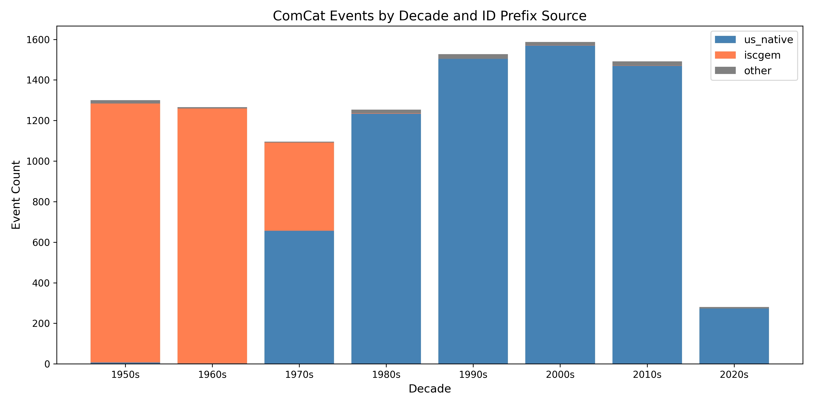
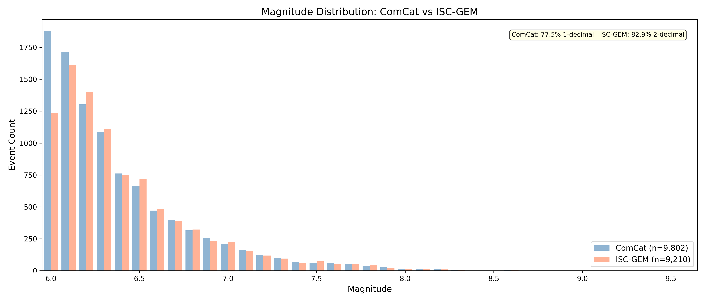

# Case A0: ComCat and ISC-GEM Catalog Comparison Reference

**Document Information**
- Version: 1.0
- Date: 2026-02-27

---

## 1. Abstract

This report is a descriptive reference document comparing the structural and population characteristics of two global earthquake catalogs: the USGS ComCat catalog and the ISC-GEM catalog. No event-level matching, cross-catalog deduplication, or statistical significance testing is performed. The key structural finding is that the ComCat catalog is a hybrid composition -- approximately 30.3% of its records carry ISC-GEM-prefixed identifiers, concentrated in the pre-1980 era. The two catalogs also differ substantially in magnitude precision: 77.5% of ComCat magnitudes are recorded to one decimal place, while 82.9% of ISC-GEM magnitudes are recorded to two decimal places.

## 2. Data Sources

Both catalogs share an identical 10-column schema: `usgs_id`, `usgs_mag`, `event_at`, `solaration_year`, `solar_secs`, `lunar_secs`, `midnight_secs`, `latitude`, `longitude`, `depth`.

| Property | ComCat | ISC-GEM |
| --- | --- | --- |
| File | `data/global-sets/comcat_global_6-9_1949-2021.csv` | `data/global-sets/iscgem_global_events.csv` |
| Event Count | 9,802 | 9,210 |
| Year Range | 1950--2021 | 1950--2021 |
| Magnitude Range | 6.00--9.50 | 6.00--9.55 |

## 3. Methodology

Three analyses were performed:

**(a) Population summary.** Basic descriptive statistics (event count, year range, magnitude range) were computed for both catalogs.

**(b) ID prefix classification and temporal distribution.** Each ComCat `usgs_id` was classified into one of three groups based on its string prefix: `iscgem` (starts with "iscgem"), `us_native` (starts with "us" but not "iscgem"), or `other` (all remaining). The temporal distribution of `iscgem`-prefixed records was then computed by decade.

**(c) Magnitude precision classification.** Each magnitude value in both catalogs was classified as either one-decimal (value multiplied by 100 and rounded to integer is divisible by 10) or two-decimal (all others). Counts and percentages were computed per catalog.

## 4. Results

### 4.1 Population Summary

ComCat contains 9,802 events and ISC-GEM contains 9,210 events -- a difference of 592 events (+6.4% in ComCat). Both catalogs span the same year range (1950--2021). ISC-GEM extends slightly higher in maximum magnitude (9.55 vs 9.50).

### 4.2 ComCat Hybrid Composition

The ID prefix classification reveals that ComCat is not a homogeneous catalog:

| Prefix Group | Count | Percentage |
| --- | --- | --- |
| us_native | 6,716 | 68.5% |
| iscgem | 2,973 | 30.3% |
| other | 113 | 1.2% |

The 2,973 ISC-GEM-prefixed records within ComCat are heavily concentrated in the earlier decades:

| Decade | Count | % of ISC-GEM Prefix |
| --- | --- | --- |
| 1950s | 1,277 | 43.0% |
| 1960s | 1,257 | 42.3% |
| 1970s | 435 | 14.6% |
| 1980s | 2 | 0.1% |
| 1990s | 0 | 0.0% |
| 2000s | 1 | 0.0% |
| 2010s | 1 | 0.0% |
| 2020s | 0 | 0.0% |

The temporal pattern is clear: 99.9% (2,969 of 2,973) of ISC-GEM-prefixed records in ComCat fall within the 1950s through 1970s. This indicates that ComCat backfilled its pre-1976 historical record using ISC-GEM catalog data. From 1980 onward, ComCat relies almost exclusively on its own native event identifiers.

### 4.3 Magnitude Precision

The two catalogs differ substantially in the precision of their stored magnitude values:

| Catalog | 1-Decimal | % | 2-Decimal | % |
| --- | --- | --- | --- | --- |
| ComCat | 7,601 | 77.5% | 2,201 | 22.5% |
| ISC-GEM | 1,575 | 17.1% | 7,635 | 82.9% |

ComCat's magnitude values are predominantly single-decimal (77.5%), while ISC-GEM records two-decimal magnitudes for the vast majority of its events (82.9%). This difference has practical consequences for magnitude-based analyses near the M 6.0 lower threshold: ComCat events at exactly M 6.0 may represent a broader effective range (rounding from 5.95--6.04) than ISC-GEM events at M 6.00 (from 5.995--6.004). This could introduce systematic differences in event counts near the threshold boundary.

### 4.4 Schema Compatibility

Both catalog files use an identical 10-column structure with the same field names and data types. No structural incompatibility exists between the two files for downstream analysis purposes.

## 5. Interpretation

The two catalogs are not independent datasets. Approximately 30.3% of ComCat's records are sourced from the ISC-GEM catalog, as indicated by their `iscgem`-prefixed identifiers. This overlap is concentrated in the pre-1980 era, reflecting ComCat's use of ISC-GEM data to fill its historical record.

The magnitude precision difference between the catalogs is substantial. ComCat's predominance of single-decimal magnitudes (77.5%) compared to ISC-GEM's predominance of two-decimal magnitudes (82.9%) means that magnitude-binned analyses may produce different distributions depending on which catalog is used, particularly at bin boundaries. The M 6.0 bin in ComCat shows 1,876 events versus 1,233 in ISC-GEM, a difference that may partly reflect the coarser rounding in ComCat capturing events that would fall below the threshold with higher precision.

## 6. Limitations

- No event-level matching was performed. The 30.3% overlap estimate is based solely on ID prefix classification, not confirmed by coordinate or time matching.
- Magnitude precision classification relies on the stored floating-point representation. Some values classified as one-decimal may originally have been recorded with higher precision but truncated during data processing.
- The `other` prefix group (1.2% of ComCat) was not further investigated. These 113 records may represent additional external catalog sources.

## 7. References

No external references are cited. Catalog documentation is available from the USGS Earthquake Hazards Program (ComCat) and the International Seismological Centre (ISC-GEM).

---

**Generation Details**
- Version: 1.0
- Date: 2026-02-27
- Generated with: Claude Code (claude-opus-4-6)
