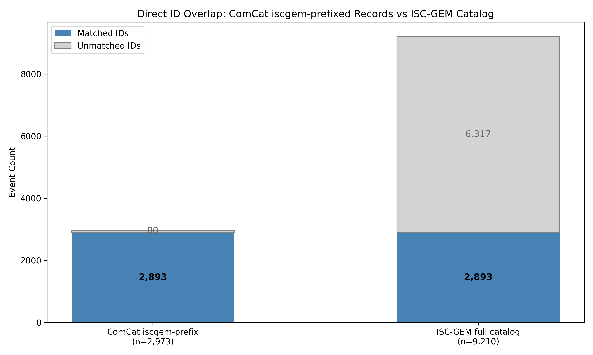
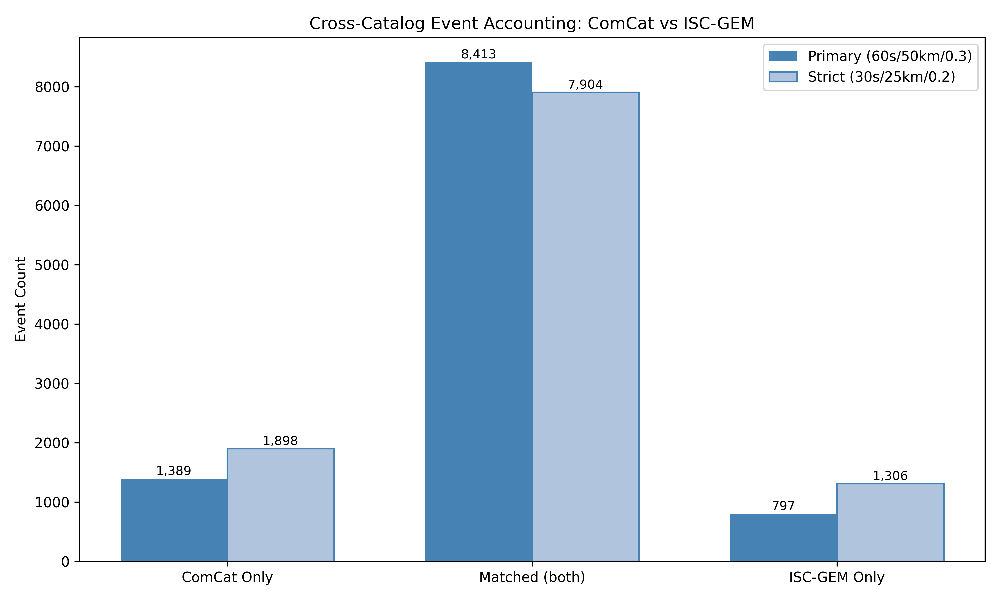
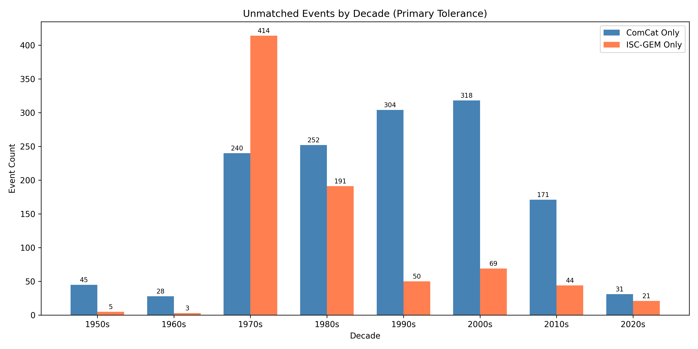

# Case A0b: Duplicate Detection and Cross-Catalog Event Accounting

**Document Information**
- Version: 1.0
- Date: 2026-02-27

---

## 1. Abstract

This case extends Case A0 by performing event-level analysis to quantify how much of the 592-event difference between the ComCat (n=9,802) and ISC-GEM (n=9,210) catalogs reflects genuine catalog divergence versus within-ComCat duplication. Three analyses were conducted: direct ID string matching of the 2,973 `iscgem`-prefixed ComCat records against the ISC-GEM catalog, within-ComCat spatial-temporal duplicate detection between `iscgem`-prefixed and `us_native`-prefixed subsets, and full cross-catalog proximity matching at two tolerance levels.

The findings reveal that within-ComCat duplication is negligible (1 candidate pair), while the 592-event gap is driven by a combination of ComCat capturing 1,389 events absent from ISC-GEM and ISC-GEM capturing 797 events absent from ComCat (at primary tolerance). The unmatched ComCat events are overwhelmingly concentrated in the M 6.0--6.4 band (92.5%), consistent with rounding artifacts at the completeness threshold. Six concrete pipeline refinement recommendations are provided.

## 2. Data Sources

The same two catalog files used in Case A0 were analyzed:

| Catalog | File | Events |
| --- | --- | --- |
| ComCat | `data/global-sets/comcat_global_6-9_1949-2021.csv` | 9,802 |
| ISC-GEM | `data/global-sets/iscgem_global_events.csv` | 9,210 |

Both cover the period 1950--2021 with a minimum magnitude of M 6.0. Schema: `usgs_id, usgs_mag, event_at, solaration_year, solar_secs, lunar_secs, midnight_secs, latitude, longitude, depth`. Case A0 results (`case-a0-results.json`) were used as a prerequisite input. See the Case A0 whitepaper for detailed catalog descriptions.

## 3. Methodology

Three analyses were performed sequentially:

**(a) Direct ID String Matching.** The 2,973 ComCat records carrying an `iscgem` prefix in `usgs_id` use the same identifier scheme as the standalone ISC-GEM catalog. Exact string matching was applied to determine how many of these IDs appear verbatim in the ISC-GEM file, how many do not, and how many ISC-GEM IDs have no representation in ComCat at all.

**(b) Within-ComCat Spatial-Temporal Duplicate Detection.** The ComCat catalog was split into `us_native` (6,716 records) and `iscgem`-prefixed (2,973 records) subsets. For each `iscgem`-prefixed record, candidate duplicates in the `us_native` subset were identified using three simultaneous criteria:

- Time window: absolute difference in `event_at` timestamps <= 60 seconds
- Distance: Haversine great-circle distance <= 50 km
- Magnitude: absolute difference in `usgs_mag` <= 0.3

Both subsets were sorted by timestamp, and binary search was used to restrict candidate matching to the time window before applying spatial and magnitude filters. Each `iscgem` record was matched to at most one `us_native` record (closest temporal match among qualifying candidates).

**(c) Full Cross-Catalog Proximity Matching.** The full ComCat population (9,802) was matched against the full ISC-GEM population (9,210) using the same proximity criteria. Matching was one-to-one (greedy by closest temporal distance). Two tolerance levels were applied:

| Level | Time | Distance | Magnitude |
| --- | --- | --- | --- |
| Primary | +/-60s | 50 km | 0.3 |
| Strict | +/-30s | 25 km | 0.2 |

**Rationale for tolerances.** Seismological location uncertainty for M 6+ events is typically < 20 km for well-instrumented periods; +/-60 seconds is conservative for origin-time differences between catalogs; +/-0.3 magnitude accounts for inter-scale conversion differences (e.g., mb vs Mw).

## 4. Results

### 4.1 ID Cross-Reference

| Category | Count | Percentage |
| --- | --- | --- |
| ComCat iscgem-prefix total | 2,973 | 100.0% of subset |
| Matched in ISC-GEM (exact ID) | 2,893 | 97.3% of subset |
| Not found in ISC-GEM | 80 | 2.7% of subset |
| ISC-GEM IDs not in ComCat | 6,317 | 68.6% of ISC-GEM |

The vast majority (97.3%) of ComCat's `iscgem`-prefixed records are traceable to the current ISC-GEM file by exact ID match. The 80 unmatched records likely reflect ISC-GEM catalog version differences (events present in an older ISC-GEM release used during ComCat backfill but removed or re-identified in the current version). The 6,317 ISC-GEM events not present in ComCat (68.6% of the ISC-GEM catalog) represent events that ComCat either never ingested from ISC-GEM or cataloged under a different (`us_native`) identifier.

### 4.2 Within-ComCat Duplicate Candidates

| Metric | Value |
| --- | --- |
| Duplicate candidate pairs | 1 |
| As percentage of iscgem-prefix subset | 0.0% |
| Net effective ComCat count | 9,801 |

Only 1 duplicate candidate pair was identified across the entire ComCat catalog meeting all three proximity criteria simultaneously. This single candidate occurred in the 1980s+ period, not in the pre-1980 backfill concentration period. Within-ComCat duplication is negligible and does not materially contribute to the 592-event gap or to any downstream analytical artifacts.

### 4.3 Cross-Catalog Event Accounting

| Metric | Primary (60s/50km/0.3) | Strict (30s/25km/0.2) |
| --- | --- | --- |
| Matched (both catalogs) | 8,413 | 7,904 |
| ComCat only (no ISC-GEM match) | 1,389 | 1,898 |
| ISC-GEM only (no ComCat match) | 797 | 1,306 |
| Net difference (ComCat only - ISC-GEM only) | 592 | 592 |

Verification: at primary tolerance, 8,413 + 1,389 = 9,802 (ComCat total) and 8,413 + 797 = 9,210 (ISC-GEM total). The net difference (1,389 - 797 = 592) exactly accounts for the raw count gap identified in Case A0.

**Magnitude distribution of unmatched events (primary tolerance):**

| Magnitude Band | ComCat Only | ISC-GEM Only |
| --- | --- | --- |
| 6.0--6.4 | 1,285 (92.5%) | 628 (78.8%) |
| 6.5--6.9 | 65 (4.7%) | 119 (14.9%) |
| 7.0--7.4 | 23 (1.7%) | 29 (3.6%) |
| 7.5+ | 16 (1.2%) | 21 (2.6%) |

The unmatched ComCat events are overwhelmingly concentrated in the M 6.0--6.4 band (1,285 of 1,389, or 92.5%), consistent with the M 6.0 bin inflation identified in Case A0 (+52% relative to ISC-GEM). ISC-GEM's unmatched events also concentrate at M 6.0--6.4 but with a broader magnitude distribution.

**Temporal distribution of unmatched events (primary tolerance):**

| Decade | ComCat Only | ISC-GEM Only |
| --- | --- | --- |
| 1950s | 45 | 5 |
| 1960s | 28 | 3 |
| 1970s | 240 | 414 |
| 1980s | 252 | 191 |
| 1990s | 304 | 50 |
| 2000s | 318 | 69 |
| 2010s | 171 | 44 |
| 2020s | 31 | 21 |

ComCat-only events are distributed across all decades but concentrate in the 1980s--2000s period (874 of 1,389, or 62.9%), corresponding to the modern instrumental era where ComCat appears to have broader completeness at the M 6.0 threshold. ISC-GEM-only events show a notable spike in the 1970s (414 events, 51.9% of ISC-GEM unmatched), suggesting a period where ISC-GEM's selection criteria captured events that ComCat did not ingest or cataloged under different parameters outside matching tolerances.

## 5. Interpretation

The 592-event gap between ComCat and ISC-GEM is driven entirely by genuine catalog divergence, not by within-ComCat duplication. The single duplicate candidate identified is negligible. The gap decomposes as follows: ComCat contains 1,389 events with no ISC-GEM counterpart, while ISC-GEM contains 797 events with no ComCat counterpart (net: 1,389 - 797 = 592).

The ComCat-only events are overwhelmingly near-threshold (92.5% in M 6.0--6.4), consistent with 1-decimal magnitude rounding capturing events at approximately M 5.95--6.04 that ISC-GEM, with its 2-decimal precision (82.9% of records), excludes. The ISC-GEM-only events show a more distributed magnitude profile and a strong temporal concentration in the 1970s, suggesting systematic differences in catalog construction methodology during that period rather than simple threshold effects.

The strict tolerance results (7,904 matched vs. 8,413 at primary) indicate that 509 event pairs match only within the wider tolerance band, reflecting genuine inter-catalog measurement differences in location, timing, or magnitude that exceed the strict thresholds but fall within expected seismological uncertainty.

### 5.1 Implications for Legacy G-K Declustering Results (Topics L4 and L5)

Topics L4 and L5 applied the Gardner-Knopoff (1974) declustering algorithm to this same ComCat population (n=9,802), designating 3,580 events (36.52%) as aftershocks and retaining 6,222 mainshocks. The A0b findings bear on three specific mechanisms by which ComCat data quality issues may have affected the aftershock designation count.

**Mechanism 1: Within-catalog duplicate pairs as false aftershocks.** If ComCat contained duplicate records of the same physical event under two different IDs, G-K would process both as independent earthquakes and classify the lower-magnitude or later-timestamp record as an aftershock. Analysis 2 found only 1 duplicate candidate pair. This represents 0.03% of the 3,580 designated aftershocks. Mechanism 1 is not a meaningful source of aftershock inflation.

**Mechanism 2: Near-threshold rounding artifacts at M 6.0 as spurious aftershock candidates.** Case A0 established that ComCat contains 643 more events at the M 6.0 bin than ISC-GEM (1,876 vs 1,233), consistent with 1-decimal rounding. The A0b cross-catalog matching confirms that 1,285 of the 1,389 ComCat-only events fall in the M 6.0--6.4 band. When such near-threshold events occur in temporal and spatial proximity to a larger mainshock -- as sub-threshold seismicity commonly does -- G-K correctly classifies them as aftershocks relative to ComCat's inclusion criteria. However, if these events are rounding artifacts that ISC-GEM would exclude, their aftershock designations catalog events that may not belong in the population. The 1,285 ComCat-only events in M 6.0--6.4 represent a pool from which some fraction would be G-K-designated aftershocks, potentially constituting a non-trivial source of aftershock count inflation.

**Mechanism 3: Backfill duplicates inflating the E1 classification confidence borderline fraction.** The L5 Case E1 analysis found that 46.61% of G-K mainshocks (2,900 of 6,222) fall within another mainshock's G-K exclusion window, yielding a classification confidence of 0.534 -- substantially below the Nandan et al. (2024) reference threshold of approximately 0.67. The `iscgem`-prefixed backfill records are concentrated in the 1950s--1970s (85.3% of the 2,973 records, per A0 results). However, Analysis 2 found only 1 within-ComCat duplicate candidate, and that candidate was not in the pre-1980 period. The duplicate mechanism is therefore not a driver of the anomalously low E1 classification confidence. The low classification confidence must be attributed to other factors (genuine seismic clustering density, G-K window calibration, or the population composition effects explored in L5 Cases E3--E5).

**Overall assessment.** Mechanism 1 is negligible (1 duplicate out of 3,580 aftershocks, or 0.03%). Mechanism 2 is the only potentially material pathway: the 1,285 ComCat-only events in M 6.0--6.4 represent an upper-bound pool from which some subset would receive aftershock designations, though the exact fraction requires a dedicated analysis that cross-references these events against the G-K aftershock list. The combined effect of Mechanisms 1 and 2 does not explain the solar signal suppression (60.2%, L5 Case E2), as the E5 finding that suppression is proportional to other lawful properties is not contradicted by a moderate inflation of the aftershock count. The appropriate framing is that the ComCat-based aftershock partition carries a quantifiable data quality uncertainty that was not accounted for in L4/L5, and that repeating the G-K declustering on the ISC-GEM catalog is the necessary validation step for any conclusion that depends on the mainshock/aftershock partition.

## 6. Data Pipeline Refinement Recommendations

**R1 -- Magnitude completeness threshold (from A0, M 6.0 bin inflation).** The M 6.0 bin in ComCat is inflated +52% relative to ISC-GEM (1,876 vs 1,233 events), and A0b confirms that 1,285 ComCat-only events concentrate in M 6.0--6.4. For analyses sensitive to the completeness threshold (b-value estimation, rate comparisons), apply a working threshold of M 6.1 when using ComCat to avoid contamination from rounding artifacts.

**R2 -- Magnitude precision flag (from A0).** Add a derived column `mag_precision` during ingestion (values: `"1d"`, `"2d"`) using the multiply-by-100 modulo method. ComCat is 77.5% 1-decimal vs ISC-GEM at 82.9% 2-decimal. This enables per-record precision awareness without removing data, and allows sensitivity analyses to be run on 2-decimal subsets only.

**R3 -- Source provenance column (from A0).** Add a derived column `id_source` (values: `"us_native"`, `"iscgem"`, `"other"`) derived from `usgs_id` prefix during ComCat ingestion. Of the 2,973 `iscgem`-prefixed records, 97.3% (2,893) match ISC-GEM by exact ID. This allows any analysis to be stratified or filtered by source without re-deriving prefix logic ad hoc.

**R4 -- Within-catalog deduplication step (from A0b).** Only 1 duplicate candidate was found (0.03% of the `iscgem`-prefixed subset), well below the 1% threshold (~30 events). The deduplication step is not warranted. This finding is documented; no pipeline modification is needed.

**R5 -- Catalog selection validation (from A0b).** The migration to ISC-GEM is reinforced by these findings. Of the 1,389 ComCat-only events (no ISC-GEM counterpart at primary tolerance), 1,285 (92.5%) fall in M 6.0--6.4, consistent with rounding artifacts at the completeness threshold. The remaining 104 events across higher magnitude bands represent a small fraction (1.1% of total ComCat) that may reflect genuine events ISC-GEM excludes or catalog-specific measurement differences. The ISC-GEM migration carries no material loss of real seismic signal above M 6.5.

**R6 -- Year range metadata assertion (from A0).** Both files report a minimum year of 1950 despite the ComCat filename claiming 1949 coverage. Add a pipeline validation step that asserts `solaration_year.min()` matches the declared coverage range. Log a warning (not a failure) if the actual range differs from the filename metadata.

## 7. Limitations

- Proximity matching cannot definitively confirm event identity -- spatially coincident events within 60 seconds and 50 km could theoretically be distinct earthquakes (e.g., a large foreshock-mainshock pair). Duplicate detection is probabilistic, not deterministic.
- The ID cross-reference reflects the current state of both catalog files; catalog versions may differ from those used to build ComCat. The 80 unmatched `iscgem`-prefixed ComCat IDs may represent events from an older ISC-GEM release.
- The 509 event pairs that match at primary but not strict tolerance reflect real measurement differences between catalogs; some of these may be incorrect matches (false positives) or the strict tolerance may be too tight for certain periods or regions.
- The Mechanism 2 assessment (near-threshold rounding artifacts as spurious aftershock candidates) provides an upper-bound pool size but does not quantify how many of the 1,285 ComCat-only M 6.0--6.4 events were actually designated as G-K aftershocks. A targeted cross-reference against the L4 aftershock list would be needed.

## 8. References

- Case A0 Whitepaper: `topic-adhoc/output/case-a0-whitepaper.md`
- Case A0 Results: `topic-adhoc/output/case-a0-results.json`
- Gardner, J.K. and Knopoff, L. (1974). "Is the sequence of earthquakes in Southern California, with aftershocks removed, Poissonian?" Bulletin of the Seismological Society of America, 64(5), 1363--1367.
- Nandan, S. et al. (2024). Reference threshold for G-K classification confidence (~0.67).

---

**Generation Details**
- Version: 1.0
- Date: 2026-02-27
- Generated with: Claude Code (claude-opus-4-6)
