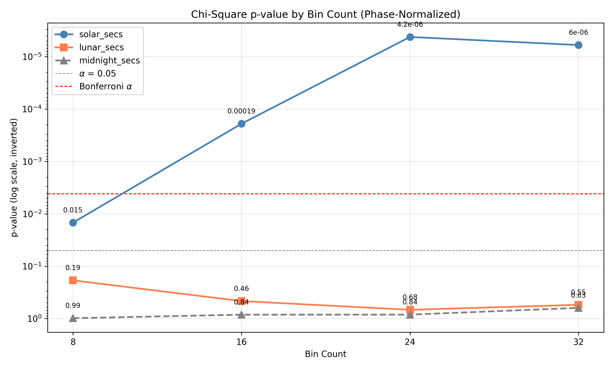
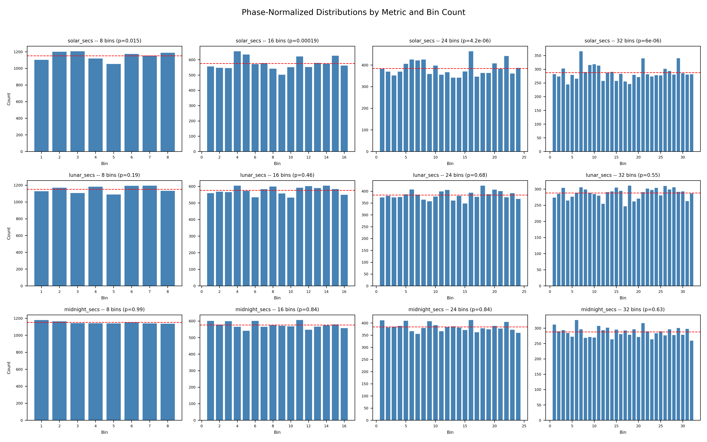

# Case A1: Binning Increment Sensitivity Analysis for Astronomical Metrics

**Document Information**
- Version: 1.0
- Date: 2026-02-27

---

## 1. Abstract

This case tests whether the chi-square signal observed for `solar_secs` is robust across multiple bin counts (8, 16, 24, 32) or dependent on a particular binning choice. Phase-normalized binning is applied consistently to all three astronomical metrics (`solar_secs`, `lunar_secs`, `midnight_secs`) as a project standard. The analysis finds that the `solar_secs` signal is robust, achieving Bonferroni-corrected significance at 3 of 4 bin counts (16, 24, and 32). The `lunar_secs` metric shows no significant departure from uniformity at any bin count after phase normalization, consistent with the prior finding that its legacy 16-bin result was a binning artifact. The `midnight_secs` metric remains non-significant across all bin counts, behaving as expected for a temporal control at global scale.

## 2. Data Source

ISC-GEM catalog: n = 9,210 events, M >= 6.0, 1950--2021. This analysis uses the ISC-GEM dataset rather than the ComCat catalog used in legacy Approach Three. The 16-bin baseline values here will differ from legacy values; this is expected and does not represent a discrepancy.

## 3. Methodology

### 3.1 Phase Normalization

Phase-normalized binning is used for all metrics per project standard (see `rules/data-handling.md`; established in Approach Three Case 1B.3.1). Each event's raw seconds value is mapped to a phase in [0, 1) by dividing by the metric-specific cycle length:

| Metric | Normalization Factor |
| --- | --- |
| `solar_secs` | Actual calendar year length for the event's `solaration_year` (365 x 86,400 or 366 x 86,400 s) |
| `lunar_secs` | Mean synodic month: 2,551,442.976 s (29.53059 days x 86,400) |
| `midnight_secs` | Fixed day: 86,400 s |

A small number of events (3 solar, 23 lunar) had raw seconds values marginally exceeding the normalization factor due to astronomical boundary effects. These were clamped to phase = 0.999999 prior to binning.

### 3.2 Chi-Square Test

A chi-square goodness-of-fit test against a uniform expected distribution is performed for each (metric, bin_count) combination. Cramer's V is reported as an effect size measure: V = sqrt(chi2 / (n x (k - 1))), where n = 9,210 and k is the bin count.

### 3.3 Multiple Comparisons

Twelve tests are performed (3 metrics x 4 bin counts). Bonferroni correction sets the significance threshold at alpha = 0.05 / 12 = 0.004167. Robustness criterion: a metric's signal is considered robust if it achieves Bonferroni-corrected significance at 3 or more of the 4 bin counts.

### 3.4 Chi-Square Validity

The expected count per bin (n / k) for each bin count is:

| Bin Count (k) | Expected Count per Bin |
| --- | --- |
| 8 | 1,151.25 |
| 16 | 575.625 |
| 24 | 383.75 |
| 32 | 287.8125 |

All values substantially exceed the chi-square minimum threshold of 5 expected counts per cell.

## 4. Results

### 4.1 Summary Table

| Metric | k | Chi-Square | p-value | Cramer's V | Bonferroni Sig. |
| --- | --- | --- | --- | --- | --- |
| `solar_secs` | 8 | 17.44 | 1.48e-02 | 0.0164 | No |
| `solar_secs` | 16 | 42.46 | 1.91e-04 | 0.0175 | Yes |
| `solar_secs` | 24 | 66.48 | 4.20e-06 | 0.0177 | Yes |
| `solar_secs` | 32 | 78.17 | 5.99e-06 | 0.0165 | Yes |
| **`solar_secs`** | | | | **Robust?** | **Yes (3/4)** |
| `lunar_secs` | 8 | 10.04 | 1.87e-01 | 0.0125 | No |
| `lunar_secs` | 16 | 14.82 | 4.65e-01 | 0.0104 | No |
| `lunar_secs` | 24 | 19.34 | 6.82e-01 | 0.0096 | No |
| `lunar_secs` | 32 | 29.42 | 5.47e-01 | 0.0102 | No |
| **`lunar_secs`** | | | | **Robust?** | **No (0/4)** |
| `midnight_secs` | 8 | 1.39 | 9.86e-01 | 0.0046 | No |
| `midnight_secs` | 16 | 9.60 | 8.44e-01 | 0.0083 | No |
| `midnight_secs` | 24 | 16.29 | 8.43e-01 | 0.0088 | No |
| `midnight_secs` | 32 | 27.91 | 6.26e-01 | 0.0099 | No |
| **`midnight_secs`** | | | | **Robust?** | **No (0/4)** |

### 4.2 P-Value Sweep

The `solar_secs` p-values decrease monotonically from k=8 (p=0.015) through k=24 (p=4.2e-06) and remain at a similar order of magnitude at k=32 (p=6.0e-06). Only the k=8 result fails to reach Bonferroni significance. The `lunar_secs` and `midnight_secs` metrics remain well above both significance thresholds across all bin counts, with `midnight_secs` showing the highest (least significant) p-values overall.

### 4.3 Distribution Grid

The `solar_secs` row shows visible departures from the uniform expected line (red dashed), with consistent elevation in certain phase regions and depression in others across bin counts. The pattern is most visually apparent at k=24 and k=32, where finer resolution reveals the structure of the non-uniformity. The `lunar_secs` and `midnight_secs` rows show bin counts fluctuating closely around the expected uniform line with no systematic pattern.

## 5. Interpretation

**`solar_secs`:** The signal is robust by the stated criterion, achieving Bonferroni-corrected significance at 3 of 4 bin counts (k=16, 24, 32). The k=8 result (p=0.015) is nominally significant at alpha=0.05 but does not survive Bonferroni correction. The progressive strengthening of the chi-square statistic with increasing bin count suggests that the non-uniformity has structure at finer resolution scales, rather than being an artifact of a particular bin width. The Cramer's V values are small (0.016--0.018), indicating a modest but consistent effect size.

**`lunar_secs`:** No significant departure from uniformity is detected at any bin count after phase normalization (all p > 0.18). This is consistent with the prior finding that the legacy 16-bin lunar result (p=0.0179) was a binning artifact resolved by phase normalization. No bin count recovers a significant result.

**`midnight_secs`:** All four p-values are non-significant and far from any threshold (all p > 0.62). This confirms its expected behavior as a temporal control at global scale. This characterization applies to the global, unstratified dataset and does not generalize to stratified or regional analyses.

## 6. Limitations

- Phase normalization for `lunar_secs` uses the mean synodic month (29.53059 days); individual month lengths vary from approximately 29.18 to 29.93 days. Per-event actual synodic month length was not computed.
- The four bin counts tested (8, 16, 24, 32) are not exhaustive. Intermediate or higher values (e.g., 48, 64) could reveal non-monotonic behavior not captured in this sweep.
- Three solar-phase and 23 lunar-phase values required clamping due to astronomical cycle boundary effects; the impact on results is negligible given the sample size.

## 7. References

- Approach Three Case 1B.3.1 (lunar phase normalization; establishing case for phase-normalized binning).
- `rules/data-handling.md` (phase normalization project standard).

---

**Generation Details**
- Version: 1.0
- Date: 2026-02-27
- Generated with: Claude Code (claude-opus-4-6)
