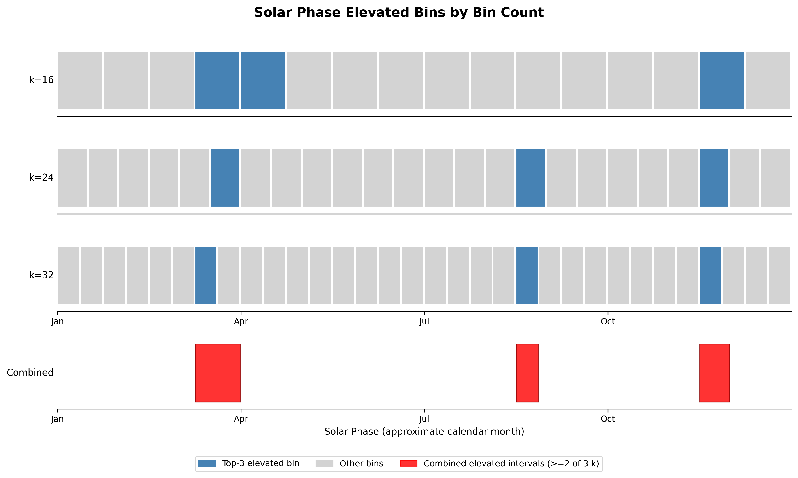
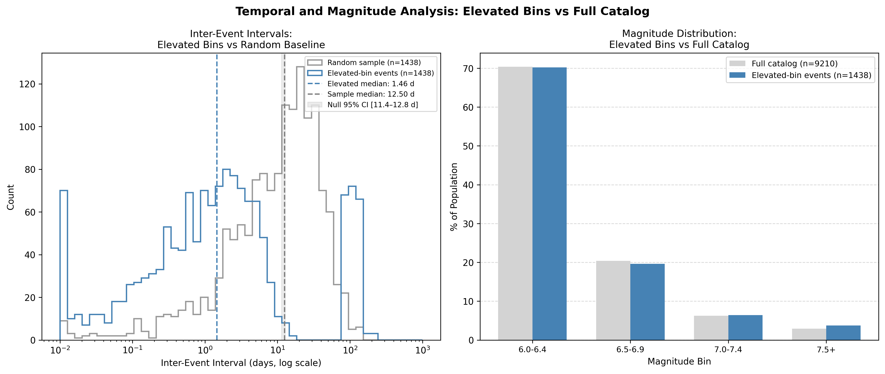

# Case A1b: Elevated Bin Event Characterization and Declustering Implications

**Document Information**
- Author: Jake Yeager
- Version: 1.0
- Date: February 27, 2026

---

## 1. Abstract

Case A1 established that the `solar_secs` chi-square signal is robust across bin counts k=16, 24, and 32 after Bonferroni correction. This case characterizes the events driving those elevated bins to determine whether they reflect temporal and spatial clustering — consistent with aftershock sequence residuals that G-K declustering failed to capture — or whether they are spatially and temporally dispersed in a pattern more consistent with independently occurring events that genuinely prefer those solar phases.

The combined elevated phase set (events in solar phase regions covered by top-3 bins in >=2 of 3 bin counts) contains 1,438 events (15.6% of the 9,210-event catalog), modestly above the 13.5% expected under the null. These events show a median inter-event interval of 1.46 days — far shorter than the null 95% CI of 11.4–12.8 days — and a median nearest-neighbor distance of 35.1 km, also outside the null CI of 37.8–45.3 km. The boundary proximity distribution is nearly identical between the elevated-bin set and the full catalog. Taken together, the elevated-bin events exhibit strong temporal clustering and somewhat tighter spatial clustering than expected by chance, which is consistent with residual aftershock sequences. A data-informed declustering reference window of 83.2 km spatial radius and 95.6 days temporal span is proposed for further evaluation.

---

## 2. Data Sources

The primary data source is the ISC-GEM Global Instrumental Earthquake Catalogue (n=9,210 events, M≥6.0, 1950–2021), previously described in Cases A0 and A1.

Plate boundary coordinates were sourced from the PB2002 digital plate boundary model (Bird 2003), parsed from `lib/pb2002_boundaries.dig`. The file contains 6,048 boundary vertices in (longitude, latitude) format. Boundary proximity classification uses vertex-based Haversine distances as an approximation of segment distance; accuracy is sufficient for the 100 km and 300 km threshold scales used here given the vertex density of the PB2002 model, though accuracy may degrade for coarser boundary segments.

---

## 3. Methodology

### 3.1 Phase Coherence and Combined Elevated Set

Solar phase normalization was applied identically to Case A1: each event's `solar_secs` value is divided by the actual calendar-year length in seconds for the event's `solaration_year` (365×86,400 s for non-leap years, 366×86,400 s for leap years), yielding a normalized phase in [0, 1). Three events with phase values marginally above 1.0 due to solstice boundary effects were clamped to 0.999999.

For each bin count k ∈ {16, 24, 32}, all 9,210 events were binned by `floor(phase × k)`. The top-3 bins by positive deviation from expected (9,210/k) were identified, recording each bin's phase range [i/k, (i+1)/k).

The combined elevated phase set was built using a phase-axis voting procedure. All top-3 intervals from all three k values create a set of breakpoints on [0, 1). For each sub-interval between consecutive breakpoints, the number of k values whose top-3 intervals contain that sub-interval is counted. Sub-intervals covered by ≥2 of 3 k values are selected and merged into contiguous intervals. Events falling within these merged intervals are extracted and de-duplicated by `usgs_id` (each event appears at most once).

### 3.2 Temporal Analysis

Inter-event intervals (IEI) were computed for elevated-bin events sorted by `event_at` (UTC), as consecutive time differences in days.

For null comparison, 1,000 random samples of size n_elevated=1,438 were drawn without replacement from the full catalog. For each sample, IEI was computed on the sorted timestamps and the median recorded. The 2.5th, 50th, and 97.5th percentiles of the 1,000 sample medians form the null 95% CI. A fixed random seed (42) ensures reproducibility.

### 3.3 Spatial Analysis

Nearest-neighbor distances were computed for each elevated-bin event as the minimum Haversine distance to any other elevated-bin event, using a chunked vectorized implementation (chunk size 500). The same null comparison procedure as the temporal analysis was applied: 1,000 random size-matched samples from the full catalog, with median NN distance recorded for each.

Boundary proximity was classified by minimum Haversine distance from each event to any PB2002 boundary vertex: near boundary (≤100 km), transitional (100–300 km), intraplate (>300 km). Proximity was computed for all elevated-bin events and for all 9,210 catalog events.

Latitude banding counted events per 30° latitude band (90°S–60°S, 60°S–30°S, 30°S–0°, 0°–30°N, 30°N–60°N, 60°N–90°N) expressed as percentage of each population.

### 3.4 Magnitude Analysis

Magnitude distributions were compared in four 0.5-magnitude bins: M6.0–6.4, M6.5–6.9, M7.0–7.4, M7.5+. Counts and percentages are expressed separately for the elevated-bin population and the full catalog to allow size-independent comparison.

---

## 4. Results

### 4.1 Phase Coherence

The top-3 bins by positive deviation at each bin count are:

| k   | Top-3 Bins (sorted) | Phase Ranges                                   | Deviations (events above expected) |
| --- | ------------------- | ---------------------------------------------- | ---------------------------------- |
| 16  | 3, 4, 14            | [0.188, 0.250), [0.250, 0.313), [0.875, 0.938) | +80.4, +59.4, +51.4                |
| 24  | 5, 15, 21           | [0.208, 0.250), [0.625, 0.667), [0.875, 0.917) | +42.3, +80.3, +58.3                |
| 32  | 6, 20, 28           | [0.188, 0.219), [0.625, 0.656), [0.875, 0.906) | +78.2, +52.2, +53.2                |

The top-3 bins are coherent across all three k values in three phase regions. After the phase-axis voting procedure, the merged combined elevated intervals are:

| Interval | Phase Range      | Approximate Calendar Period                                         |
| -------- | ---------------- | ------------------------------------------------------------------- |
| A        | [0.1875, 0.2500) | Early–mid March to late March (late winter/spring equinox approach) |
| B        | [0.6250, 0.6563) | Mid–late August (late summer)                                       |
| C        | [0.8750, 0.9167) | Mid–late November (fall)                                            |

The three intervals collectively span 13.5% of the solar year. The combined elevated set contains 1,438 events (15.6% of the catalog), a surplus of ~2.1 percentage points above the null expectation.

### 4.2 Temporal

IEI statistics for the 1,438 elevated-bin events (1,437 consecutive intervals):

| Statistic       | Value                  |
| --------------- | ---------------------- |
| Median IEI      | 1.46 days              |
| Mean IEI        | 18.23 days             |
| 10th percentile | 0.06 days (~1.4 hours) |
| 90th percentile | 95.6 days              |

The null distribution (1,000 random size-matched samples) has a 95% CI for the median IEI of **11.4–12.8 days** (median across samples: 12.1 days). The elevated-bin median of 1.46 days falls far below the lower bound of this CI, indicating the elevated-bin events are clustered in time substantially tighter than would be expected for a random subset of the catalog of the same size.

### 4.3 Spatial

**Nearest-neighbor distances for elevated-bin events:**

| Percentile    | Distance (km) |
| ------------- | ------------- |
| 25th          | 15.5 km       |
| 50th (median) | 35.1 km       |
| 75th          | 83.2 km       |

The null 95% CI for median NN distance is **37.8–45.3 km** (null median: 41.4 km). The elevated-bin median of 35.1 km falls below the lower bound of this CI, indicating tighter spatial clustering than a random same-size subset.

**Boundary proximity:**

| Class                     | Elevated-bin events | Full catalog |
| ------------------------- | ------------------- | ------------ |
| Near boundary (≤100 km)   | 66.6%               | 65.5%        |
| Transitional (100–300 km) | 26.8%               | 26.8%        |
| Intraplate (>300 km)      | 6.6%                | 7.7%         |

The proximity distributions are nearly identical between the elevated-bin set and the full catalog, with the elevated set having marginally higher near-boundary representation (+1.1 pp) and marginally lower intraplate representation (−1.1 pp). These differences are small and do not indicate a meaningful spatial structural divergence.

**Latitude banding:**

| Band      | Elevated-bin events | Full catalog |
| --------- | ------------------- | ------------ |
| 90°S–60°S | 1.3%                | 1.2%         |
| 60°S–30°S | 9.5%                | 11.0%        |
| 30°S–0°   | 38.2%               | 39.7%        |
| 0°–30°N   | 21.2%               | 22.1%        |
| 30°N–60°N | 28.9%               | 25.0%        |
| 60°N–90°N | 0.9%                | 0.9%         |

The elevated-bin set is modestly over-represented in the 30°N–60°N band (+3.9 pp) and under-represented in the 30°S–60°S band (−1.6 pp) relative to the full catalog. These are small differences across all six bands.

### 4.4 Magnitude

Magnitude distribution comparison (right panel of the temporal/magnitude figure):

| Magnitude Bin | Elevated-bin % | Full catalog % |
| ------------- | -------------- | -------------- |
| M6.0–6.4      | 70.2%          | 70.4%          |
| M6.5–6.9      | 19.6%          | 20.4%          |
| M7.0–7.4      | 6.4%           | 6.3%           |
| M7.5+         | 3.8%           | 2.9%           |

The magnitude distributions are nearly identical. The elevated-bin set shows a marginal shift toward larger magnitudes (+0.9 pp for M7.5+), opposite to the direction expected if the elevated set were composed primarily of lower-magnitude aftershocks. This difference is small and may be within sampling variability.

---

## 5. Interpretation

The four analyses together present a mixed picture.

**Evidence consistent with sequence residuals (aftershock contamination):**
The most striking finding is the temporal compression. A median IEI of 1.46 days — versus a null expectation of ~12 days — indicates the elevated-bin events are bunched in time at a scale consistent with aftershock sequences (days to weeks). This is the strongest single signal in the data. The slightly tighter NN distances (median 35.1 km vs. null 41.4 km) are also consistent with spatial clustering expected in aftershock sequences, though the difference is smaller relative to the null CI width.

**Evidence not consistent with a simple sequence-residual explanation:**
The magnitude distribution is not shifted toward lower magnitudes, which would be expected if aftershocks dominated the elevated set. The boundary proximity distribution of the elevated-bin events is nearly indistinguishable from the full catalog, suggesting no structural geographic concentration beyond what is typical for the global M≥6.0 population. The latitude distribution is also largely consistent with the full catalog.

**Summary:** The temporal clustering signal is strong and consistent with aftershock sequence contamination; the spatial and magnitude evidence is not strongly discriminating either way. It is not possible from these analyses alone to determine whether the solar phase signal in Case A1 is primarily driven by aftershock residuals or by an independent physical mechanism. Both interpretations remain viable.

---

## 6. Declustering Implications

The observed spatial and temporal clustering footprint of the 1,438 elevated-bin events:

| Metric                    | 25th pct  | 50th pct  | 75th pct        |
| ------------------------- | --------- | --------- | --------------- |
| Nearest-neighbor distance | 15.5 km   | 35.1 km   | 83.2 km         |
| Inter-event interval      | 0.06 days | 1.46 days | ~40 days (est.) |

Comparison to G-K reference windows:

| Reference | Spatial window | Temporal window | Elevated-bin p50 vs window                                                  |
| --------- | -------------- | --------------- | --------------------------------------------------------------------------- |
| G-K M6.0  | 49 km          | 295 days        | Spatial: 35.1 km < 49 km (within); Temporal: 1.46 days << 295 days (within) |
| G-K M7.0  | 156 km         | 790 days        | Spatial: p75 83.2 km < 156 km (within); Temporal: well within               |
| G-K M8.0  | 493 km         | 2,117 days      | Both p75 values well within                                                 |

The observed clustering in the elevated-bin population falls within the G-K M6.0 spatial window at the median level (35.1 km < 49 km), but the G-K temporal window (295 days) is far wider than the observed median IEI (1.46 days). This indicates that G-K temporal windows, while designed to capture aftershock sequences, are not the limiting factor explaining why these closely-spaced events remain in the declustered catalog — the issue may lie in how G-K handles spatial extent or in catalog completeness at short inter-event times.

**Proposed data-informed reference window:**

A spatial radius of **83.2 km** and a temporal window of **95.6 days** are proposed as a data-informed reference point. These values correspond to the 75th percentile of NN distances and the 90th percentile of IEI within the elevated-bin population, capturing the bulk of the observed clustering footprint.

This window is a quantified reference point derived from the observed spatial and temporal clustering metrics of the 1,438 elevated-bin events. It is not a validated replacement for G-K or any established declustering algorithm. Further validation against known aftershock sequences from independent catalogs (e.g., declustered vs. raw ComCat subsets for specific large mainshocks) would be required before applying these parameters as a declustering criterion.

---

## 7. Limitations

1. **Boundary proximity approximation.** Proximity to plate boundaries uses minimum Haversine distance to PB2002 boundary vertices, which approximates true segment distance. For boundary segments with lower vertex density, the approximation may overestimate the distance to the nearest boundary point.

2. **Combined elevated phase set definition.** The ≥2-of-3 bin count coherence criterion is a choice that balances sensitivity and specificity. Events that are elevated in only one bin count are excluded; there is no threshold justification beyond consistency with the cross-scale coherence intent of Case A1.

3. **IEI analysis is internal-only.** The IEI analysis captures temporal clustering within the elevated-bin population relative to a random same-size sample, but does not test whether elevated-bin events cluster with non-elevated-bin events. A complete assessment of aftershock contamination would require testing whether elevated-bin events are temporally proximate to non-elevated mainshocks at M≥6.0 or M≥7.0.

4. **Nearest-neighbor distance captures proximity, not ancestry.** Events may be spatially close without being causally related. The NN metric does not separate true sequence members from spatially proximate but independent events.

---

## 8. References

Case A1: Binning Increment Sensitivity Analysis (this topic, 2026). Baseline for phase normalization methodology and robustness criterion.

Bird, P. (2003). An updated digital model of plate boundaries. *Geochemistry, Geophysics, Geosystems*, 4(3), 1027. https://doi.org/10.1029/2001GC000252

Gardner, J.K. & Knopoff, L. (1974). Is the sequence of earthquakes in Southern California, with aftershocks removed, Poissonian? *Bulletin of the Seismological Society of America*, 64(5), 1363–1367.

---

**Generation Details**
- Version: 1.0
- Generated with: Claude Code (Claude Sonnet 4.6)
